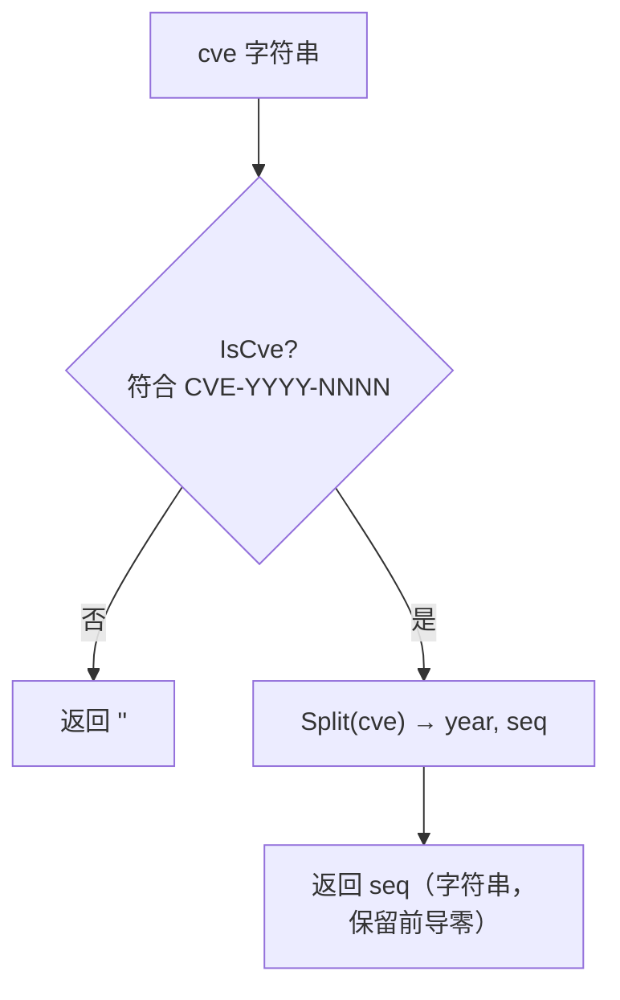

# ExtractCveSeq 提取序列号

:::tip 📂 查看源码
[`extract.go:219`](https://github.com/scagogogo/cve-skills/blob/main/extract.go#L219-L226) — 在 GitHub 上查看实现代码（第 219–226 行）。
:::

从 CVE 编号中提取序列号部分（字符串格式）。

:::tip 📌 场景
- 单独取出 CVE 的序列号字段，用于存储或展示。
- 需要原样保留前导零时，使用字符串形式而非整数。
- 将序列号作为字符串令牌传递给下游处理逻辑。
:::

## 函数签名

```go
func ExtractCveSeq(cve string) string
```

## 参数

- `cve` (string): 要提取序列号的 CVE 编号，允许大小写混用并带有前后空白。

## 返回值

- `string`: CVE 的序列号部分，例如 `"12345"`。如果输入不是有效的 CVE 格式，则返回空字符串 `""`。

## 行为说明

- 首先用 `IsCve` 校验输入，若不是有效 CVE，立即返回 `""`。
- 校验通过后，委托 `Split` 取其第二个返回值（即序列号段）。
- 序列号以字符串形式返回，因此前导零会被保留（如 `"0001"` 仍为 `"0001"`）。
- 由于使用 `IsCve` 作为门槛，仅"包含"CVE 的文本会被视为无效并返回 `""`。
- 不进行任何数值解析，如需整数请使用 `ExtractCveSeqAsInt`。

## 流程图



## 示例

```go
package main

import (
    "fmt"
    "github.com/scagogogo/cve-skills"
)

func main() {
    testCases := []string{
        "CVE-2022-12345",    // 标准格式
        "cve-2022-0001",     // 小写，带前导零
        " CVE-2022-1 ",      // 带空格，短序列号
        "CVE-2022-00001",    // 保留前导零
        "invalid-format",    // 非 CVE
        "包含CVE-2022-12345的文本", // 仅包含 CVE 的文本
        "",                  // 空字符串
    }

    for _, cveId := range testCases {
        seq := cve.ExtractCveSeq(cveId)
        fmt.Printf("%-26s -> Sequence: '%s'\n", cveId, seq)
    }

    // 预期输出:
    // CVE-2022-12345            -> Sequence: '12345'
    // cve-2022-0001             -> Sequence: '0001'
    //  CVE-2022-1               -> Sequence: '1'
    // CVE-2022-00001            -> Sequence: '00001'
    // invalid-format            -> Sequence: ''
    // 包含CVE-2022-12345的文本    -> Sequence: ''
    //                           -> Sequence: ''
}
```

## 使用场景

- 将序列号单独存入数据库字段以便查询。
- 原样保留序列号字符串（含前导零）用于展示或审计。
- 以序列号部分作为键构建标识符或映射。
- 在传递给下游字符串处理工具前，先从 CVE 中取出序列号。

## 注意事项

- ⚠️ 任何无法通过 `IsCve` 的输入都会返回 `""`，包括仅"包含"CVE 的文本——要从自由文本中提取，请先用 `ExtractCve`。
- 返回值为字符串且保留前导零；如需数值比较或排序，请改用 `ExtractCveSeqAsInt`。
- 输入大小写不敏感且容忍前后空白，与 `IsCve` 行为一致。
- 不做去重或排序——本函数一次只处理单个 CVE。

## 内部实现

函数体（`extract.go:219-L226`）是一个极薄的两步包装——真正的复杂度落在它委托的辅助函数上：

- **有效性门槛（`extract.go:220`）** —— `if !IsCve(cve)` 是第一个也是唯一的分支。任何不是独立 CVE 的输入（形状不对、嵌在散文中、空字符串）都在此返回 `""`，下方的提取逻辑不会对脏数据执行。
- **委托拆分（`extract.go:223`）** —— `_, seq := Split(cve)` 用空白标识符丢弃年份段，只保留序列号。复用 `Split`（而非重新实现正则解析）保证序列号定义与所有其他提取函数完全一致。
- **直接返回（`extract.go:224`）** —— `return seq` 原样回传 `Split` 产生的字符串令牌，不做任何转换。没有 `Format` 调用、没有 map 构造、没有 `sort.Slice`——这正是前导零能完整保留的原因。
- **设计意图——组合优先于重写。** 整个函数存在的意义是给调用方一个单一职责的名称（"给我序列号"），同时把解析与校验下沉到 `IsCve` 和 `Split`，使格式规则只有一处事实来源。
- **设计意图——字符串保真。** 原样返回字符串（而非解析为 `int`）是刻意的：像 `CVE-2022-00001` 这样的编号必须保留前导零，数值转换留给兄弟函数 `ExtractCveSeqAsInt`。

## 复杂度

| 维度 | 开销 | 原因 |
|---|---|---|
| 时间 | O(n) | `IsCve` 与 `Split` 各对长度为 n 的输入扫描常数次，无排序或嵌套循环。 |
| 空间 | O(n) | `Split` 分配一个新的 `seq` 子串（指向输入底层数组的切片头），外加 `IsCve` 的临时占用。 |
| 分配次数 | O(1) | 只返回一个字符串，无 map、无切片扩容、无递归。 |

由于函数一次只处理一个 CVE，对 k 个 CVE 的批次总开销为 O(k * n)。

## 边界情形

| 输入 | 行为 | 返回 |
|---|---|---|
| `"CVE-2022-12345"` | 标准格式，通过 `IsCve`，`Split` 得到 `("2022","12345")` | `"12345"` |
| `"cve-2022-0001"` | 小写，通过 `IsCve`（大小写不敏感）；前导零保留 | `"0001"` |
| `" CVE-2022-1 "` | 前后空白被 `IsCve` 容忍；短序列号原样返回 | `"1"` |
| `"CVE-2022-00001"` | 前导零原样保留，不做数值归一化 | `"00001"` |
| `"CVE-2022-ABC"` | 非数字序列号，被 `IsCve` 拒绝 | `""` |
| `"invalid-format"` | 非 CVE 形状，在门槛处被拒 | `""` |
| `"包含CVE-2022-12345的文本"` | 内嵌 CVE，`IsCve` 将整串视为无效 | `""` |
| `""`（空串） | 立即未通过 `IsCve` | `""` |

## 数据流

```text
+--------------------+
| 输入: cve 字符串    |
|  例 "CVE-2022-00001"
+---------+----------+
          |
          v
+-------------------+
| IsCve(cve) 门槛    |   extract.go:220
| 大小写不敏感,       |
| 容忍前后空白        |
+---------+---------+
          |
   +------+------+
   |             |
 无效          有效
   |             |
   v             v
+-------+   +----------------------+
| ""    |   | _, seq := Split(cve) |  extract.go:223
+-------+   |  丢弃 year           |
            +----------+-----------+
                       |
                       v
            +---------------------+
            | return seq (字符串) |  extract.go:224
            |  "00001"             |
            |  保留前导零          |
            +---------------------+
```

## 相关函数

- [ExtractCveSeqAsInt](/zh/api/functions/extract-cve-seq-as-int) — 同样提取序列号，但返回 `int`（去掉前导零，无效输入返回 0）。
- [ExtractCveYear](/zh/api/functions/extract-cve-year) — 改为提取年份段。
- [Split](/zh/api/functions/split) — 一次性拆分为年份和序列号。
- [IsCve](/zh/api/functions/is-cve) — 本函数内部使用的有效性校验。
- [提取类函数总览](/zh/api/extract) — 所有提取函数的入口页。
