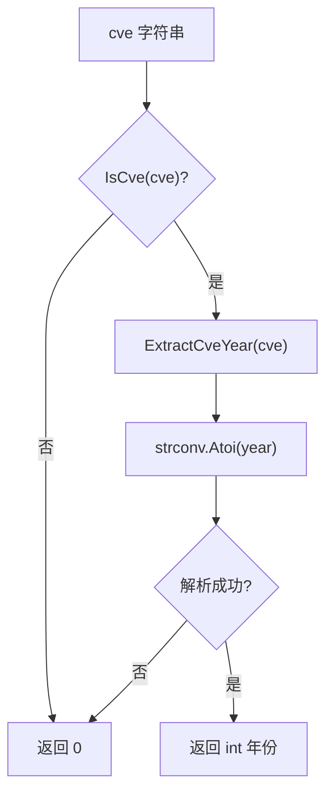

# ExtractCveYearAsInt 提取年份整数

:::tip 📂 查看源码
[`extract.go:183`](https://github.com/scagogogo/cve-skills/blob/main/extract.go#L183-L191) — 在 GitHub 上查看实现代码（第 183–191 行）。
:::

`ExtractCveYearAsInt` 从 CVE 编号中提取年份部分，并返回原生 `int` 类型，便于进行数值计算、比较与统计。

:::tip 📌 场景
- 计算某个 CVE 自发布至今经过了多少年。
- 按年份的数值范围对 CVE 进行分组或过滤（例如 `year >= 2020`）。
- 将年份作为整数排序键，对 CVE 列表排序。
:::

## 函数签名

```go
func ExtractCveYearAsInt(cve string) int
```

## 参数

- `cve` (string): CVE 编号字符串，例如 `CVE-2022-12345`。允许前后的空白字符和大小写混用，因为内部会做格式归一化。

## 返回值

- `int`: CVE 的年份整数值，例如 `2022`。当输入不是有效的 CVE 格式，或年份段无法解析为数字时，返回 `0`。

## 行为说明

- 先调用 `IsCve(cve)` 校验格式；若输入不是有效的 CVE 编号，则直接短路返回 `0`，不再解析。
- 委托 `ExtractCveYear(cve)`（其内部调用 `Split`）取得年份字符串。
- 使用 `strconv.Atoi` 将年份字符串转为整数；转换错误被有意忽略，失败时返回零值 `0`。
- 由于 `IsCve` 已保证年份段为数字，凡是通过第一步校验的输入，`Atoi` 实际都会成功；返回 `0` 的回退分支属于防御性保护。
- 该函数是纯函数，无副作用，不会修改输入或任何全局状态。

## 流程图



## 示例

```go
package main

import (
	"fmt"
	"time"

	"github.com/scagogogo/cve-skills"
)

func main() {
	cveList := []string{
		"CVE-2020-1111",   // 标准格式
		"cve-2021-2222",   // 小写
		" CVE-2022-3333 ", // 前后有空白
		"CVE-1999-1",      // 最早的合法 CVE 年份
		"invalid-cve",     // 非 CVE 格式
		"",                // 空字符串
	}

	currentYear := time.Now().Year()

	for _, cveId := range cveList {
		year := cve.ExtractCveYearAsInt(cveId)
		if year > 0 {
			age := currentYear - year
			fmt.Printf("%-18s -> year=%d  (%d 年前)\n", cveId, year, age)
		} else {
			fmt.Printf("%-18s -> 无效 CVE (0)\n", cveId)
		}
	}

	// 数值比较示例：统计 2022 年及以后发布的 CVE 数量
	recent := []string{"CVE-2020-1111", "CVE-2022-12345", "CVE-2023-4444"}
	count := 0
	for _, cveId := range recent {
		if cve.ExtractCveYearAsInt(cveId) >= 2022 {
			count++
		}
	}
	fmt.Printf("\n2022 年及以后的 CVE 数量: %d\n", count)
}
```

预期输出（假设当前年份为 2026）：

```bash
CVE-2020-1111      -> year=2020  (6 年前)
cve-2021-2222      -> year=2021  (5 年前)
 CVE-2022-3333     -> year=2022  (4 年前)
CVE-1999-1         -> year=1999  (27 年前)
invalid-cve        -> 无效 CVE (0)
                   -> 无效 CVE (0)

2022 年及以后的 CVE 数量: 2
```

## 使用场景

- 用当前年份减去年份，计算 CVE 的发布年限。
- 按数值年份范围过滤 CVE，例如 `year >= 2020 && year <= 2023`。
- 将年份作为排序键，对 CVE 排序或分桶。
- 构建按年份统计的报表与图表（每年的 CVE 数量）。
- 在调用处无需手动 string 转 int，直接按年份比较两个 CVE。

## 注意事项

- ⚠️ 返回值 `0` 存在歧义：它既可能表示无效 CVE，也可能表示 `Atoi` 失败。实际两者会重合（凡是通过 `IsCve` 的输入年份必为数字），但如果你的业务中 `0` 是一个有意义的年份，应在上游额外校验输入。
- ✅ 与返回字符串的 `ExtractCveYear` 不同，本函数直接返回原生 `int`，调用处无需再写 `strconv.Atoi`。
- ⚠️ 本函数不校验年份范围（例如 1999..当前年份）；若需要范围合法性，请配合 `IsCveYearOk` / `IsCveYearOkWithCutoff`。
- 🔍 `IsCve` 不区分大小写且容忍前后空白，因此 `cve-2022-12345` 和 `" CVE-2022-3333 "` 都能得到 `2022`。
- 🛠️ 若需提取序列号的整数形式，请使用 `ExtractCveSeqAsInt`。

## 内部实现

函数体（`extract.go:183`–`191`）由三个辅助函数组合而成，并带有刻意保留的防御性回退：

- **格式门控（L184–L186）：** `if !IsCve(cve) { return 0 }` 在任何解析之前短路返回。`IsCve` 会做大小写不敏感、容忍前后空白的归一化以及正则匹配，因此到达下一步的输入必然是格式良好的 CVE。
- **年份抽取（L187）：** `year := ExtractCveYear(cve)` 委托 `ExtractCveYear`，后者内部调用 `Split`，从 `CVE-YYYY-NNNN` 结构中切出中间的年份段，得到形如 `"2022"` 的字符串。
- **数值转换（L188–L189）：** `i, _ := strconv.Atoi(year)` 将字符串解析为原生 `int`。错误值通过 `_` 有意丢弃；失败时零值 `0` 直接作为返回值流出。
- **仅作防御的回退分支：** 由于 `IsCve` 已保证年份段全为数字，`Atoi` 分支只可能在未来 `IsCve`/`Split` 实现变更后才命中，并非日常执行路径；返回 `0` 是针对未来变更的护栏。
- **纯函数性质：** 除中间字符串外无堆分配，不修改全局状态、不修改输入；函数具有引用透明性，可安全并发调用。

## 复杂度

设 `n = len(cve)`（输入字符串长度）。

| 步骤 | 时间 | 空间 | 说明 |
| --- | --- | --- | --- |
| `IsCve(cve)` | O(n) | O(n) | 归一化（trim/大小写）可能分配；正则匹配与输入长度成线性。 |
| `ExtractCveYear(cve)` | O(n) | O(n) | 调用 `Split`，产出较短的年份子串（约 4 字符）。 |
| `strconv.Atoi(year)` | O(1) | O(1) | 年份段长度有界（通常 4 位）。 |
| **总体** | **O(n)** | **O(n)** | 由校验与子串抽取主导。 |

- 函数仅做一次校验加一次抽取，无排序、无嵌套、无扇出，因此不存在 `O(n log n)` 或 `O(n+m)` 项。
- 空间主要由归一化副本与年份子串占用，二者存活期短，是否逃逸到堆取决于调用方。

## 边界情形

| 输入 | 行为 | 返回 |
| --- | --- | --- |
| `"CVE-2022-12345"` | 标准格式；通过 `IsCve`，年份 `2022` 解析成功。 | `2022` |
| `"cve-2021-2222"` | 小写；`IsCve` 大小写不敏感。 | `2021` |
| `" CVE-2022-3333 "` | 前后空白由 `IsCve` 裁剪。 | `2022` |
| `"CVE-1999-1"` | 最早的合法 CVE 年份；序列号为一位。 | `1999` |
| `"invalid-cve"` | 未通过 `IsCve`；解析前短路。 | `0` |
| `""`（空字符串） | 未通过 `IsCve`；不会到达 `Atoi`。 | `0` |
| `"CVE-ABCD-1234"` | 非数字年份被 `IsCve` 正则拒绝。 | `0` |
| `"CVE-2022-1234 "` 仅尾部空白 | 被裁剪；合法。 | `2022` |
| `"CVE-2022-1234extra"` | 尾部多余字符破坏 `IsCve` 锚定。 | `0` |
| 列表中的重复项 | 每次调用相互独立；无去重状态。 | 逐项年份 |
| 等价空值 | 不适用——Go 字符串非 nil；`""` 已在上面处理。 | `0` |

## 数据流

```text
+----------------------+
|  输入: cve 字符串     |
|  例如 "CVE-2022-12345"|
+----------+-----------+
           |
           v
+----------------------+
|  IsCve(cve)          |
|  归一化 + 正则匹配    |
+----------+-----------+
           |
   失败? +-+ 是 --> 返回 0
           | |
           | 否
           v
+----------------------+
|  ExtractCveYear(cve) |
|  经 Split -> "2022"  |
+----------+-----------+
           |
           v
+----------------------+
|  strconv.Atoi(year)  |
|  "2022" -> 2022       |
+----------+-----------+
           |
   出错? +-+ 是 --> 返回 0  (仅防御)
           | |
           | 否
           v
+----------------------+
|  返回 int 年份        |
|  2022                |
+----------------------+
```

## 相关函数

- [ExtractCveYear](/zh/api/functions/extract-cve-year) — 以字符串形式返回年份。
- [ExtractCveSeqAsInt](/zh/api/functions/extract-cve-seq-as-int) — 序列号对应的整数版本，返回 `int`。
- [Split](/zh/api/functions/split) — 将 CVE 拆分为年份与序列号字符串。
- [IsCve](/zh/api/functions/is-cve) — 本函数内部使用的格式校验门。
- [IsCveYearOk](/zh/api/functions/is-cve-year-ok) — 对提取出的年份做范围校验。
- [Extract 分类入口](/zh/api/extract) — 所有提取函数的总览。
