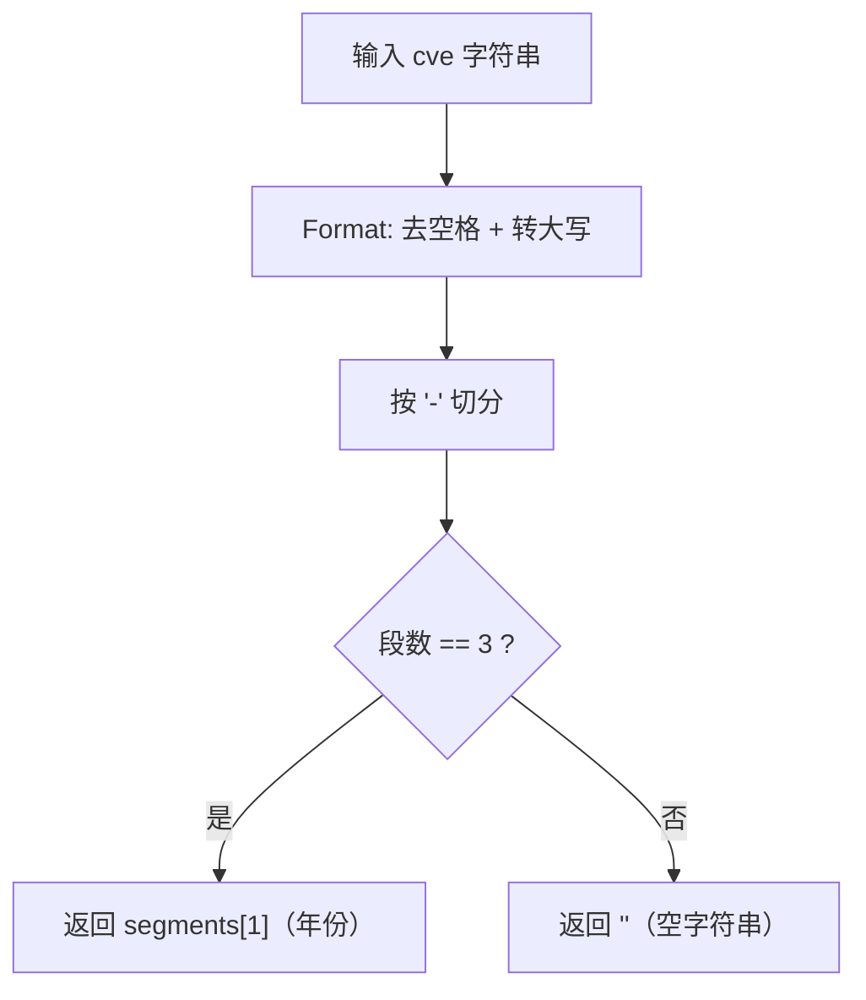

# ExtractCveYear 提取年份

:::tip 📂 查看源码
[`extract.go:146`](https://github.com/scagogogo/cve-skills/blob/main/extract.go#L146-L150) — 在 GitHub 上查看实现代码（第 146–150 行）。
:::

从 CVE 编号中提取年份部分并以字符串形式返回。

:::tip 📌 场景
- 按年份对 CVE 记录分类，用于统计或报告。
- 在进一步处理前，将 CVE 列表按年份分组。
- 在界面或报告中展示年份字段，无需手动解析原始字符串。
:::

## 函数签名

```go
func ExtractCveYear(cve string) string
```

## 参数

- `cve` (string): 要提取年份的 CVE 编号字符串。大小写不敏感，允许前后空白。

## 返回值

- `string`: 提取到的年份字符串，如 `"2022"`。如果输入不是有效的 CVE 格式，则返回空字符串 `""`。

## 行为说明

- 内部委托 `Split`：先用 `Format` 归一化（去空格 + 转大写），再按 `-` 切分。
- 有效的切分必须产生恰好三段（`CVE`、`YYYY`、`NNNNN`），返回中间一段作为年份。
- 若切分结果不是三段（例如 `"not-a-cve"` 或 `"CVE-2022"`），返回零值 `""`，不会 panic、不返回错误。
- 返回的年份是原始字符串，不会校验年份是否落在 CVE 范围（1999..当前年份）；如需校验请用 `IsCveYearOk`。
- 当输入形如 `CVE-ABCD-1234` 时，返回的字符串可能不是数字；如需数值结果请用 `ExtractCveYearAsInt`。

## 流程图



## 示例

```go
package main

import (
	"fmt"

	"github.com/scagogogo/cve-skills"
)

func main() {
	// 标准 CVE：返回年份段
	year := cve.ExtractCveYear("CVE-2022-12345")
	fmt.Println(year) // 2022

	// 大小写不敏感：小写输入也会归一化
	yearLower := cve.ExtractCveYear("cve-2021-44228")
	fmt.Println(yearLower) // 2021

	// 前后空白由 Format 处理
	yearSpace := cve.ExtractCveYear("  CVE-1999-0001  ")
	fmt.Println(yearSpace) // 1999

	// 无效格式：不是三段，返回空字符串
	yearInvalid := cve.ExtractCveYear("not-a-cve")
	fmt.Printf("%q\n", yearInvalid) // ""

	// 部分畸形：只有两段，返回空字符串
	yearPartial := cve.ExtractCveYear("CVE-2022")
	fmt.Printf("%q\n", yearPartial) // ""

	// 年份段不会被校验为数字或范围
	yearWeird := cve.ExtractCveYear("CVE-ABCD-1234")
	fmt.Printf("%q\n", yearWeird) // "ABCD"
}
```

## 使用场景

- 从 CVE 数据集构建按年份的索引或汇总。
- 在安全报告中按年份分组聚合。
- 快速读取年份字段用于展示，无需手动切片字符串。

## 注意事项

- 返回的是字符串而非整数。需要数值比较或运算时请用 `ExtractCveYearAsInt`。
- 本函数不校验年份范围；`CVE-0000-1` 仍会返回 `"0000"`。如需范围校验请配合 `IsCveYearOk`。
- 与扫描自由文本的 `ExtractCve`/`ExtractFirstCve` 不同，`ExtractCveYear` 期望输入已是单个 CVE 编号，不会在任意文本中搜索。
- 依赖 `Split`，三段规则意味着带多余短横线的输入（如 `"CVE-2022-1234-extra"`）会返回 `""`。
- 空输入 `""` 返回 `""`（切分后只有一段）。

## 内部实现

`ExtractCveYear` 是一个两行的薄封装；真正的逻辑都在 `Split`（`base.go:265`）中。

- **委托给 `Split`**：第 147 行调用 `year, _ := Split(cve)` —— 第二个返回值（序列号）通过 `_` 主动丢弃，表明本函数只关心年份段。
- **归一化是委托而非重复**：`Split` 内部在切分前调用 `Format(cve)`（去空格 + 转大写），因此 `ExtractCveYear` 自身并不调用 `Format`。归一化契约只保留在 `Split`/`Format` 一处。
- **按 `-` 切分并严格执行三段校验**：`Split` 内 `strings.Split(cve, "-")` 必须恰好产生三段（`["CVE", "YYYY", "NNNNN"]`）。若 `len(split) != 3`，`Split` 返回命名返回值的零值（`""`, `""`）—— 因此 `ExtractCveYear` 无需自己写 `if` 就能拿到 `""`。
- **返回中间段**：成功路径下 `Split` 返回 `split[1], split[2]`，`ExtractCveYear` 原样转发 `split[1]`（年份）作为字符串 —— 不做数字解析，不做范围校验。
- **设计意图 —— 组合优于重写**：通过 `Split` 中转，年份/序列号这一对提取函数共享同一条归一化与校验路径，保证 `ExtractCveYear` 与 `ExtractCveSeq` 对“何为有效 CVE”的判定始终一致。

## 复杂度

函数本身是 O(1) 的胶水代码；开销主要由 `Split` 承担，后者对输入字符串做一次线性扫描。

| 资源 | 量级 | 原因 |
|---|---|---|
| 时间 | O(n) | `Format` 一遍完成去空格/转大写；`strings.Split` 一遍扫描 `-`。两者均为 CVE 长度 `n` 的线性。 |
| 空间 | O(n) | `Format` 可能分配新字符串（大写副本），`strings.Split` 分配 3 元素切片及子串 —— 均与 `n` 成正比。 |
| 分配 | O(1) 切片头、O(n) 字符串字节 | 切片头数量为小常数；主要分配是大写化/切分后的字符串数据。 |

此处的 `n` 是输入 CVE 字符串的长度（实际通常为小常数，一般不超过 20 字节），因此对真实 CVE 输入而言该函数实际上是常数开销。

## 边界情形

| 输入 | 行为 | 返回 |
|---|---|---|
| `"CVE-2022-12345"` | 标准三段 CVE；`Format` 无操作，切分得 `["CVE","2022","12345"]`。 | `"2022"` |
| `"cve-2021-44228"` | 小写；`Format` 先转大写为 `CVE-2021-44228` 再切分。 | `"2021"` |
| `"  CVE-1999-0001  "` | `Format` 去掉前后空白后切分。 | `"1999"` |
| `""`（空） | `strings.Split("", "-")` 返回 `[""]` —— 只有一段，不是三段。 | `""` |
| `"CVE-2022"` | 切分后只有两段。 | `""` |
| `"not-a-cve"` | 凑巧三段 `["not","a","cve"]`；`Format` 转大写为 `NOT-A-CVE`，仍为三段，故原样返回中间段。 | `"A"` |
| `"CVE-2022-1234-extra"` | 切分后四段 —— 不满足 `len == 3` 校验。 | `""` |
| `"CVE-ABCD-1234"` | 三段；年份段非数字但本函数不校验数字。 | `"ABCD"` |
| `"CVE-0000-1"` | 三段；年份超出 CVE 范围但此处不做范围校验。 | `"0000"` |

## 数据流

```text
+----------------------+
| 输入: cve 字符串     |
|  如 "cve-2022-12345" |
+----------+-----------+
           |
           v
+----------------------+     ExtractCveYear (extract.go:146)
| year, _ := Split(cve)|----- 只保留第一个返回值；
+----------+-----------+      序列号被丢弃 (_)
           |
           v
+----------------------+     Split (base.go:265)
| cve = Format(cve)    |----- 去掉前后空白，
+----------+-----------+      所有字符转大写
           |
           v
+----------------------+
| split = Split(cve,'-')|
+----------+-----------+
           |
           v
+----------------------+
| len(split) == 3 ?    |
+--+----------------+--+
   | 是             | 否
   v                v
+----------+   +----------------+
| return   |   | return "", ""  |   命名返回值的零值
| split[1] |   +-------+--------+
+----+-----+           |
     |                 v
     |           +----------------+
     |           | year == ""     |
     |           +-------+--------+
     |                 |
     v                 v
+--------------------------------+
| 输出: year 字符串             |
|  "2022"            或   ""    |
+--------------------------------+
```

## 相关函数

- [Split](/zh/api/functions/split) — 将 CVE 拆分为年份与序列号两部分。
- [ExtractCveYearAsInt](/zh/api/functions/extract-cve-year-as-int) — 以 `int` 返回年份，失败时返回 `0`。
- [ExtractCveSeq](/zh/api/functions/extract-cve-seq) — 提取序列号部分。
- [Format](/zh/api/functions/format) — 切分前应用的归一化。
- [IsCveYearOk](/zh/api/functions/is-cve-year-ok) — 校验年份是否落在 CVE 范围内。
- [Extract 分类入口](/zh/api/extract) — 全部提取函数总览。
