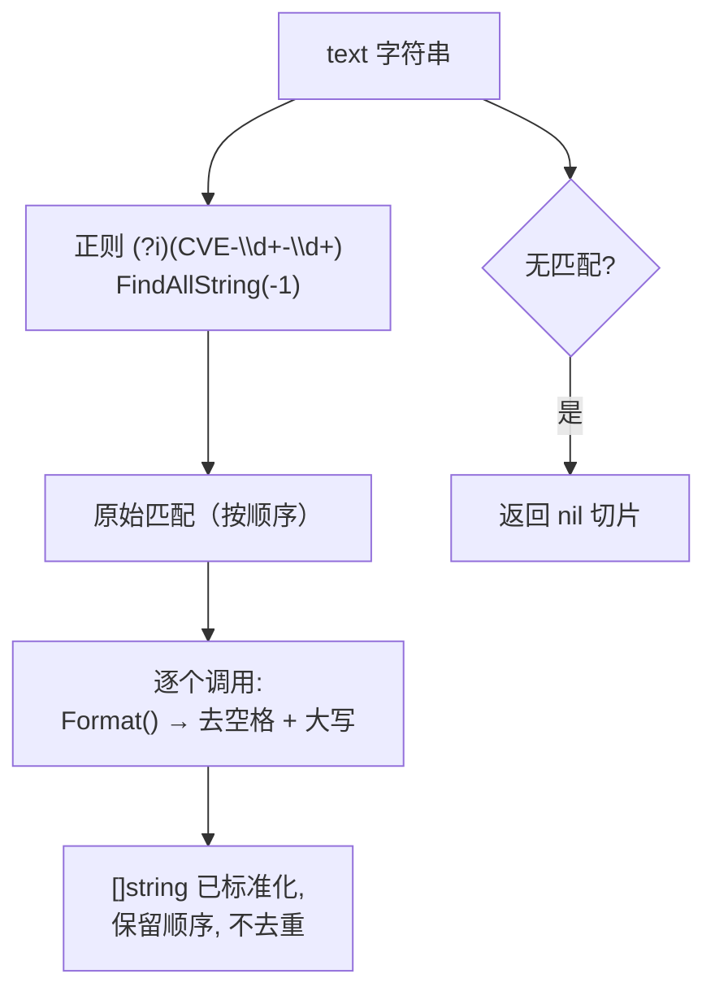

# ExtractCve 提取全部

:::tip 📂 查看源码
[`extract.go:42`](https://github.com/scagogogo/cve-skills/blob/main/extract.go#L42-L49) — 在 GitHub 上查看实现代码（第 42–49 行）。
:::

从任意自由文本中提取所有 CVE 编号，并以标准化列表形式返回。

:::tip 📌 场景
- 一次性从安全公告、更新日志或邮件正文中抽取全部 CVE 编号。
- 将混用大小写的写法（如 `cve-2022-12345`）统一为标准大写格式，同时保留出现顺序。
- 将结果交给去重、排序或验证流水线，做后续分析处理。
:::

## 函数签名

```go
func ExtractCve(text string) []string
```

## 参数

- `text` (string): 要扫描的文本内容，可以是任意字符串——单行、多行报告，甚至空字符串。

## 返回值

- `[]string`: 文本中找到的所有 CVE 编号，每个都标准化为大写格式。按在输入中出现的顺序返回。未找到任何 CVE 时返回空（nil）切片。

## 行为说明

- 使用包级预编译正则 `(?i)(CVE-\d+-\d+)` 查找所有非重叠匹配；该正则大小写不敏感且未锚定，因此能匹配嵌入在自由文本任意位置的 CVE。
- 每个匹配都经过 `Format`（`strings.ToUpper(strings.TrimSpace(...))`），因此 `cve-2022-12345` 与 `CVE-2022-12345` 都会变成 `CVE-2022-12345`。
- 匹配按在输入中出现的顺序返回——同一个 CVE 出现两次就会在结果中出现两次。
- 不做去重——如需唯一值，请对结果调用 `RemoveDuplicateCves`。
- 不校验年份/序列号范围，仅匹配 `CVE-<数字>-<数字>` 的语法形态。如需语义校验，事后调用 `ValidateCve`。
- 空文本或不含 CVE 的输入返回 nil 切片（长度为 0），绝不会 panic。

## 流程图



## 示例

```go
package main

import (
    "fmt"
    "github.com/scagogogo/cve-skills"
)

func main() {
    // 基本用法：混用大小写的写法被统一为大写
    text := "系统受到CVE-2021-44228和cve-2022-12345的影响"
    cves := cve.ExtractCve(text)
    fmt.Printf("Extracted: %v\n", cves)
    // Extracted: [CVE-2021-44228 CVE-2022-12345]

    // 复杂多行公告
    complexText := `
    Security Advisory 2024-001

    This update fixes the following vulnerabilities:
    1. CVE-2021-44228 - Log4Shell vulnerability
    2. cve-2022-12345 - custom component vulnerability
    3. CVE-2023-1234 - third-party library vulnerability

    Also includes: CVE-2023-5678 and CVE-2024-9999
    `
    extracted := cve.ExtractCve(complexText)
    fmt.Printf("From complex text (%d): %v\n", len(extracted), extracted)
    // From complex text (5): [CVE-2021-44228 CVE-2022-12345 CVE-2023-1234 CVE-2023-5678 CVE-2024-9999]

    // 不去重——重复出现的 CVE 被保留，顺序不变
    dup := cve.ExtractCve("CVE-2022-1 mentions CVE-2022-1 again")
    fmt.Printf("Duplicates kept: %v\n", dup)
    // Duplicates kept: [CVE-2022-1 CVE-2022-1]

    // 空文本与不含 CVE 的文本都返回 nil 切片
    fmt.Printf("Empty text: %v (len %d)\n", cve.ExtractCve(""), len(cve.ExtractCve("")))
    fmt.Printf("No-CVE text: %v (len %d)\n", cve.ExtractCve("plain text without any cve"), len(cve.ExtractCve("plain text without any cve")))
}
```

## 使用场景

- 从安全公告或厂商通告中提取所有受影响的 CVE 编号。
- 批量处理更新日志与发布说明，按版本收集 CVE 列表。
- 在应急响应期间从日志、邮件或聊天记录中挖掘 CVE 引用。
- 在交给去重、排序或验证流水线之前，先从自由文本中提取出 CVE 列表。

## 注意事项

- ⚠️ 结果不去重——同一个 CVE 出现 N 次就会返回 N 次。需要唯一性时请串联 `RemoveDuplicateCves`。
- 仅匹配 `CVE-<数字>-<数字>` 的语法形态，不校验年份与序列号范围。像 `CVE-9999-0` 这样的片段也会被提取并格式化——如需语义正确性，请用 `ValidateCve` 校验。
- 正则大小写不敏感，因此 `cve`、`Cve`、`CVE` 前缀都能匹配；每个匹配都会经 `Format` 转为大写。
- 顺序遵循输入文本，即从左到右、逐行推进——当需要"最先提及"或"最后提及"时很有用（见 `ExtractFirstCve` / `ExtractLastCve`）。
- 时间复杂度 O(m)，其中 m 为文本长度；空间复杂度 O(n)，其中 n 为匹配数量。

## 内部实现

函数体（extract.go L42-L49）刻意精简——三条语句，把重活交给预编译正则与 `Format` 辅助函数。

- **预编译正则查找（L43）。** `cveRegex` 是包级 `var`，在包初始化时通过 `regexp.MustCompile(`(?i)(CVE-\d+-\d+)`)` 编译一次。调用 `FindAllString(text, -1)` 扫描整个输入，按从左到右顺序返回所有非重叠匹配。`-1` 表示"匹配数量不限"。由于正则在包初始化时已编译，重复调用只付出线性扫描成本，无需重复编译。
- **就地标准化循环（L44-L46）。** 对返回的 `slice` 以索引+值方式遍历，每个元素被 `Format(cve)` 的结果原地覆盖。`Format` 执行 `strings.ToUpper(strings.TrimSpace(...))`，因此首尾空白被剥离，大小写不敏感匹配到的 `CVE-` 前缀被统一为大写。原地修改避免了再分配一个切片。
- **直接返回（L47）。** 返回的是同一个 `slice` 引用——不拷贝、不排序、不去重。这让函数分配更轻，是否串联 `RemoveDuplicateCves` 或 `SortCves` 交给调用方决定。
- **设计意图。** 该函数是一个薄薄的"扫描 + 标准化"适配器：正则负责匹配语义，`Format` 负责大小写规则，`ExtractCve` 只负责把它们串起来。正因如此，`ExtractFirstCve` 与 `ExtractLastCve` 能复用它（后者直接调用 `ExtractCve` 再取最后一个元素）。
- **无防御性分支。** 没有显式的 `if len(text) == 0` 判断；`FindAllString` 在空文本或无匹配输入上返回 `nil`，而对 nil 切片执行 `for` 循环是空操作，因此函数自然返回 `nil`，不会 panic。

## 复杂度

| 维度 | 上界 | 决定因素 |
|---|---|---|
| 时间 | O(m) | `FindAllString` 对输入文本扫描一次，m 为文本长度（依据源码注释）。 |
| 空间 | O(n) | 返回切片每个匹配占一个字符串，n 为匹配到的 CVE 数量（依据源码注释）。 |
| 单元素标准化 | O(k) | 每次 `Format` 对长度为 k 的匹配做去空格 + 转大写；n 次累加不超过 m。 |
| 初始化 | 摊还 O(1) | 正则在包初始化时编译一次，并非每次调用都编译。 |

本函数不做排序与去重，因此没有 O(n log n) 项——需要排序或唯一性的调用方自行通过 `SortCves` / `RemoveDuplicateCves` 叠加。

## 边界情形

| 输入 | 行为 | 返回 |
|---|---|---|
| `""`（空字符串） | `FindAllString` 无匹配；循环体不执行 | `nil`（长度 0） |
| `"plain text without any cve"` | 正则扫描后未找到 `CVE-<数字>-<数字>` 片段 | `nil`（长度 0） |
| `"cve-2022-12345"`（全小写） | 大小写不敏感匹配；`Format` 转大写 | `["CVE-2022-12345"]` |
| `"CvE-2022-12345"`（混合大小写） | 匹配；`Format` 统一前缀大写 | `["CVE-2022-12345"]` |
| `"CVE-2022-12345 CVE-2022-12345"`（重复） | 两次独立匹配；不去重 | `["CVE-2022-12345", "CVE-2022-12345"]` |
| `"CVE-9999-0"`（年份/序号越界） | 语法形态匹配；不做范围校验 | `["CVE-9999-0"]` |
| `"CVE-2022-1234 extra"`（带周围文本） | 匹配嵌入的片段；周围文本被忽略 | `["CVE-2022-1234"]` |
| 多行公告文本 | 逐行从左到右扫描；换行符只是非匹配字符 | 按出现顺序的全部匹配 |
| `" CVE-2022-1 "`（匹配两侧有空白） | 空白在捕获组之外；`Format` 也会再修剪一次 | `["CVE-2022-1"]` |

## 数据流

```text
+-------------------+
|  text: string     |
|  (任意文本)        |
+---------+---------+
          |
          v
+-------------------+    包级变量, 初始化时编译一次
| cveRegex          |    (?i)(CVE-\d+-\d+)
| FindAllString(-1) |
+---------+---------+
          |
          v
+-------------------+
| slice []string    |    原始匹配, 按输入顺序, 如
| (保留小写/混合    |    ["cve-2022-12345", "CVE-2021-44228"]
|  大小写)          |
+---------+---------+
          |
          | for i, cve := range slice
          v
+-------------------+
| Format(cve)       |    ToUpper + TrimSpace, 就地修改
| slice[i] = ...    |    覆盖每个元素
+---------+---------+
          |
          v
+-------------------+
| slice []string    |    已标准化, 如
| (大写, 保留顺序,  |    ["CVE-2022-12345", "CVE-2021-44228"]
|  不去重)          |    -- 不排序, 不去重 --
+---------+---------+
          |
          v
+-------------------+
| return slice      |    无匹配时返回 nil
+-------------------+
```

## 相关函数

- [ExtractFirstCve](/zh/api/functions/extract-first-cve) — 只返回第一个匹配，比取 `ExtractCve(text)[0]` 更高效。
- [ExtractLastCve](/zh/api/functions/extract-last-cve) — 只返回最后一个匹配（内部调用 `ExtractCve`）。
- [IsContainsCve](/zh/api/functions/is-contains-cve) — 布尔判断文本是否包含任意 CVE，不分配切片。
- [Format](/zh/api/functions/format) — 对每个匹配执行的标准化步骤。
- [RemoveDuplicateCves](/zh/api/functions/remove-duplicate-cves) — 对本函数返回的切片去重。
- [提取类函数总览](/zh/api/extract) — 所有提取函数的入口页。
