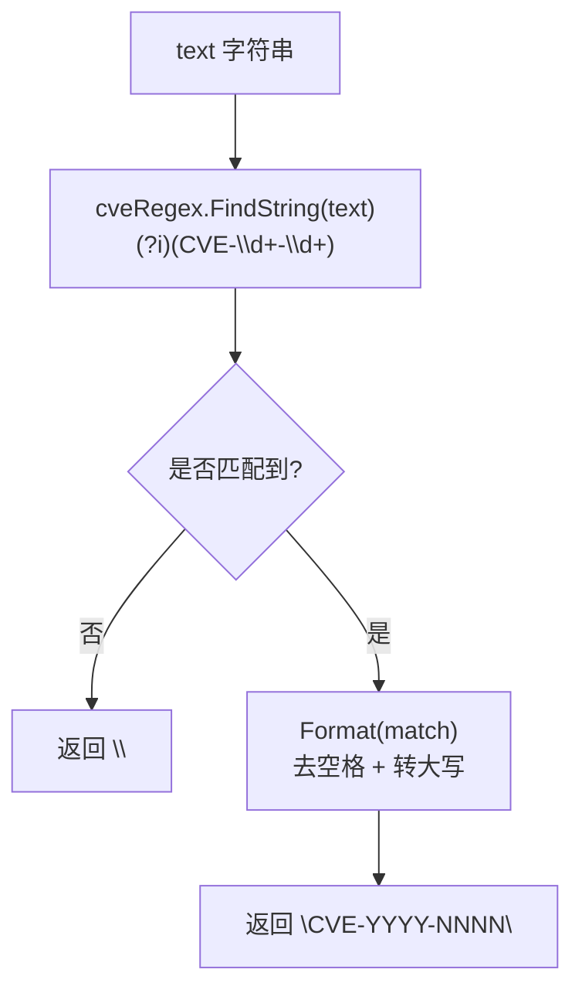

# ExtractFirstCve 提取首个

:::tip 📂 查看源码
[`extract.go:78`](https://github.com/scagogogo/cve-skills/blob/main/extract.go#L78-L82) — 在 GitHub 上查看实现代码（第 78–82 行）。
:::

从字符串中提取第一个出现的 CVE 编号，并以标准大写格式返回。

:::tip 📌 场景
- 在安全公告标题或摘要中快速取到主要 CVE 编号
- 提交缺陷报告时只需一个标识符，挑一个代表性 CVE
- 下游逻辑只关心首个匹配时的快速路径
:::

## 函数签名

```go
func ExtractFirstCve(text string) string
```

## 参数

- `text` (string): 需要提取 CVE 的文本内容。可以是任意字符串——安全公告、提交信息、日志行等。

## 返回值

- `string`: 第一个找到的 CVE 编号，已格式化为标准大写形式。如果未找到任何 CVE，则返回空字符串 `""`。

## 行为说明

- 使用预编译正则 `(?i)(CVE-\d+-\d+)` 通过 `FindString` 定位首个匹配，匹配不区分大小写且在首次命中后即停止。
- 匹配到的子串会经过 `Format` 处理：去除首尾空白并转为大写，因此 `cve-2021-44228` 与 ` CVE-2021-44228 ` 都会归一化为 `CVE-2021-44228`。
- 当文本中没有任何 CVE 模式匹配时，`FindString` 返回 `""`；`Format("")` 同样返回 `""`，因此空字符串契约无需额外分支即可成立。
- 仅返回字面意义上的首个匹配——不会对其余文本做扫描、切片或去重，因而比先调用 `ExtractCve` 再取 `[0]` 更省资源。

## 流程图



## 示例

```go
package main

import (
    "fmt"

    "github.com/scagogogo/cve-skills"
)

func main() {
    // 与源码对齐的示例：混合大小写句子中的首个 CVE
    report := "系统受到CVE-2021-44228和CVE-2022-12345的影响"
    firstCve := cve.ExtractFirstCve(report)
    fmt.Println(firstCve) // Output: CVE-2021-44228

    // 不含任何 CVE 的文本 → 空字符串
    noCve := "本文档不包含任何CVE编号"
    fmt.Printf("%q\n", cve.ExtractFirstCve(noCve)) // Output: ""

    // Log4j 风格的带括号引用
    log4j := "Log4j漏洞(CVE-2021-44228)非常严重"
    fmt.Println(cve.ExtractFirstCve(log4j)) // Output: CVE-2021-44228

    // 小写输入会被归一化为大写
    lower := "first is cve-2022-12345 then cve-2023-9999"
    fmt.Println(cve.ExtractFirstCve(lower)) // Output: CVE-2022-12345

    // 空字符串输入
    fmt.Printf("%q\n", cve.ExtractFirstCve("")) // Output: ""

    // 即使存在多个匹配，也只返回首个
    many := "CVE-2023-1111, CVE-2023-2222, CVE-2023-3333"
    fmt.Println(cve.ExtractFirstCve(many)) // Output: CVE-2023-1111
}
```

## 使用场景

- 当下游只需要一个标识符时，从公告中获取主要或最显著的 CVE
- 快速识别安全通告的主 CVE，用于打标签或建工单
- 只需要首个结果、无需构造完整匹配列表的性能敏感路径
- 在进行更重的提取流程之前，对日志或提交信息做轻量预扫描

## 注意事项

- ⚠️ 本函数只返回**首个**匹配；如需获取全部 CVE 请使用 [`ExtractCve`](/zh/api/functions/extract-cve)，如需最后一个请使用 [`ExtractLastCve`](/zh/api/functions/extract-last-cve)。
- ✅ 匹配不区分大小写（`(?i)`），结果统一经 `Format` 转为大写，因此 `cve-`、`Cve-`、`CVE-` 前缀都会得到同一标准形式。
- ⚠️ 匹配基于模式，并不与 CVE 库核对——像 `CVE-9999-99999` 这样的串也会被返回，尽管它并非真实分配的 CVE。需要语义校验时请配合 [`ValidateCve`](/zh/api/functions/validate-cve)。
- ✅ 此处不涉及去重（仅一个结果），但底层正则本身也不去重——首个匹配即便重复也会胜出。
- ⚠️ 空字符串是唯一的失败信号，调用方应通过 `== ""` 判断，而非期待 error 返回。

## 内部实现

函数体只有两行（`extract.go:78-82`），但每一行都蕴含着明确的设计取舍：

- **复用预编译正则（L9、L79）**：包级变量 `cveRegex = regexp.MustCompile(\`(?i)(CVE-\d+-\d+)\`)` 在 init 阶段编译一次，被 `ExtractCve`、`ExtractFirstCve`、`ExtractLastCve` 共享。`ExtractFirstCve` 调用 `cveRegex.FindString(text)`，仅做一次最左匹配并短路返回——不会像 `FindAllString` 那样分配结果切片。
- **以 `FindString` 实现首个语义（L79）**：`(*Regexp).FindString` 返回最左匹配的文本，无匹配时返回 `""`，恰好对应"首个 CVE"的契约，无需手动处理索引。
- **归一化委托给 `Format`（L80）**：原始匹配串直接传入 `Format(s)`，由其去除首尾空白并转大写。这保证大小写不敏感的输入（`cve-`、`Cve-`、`CVE-`）始终得到统一的 `CVE-YYYY-NNNN` 形式。
- **无需分支的空路径**：无匹配时 `FindString` 返回 `""`，`Format("")` 亦返回 `""`，空字符串契约由函数组合自然成立——函数体内没有任何 `if`/`else`。
- **比 `ExtractCve(text)[0]` 更省资源**：`FindString` 在首次命中即止且只分配一个字符串，避免了 `ExtractCve` 构造并归一化整个匹配切片的开销。

## 复杂度

| 维度 | 开销 | 说明 |
|---|---|---|
| 时间 | O(m) | 对输入做一次正则扫描，m = `len(text)`；`(?i)(CVE-\d+-\d+)` 在最左匹配后即停，实际常在文本末尾之前就结束。 |
| 空间 | O(1) 辅助 | `FindString` 仅分配一个匹配字符串；`Format` 至多再分配一个归一化字符串。不构造切片或 map。 |
| 正则编译 | O(1) 摊销 | `cveRegex` 通过 `MustCompile` 在包 init 时编译一次；每次调用的编译成本为零。 |

上述界比源码中对 `ExtractCve` 标注的 O(n)/O(m) 更紧——因为 `ExtractFirstCve` 永远只物化一个匹配，省去了 `ExtractCve` 为完整匹配切片付出的 O(n) 空间。

## 边界情形

| 输入 | 行为 | 返回 |
|---|---|---|
| `""`（空字符串） | `FindString` 无匹配 → 返回 `""`；`Format("")` 返回 `""` | `""` |
| 不含 CVE 模式的文本（如 `"no vulns here"`） | 正则扫描结束无匹配 → `""` → `Format("")` → `""` | `""` |
| 小写 `cve-2022-12345` | `(?i)` 大小写不敏感匹配；`Format` 转大写 | `"CVE-2022-12345"` |
| 混合大小写 `Cve-2022-12345` | 同上——`(?i)` 匹配，`Format` 归一化 | `"CVE-2022-12345"` |
| 带首尾空白/括号 `"( CVE-2021-44228 )"` | 捕获组 `(...)` 只取 `CVE-2021-44228`；`Format` 去除边缘空白 | `"CVE-2021-44228"` |
| 多个 CVE `"CVE-2023-1111, CVE-2023-2222"` | `FindString` 只返回最左匹配，其余忽略 | `"CVE-2023-1111"` |
| 首个 CVE 重复 `"CVE-2021-44228 and CVE-2021-44228"` | 首次出现胜出；不做去重（也无需去重） | `"CVE-2021-44228"` |
| 形式合规但不存在 `"CVE-9999-99999"` | 模式匹配成功；不与 CVE 库核对 | `"CVE-9999-99999"` |
| 嵌在更长单词中的类 CVE 片段 `"XCVE-2021-44228Z"` | 未锚定 `\b`，子串仍可匹配 | `"CVE-2021-44228"` |

## 数据流

```text
+---------------------------+
|     输入 text (string)    |
|  如 "see cve-2022-12345"  |
+-------------+-------------+
              |
              v
+---------------------------+
| cveRegex.FindString(text) |  预编译: (?i)(CVE-\d+-\d+)
|  - 最左单次匹配           |
|  - 无匹配返回 ""          |
+-------------+-------------+
              |
              v
+---------------------------+
|       原始匹配 s          |
|  "cve-2022-12345" 或 ""   |
+-------------+-------------+
              |
              v
+---------------------------+
|       Format(s)           |  去空格 + 转大写
|  -> "CVE-2022-12345"      |
|  -> ""            (若为"")|
+-------------+-------------+
              |
              v
+---------------------------+
|     返回 string           |
|  "CVE-YYYY-NNNN" 或 ""    |
+---------------------------+
```

## 相关函数

- [ExtractCve](/zh/api/functions/extract-cve) — 从文本中提取全部 CVE 编号
- [ExtractLastCve](/zh/api/functions/extract-last-cve) — 从文本中提取最后一个 CVE 编号
- [IsContainsCve](/zh/api/functions/is-contains-cve) — 判断文本中是否包含任意 CVE
- [Format](/zh/api/functions/format) — 对匹配子串执行的归一化步骤
- [ValidateCve](/zh/api/functions/validate-cve) — 按真实 CVE 规则校验返回的标识符
- [提取类函数总览](/zh/api/extract) — 全部提取相关函数
