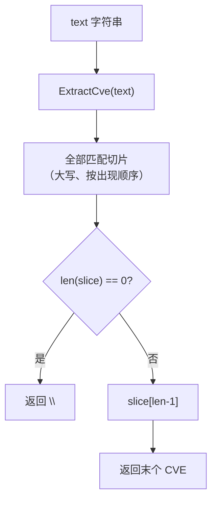

# ExtractLastCve 提取末个

:::tip 📂 查看源码
[`extract.go:111`](https://github.com/scagogogo/cve-skills/blob/main/extract.go#L111-L118) — 在 GitHub 上查看实现代码（第 111–118 行）。
:::

从一段文本中提取最后出现的 CVE 编号，并返回标准大写格式。

:::tip 📌 场景
- 从更新日志或发行说明中提取最近一次提到的 CVE。
- 从按时间顺序罗列修复项的安全公告中抓取最新修复的 CVE。
- 当摘要行末尾的 CVE 才是关注重点时，取最后一个即可。
:::

## 函数签名

```go
func ExtractLastCve(text string) string
```

## 参数

- `text` (string): 需要提取 CVE 的文本内容，可以是任意字符串。

## 返回值

- `string`: 文本中最后一个找到的 CVE 编号，格式化为标准大写形式。如果未找到任何 CVE，则返回空字符串 `""`。

## 行为说明

- 内部先调用 `ExtractCve(text)` 按出现顺序收集所有匹配，再返回结果切片的最后一个元素。
- 由于复用 `ExtractCve`，结果继承同样的匹配与格式化规则：匹配大小写不敏感（`(?i)(CVE-\d+-\d+)`），返回值经 `Format` 标准化为大写并去除首尾空白。
- 当输入不含任何 CVE（或为空）时，`ExtractCve` 返回空切片；`ExtractLastCve` 判定 `len(slice) == 0` 后直接返回 `""`，不会越界访问切片，因此不会 panic。
- 不去重：若同一 CVE 出现多次，返回最后一次出现（仍为大写）。如需去重请另行使用 `RemoveDuplicateCves`。

## 流程图



## 示例

```go
package main

import (
    "fmt"
    "github.com/scagogogo/cve-skills"
)

func main() {
    // 来源：extract.go 文档示例
    changelog := "修复了CVE-2021-44228和CVE-2022-12345漏洞"
    lastCve := cve.ExtractLastCve(changelog)
    fmt.Println(lastCve) // Output: CVE-2022-12345

    // 多组用例与注释的预期输出
    cases := []string{
        "系统受到CVE-2021-44228和CVE-2022-12345的影响", // 预期: CVE-2022-12345
        "cve-2022-12345 comes first",                  // 预期: CVE-2022-12345（仅一个）
        "Primary is CVE-2021-44228, plus cve-2022-12345 and CVE-2023-3333", // 预期: CVE-2023-3333
        "本文档不包含任何CVE编号",                            // 预期: ""（空）
        "",                                            // 预期: ""（空）
    }

    for _, text := range cases {
        last := cve.ExtractLastCve(text)
        fmt.Printf("Text: '%s'\n  Last CVE: '%s'\n", text, last)
    }
}
```

## 使用场景

- 从更新日志或发行说明中获取最近提到的 CVE。
- 处理按时间顺序排列的 CVE 列表，末尾即最新。
- 捕获附加在公告末尾的补充或更新 CVE 信息。
- 与 `ExtractFirstCve` 配合，快速确认文本中 CVE 的首尾范围。

## 注意事项

- ⚠️ 与 `ExtractFirstCve`（利用正则的 `FindString` 提前终止）不同，`ExtractLastCve` 始终执行一次完整的 `ExtractCve` 扫描、物化整个切片后再取末元素——性能与 `ExtractCve` 相当，并不会更快。
- ✅ 大小写不敏感：小写 `cve-...` 与混合大小写 `CvE-...` 都会被标准化为 `CVE-...`。
- ⚠️ 不去重：若同一 CVE 重复出现，返回的是最后一次重复。需要唯一性时请配合 `RemoveDuplicateCves`。
- 🔍 未匹配时返回 `""`（而非错误），调用方应检查空字符串，而非期待哨兵错误。
- 🛠️ 若需要全部匹配，请直接调用 `ExtractCve`；若只需首个匹配，请使用更轻量的 `ExtractFirstCve`。

## 内部实现

该函数是对 `ExtractCve` 的薄封装，仅增加一次空判断与一次末元素取值：

- 委托给 `ExtractCve(text)`（extract.go:112），后者本身执行 `cveRegex.FindAllString(text, -1)` 并通过 `Format` 标准化每个匹配。这意味着 `ExtractLastCve` 要承担完整的扫描与切片分配开销，而非定向的"查找最后一个"搜索。
- 在任何索引操作之前用 `if len(slice) == 0`（extract.go:113）守卫空切片。这是函数内唯一的分支点，避免在不含 CVE 的输入上越界 panic。
- 返回 `slice[len(slice)-1]`（extract.go:116）——对已物化、已格式化的切片做一次索引。此处不再额外调用 `Format`，因为 `ExtractCve` 已把每个元素转为大写。
- 设计意图：复用经过测试的 `ExtractCve` 流水线（匹配 + 格式化）而非重新实现正则，使 `ExtractCve` / `ExtractFirstCve` / `ExtractLastCve` 三者的匹配规则保持一致。代价是"最后一个"通过物化整个列表得出，而非反向扫描。
- 顺序来源于 `FindAllString`（按源文本从左到右的出现顺序），因此末元素是源顺序中的最后一个匹配——并非年份或序列号最大者，也不受排序影响。

## 复杂度

由本函数调用的 `ExtractCve` 扫描推导而得（见 `ExtractCve` 文档注释：时间 O(m)、空间 O(n)）：

| 资源 | 复杂度 | 说明 |
|---|---|---|
| 时间 | O(m) | `m` 为输入文本长度；由一次正则 `FindAllString` 全字符串扫描主导。 |
| 空间 | O(n) | `n` 为匹配到的 CVE 数量；`ExtractCve` 分配长度为 `n` 的切片，在读取末元素前全部保留。 |
| 本封装额外时间 | O(1) | 一次 `len()` 判断加一次切片索引——相对扫描可忽略。 |

注意：尽管只需要末元素，整个切片仍会被物化，因此空间开销与 `ExtractCve` 相同，而非 O(1)。

## 边界情形

| 输入 | 行为 | 返回 |
|---|---|---|
| 空字符串 `""` | `ExtractCve` 返回空切片；命中 `len == 0` 分支。 | `""` |
| 文本中不含任何 CVE | 正则无匹配；空切片；命中 `len == 0` 分支。 | `""` |
| 仅一个 CVE `"...CVE-2022-12345..."` | 切片只有一个元素；返回 `slice[0]`。 | 该 CVE，大写 |
| 多个 CVE | 返回从左到右顺序中的最后一个匹配。 | 末个 CVE，大写 |
| 小写 `cve-2022-12345` | 被 `(?i)` 匹配；经 `Format` 转为大写。 | `CVE-2022-12345` |
| 混合大小写 `CvE-2022-12345` | 同样大小写不敏感匹配并标准化。 | `CVE-2022-12345` |
| 同一 CVE 重复出现 | 不去重；返回最后一次出现，原样返回。 | 最后一次出现，大写 |
| 类似 CVE 但带多余数字的子串 | 正则 `CVE-\d+-\d+` 各分组贪婪；仅格式正确的匹配计入。 | 最后一个格式正确的匹配，或 `""` |

## 数据流

```text
+------------------------+
|   text: 字符串输入      |
+-----------+------------+
            |
            v
+------------------------+
|  ExtractCve(text)      |
|  (extract.go:112)      |
|  - cveRegex.FindAll    |
|    String(text, -1)    |
|  - 对每个匹配 Format   |
+-----------+------------+
            |
            v
+------------------------+
|  slice: []string       |
|  (大写、按出现顺序)     |
+-----------+------------+
            |
            v
+------------------------+
| len(slice) == 0 ?      |--- 是 ---> 返回 ""
| (extract.go:113)       |
+-----------+------------+
            | 否
            v
+------------------------+
| slice[len(slice)-1]    |
| (extract.go:116)       |
+-----------+------------+
            |
            v
+------------------------+
| 返回末个 CVE 字符串     |
+------------------------+
```

## 相关函数

- [ExtractCve](/zh/api/functions/extract-cve) — 从文本中提取所有 CVE（`ExtractLastCve` 的基础）。
- [ExtractFirstCve](/zh/api/functions/extract-first-cve) — 提取首个 CVE，扫描更轻量。
- [提取分类](/zh/api/extract) — 提取类函数总览。
