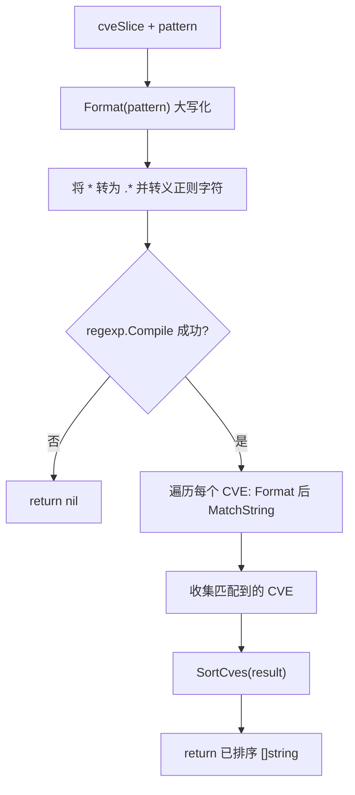

# FilterCvesByPattern 通配符筛选

:::tip 📂 查看源码
[`extract.go:299`](https://github.com/scagogogo/cve-skills/blob/main/extract.go#L299-L330) — 在 GitHub 上查看实现代码（第 299–330 行）。
:::

`FilterCvesByPattern` 根据简单通配符模式对 CVE 列表进行筛选，返回已格式化并排序的匹配结果。

:::tip 📌 场景
- 快速将 CVE 列表缩小到某一年（如 `CVE-2022-*`）
- 选取跨年份但序列号相同的 CVE（如 `CVE-*-1234`）
- 构建由用户输入模式驱动的灵活 CVE 查询/搜索功能

## 函数签名

```go
func FilterCvesByPattern(cveSlice []string, pattern string) []string
```

## 参数

- `cveSlice` ([]string): 需要筛选的 CVE 编号数组
- `pattern` (string): 通配符模式，自动通过 `Format` 格式化为大写

## 返回值

- `[]string`: 匹配模式的所有 CVE 编号，每个都经 `Format` 标准化并通过 `SortCves` 排序；若编译模式失败则返回 `nil`

## 行为说明

- 模式首先经过 `Format`（大写并去空白），因此 `cve-2022-*` 与 `CVE-2022-*` 行为一致
- `*` 被转换为正则 `.*`（匹配任意字符序列）
- 模式中的正则元字符 — `. + ( ) [ ] { } \ ^ $ |` — 会自动转义，因此字面量点号、花括号等不会被当作正则语法
- `cveSlice` 中的每个 CVE 在匹配前都经 `Format` 标准化，因此容忍首尾空白与大小写混用
- 结果最后经 `SortCves` 排序，保证输出顺序确定、与输入顺序无关

## 流程图



## 示例

```go
package main

import (
	"fmt"

	"github.com/scagogogo/cve-skills"
)

func main() {
	cveList := []string{
		"CVE-2022-1111",
		"CVE-2022-2222",
		"CVE-2021-1111",
		"CVE-2023-2222",
		"cve-2022-3333", // 小写，会被格式化
	}

	// 输入: ["CVE-2022-1111", "CVE-2022-2222", "CVE-2023-1111"], "CVE-2022-*"
	// 输出: ["CVE-2022-1111", "CVE-2022-2222"]
	cves2022 := cve.FilterCvesByPattern(cveList, "CVE-2022-*")
	fmt.Println("CVE-2022-*      :", cves2022)

	// 输入: ["CVE-2022-1111", "CVE-2021-1111", "CVE-2023-2222"], "CVE-*-1111"
	// 输出: ["CVE-2021-1111", "CVE-2022-1111"]
	cve1111 := cve.FilterCvesByPattern(cveList, "CVE-*-1111")
	fmt.Println("CVE-*-1111      :", cve1111)

	// 以序列号前缀开头的模式 — CVE-2022-1* 匹配 2022 年序列号以 "1" 开头的 CVE。
	cve2022Seq1 := cve.FilterCvesByPattern(cveList, "CVE-2022-1*")
	fmt.Println("CVE-2022-1*     :", cve2022Seq1)

	// 小写模式在匹配前会自动格式化为大写。
	cves2023 := cve.FilterCvesByPattern(cveList, "cve-2023-*")
	fmt.Println("cve-2023-*      :", cves2023)
}
```

## 使用场景

- 通过通配符按年份快速筛选 CVE（`CVE-2022-*`）
- 选取跨年份但序列号相同的 CVE（`CVE-*-1234`）
- 构建灵活的、由用户输入模式驱动的 CVE 查询/搜索功能
- 在筛选的同时对零散 CVE 列表进行标准化与排序

## 注意事项

- 仅 `*` 是通配符；`?` 等 glob 风格占位符**不支持** — `?` 会被当作字面字符
- 模式仅由自身文本锚定 — 没有隐式的 `^`/`$`，因此 `CVE-2022-1` 也会匹配 `CVE-2022-12345`。需要更严格边界时请在模式中显式补充上下文
- 由于每个 CVE 在匹配前都经过 `Format`，`cveSlice` 中大小写混用或带空白的条目仍可正确匹配
- 若 `regexp.Compile` 失败（如转义异常），函数返回 `nil` 而非空切片 — 下游逻辑需区分 `nil` 与"无匹配"
- 结果由 `SortCves` 排序，输出顺序确定，与输入顺序无关

## 内部实现

`FilterCvesByPattern`（extract.go L299-L330）将通配符模式转换为正则表达式，再让每个已格式化的 CVE 与之匹配。其流程分为五个阶段：

- **模式标准化（L300）。** `pattern = Format(pattern)` 先将模式大写化并去除首尾空白。这就是 `cve-2022-*` 与 `CVE-2022-*` 结果一致的原因——下一步的通配符转换始终作用于规范化后的形态。
- **通配符转正则（L302-L314）。** 逐 rune 遍历模式：`*` 转为 `.*`；正则元字符 `. + ( ) [ ] { } \ ^ $ |` 各加反斜杠前缀（L308-L310）；其余 rune 原样追加（L311-L313）。设计意图：对外只暴露**简单**的通配符语法（仅 `*`），底层仍复用 Go 的 `regexp` 引擎，同时保护字面量点号/花括号不被误判为正则语法。
- **编译与快速失败（L316-L319）。** `regexp.Compile(string(regexParts))` 编译转换后的模式。若编译失败立即返回 `nil`，而非 panic——刻意为之，使调用方能区分"模式非法"与"无匹配"。
- **逐 CVE 格式化并匹配（L321-L327）。** `cveSlice` 中每个元素先经 `Format`（L323），再调用 `regex.MatchString`（L324）。在循环内部格式化（而非预先规范化整个切片）意味着原切片不会被修改；仅匹配结果以其规范形态被收集（L325）。
- **确定性排序（L329）。** `return SortCves(result)` 对收集到的匹配项排序，输出顺序与输入顺序无关、跨调用稳定。

### 关键行

- L300：`pattern = Format(pattern)` — 规范化模式。
- L307：`regexParts = append(regexParts, []rune(".*")...)` — `*` → `.*`。
- L308-L310：正则元字符的转义分支。
- L316：`regexp.Compile(string(regexParts))` — 唯一的失败点。
- L324：`regex.MatchString(formatted)` — 实际匹配测试。
- L329：`SortCves(result)` — 最终的确定性排序。

## 复杂度

设 `n = len(cveSlice)`、`m = len(pattern)`（按 rune 计）。主要开销如下：

- 模式转换：O(m) — 对模式 rune 做一次遍历，每个 rune 的 append 均摊 O(1)。编译后的正则模式串最多约 2m 个 rune（最坏情况：每个字符都是需加 `\` 前缀的元字符）。
- `regexp.Compile`：对本语法下这种无歧义（非回溯歧义）的模式为 O(m)。
- 逐 CVE 匹配：每次 `MatchString` 为 O(k)，k 为 CVE 长度；整个切片为 O(n · k)。每次 `Format` 同样为 O(k)。
- `SortCves(result)`：O(r log r)，r 为匹配数（`r ≤ n`）。

| 资源 | 开销 |
| --- | --- |
| 时间 | O(m) + O(n · k) + O(r log r)，即对输入切片线性扫描再加一次匹配项排序 |
| 空间 | O(m) 用于正则 parts 缓冲 + O(r) 用于结果切片（外加编译后的正则） |

## 边界情形

| 输入 | 行为 | 返回 |
| --- | --- | --- |
| `cveSlice` 为 nil 或空 | 循环体不执行；`result` 保持 nil | `SortCves(nil)` → `nil` |
| `pattern` 为空串 `""` | `Format("")` → `""`；正则 `""` 编译成功；`MatchString` 匹配任意字符串 | 全部 CVE 格式化并排序 |
| `pattern` 为小写（`cve-2022-*`） | `Format` 先转为大写 `CVE-2022-*` 再转换 | 与大写模式一致 |
| `pattern` 含正则元字符（`CVE-2022.[*`） | `.` 被转义为 `\.`，按字面量处理 | 匹配字面量 `.`，而非"任意字符" |
| `pattern` 含 `?` | `?` 不是通配符；被原样追加（未转义）传给 `regexp.Compile` | 形成正则 `?` — 多半**编译失败** → `nil` |
| `cveSlice` 中有重复 CVE | 每个出现都独立格式化、匹配并追加 | 重复项保留（不去重），随后排序 |
| `cveSlice` 条目大小写/空白混用（`" cve-2022-1111 "`） | 每个匹配前都经 `Format` | 正常匹配，输出为规范形态 |
| `regexp.Compile` 失败 | L317-L319 提前返回 | `nil` |
| 无任何 CVE 匹配模式 | `result` 保持空 | `SortCves([])` → 空切片（非 `nil`） |

## 数据流

```text
+--------------------------+      +-------------------------+
| cveSlice []string        |      | pattern string          |
| (原始，可能大小写混用)   |      | (如 "cve-2022-*")       |
+-----------+--------------+      +-----------+-------------+
            |                               |
            |                               v
            |                  +---------------------------+
            |                  | Format(pattern)           |  L300
            |                  | -> "CVE-2022-*"           |
            |                  +-----------+---------------+
            |                              |
            |                              v
            |                  +---------------------------+
            |                  | 逐 rune 转换              |  L302-L314
            |                  |  '*' -> ".*"              |
            |                  |  元字符 -> '\'+char       |
            |                  | -> "CVE-2022-.*"          |
            |                  +-----------+---------------+
            |                              |
            |                              v
            |                  +---------------------------+
            |                  | regexp.Compile(...)       |  L316
            |                  +-----+---------------+-----+
            |                        |               |
            |                 err != 0|               | ok
            |                        v               v
            |               +----------------+  +-------------------------+
            |               | return nil     |  | regex *Regexp           |
            |               | (L317-L319)    |  +-----------+-------------+
            |               +----------------+              |
            |                                               |
            v                                               v
   +-----------------+                          +-------------------------+
   | for cve in slice| (L322)                   | regex.MatchString(...)  |
   +---+-------------+                          +-----------+-------------+
       |                                                      |
       v                                                      |
   +-----------------+                                       |
   | Format(cve)     | L323                                  |
   | -> 规范形态     |                                       |
   +---+-------------+                                       |
       |                                                      |
       +----------------------> 是否匹配? ---------------------+
                                  |
                            是    |   否
                              v   |   v
                       +-----------+ +-----------+
                       | 追加到     | | 跳过      |
                       | result    | | (L325)    |
                       +-----+-----+ +-----------+
                             |
                             v
                    +-----------------+
                    | result []string |  (已格式化的匹配项)
                    +--------+--------+
                             |
                             v
                    +-----------------+
                    | SortCves(result)| L329
                    +--------+--------+
                             |
                             v
                    +-----------------+
                    | 已排序 []string |  (返回值)
                    +-----------------+
```

## 相关函数

- [Format](/zh/api/functions/format) — 将 CVE 标准化为大写去空白形式（应用于模式与每个 CVE）
- [SortCves](/zh/api/functions/sort-cves) — 对筛选结果进行确定性排序
- [FilterCvesByYear](/zh/api/functions/filter-cves-by-year) — 不使用通配符，按指定年份筛选
- [ExtractCves](/zh/api/functions/extract-cve) — 先从任意文本中提取全部 CVE，再进行筛选
- [范围与模式分类](/zh/api/range-pattern)
