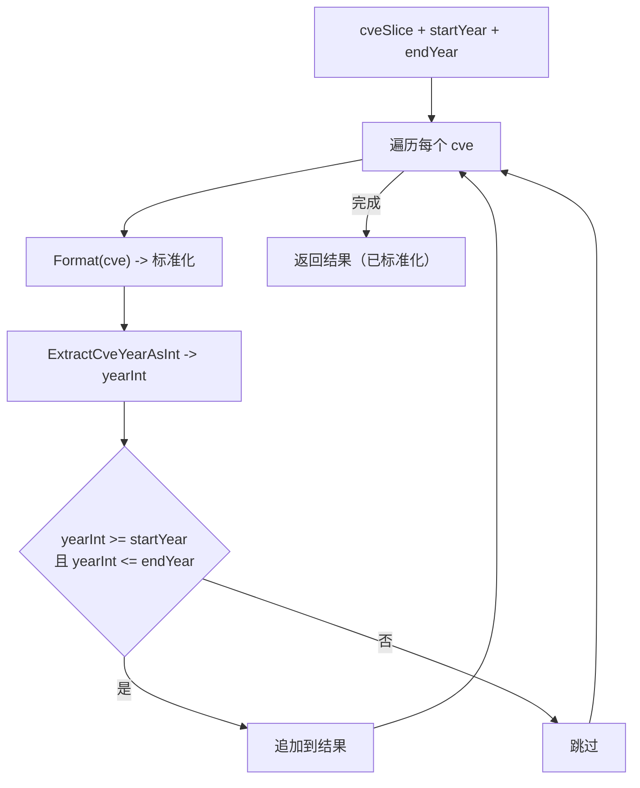

# FilterCvesByYearRange 年份范围筛选

:::tip 📂 查看源码
[`filter.go:139`](https://github.com/scagogogo/cve-skills/blob/main/filter.go#L139-L152) — 在 GitHub 上查看实现代码（第 139–152 行）。
:::

`FilterCvesByYearRange` 从 CVE 列表中筛选出年份落在闭区间 `[startYear, endYear]` 内的 CVE 编号。

:::tip 📌 场景
- 提取一个报告周期（如财年或季度）内发布的全部 CVE
- 在趋势分析或绘图前，将大批 CVE 数据收窄到目标时间窗
- 从一份累计列表中切出连续区间，做"同比"对比
:::

## 函数签名

```go
func FilterCvesByYearRange(cveSlice []string, startYear, endYear int) []string
```

## 参数

- `cveSlice` ([]string)：需要筛选的 CVE 编号数组
- `startYear` (int)：起始年份（含）
- `endYear` (int)：结束年份（含）

## 返回值

- `[]string`：符合年份范围的 CVE 编号数组，均已标准化格式处理；无匹配项时返回空数组

## 行为说明

- 遍历 `cveSlice` 中的每一项，比较前先用 `Format` 标准化，因此大小写与首尾空格不影响结果
- 通过 `ExtractCveYearAsInt` 将年份提取为整数，范围判定为 `yearInt >= startYear && yearInt <= endYear`，两端均含
- 每个匹配的 CVE 以标准化（大写、去首尾空格）形式追加，输入再乱输出也是规范的
- 保留输入顺序；无法提取到正整数年份的条目（格式错误或不可解析）会被静默丢弃
- 无匹配时返回 `nil`（空数组）——调用方应将空结果视为"范围内无 CVE"，而非错误

## 流程图



## 示例

```go
package main

import (
	"fmt"

	"github.com/scagogogo/cve-skills"
)

func main() {
	cveList := []string{
		"CVE-2020-1111",
		"CVE-2021-2222",
		"CVE-2022-3333",
	}

	// 范围覆盖 2021 和 2022（两端均含）
	recentCves := cve.FilterCvesByYearRange(cveList, 2021, 2022)
	// recentCves -> ["CVE-2021-2222", "CVE-2022-3333"]
	fmt.Println("2021-2022:", recentCves)

	// 范围内无匹配 -> 空数组
	none := cve.FilterCvesByYearRange([]string{"CVE-2020-1111", "CVE-2021-2222"}, 2022, 2023)
	// none -> []
	fmt.Println("2022-2023 (无匹配):", none)

	// 范围覆盖整个列表
	all := cve.FilterCvesByYearRange(cveList, 2020, 2022)
	// all -> ["CVE-2020-1111", "CVE-2021-2222", "CVE-2022-3333"]
	fmt.Println("2020-2022:", all)

	// 大小写/首尾空格在比较前已被标准化
	messy := cve.FilterCvesByYearRange(
		[]string{" cve-2021-2222 ", "CVE-2022-3333"},
		2021, 2021,
	)
	// messy -> ["CVE-2021-2222"]
	fmt.Println("标准化后的 2021:", messy)
}
```

## 使用场景

- 提取一个报告周期内发布的全部 CVE，用于年度或季度安全报告
- 在趋势分析或绘图前，将 CVE 数据集预筛到目标时间窗
- 从一份累计列表中切出连续区间，做同比对比

## 注意事项

- `startYear` 与 `endYear` 均**含**边界；`FilterCvesByYearRange(list, 2021, 2021)` 等价于单年份筛选
- 函数**不校验** `startYear <= endYear`——若 `startYear > endYear`，区间为空，结果恒为空数组
- 与 `FilterCvesByYear` 相比，本函数接受范围而非单一年份；`GetRecentCves` 是对本函数的薄封装，传入 `(当前年份-years+1, 当前年份)`
- 输出顺序遵循输入顺序；如需排序，请将结果再过一遍 `SortCves`
- 无法提取到正整数年份的格式错误 CVE 会被静默丢弃，不会触发错误

## 内部实现

本函数是一次性线性扫描，不预分配容量、不排序。对照 `filter.go:139-152`，关键步骤如下：

- `var result []string`（L140）——结果切片以 `nil` 起步，无底层数组。在首次 `append` 之前不分配任何内存，因此"全军覆没"的输入零切片分配开销。这也是"无匹配返回 `nil`"而非"返回长度为 0 的非 nil 切片"的根因。
- `Format(cve)`（L143）——每个条目在比较之前先被标准化为大写、去首尾空格。这是让筛选对大小写与空格不敏感的唯一入口，同时也意味着追加进 `result` 的是标准化后的值，而非原始输入。
- `ExtractCveYearAsInt(formattedCve)`（L144）——从已格式化的字符串中把年份提取为 `int`。基于格式化后的串可保证前缀为大写 `CVE-`，这正是提取器所依赖的。
- `yearInt >= startYear && yearInt <= endYear`（L145）——闭区间判定，两端均含。注意这是纯整数比较；若 `startYear > endYear`，该谓词对任何 `yearInt` 都不可满足，循环体只是什么也不追加。
- `result = append(result, formattedCve)`（L146）——只存标准化后的字符串，因此无论输入多乱，输出一律大写、去首尾空格。由于循环按迭代顺序追加且从不重排，输入顺序得以保留。

### 设计意图

- **先标准化再比较**：每个条目先过 `Format`，把大小写/空格问题统一收敛到一个辅助函数，让范围判定退化为纯整数比较。
- **不校验、不报错**：格式错误、提取不到正整数年份的条目（如 `ExtractCveYearAsInt` 返回 `0`）对任何现实 `startYear` 都过不了 `>= startYear` 这一关，于是被静默丢弃——没有错误路径，也不打日志。
- **稳定且分配轻量**：保留输入顺序、把分配推迟到首次命中，使"在大列表里收窄"这一常见路径保持低开销。

## 复杂度

| 维度 | 开销 | 说明 |
|---|---|---|
| 时间 | O(n) | 对长度为 n 的 `cveSlice` 做一趟遍历；每轮做常数工作量的 `Format` + `ExtractCveYearAsInt` + 两次整数比较。不排序、不哈希。 |
| 空间 | O(k) | k 为命中的 CVE 数量（结果切片）。最坏 k = n，即 O(n)。不分配辅助 map 或 set。 |
| 最佳情形 | O(1) 空间 | 无任何命中时 `result` 始终为 `nil`，底层数组从不分配。 |

O(n) 时间与 O(k) 空间的结论与 `filter.go:126-128` 的文档注释一致（时间 O(n)，空间 O(k)，最坏 O(n)）。

## 边界情形

| 输入 | 行为 | 返回 |
|---|---|---|
| 空数组 `[]` | 循环体不执行 | `nil`（空） |
| `startYear > endYear`（如 2022, 2021） | 范围谓词对任何 `yearInt` 都不可满足；不追加任何项 | `nil`（空） |
| `startYear == endYear`（如 2021, 2021） | 退化为单年份筛选；只有该年份命中 | 命中项或 `nil` |
| 小写输入 `cve-2021-2222` | `Format` 先转大写为 `CVE-2021-2222` 再比较/追加 | `["CVE-2021-2222"]` |
| 带首尾空格 `" cve-2021-2222 "` | `Format` 去空格并转大写 | `["CVE-2021-2222"]` |
| 输入含重复 CVE | 每份副本独立处理；重复项在输出中保留（此处不去重） | 重复项保留 |
| 格式错误 `"CVE-2021-abc"` / `"foobar"` | `ExtractCveYearAsInt` 返回 `0`；对任何现实年份 `0 >= startYear` 为假 | 静默丢弃 |
| 年份低于范围（如范围为 2021-2022 时输入 2020） | 过不了 `>= startYear` | 丢弃 |
| 年份高于范围（如范围为 2021-2022 时输入 2023） | 过不了 `<= endYear` | 丢弃 |
| 所有条目都命中 | 每项按序追加 | 满长切片，O(n) 空间 |

## 数据流

```text
+---------------------------+   +--------------------------+   +--------------------------+
| 输入: cveSlice []string   |   | startYear, endYear : int |   | (无辅助状态)              |
+---------------------------+   +--------------------------+   +--------------------------+
          |                              |
          v                              |
   +--------------+                      |
   | 遍历每个 cve |<---------------------+  (闭区间 [startYear, endYear])
   +--------------+                      |
          |                              |
          v                              |
   +----------------------+              |
   | Format(cve)          |  标准化: 转大写 + 去首尾空格
   +----------------------+              |
          |                              |
          v                              |
   +--------------------------+          |
   | ExtractCveYearAsInt(...) |  -> yearInt (int)
   +--------------------------+          |
          |                              |
          v                              |
   +-----------------------------------+ |
   | yearInt >= startYear &&           | |
   | yearInt <= endYear ?              | |
   +-----------------------------------+ |
        |              |                |
       是             否                |
        |              |                |
        v              v                |
   +-----------+  +-----------+         |
   | 追加      |  | 跳过       |         |
   | formatted |  | (静默)     |         |
   +-----------+  +-----------+         |
        |              |                |
        +------+-------+                |
               |                        |
               v                        |
        +--------------+                |
        | 下一个 cve <-+----------------+
        +--------------+
               |
               v  (遍历结束)
   +-----------------------------+
   | 返回 result []string        |  已标准化，保留输入顺序
   | (无命中时为 nil)            |
   +-----------------------------+
```

## 相关函数

- [FilterCvesByYear](/zh/api/functions/filter-cves-by-year) —— 筛选特定单一年份的 CVE
- [GetRecentCves](/zh/api/functions/get-recent-cves) —— 获取最近 N 年的 CVE（基于本函数实现）
- [GroupByYear](/zh/api/functions/group-by-year) —— 按年份分组为 map
- [CountByYear](/zh/api/functions/count-by-year) —— 按年份计数
- [ExtractCveYearAsInt](/zh/api/functions/extract-cve-year-as-int) —— 提取年份为整数（内部使用）
- [Format](/zh/api/functions/format) —— 标准化为大写、去首尾空格（内部使用）
- [筛选与分组分类](/zh/api/filter-group)
