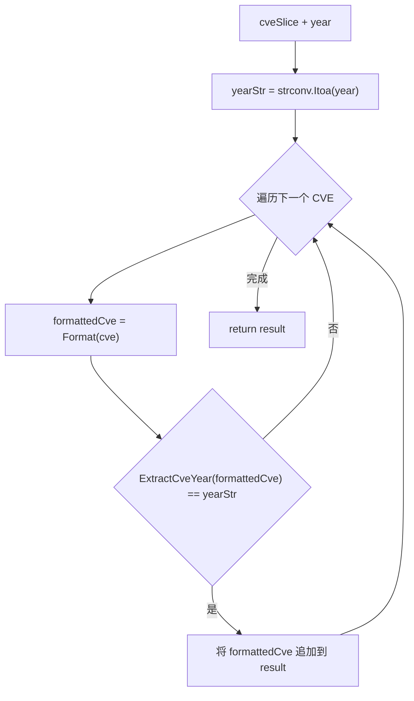

# FilterCvesByYear 按年筛选

:::tip 📂 查看源码
[`filter.go:88`](https://github.com/scagogogo/cve-skills/blob/main/filter.go#L88-L101) — 在 GitHub 上查看实现代码（第 88–101 行）。
:::

`FilterCvesByYear` 对 CVE 列表进行筛选，只返回属于指定年份的 CVE 编号，每个结果都经过 `Format` 标准化处理。

:::tip 📌 场景
- 提取某一年分配的所有 CVE，用于生成聚焦的年度报告
- 在深入分析前，从多年 CVE 数据集中隔离出某一年的记录
- 在漏洞处置时聚焦到关心的某一年度
:::

## 函数签名

```go
func FilterCvesByYear(cveSlice []string, year int) []string
```

## 参数

- `cveSlice` ([]string): 需要筛选的 CVE 编号数组
- `year` (int): 目标年份，整数格式，如 `2021`

## 返回值

- []string: 年份与目标相符的 CVE 编号数组，已通过 `Format` 标准化；如果没有匹配项，则返回空数组

## 行为说明

- 对 `cveSlice` 做一次遍历，对每个元素调用 `Format` 生成标准化的大写 CVE
- 通过 `ExtractCveYear` 从格式化后的 CVE 中取出年份字符串，与 `strconv.Itoa(year)` 比较——借助 `Format`，匹配是大小写无关的
- 仅当提取到的年份等于目标年份字符串时，才将该元素追加到结果中，并保留其在原列表中的相对顺序
- 当没有任何匹配时，底层 `result` 切片保持 `nil`，因此返回的是空切片（长度为 0）
- 时间复杂度 O(n)，n 为数组长度；空间复杂度 O(k)，k 为结果数组长度（最坏情况为 O(n)）

## 流程图



## 示例

```go
package main

import (
	"fmt"

	"github.com/scagogogo/cve-skills"
)

func main() {
	cveList := []string{"CVE-2021-1111", "CVE-2022-2222", "CVE-2021-3333"}

	// 筛选 2021 年的 CVE
	cves2021 := cve.FilterCvesByYear(cveList, 2021)
	// cves2021 = ["CVE-2021-1111", "CVE-2021-3333"]
	fmt.Printf("2021: %v\n", cves2021)

	// 没有匹配 CVE 的年份返回空数组
	cves2023 := cve.FilterCvesByYear(cveList, 2023)
	// cves2023 = []
	fmt.Printf("2023: %v (len=%d)\n", cves2023, len(cves2023))

	// 混合大小写的输入会在年份比较前经过 Format 标准化
	mixedCase := []string{"cve-2021-1111", "CVE-2022-2222", "CvE-2021-3333"}
	normalized2021 := cve.FilterCvesByYear(mixedCase, 2021)
	// normalized2021 = ["CVE-2021-1111", "CVE-2021-3333"]
	fmt.Printf("normalized 2021: %v\n", normalized2021)
}
```

## 使用场景

- 生成年度安全报告时获取特定年份的 CVE 集合
- 在趋势或密度分析前，将多年数据集收窄到单一年份
- 通过聚焦关心的年度来处置漏洞

## 注意事项

- 结果总是经过 `Format` 处理，混合大小写或带空格的输入会以规范的大写 CVE 形式返回
- 比较按年份字符串精确匹配；目标年份无匹配 CVE 时返回的是空切片（非 nil 容量），应检查 `len()` 而非判断 `nil`
- 本函数只返回**某一年的匹配子集**；如需闭区间年份范围请用 [FilterCvesByYearRange](/zh/api/functions/filter-cves-by-year-range)，如需最近 n 年的相对窗口请用 [GetRecentCves](/zh/api/functions/get-recent-cves)
- 若要按年份分组所有 CVE（而非只选出某一年），请用 [GroupByYear](/zh/api/functions/group-by-year)

## 内部实现

函数体（L88–L100）是一个单次遍历过滤器，由本包中已复用的三个原语构成：

- `var result []string` 初始即为 `nil` 切片，因此在首次匹配 append 之前不会发生任何分配。这也是空结果返回 `len() == 0` 而非携带已分配容量的原因。
- `yearStr := strconv.Itoa(year)`（L90）在循环**之外**将整数目标转为字符串，且只转换一次。后续比较是纯字符串相等比对 `ExtractCveYear` 的返回值，避免了在热路径中对每个元素做 `strconv` 或 `int` 解析。
- 循环内先执行 `formattedCve := Format(cve)`（L93），使年份提取与被追加的值共用同一份规范化（大写）形式。这是刻意的设计选择：一次遍历即同时实现大小写无关匹配与输出标准化。
- `ExtractCveYear(formattedCve) == yearStr`（L94）是对已格式化 CVE 的字符串比较，因此 `cve-2021-1111`、`CvE-2021-1111`、`CVE-2021-1111` 都会先经 `Format` 再读取年份。
- `result = append(result, formattedCve)`（L95）仅在匹配时触发，保留 `cveSlice` 中元素的原始相对顺序。不排序、不去重、不构造 map——函数始终是线性扫描。

## 复杂度

| 资源 | 复杂度 | 原因 |
|------|--------|------|
| 时间 | O(n) | 对 `cveSlice`（长度为 n）做一次遍历；每次迭代为常数开销的 `Format` + `ExtractCveYear` + 字符串比较 |
| 空间 | O(k)，最坏 O(n) | 仅匹配项被存入 `result`，k 为匹配数；最坏情况下全部匹配，k = n |
| 辅助 | O(1) | `yearStr` 是一个短字符串；不分配 map 或额外缓冲区 |

注意：单元素开销取决于 `Format` 与 `ExtractCveYear`，二者均为 O(L)，L 为 CVE 字符串长度。由于 CVE 编号较短且有上界，L 视为常数，整体复杂度仍为 O(n)。

## 边界情形

| 输入 | 行为 | 返回 |
|------|------|------|
| `cveSlice` 为 `nil` 或空 | 循环体不执行；`result` 保持 `nil` | `[]string`（len 0） |
| `year` 无任何匹配项 | 不触发 append；`result` 保持 `nil` | `[]string`（len 0） |
| 混合大小写 CVE，如 `cve-2021-1111` | `Format` 在年份比较与 append 前转为大写 | 规范化后的匹配项，如 `["CVE-2021-1111"]` |
| 输入含重复 CVE | 不去重；每个匹配的重复项都会再次追加 | 保留重复，按原始顺序 |
| 格式错误的 CVE 字符串 | `Format`/`ExtractCveYear` 返回空或不匹配的年份；该项被跳过 | 仅出现格式正确的匹配项 |
| 所有项都匹配目标年份 | 每个格式化后的项都被追加 | 长度为 n 的切片 |
| `year` 为负数或 0 | `strconv.Itoa(year)` 生成的字符串不可能等于真实 CVE 年份 | `[]string`（len 0） |

## 数据流

```text
+--------------------------+        +----------------------------+
| 输入: cveSlice []string  |        | 输入: year int             |
|  如 ["CVE-2021-1111",    |        |  如 2021                   |
|       "CVE-2022-2222",   |        +--------------+-------------+
|       "cve-2021-3333"]   |                       |
+-----------+--------------+                       |
            |                                      |
            |              +-----------------------v-----------------------+
            |              | yearStr = strconv.Itoa(year)  -->  "2021"   |
            |              +-----------------------+-----------------------+
            |                                      |
            v                                      |
+---------------------+                            |
| 遍历 cveSlice 中    |                            |
|   的每个 cve        |                            |
+---------+-----------+                            |
          |                                        |
          v                                        |
+---------------------+                            |
| formattedCve =      |                            |
|   Format(cve)       |  （大写、规范化）          |
+---------+-----------+                            |
          |                                        |
          v                                        |
+----------------------------------------------+   |
| ExtractCveYear(formattedCve) == yearStr ?    |<--+
+------+---------------------------------------+
       |
       | 是
       v
+---------------------+
| 将 formattedCve     |
|   追加到 result     |
+---------------------+
       |
       | 循环继续，保留输入顺序
       v
+---------------------+
| 返回 result         |
|  如 ["CVE-2021-1111",
|       "CVE-2021-3333"]
+---------------------+
```

## 相关函数

- [GroupByYear](/zh/api/functions/group-by-year) — 将 CVE 列表按年份分组为 map
- [FilterCvesByYearRange](/zh/api/functions/filter-cves-by-year-range) — 筛选闭区间年份范围内的 CVE
- [GetRecentCves](/zh/api/functions/get-recent-cves) — 获取最近 n 年的 CVE
- [ExtractCveYear](/zh/api/functions/extract-cve-year) — 从单个 CVE 提取年份字符串
- [Format](/zh/api/functions/format) — 将 CVE 标准化为大写形式
- [筛选与分组分类](/zh/api/filter-group)
