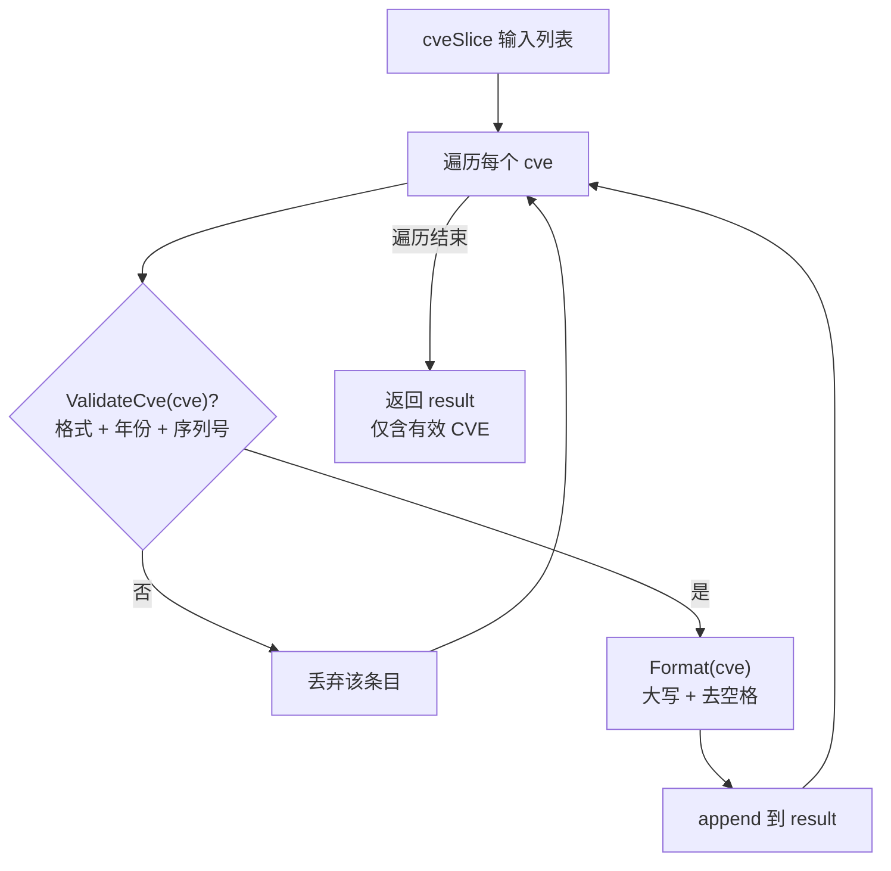

# FilterValidCves 过滤有效

:::tip 📂 查看源码
[`base.go:400`](https://github.com/scagogogo/cve-skills/blob/main/base.go#L400-L409) — 在 GitHub 上查看实现代码（第 400–409 行）。
:::

从 CVE 列表中过滤出有效的 CVE 编号，并以标准化大写格式返回。

:::tip 📌 场景
- 在持久化外部数据源导入的混合质量 CVE 数据前进行清洗
- 预处理用户提交的 CVE 列表，使下游逻辑只处理格式正确的条目
- 对文本提取流程（如 `ExtractCve` 之后）的输出进行净化，丢弃格式错误的匹配项
:::

## 函数签名

```go
func FilterValidCves(cveSlice []string) []string
```

## 参数

- `cveSlice` ([]string): 待过滤的 CVE 编号字符串列表。条目可以是任意大小写、可带前后空白；无效条目会被静默丢弃。

## 返回值

- []string: 一个新切片，包含所有通过验证的输入条目，每条均标准化为大写格式（如 `CVE-2022-12345`）。保留输入中有效条目的相对顺序。当没有任何有效条目时返回空切片（非 nil）。

## 行为说明

- 遍历 `cveSlice` 的每个条目，将验证委托给 `ValidateCve`，后者会检查完整的 `CVE-YYYY-NNNNN` 格式、年份与序列号均为数字、`year >= 1999`、`year <= 当前年份`、且 `seq > 0`。
- 仅通过验证的条目会被追加到结果中；失败条目被跳过，不会触发 panic 或返回错误。
- 每个保留的条目在追加前都会经过 `Format`（大写 + 去空格）处理，因此无论输入大小写或前后空白如何，输出都是一致标准化的。
- 结果通过在 `nil` 切片上 `append` 构建，因此当输入中没有有效条目时，返回的切片非 nil 但为空——可安全地 `range`。
- 验证使用调用时的当前年份，因此年份等于当前年份的 CVE 会被接受；未来年份的 CVE 会被拒绝（若需容忍预留的未来编号，请使用年份偏移相关函数）。

## 流程图



## 示例

```go
package main

import (
	"fmt"

	"github.com/scagogogo/cve-skills"
)

func main() {
	// 混合输入：有效、格式错误、年份越界、小写有效
	raw := []string{
		"CVE-2022-12345",   // 有效
		"not-a-cve",        // 格式无效 -> 丢弃
		"CVE-1998-12345",   // 年份早于 1999 -> 丢弃
		"cve-2023-99999",   // 有效（小写，会被标准化）
		" CVE-2021-44228 ", // 有效（带前后空格，会被去除）
		"CVE-2099-1",       // 未来年份 -> 丢弃
		"",                 // 空字符串 -> 丢弃
	}

	valid := cve.FilterValidCves(raw)
	fmt.Printf("Input  (%d): %v\n", len(raw), raw)
	fmt.Printf("Valid  (%d): %v\n", len(valid), valid)
	// 输出（假设当前年份为 2024）：
	// Valid  (3): [CVE-2022-12345 CVE-2023-99999 CVE-2021-44228]

	// 空 / 全部无效的输入返回空（非 nil）切片
	empty := cve.FilterValidCves([]string{"", "garbage", "CVE-1990-1"})
	fmt.Printf("Empty result len=%d, safe to range: %v\n", len(empty), empty == nil)
	// 输出: Empty result len=0, safe to range: false

	// 常见流水线：从文本提取，再仅保留有效编号
	text := "Affected by cve-2022-12345 and cve-2099-1 and CVE-2021-44228"
	extracted := cve.ExtractCve(text)
	cleaned := cve.FilterValidCves(extracted)
	fmt.Printf("Extracted: %v\n", extracted)
	fmt.Printf("Cleaned:   %v\n", cleaned)
	// 输出（假设当前年份为 2024）：
	// Extracted: [CVE-2022-12345 CVE-2099-1 CVE-2021-44228]
	// Cleaned:   [CVE-2022-12345 CVE-2021-44228]
}
```

## 使用场景

- 对从数据源、CSV 或用户输入导入的 CVE 列表进行数据清洗
- 在存储、去重（`RemoveDuplicateCves`）或排序（`SortCves`）之前作为预处理步骤
- 当源文本可能包含格式错误的匹配时，过滤 `ExtractCve` 的输出
- 保护批量操作，使无效条目不会进入下游的数字解析逻辑

## 注意事项

- ⚠️ 本函数**不去重**输出：如果同一个有效 CVE 在输入中出现多次，它在输出中也会出现同样的次数。需要唯一性时请配合 `RemoveDuplicateCves` 使用。
- ⚠️ 返回的切片是每个有效输入的**标准化**形式——大小写和前后空白会被改变。若必须保留有效条目的原始字符串，请自行使用 `ValidateCve` 验证。
- ✅ 验证委托给 `ValidateCve`，因此接受/拒绝规则与该函数完全一致：格式 + 年份/序列号为数字 + `1999 <= year <= 当前年份` + `seq > 0`。此处没有针对未来年份的单独偏移。
- ✅ 全部无效的输入返回空切片而非 `nil`，因此对结果调用 `len()` 或迭代总是安全的。
- 🔍 若需要知道每条被丢弃的原因（而非静默丢弃），请使用 `ValidateCves`，它返回带 `Reason` 字段的 `[]CveValidationResult`。

## 内部实现

本函数是一个紧凑的单遍过滤流水线，完整函数体（base.go L400-L408）如下：

```go
func FilterValidCves(cveSlice []string) []string {
	var result []string
	for _, cve := range cveSlice {
		if ValidateCve(cve) {
			result = append(result, Format(cve))
		}
	}
	return result
}
```

- **nil 切片初始化（L401）：** `var result []string` 声明了一个没有底层数组的切片。在 `nil` 切片上 `append` 在 Go 中是良定义的——运行时会按需分配——因此函数无需显式 `make`，并在没有任何条目被保留时自然得到非 nil 但为空的结果。
- **验证委托（L403）：** 每个条目交给 `ValidateCve` 处理。这是接受/拒绝的唯一真相来源：格式匹配、年份与序列号为数字、`1999 <= year <= 当前年份`、且 `seq > 0`。将规则集中在一处，保证本过滤器与独立验证器永远不会产生分歧。
- **就地标准化（L404）：** 被保留的条目以 `Format(cve)` 的形式追加，而非原始输入。`Format` 会把前缀大写并去除前后空白，因此无论条目原本如何书写，输出都是统一标准化的。标准化被合并进 append 以避免二次遍历。
- **失败静默跳过（L403 false 分支）：** 未通过验证的条目只是不被追加；没有错误返回、没有 panic、也没有日志。本函数是全函数——对任何输入都返回一个可用的切片。
- **顺序保持：** 由于遍历只向前、`append` 追加到尾部，输入中有效条目的相对顺序被保留。重复条目原样透传（没有构建去重 map）。

## 复杂度

| 维度 | 开销 | 驱动因素 |
|---|---|---|
| 时间 | O(n) | 对 `n = len(cveSlice)` 做一次正向遍历；每个条目触发一次 `ValidateCve` + 至多一次 `Format`，二者均为 O(1) 字符串操作 |
| 空间 | O(k) | 分配一个大小为 `k`（有效条目数）的新切片；输入永不被修改 |
| 辅助 | O(1) | 无 map、无递归、无排序缓冲——仅循环变量与结果切片头 |

其中 `n` 为输入长度，`k <= n` 为有效条目数。最坏情况（全部有效）为 O(n) 时间与 O(n) 空间；最坏情况（全部无效）为 O(n) 时间与除空结果外 O(1) 额外空间。

## 边界情形

| 输入 | 行为 | 返回 |
|---|---|---|
| `nil` 切片 | 循环体不执行；`result` 保持 `nil` 声明状态 | 空非 nil 切片（`len == 0`） |
| 空切片 `[]string{}` | 零次迭代 | 空非 nil 切片 |
| 全部条目无效（格式错误/年份越界） | 每个 `ValidateCve` 返回 false；不追加任何内容 | 空非 nil 切片 |
| 混合大小写，如 `cve-2023-1` | 通过验证，`Format` 大写为 `CVE-2023-1` | `["CVE-2023-1"]` |
| 带前后空白的条目，如 `" CVE-2021-44228 "` | `ValidateCve` 先去空白再检查；`Format` 追加时再次去空白 | `["CVE-2021-44228"]` |
| 重复的有效条目，如 `["CVE-2022-1","CVE-2022-1"]` | 二者均通过；未查询去重 map | `["CVE-2022-1","CVE-2022-1"]`（重复被保留） |
| 未来年份 CVE，如 `CVE-2099-1` | `ValidateCve` 拒绝（`year > 当前年份`） | 丢弃，不在结果中 |
| 早于 1999 的年份，如 `CVE-1998-1` | `ValidateCve` 拒绝（`year < 1999`） | 丢弃，不在结果中 |
| 空字符串 `""` | `ValidateCve` 拒绝（格式不匹配） | 丢弃，不在结果中 |

## 数据流

```text
+-------------------------+
| 输入: cveSlice []string |   (可能为 nil、空、混合大小写、带空白)
+-------------------------+
            |
            v
   +-----------------+
   | 遍历 cveSlice   |   <-- 单次正向遍历, O(n)
   | 中每个 cve      |
   +-----------------+
            |
            v
   +-----------------+
   | ValidateCve(cve)|   <-- 格式 + 数字 + 1999<=year<=当前 + seq>0
   +-----------------+
        |        |
      通过      失败
        |        |
        v        v
+-----------+  +--------------+
| Format(cve)| | 静默丢弃     |   (无错误, 无 panic)
+-----------+  +--------------+
        |             |
        v             |
+----------------+    |
| append 到      |    |
| result []string|    |
+----------------+    |
        |             |
        +------>------+
            |
            v
+-------------------------+
| 返回: result []string   |   (大写标准化, 顺序保持, 非 nil)
+-------------------------+
```

## 相关函数

- [ValidateCve](/zh/api/functions/validate-cve) — 本函数内部使用的单 CVE 布尔验证
- [ValidateCves](/zh/api/functions/validate-cves) — 返回逐条原因的批量验证（需要知道条目被丢弃的原因时使用）
- [Format](/zh/api/format-validate) — 标准化单个 CVE 的大小写与空白
- [批量验证分类](/zh/api/batch-validation) — 批量验证与过滤辅助函数总览
