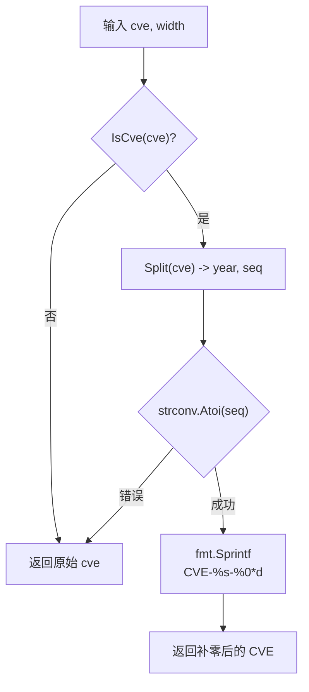

# FormatSeq 序列号定宽

:::tip 📂 查看源码
[`base.go:79`](https://github.com/scagogogo/cve-skills/blob/main/base.go#L79-L90) — 在 GitHub 上查看实现代码（第 79–90 行）。
:::

`FormatSeq` 将 CVE 的序列号前补零至固定宽度，生成宽度一致的标识符，例如 `CVE-2022-000123`。

:::tip 📌 场景
- 在报告与仪表盘中将 CVE 标识符统一为一致的显示宽度
- 在写入数据库或建立索引前保证序列号长度一致
- 在终端表格输出中对齐 CVE 列以提升可读性
:::

## 函数签名

```go
func FormatSeq(cve string, width int) string
```

## 参数

- `cve` (string)：待格式化的 CVE 编号字符串（如 `CVE-2022-123`）
- `width` (int)：序列号的目标宽度；序列号不足时前面补零（如 `width=6` 时 `123` 变为 `000123`）

## 返回值

- `string`：序列号补零至指定宽度的 CVE 编号。如果输入不是有效的 CVE 格式，则原样返回原始输入。

## 行为说明

- 先用 `IsCve` 校验输入；无效输入原样返回，不做任何补零
- 通过 `Split` 将 CVE 拆分为年份与序列号，`Split` 内部调用 `Format` —— 因此在补零前会去除两侧空白并将字母转为大写（如 `" cve-2022-123 "` 被当作 `CVE-2022-123` 处理）
- 用 `strconv.Atoi` 将序列号转为整数；若解析失败则原样返回输入
- 通过 `fmt.Sprintf("CVE-%s-%0*d", year, width, seqInt)` 重新拼接 —— `%0*d` 动词产生恰好 `width` 位且前补零的输出
- 如果序列号本身的位数已多于 `width`，则保留原序列号长度（补零只会增加位数，从不截断）

## 流程图



## 示例

```go
package main

import (
	"fmt"

	"github.com/scagogogo/cve-skills"
)

func main() {
	// 将短序列号补齐到 6 位 -> "CVE-2022-000123"
	fmt.Println(cve.FormatSeq("CVE-2022-123", 6)) // CVE-2022-000123

	// 将 5 位序列号补齐到 6 位 -> "CVE-2022-012345"
	fmt.Println(cve.FormatSeq("CVE-2022-12345", 6)) // CVE-2022-012345

	// 小写与两侧空白会经 Split/Format 归一化
	fmt.Println(cve.FormatSeq(" cve-2022-7 ", 4)) // CVE-2022-0007

	// 序列号位数多于 width 时保留原长度（不截断）
	fmt.Println(cve.FormatSeq("CVE-2022-1234567", 4)) // CVE-2022-1234567

	// 无效输入原样返回
	fmt.Println(cve.FormatSeq("not-a-cve", 6)) // not-a-cve

	// 存储前的典型归一化
	standardized := cve.FormatSeq("CVE-2022-123", 6)
	fmt.Println(standardized) // CVE-2022-000123
}
```

## 使用场景

- 在报告与仪表盘中将 CVE 标识符统一为一致的显示宽度
- 在写入数据库或建立索引前保证序列号长度一致
- 在终端表格输出中对齐 CVE 列以提升可读性
- 在排序前预处理 CVE，使同等宽度下的字典序与数值序一致

## 注意事项

- `width` 仅设定**最小**位数 —— 序列号位数多于 `width` 时按原长度返回，从不截断
- 由于内部调用了 `Split`（进而调用 `Format`），返回的 CVE 始终是大写且去除两侧空白的，即便输入为小写或带空格
- 无效输入**原样返回**（既不是错误，也不是空字符串）—— 需要严格校验的调用方应先用 `IsCve` 或 `ValidateCve` 预检
- `width <= 0` 在 `%0*d` 下技术上可行，会按序列号原长度输出（不补零）；为获得可预期结果请传入正数 `width`
- 与 `Format` 对比：`Format` 仅去空白并转大写；`FormatSeq` 额外将序列号补零至固定宽度

## 内部实现

`FormatSeq`（base.go L79-L90）是一条「守卫—拆分—重建」的短流水线：

- **`IsCve` 守卫**（L80-L82）：第一步即 `if !IsCve(cve) { return cve }`。任何未完整匹配 CVE 正则的输入原样返回，因此函数绝不会尝试去拆分或补零脏数据——这是「无效输入原样返回」契约的唯一来源。
- **`Split` 拆分**（L83）：`year, seq := Split(cve)` 按 `-` 拆分。`Split` 内部调用 `Format`，即在拆分前先执行 `strings.ToUpper(strings.TrimSpace(...))`，所以两侧空白与小写字母是在此处归一化的，而非 `FormatSeq` 自身完成。
- **数值转换**（L84-L87）：`seqInt, err := strconv.Atoi(seq)` 将序列号转为整数。若 `seq` 非数字（仅可能出现在 `IsCve` 通过但正则仍捕获到非数字的边界输入），函数以返回原始 `cve` 退出，保持「不报错、原样返回」的行为，而非 panic。
- **`fmt.Sprintf` 拼装**（L88）：用 `fmt.Sprintf("CVE-%s-%0*d", year, width, seqInt)` 重建结果。`%0*d` 动词以 `width` 为第一个参数、`seqInt` 为第二个参数，当 `seqInt` 位数不足时产生恰好 `width` 位且前补零的输出；当 `seqInt` 位数已超过 `width` 时按其自然长度输出（Go 的 `%0*d` 从不截断）。
- **设计意图**：函数在失败时非破坏、在成功时不截断——它只会*增加*前导零，因此调用方可以将其视为一个安全的归一化器，绝不会破坏有效的 CVE 标识符。

## 复杂度

| 资源 | 开销 | 原因 |
|---|---|---|
| 时间 | O(n) | `IsCve` 正则匹配、`Split`（含 `Format` 的 `ToUpper`/`TrimSpace`）、`strconv.Atoi`、`fmt.Sprintf` 各对长度为 `n` 的输入扫描一次；没有任何循环随 `n` 增长 |
| 空间 | O(n) | 返回的字符串以及 `Split` 内部大写化/去空白后的中间副本均与输入长度成正比；`width` 仅对补零后的序列号长度贡献一个常量上界 |

两者均与输入 CVE 字符串的长度成线性关系；`width` 是定宽常量，不改变渐近复杂度等级。

## 边界情形

| 输入 | 行为 | 返回 |
|---|---|---|
| `FormatSeq("not-a-cve", 6)` | `IsCve` 失败，于 L81 提前返回 | `"not-a-cve"`（原样） |
| `FormatSeq("", 6)` | 空字符串使 `IsCve` 失败 | `""`（原样） |
| `FormatSeq("CVE-2022-ABC", 6)` | `IsCve` 正则拒绝非数字序列号，提前返回 | `"CVE-2022-ABC"`（原样） |
| `FormatSeq(" cve-2022-7 ", 4)` | `Split`/`Format` 去空白并转大写后补零 | `"CVE-2022-0007"` |
| `FormatSeq("CVE-2022-7", 4)` | 序列号 `7`（1 位）补齐至 4 位 | `"CVE-2022-0007"` |
| `FormatSeq("CVE-2022-1234567", 4)` | 序列号位数多于 `width`；`%0*d` 不截断 | `"CVE-2022-1234567"` |
| `FormatSeq("CVE-2022-7", 0)` | `width <= 0`；`%0*d` 按自然宽度输出，不补零 | `"CVE-2022-7"` |
| `FormatSeq("CVE-2022-7", -1)` | 负 `width` 在 `%0*d` 下等同 `0` | `"CVE-2022-7"` |
| 等宽重复输入 `FormatSeq("CVE-2022-0007", 4)` | 序列号已达 4 位，补零不增加任何位 | `"CVE-2022-0007"` |

## 数据流

```text
+----------------------+
| 输入: cve, width     |
| 如 " cve-2022-7 ", 4  |
+----------+-----------+
           |
           v
+----------------------+
| IsCve(cve) ?         |
| 正则 ^\s*CVE-...$    |
+----+------------+----+
     | 否         | 是
     v           v
+---------+  +---------------------------+
| 返回    |  | Split(cve) -> year, seq   |
| 原始    |  | (Format: 去空白 + 大写)    |
| cve     |  | year="2022", seq="7"      |
+---------+  +-------------+-------------+
                           |
                           v
              +---------------------------+
              | seqInt, err = Atoi(seq)   |
              | seqInt = 7                |
              +----+----------------+-----+
                   | err           | ok
                   v               v
              +---------+  +---------------------------+
              | 返回    |  | fmt.Sprintf(               |
              | 原始    |  |   "CVE-%s-%0*d",           |
              | cve     |  |   year, width, seqInt)     |
              +---------+  | -> "CVE-2022-0007"         |
                           +-------------+-------------+
                                         |
                                         v
                              +-----------------------+
                              | 返回补零后的 CVE       |
                              | "CVE-2022-0007"       |
                              +-----------------------+
```

## 相关函数

- [Format](/zh/api/functions/format) —— 将 CVE 标准化为大写、去空白形式（不补零）
- [Split](/zh/api/functions/split) —— 将 CVE 拆分为年份与序列号
- [IsCve](/zh/api/functions/is-cve) —— 格式化前校验 CVE 格式
- [ValidateCve](/zh/api/functions/validate-cve) —— 完整校验（格式 + 年份范围 + 正序列号）
- [格式化与校验分类](/zh/api/format-validate)
