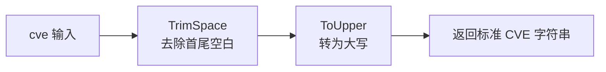

# Format 格式化

:::tip 📂 查看源码
[`base.go:45`](https://github.com/scagogogo/cve-skills/blob/main/base.go#L45-L48) — 在 GitHub 上查看实现代码（第 45–48 行）。
:::

`Format` 将 CVE 编号统一为标准形式：转为大写，并去除首尾空白字符。

:::tip 📌 场景
- 在存储或比较 CVE 编号前，对用户输入或导入数据做标准化
- 将大小写混杂或带空白的 CVE 归一化，保证下游匹配可靠
- 为报告、日志或数据库主键生成一致的展示形式
:::

## 函数签名

```go
func Format(cve string) string
```

## 参数

- `cve` (string): 需要格式化的 CVE 编号字符串，如 `"cve-2022-12345"` 或 `" CVE-2022-12345 "`

## 返回值

- `string`: 格式化后的标准 CVE 编号，始终为大写且无空格，如 `"CVE-2022-12345"`

## 行为说明

- 返回 `strings.ToUpper(strings.TrimSpace(cve))` —— 先去空白，再转大写
- `TrimSpace` 去除首尾空白字符（空格、制表符、换行），因此 `" CVE-2022-12345 "` 变为 `"CVE-2022-12345"`
- `ToUpper` 将去空白后的整个字符串转为大写，因此 `"cve-2022-12345"` 变为 `"CVE-2022-12345"`
- 不做格式校验 —— 任意字符串都会被去空白并转大写后返回；如需确认是真实 CVE，请配合 `IsCve` 或 `ValidateCve`
- 幂等：对已标准化的 CVE 再次调用 `Format`，结果不变

## 流程图



## 示例

```go
package main

import (
	"fmt"

	"github.com/scagogogo/cve-skills"
)

func main() {
	// 源码注释中的示例
	// 输入: " cve-2022-12345 "  输出: "CVE-2022-12345"
	// 输入: "cve-2021-44228"    输出: "CVE-2021-44228"
	testCases := []struct {
		input    string
		expected string
		reason   string
	}{
		{" cve-2022-12345 ", "CVE-2022-12345", "源码示例：首尾带空格 + 小写"},
		{"cve-2021-44228", "CVE-2021-44228", "源码示例：小写，无空格"},
		{"CVE-2022-12345", "CVE-2022-12345", "已标准化，保持不变（幂等）"},
		{"CvE-2022-12345", "CVE-2022-12345", "混合大小写转为大写"},
		{"\tCVE-2023-99999\n", "CVE-2023-99999", "制表符与换行作为空白被去除"},
		{"not-a-cve", "NOT-A-CVE", "不做校验：非 CVE 输入仍会被转大写"},
		{"", "", "空字符串仍为空"},
	}

	for _, tc := range testCases {
		result := cve.Format(tc.input)
		status := "✅"
		if result != tc.expected {
			status = "❌"
		}
		fmt.Printf("%s %-22q -> %q  (%s)\n", status, tc.input, result, tc.reason)
	}

	// 存储 / 比较前的典型标准化
	raw := " cve-2021-44228 "
	standardCve := cve.Format(raw)
	fmt.Printf("标准化结果: %q\n", standardCve)
}
```

## 使用场景

- 在比较或存储 CVE 编号前进行标准化
- 确保系统中所有 CVE 编号格式一致
- 归一化表单、API 参数或 CLI 参数中的用户输入
- 为去重、排序或索引生成稳定的主键

## 注意事项

- ⚠️ `Format` **不做**输入校验 —— `"not-a-cve"` 会变成 `"NOT-A-CVE"`。需要校验时请使用 `IsCve` 或 `ValidateCve`
- ✅ 顺序很重要：先去空白再转大写，因此内部字符不受影响，仅去除首尾空白
- 🔍 内部空白（如 `"CVE-2022-123 45"`）会被原样保留并转大写 —— `Format` 不会修复格式错误的输入
- 幂等且无副作用；可重复调用，并发安全

## 内部实现

`Format` 的函数体只有一行（`base.go:46`）：`return strings.ToUpper(strings.TrimSpace(cve))`。其设计意图拆解如下。

### 第 1 步 —— 去除首尾空白

`strings.TrimSpace(cve)`（Go 标准库）移除首尾的 Unicode 空白字符，包括空格、制表符（`\t`）、换行（`\n`）和回车（`\r`）。内部空白保持不动。此步骤先行，使后续转大写只作用于有效负载。

### 第 2 步 —— 将去空白后的字符串转大写

`strings.ToUpper` 随后将已去空白字符串中的每个 rune 转为大写。标准 CVE 标识符中唯一的字母段是 `CVE-` 前缀，因此实际上是将 `cve-` / `Cve-` / `CVE-` 统一为 `CVE-`。数字与连字符不受影响。

### 第 3 步 —— 直接返回，不做校验

没有正则检查、没有调用 `IsCve`、也没有分配中间切片 —— 函数刻意接受任意 `string`，去空白并转大写后返回。校验职责留给 `IsCve` / `ValidateCve`，使 `Format` 保持轻量且无副作用。

### 设计意图

- **幂等性**：`ToUpper(TrimSpace(x))` 是不动点 —— 对结果再次调用结果不变，调用者可安全重复归一化。
- **可组合性**：`Format` 在 `extractYear`、`Split` 顶部以及 `FilterValidCves` 内部被调用以先归一化再解析，保证单一统一入口。
- **顺序敏感**：先去空白再转大写，避免空白字符大写形式（理论上）不同的边界情况；实际效果是让两步变换相互独立、行为可预测。

## 复杂度

| 维度 | 开销 | 说明 |
|---|---|---|
| 时间 | O(n) | `TrimSpace` 与 `ToUpper` 各扫描输入一次，n 为 `cve` 的长度 |
| 空间 | O(n) | 分配一个新字符串作为结果；不使用额外数据结构 |
| 分配次数 | 1–2 | 当无需去除空白时 `TrimSpace` 可能返回原字符串；`ToUpper` 仅在字符发生变化时分配新字符串 |

由于开销与输入长度成线性关系，且不存在对外部集合的循环，对于典型 CVE 编号（几十个字符）而言 `Format` 实际上是常数时间。

## 边界情形

| 输入 | 行为 | 返回 |
|---|---|---|
| `" CVE-2022-12345 "`（首尾带空格） | 先去空白，再转大写 | `"CVE-2022-12345"` |
| `"cve-2022-12345"`（小写） | 无需去空白，所有小写字母转大写 | `"CVE-2022-12345"` |
| `"CvE-2022-12345"`（混合大小写） | 每个 rune 单独转大写 | `"CVE-2022-12345"` |
| `"\tCVE-2023-99999\n"`（制表符/换行） | 制表符与换行视为空白并被移除 | `"CVE-2023-99999"` |
| `"CVE-2022-12345"`（已标准化） | 幂等 —— 无字符变化 | `"CVE-2022-12345"` |
| `""`（空字符串） | 无内容可去空白或转大写 | `""` |
| `"   "`（仅空白） | 全部空白被去除，留下空字符串 | `""` |
| `"not-a-cve"`（非 CVE） | 不做校验；原样转大写 | `"NOT-A-CVE"` |
| `"CVE-2022-123 45"`（内部空格） | 内部空白保留并转大写 | `"CVE-2022-123 45"` |
| `"cve-2022-12345-extra"`（多余段） | 不做解析；仅去空白并转大写 | `"CVE-2022-12345-EXTRA"` |

## 数据流

```text
+--------------------------+
| 输入: cve string         |
| 如 " cve-2022-12345 "    |
+------------+-------------+
             |
             v
+--------------------------+
| strings.TrimSpace(cve)   |   <-- 移除首尾空白
|  "cve-2022-12345"        |       (空格/制表符/换行)
+------------+-------------+
             |
             v
+--------------------------+
| strings.ToUpper(trimmed) |   <-- 每个 rune 转大写
|  "CVE-2022-12345"        |       (数字与连字符不变)
+------------+-------------+
             |
             v
+--------------------------+
| 返回: 标准 CVE 字符串    |
|  "CVE-2022-12345"        |
+--------------------------+
```

## 相关函数

- [IsCve](/zh/api/functions/is-cve) — 严格判断 CVE 标识符格式
- [ValidateCve](/zh/api/functions/validate-cve) — 完整校验（格式 + 年份范围 + 正序列号）
- [Split](/zh/api/functions/split) — 将 CVE 拆分为年份和序列号（内部会先调用 `Format` 归一化）
- [FormatSeq](/zh/api/functions/format-seq) — 将 CVE 序列号补齐为固定宽度
- [格式化与验证分类](/zh/api/format-validate)
