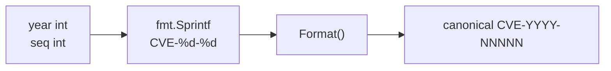

# GenerateCve 生成

:::tip 📂 查看源码
[`generate.go:58`](https://github.com/scagogogo/cve-skills/blob/main/generate.go#L58-L61) — 在 GitHub 上查看实现代码（第 58–61 行）。
:::

`GenerateCve` 根据年份和序列号构造标准 CVE 标识符，返回大写的 `CVE-YYYY-NNNNN` 形式。

:::tip 📌 场景
- 从结构化字段（年份 + 序列号）动态拼装 CVE 标识符
- 在数据规范化或流水线处理中创建新的 CVE 标识符
- 配合提取函数，将某个 CVE 的序列号重新挂到另一个年份上生成新编号
:::

## 函数签名

```go
func GenerateCve(year int, seq int) string
```

## 参数

- `year` (int)：CVE 年份，整数格式，如 `2022`
- `seq` (int)：CVE 序列号，整数格式，如 `12345`

## 返回值

- `string`：生成的标准格式 CVE 编号，如 `"CVE-2022-12345"`

## 行为说明

- 内部通过 `fmt.Sprintf` 将输入格式化为 `CVE-%d-%d`，再交给 `Format` 处理，保证返回规范的大写形式
- 返回结果始终为大写 —— `Format` 会把 `cve` 前缀统一为 `CVE`
- 不对年份做任何校验 —— 不会检查 1999..当前年份范围，`0` 或 `9999` 这类值会原样通过
- 序列号不限位数 —— 任意 `int` 均可接受，包括一位数和超大数

## 流程图



## 示例

```go
package main

import (
	"fmt"

	"github.com/scagogogo/cve-skills"
)

func main() {
	// 基本生成 —— 与源码示例一致
	fmt.Println(cve.GenerateCve(2022, 12345))  // CVE-2022-12345
	fmt.Println(cve.GenerateCve(2021, 44228))  // CVE-2021-44228

	// 一位数与超大序列号均可接受（不限位数）
	fmt.Println(cve.GenerateCve(2023, 1))      // CVE-2023-1
	fmt.Println(cve.GenerateCve(2024, 999999)) // CVE-2024-999999

	// 年份不做范围校验，不合理的年份原样通过
	fmt.Println(cve.GenerateCve(0, 100))       // CVE-0-100
	fmt.Println(cve.GenerateCve(9999, 7))      // CVE-9999-7

	// 组合使用：取出某个 CVE 的序列号，挂到新年份上生成
	year := 2023
	seq := cve.ExtractCveSeqAsInt("CVE-2022-67890")
	newCve := cve.GenerateCve(year, seq) // CVE-2023-67890
	fmt.Println(newCve)
}
```

## 使用场景

- 从结构化字段动态生成 CVE 编号
- 在规范化或迁移过程中创建新的 CVE 标识符
- 把从其他 CVE 中提取的年份与序列号重新组合成新编号

## 注意事项

- 此函数**不会**验证年份是否合理（如是否在 1999 年之后）；如需完整语义校验请使用 `ValidateCve`
- 序列号可以是任意整数，不限制位数
- 由于结果会经过 `Format` 处理，无论输入如何表示，输出始终为大写且已去除首尾空白
- 如需无需参数、适合测试或占位的假 CVE，请使用 `GenerateFakeCve`（它以当前年份和随机序列号调用本函数）

## 内部实现

`GenerateCve` 是一个单表达式函数（`generate.go:58-61`），所有工作都委托给两个既有原语完成：

- **通过 `fmt.Sprintf` 拼装字符串**（L59）：将输入代入字面模板 `CVE-%d-%d`，生成一个中间字符串，如 `CVE-2022-12345`。由于 `%d` 只接受整数，年份和序列号被直接嵌入，不做补零或长度规范化 —— 序列号 `1` 保持为 `1`，而不会变成 `00001`。
- **通过 `Format` 规范化**（L59）：拼装好的字符串立即交给 `Format`，由它将 `cve` 前缀大写并去除首尾空白。正因如此，本函数自身无需处理大写 —— 该职责统一收口在 `Format` 中。
- **无分支、无校验**：函数内没有任何 `if`、没有错误返回、没有范围检查。所有代码路径都汇聚到同一个 `return`，使函数是全定义的（对任意 `int` 对都有定义）且完全确定性。
- **设计意图 —— 组合而非重写**：复用 `Format` 而非重新实现大写逻辑，使包内对规范形式只保留唯一事实源。未来 `Format` 中规范化规则的任何改动都会被 `GenerateCve` 自动继承。
- **整型驱动而非字符串驱动**：年份和序列号以 `int` 传入（而非解析字符串），规避了一整类输入解析失败问题，并允许调用方直接与 `ExtractCveYearAsInt` / `ExtractCveSeqAsInt` 提取出的数值字段组合。

## 复杂度

| 资源 | 开销 | 来源 |
|---|---|---|
| 时间 | O(L)，L 为格式化后字符串长度 | `fmt.Sprintf` 构造字符串，`Format` 扫描/大写/去空白 —— 二者均与输出长度呈线性关系 |
| 空间 | O(L) | `Sprintf` 产生一个中间字符串，加上 `Format` 返回的规范化结果 |
| 辅助分配 | 1 个中间字符串 | `Sprintf` 的结果是临时的，仅 `Format` 的输出被返回 |

- 函数不含任何循环、排序或集合分配，因此不存在隐性的超线性行为。
- 复杂度上界由两个输入的位数决定，对于真实 CVE（年份 ≤ 4 位、序列号 ≤ 7 位）而言实质上是常数。

## 边界情形

| 输入 | 行为 | 返回 |
|---|---|---|
| `GenerateCve(2022, 12345)` | 正常路径 —— 先 `Sprintf` 再 `Format` | `"CVE-2022-12345"` |
| `GenerateCve(2023, 1)` | 一位序列号，不补零 | `"CVE-2023-1"` |
| `GenerateCve(0, 100)` | 年份不做范围校验，`0` 原样格式化 | `"CVE-0-100"` |
| `GenerateCve(9999, 7)` | 不合理的年份与短序列号原样通过 | `"CVE-9999-7"` |
| `GenerateCve(-1, 5)` | 负年份由 `%d` 渲染（无守卫） | `"CVE--1-5"`（非法 CVE 形式，此处不校验） |
| `GenerateCve(2022, -3)` | 负序列号由 `%d` 渲染（无守卫） | `"CVE-2022--3"`（非法 CVE 形式，此处不校验） |
| 重复/零序列（`GenerateCve(2022, 0)`） | 不做去重或正数性检查 | `"CVE-2022-0"` |
| 大写问题 | 输入为 `int`，大小写无关；`Format` 仍会大写前缀 | 规范大写形式 |

## 数据流

```text
+-------------+   +-------------+
| year (int)  |   | seq  (int)  |
+------+------+   +------+------+
       |                 |
       +--------+--------+
                |
                v
       +----------------------+       fmt.Sprintf("CVE-%d-%d", year, seq)
       | 中间字符串           |       如 "CVE-2022-12345"
       +----------+-----------+
                  |
                  v
         +----------------+
         |  Format(s)     |   前缀大写 + 去除首尾空白
         +-------+--------+
                 |
                 v
      +---------------------------+
      | 规范 CVE-YYYY-NNNNN       |   始终大写
      +---------------------------+
```

## 相关函数

- [Format](/zh/api/functions/format) —— 将 CVE 规范化为大写、去空白形式（内部调用）
- [GenerateFakeCve](/zh/api/functions/generate-fake-cve) —— 用当前年份和随机序列号生成假 CVE
- [ExtractCveSeqAsInt](/zh/api/functions/extract-cve-seq-as-int) —— 以 int 形式提取序列号，便于重组
- [ValidateCve](/zh/api/functions/validate-cve) —— 完整校验（格式 + 年份范围 + 正序列号）
- [Generate 分类](/zh/api/generate)
