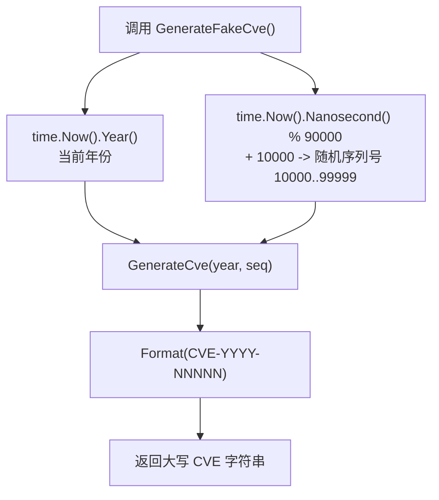

# GenerateFakeCve 生成假CVE

:::tip 📂 查看源码
[`generate.go:100`](https://github.com/scagogogo/cve-skills/blob/main/generate.go#L100-L105) — 在 GitHub 上查看实现代码（第 100–105 行）。
:::

`GenerateFakeCve` 无需传入任何参数即可生成一个假的 CVE 编号 —— 自动使用当前系统年份和随机序列号，适合用于测试、示例和占位数据。

:::tip 📌 场景
- 为单元测试或示例数据集生成占位 CVE 标识符
- 在开发阶段填充模拟的安全数据集
- 在演示和文档示例中快速创建随机 CVE
:::

## 函数签名

```go
func GenerateFakeCve() string
```

## 参数

- 无

## 返回值

- `string`：标准格式的 CVE 编号，如 `"CVE-2023-54321"`

## 行为说明

- 使用当前系统年份（来自 `time.Now().Year()`）作为 CVE 年份
- 生成范围在 `10000` 到 `99999`（含端点）的随机序列号，计算方式为 `10000 + 纳秒 % 90000`
- 最终格式化委托给 [`GenerateCve`](/zh/api/functions/generate-cve)，产出规范的大写 `CVE-YYYY-NNNNN` 形式
- 由于 `GenerateCve` 经过 `Format` 处理，返回结果始终为大写

## 流程图



## 示例

```go
package main

import (
	"fmt"

	"github.com/scagogogo/cve-skills"
)

func main() {
	// 单个假 CVE
	// 输出类似: "CVE-2026-12345"（年份跟随系统时钟）
	fakeCve := cve.GenerateFakeCve()
	fmt.Printf("Generated: %s\n", fakeCve)

	// 为测试集生成多个随机 CVE
	// 注意：因为不保证唯一性，可能出现重复
	var testCves []string
	for i := 0; i < 5; i++ {
		testCves = append(testCves, cve.GenerateFakeCve())
	}
	fmt.Println("Test set:")
	for i, id := range testCves {
		fmt.Printf("  %d: %s\n", i+1, id)
	}

	// 搭配 IsCve 确认输出是合法的 CVE 格式
	fmt.Printf("IsCve(%s) = %t\n", fakeCve, cve.IsCve(fakeCve))
}
```

## 使用场景

- 为测试和示例生成占位 CVE 标识符
- 开发阶段快速创建模拟 CVE 数据
- 为演示和文档填充示例数据集

## 注意事项

- ⚠️ 序列号派生自 `time.Now().Nanosecond()`，随机性有限且**非密码学安全** —— 切勿用于安全敏感场景
- ⚠️ **不保证唯一性**：在同一个纳秒窗口内连续快速调用可能返回相同值 —— 若需要互不相同的标识符，请自行去重或维护集合
- ✅ 输出始终符合 `CVE-YYYY-NNNNN` 格式并通过 `IsCve` 校验，但它是虚构值 —— **不**对应任何真实世界的 CVE 条目
- 🔍 与 [`GenerateCve`](/zh/api/functions/generate-cve) 对比：`GenerateCve` 需要显式指定年份和序列号；`GenerateFakeCve` 用当前年份和随机序列号自动填充两者
- 📊 随机序列号被限制在 `10000..99999`（5 位）范围内；如需其他范围，请直接调用 `GenerateCve`

## 内部实现

函数体（`generate.go:100`–`105`）仅有三条语句，刻意将所有格式化工作委托给 [`GenerateCve`](/zh/api/functions/generate-cve)：

- **年份来源（L101）** —— `currentYear := time.Now().Year()` 读取一次系统时钟。年份原样取自系统时间，**不做范围校验**（时钟配置错误可能产生 `1999` 或 `9999` 这样的年份）；`GenerateCve` 本身也不校验年份。
- **序列号推导（L102）** —— `randomSeq := 10000 + time.Now().Nanosecond()%90000`。第二次 `time.Now()` 取纳秒分量（`int` 类型，范围 `0..999999999`）；取模 `%90000` 将其映射到 `0..89999`，再加上 `10000` 偏移即落到 `10000..99999`，保证一定是 5 位数。注意这里是一次新的 `time.Now()` 调用，并未复用 L101 的值。
- **委托（L103）** —— `return GenerateCve(currentYear, randomSeq)` 将两个整数交给 `GenerateCve`，后者执行 `fmt.Sprintf("CVE-%d-%d", year, seq)` 再经 `Format` 转大写并去空格。`GenerateFakeCve` 自身不做任何字符串拼接。
- **设计意图** —— 复用 `GenerateCve`/`Format` 后，函数直接继承规范的 `CVE-YYYY-NNNNN` 形式与大写保证，使虚构输出在形态上与真实 CVE 无异且总能通过 `IsCve`。唯一被「伪造」的只是输入对 `(year, seq)`。
- **无错误路径** —— 函数签名只返回 `string`（无 `error`）。任一代码路径都产出合法字符串，调用方无需对返回值做空值/空串检查。

## 复杂度

| 指标 | 取值 | 原因 |
| --- | --- | --- |
| 时间 | O(1) | 两次 `time.Now()` 读取、一次取模/加法、一次 `fmt.Sprintf`、一次 `Format`，均为常数时间 |
| 空间 | O(1) | 仅分配返回字符串（`CVE-YYYY-NNNNN`，约 14 字节），无切片或 map |
| 内存分配 | O(1) | `fmt.Sprintf` 产出一条短字符串，外加 `Format` 的返回值 |

函数对给定时刻是确定的：纳秒相同时返回值必然相同，这正是紧密循环中可能发生重复的原因。

## 边界情形

| 输入 / 情形 | 行为 | 返回 |
| --- | --- | --- |
| 正常调用 | 读系统时钟，计算 5 位序列号 | `"CVE-YYYY-NNNNN"`（如 `"CVE-2026-12345"`） |
| 系统时钟设为异常年份 | 年份原样使用，不校验 | `"CVE-0001-12345"` 或 `"CVE-9999-12345"` |
| 同一纳秒内两次调用 | `Year()` 与 `Nanosecond()` 均相同 → `randomSeq` 相同 | 完全相同的字符串（重复） |
| 极快循环 | 纳秒值大概率重复 | 重复值；调用方需自行去重 |
| 纳秒 = 0 | `0 % 90000 = 0` → 序列号 `10000` | `"CVE-YYYY-10000"`（最小序列号） |
| 纳秒 = 999999999 | `999999999 % 90000 = 99999` → 序列号 `99999` | `"CVE-YYYY-99999"`（最大序列号） |
| 无参数 | 无可校验内容；必定成功 | 合法格式字符串，绝不会是 `""` |

## 数据流

```text
+--------------------------+
|   调用 GenerateFakeCve()  |
+------------+-------------+
             |
             v
+--------------------------+   +------------------------------+
| time.Now().Year() -> Y   |   | time.Now().Nanosecond() -> n |
+------------+-------------+   +---------------+--------------+
             |                                 |
             |                                 v
             |                 +-------------------------------+
             |                 | randomSeq = 10000 + n % 90000 |
             |                 | (范围 10000..99999)           |
             |                 +---------------+---------------+
             |                                 |
             +----------------+----------------+
                              |
                              v
               +------------------------------+
               | GenerateCve(Y, randomSeq)    |
               |  fmt.Sprintf("CVE-%d-%d",..) |
               |  -> Format (大写 + 去空格)    |
               +--------------+---------------+
                              |
                              v
                +-----------------------------+
                | "CVE-YYYY-NNNNN" (大写)     |
                +-----------------------------+
```

## 相关函数

- [GenerateCve](/zh/api/functions/generate-cve) — 根据显式年份和序列号生成 CVE
- [Format](/zh/api/functions/format) — 将 CVE 标准化为大写、去空格形式
- [IsCve](/zh/api/functions/is-cve) — 检查字符串是否为合法 CVE 格式
- [Generate 分类](/zh/api/generate)
