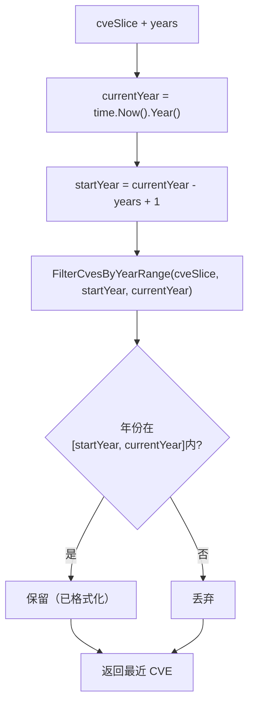

# GetRecentCves 最近N年

:::tip 📂 查看源码
[`filter.go:187`](https://github.com/scagogogo/cve-skills/blob/main/filter.go#L187-L191) — 在 GitHub 上查看实现代码（第 187–191 行）。
:::

`GetRecentCves` 从 CVE 列表中筛选出最近 `n` 年（以当前年份为基准）发布的 CVE —— 是 `FilterCvesByYearRange` 的便捷封装。

:::tip 📌 场景
- 在处理最新漏洞订阅时，只关注近几年发布的 CVE
- 生成覆盖过去 N 年的「最新安全威胁」报告
- 从仪表盘中剔除陈旧 CVE，仅保留当前年份范围内的上下文
:::

## 函数签名

```go
func GetRecentCves(cveSlice []string, years int) []string
```

## 参数

- `cveSlice` ([]string): 需要筛选的 CVE 编号数组
- `years` (int): 最近几年的范围，整数，例如 `2` 表示最近两年（当前年份与上一年）

## 返回值

- []string: 年份落在最近范围内的 CVE，已经 `Format` 标准化处理；无匹配项时返回空数组

## 行为说明

- 当前年份在调用时由 `time.Now().Year()` 计算得出，因此结果依赖运行时间
- 范围规则：覆盖 `(当前年份 - years + 1)` 到 `当前年份`（含），例如 2023 年时 `years=2` 对应窗口 `2022..2023`
- 内部委托给 `FilterCvesByYearRange`，后者会对每个 CVE 进行格式化（大写）并按数值比较年份
- 保留匹配项在输入中的原始顺序；窗口外的项被丢弃
- 无匹配项时返回空（nil）数组，而非错误

## 流程图



## 示例

```go
package main

import (
	"fmt"

	"github.com/scagogogo/cve-skills"
)

func main() {
	// 注意：下方「当前年份」为 2023（与源码注释一致）。
	// years=2 时窗口为 2022..2023。
	cveList := []string{
		"CVE-2020-1111",
		"CVE-2021-2222",
		"CVE-2022-3333",
		"CVE-2023-4444",
	}

	// 最近 2 年 -> 2022 和 2023
	recentTwoYears := cve.GetRecentCves(cveList, 2)
	fmt.Println(recentTwoYears)
	// Output: [CVE-2022-3333 CVE-2023-4444]

	// 最近 1 年 -> 仅当前年份（2023）
	recentOneYear := cve.GetRecentCves(cveList, 1)
	fmt.Println(recentOneYear)
	// Output: [CVE-2023-4444]

	// 当列表中没有当前年份的 CVE 时，返回空数组
	onlyOld := []string{"CVE-2020-1111", "CVE-2021-2222"}
	fmt.Println(cve.GetRecentCves(onlyOld, 1))
	// Output: []
}
```

## 使用场景

- 审阅漏洞订阅时，聚焦近几年发布的 CVE
- 构建覆盖过去 N 年的「最新安全威胁」报告
- 裁剪过长的待办列表，让仪表盘只展示当前相关的 CVE

## 注意事项

- 结果**随时间变化** —— 同一输入在不同年份会得到不同结果，因为窗口锚定在 `time.Now().Year()`。测试中需显式说明，或直接使用 `FilterCvesByYearRange` 锁定年份以获得确定性结果
- `years` 应为正整数；`years=1` 将窗口收窄为仅当前年份，而非常大的值实际上会返回整个列表（从某个很低的下界到当前年份都包含）
- 范围两端**均含端点**：`当前年份-years+1` 与 `当前年份` 都会被保留
- 每个 CVE 在比较年份前会先经 `Format` 标准化（大写、去空格），因此 `cve-2023-4444` 这类混合大小写输入也能正确处理
- 若需要固定、与年份无关的窗口，请直接调用 `FilterCvesByYearRange` 并显式传入 `startYear`/`endYear`

## 内部实现

`GetRecentCves` 是一个极薄的便捷封装（共 3 条语句），它把年份窗口锚定到当下，然后把全部重活交给 `FilterCvesByYearRange`。设计意图是易用性 —— 调用方只需说「最近 N 年」，而不必自行计算显式边界。

- **当前年份查询** —— `currentYear := time.Now().Year()`（L188）在调用时读取系统时钟。没有缓存，因此每次调用都重新推导锚点；这也是「注意事项」中结果随时间变化的根因。
- **范围算术** —— 调用时以 `currentYear-years+1` 作为 `startYear`、`currentYear` 作为 `endYear`（L189）。其中的 `+1` 使 `years=1` 表示「仅当前年份」、`years=2` 表示「当前年份加上一年」，与文档中含端点的语义一致。
- **完全委托** —— 返回值就是 `FilterCvesByYearRange(cveSlice, ...)` 的直接返回（L189）。所有格式化（`Format`、大写）、年份提取（`ExtractCveYearAsInt`）、`>= startYear && <= endYear` 比较以及顺序保留都在被调用方内部完成；逐条 CVE 的处理机制请参见其函数页。
- **无本地状态** —— 封装层不分配任何 map 或 slice。内存与顺序行为完全继承自 `FilterCvesByYearRange`，后者新建一个 `result []string` 并按输入顺序追加匹配且已格式化的 CVE。
- **边界值处理** —— 由于边界计算为 `currentYear-years+1`，当 `years` 为 `0` 或负值时，窗口起点会**晚于**终点（如 `currentYear+1 .. currentYear`）；此时 `FilterCvesByYearRange` 不会保留任何项，返回空数组而非错误。调用方应传入正整数 `years`。

## 复杂度

封装层本身为 O(1)；下表描述的是继承自 `FilterCvesByYearRange` 的工作量，它会对整个输入遍历一次。

| 指标 | 复杂度 | 依据 |
|---|---|---|
| 时间 | O(n) | 对长度为 n 的 `cveSlice` 遍历一次；每轮做 O(1) 的 `Format` + 年份提取 + 比较 |
| 空间 | O(k) | 一个容纳 k 个匹配 CVE 的结果 slice；最坏情况 k = n，即 O(n) |
| 辅助 | O(1) | 封装层不分配 map 或 set；被调用方也不使用 map（纯追加） |

其中 n = `len(cveSlice)`，k = 年份落在窗口内的 CVE 数量。

## 边界情形

| 输入 | 行为 | 返回 |
|---|---|---|
| 空数组 `[]`，任意 `years` | 无项可遍历 | `[]`（nil） |
| 所有 CVE 都早于窗口，如 2026 年时 `["CVE-2020-1"]` 配 `years=1` | 每个 CVE 的年份 < `startYear`，被丢弃 | `[]`（nil） |
| 仅含当前年份的 CVE，`years=1` | `startYear == currentYear`，仅同年份 CVE 匹配 | 当前年份的 CVE，已格式化 |
| 混合大小写，如 `cve-2023-4444` | `FilterCvesByYearRange` 内部先 `Format` 转为大写 `CVE-2023-4444` 再比较年份 | 匹配，返回 `CVE-2023-4444` |
| 带空格，如 `" CVE-2023-4444 "` | `Format` 去空格；年份提取随之成功 | 匹配，返回去空格/大写后的值 |
| 无效 CVE 字符串，如 `"CVE-99-bad"` | `ExtractCveYearAsInt` 返回 `0`（无有效年份）；`0 < startYear`，被丢弃 | 不出现在结果中 |
| 输入中有重复 CVE | 此处不去重；每个副本只要匹配就独立追加 | 重复项保留（如需去重请用 `RemoveDuplicateCves`） |
| `years = 0` 或负值 | `startYear = currentYear-years+1 > currentYear`；窗口为空/反向 | `[]`（nil） |
| 极大的 `years`，如 `years = 9999` | `startYear` 为一个很小的负数；每个有效 CVE 年份都 `>= startYear` | 实际上返回整个列表（已格式化） |

## 数据流

```text
+--------------------+
| cveSlice []string  |
| years int          |
+---------+----------+
          |
          v
+-----------------------+
| currentYear =         |  <-- time.Now().Year()  (L188)
|   time.Now().Year()   |
+---------+-------------+
          |
          v
+------------------------------+
| startYear = currentYear      |  (L189)
|            - years + 1       |
| endYear   = currentYear      |
+---------+--------------------+
          |
          v
+--------------------------------------+
| FilterCvesByYearRange(               |  (L189, 完全委托)
|   cveSlice, startYear, endYear)      |
+---------+----------------------------+
          |
          v
   遍历 cveSlice 中的每个 cve:
   +-------------------------------+
   | formatted = Format(cve)       |  大写 + 去空格
   | y = ExtractCveYearAsInt(...)  |
   | 当 startYear <= y <= endYear  |
   |   时保留                       |
   +---------------+---------------+
                   |
        +----------+----------+
        |                     |
     保留                   丢弃
        |                     |
        v                     v
+--------------+      (已丢弃)
| 结果 slice   |
| (已格式化,   |
|  按原顺序)   |
+------+-------+
       |
       v
+-------------------------+
| 返回 []string           |  最近 CVE（可能为空）
+-------------------------+
```

## 相关函数

- [FilterCvesByYearRange](/zh/api/functions/filter-cves-by-year-range) — 按显式年份范围（含端点）筛选 CVE
- [FilterCvesByYear](/zh/api/functions/filter-cves-by-year) — 筛选指定单个年份的 CVE
- [GroupByYear](/zh/api/functions/group-by-year) — 将 CVE 列表按年份分组
- [CountByYear](/zh/api/functions/count-by-year) — 按年份统计 CVE 数量
- [YearRange](/zh/api/functions/year-range) — 获取 CVE 列表中最早和最晚的年份
- [过滤与分组分类](/zh/api/filter-group)
