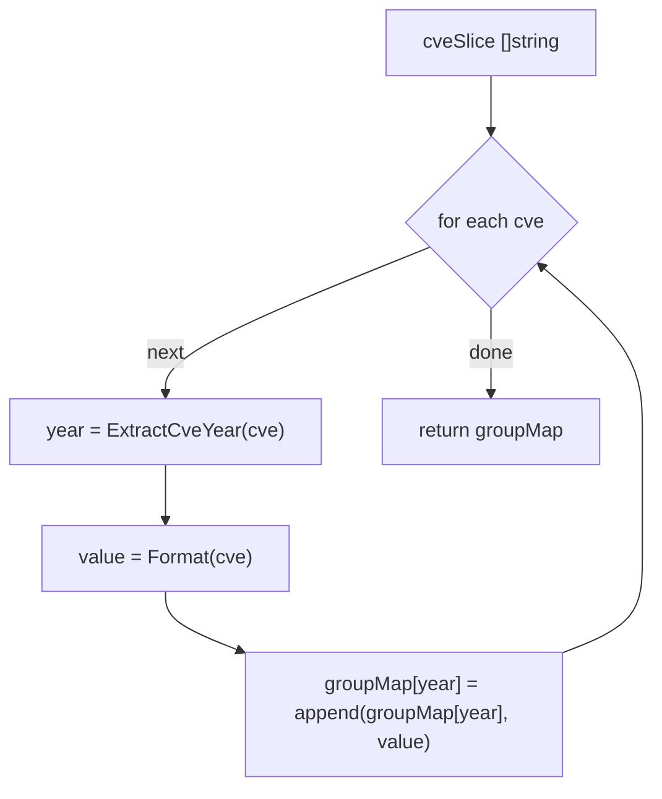

# GroupByYear 按年分组

:::tip 📂 查看源码
[`filter.go:46`](https://github.com/scagogogo/cve-skills/blob/main/filter.go#L46-L54) — 在 GitHub 上查看实现代码（第 46–54 行）。
:::

`GroupByYear` 将一组 CVE 标识符按年份分组，返回以年份字符串为键、对应年份的 CVE 数组为值的 map。

:::tip 📌 场景
- 按年份组织并展示多个 CVE，例如生成年度漏洞报告
- 分析 CVE 随时间分布的趋势
- 在按年进行下游处理前，将原始 CVE 数据流先分桶
:::

## 函数签名

```go
func GroupByYear(cveSlice []string) map[string][]string
```

## 参数

- `cveSlice` ([]string): 需要分组的 CVE 编号数组

## 返回值

- `map[string][]string`: 分组结果，键为年份字符串（如 `"2021"`），值为对应年份的 CVE 编号数组，每个元素已标准化为大写去首尾空格的形式

## 行为说明

- 遍历 `cveSlice` 中的每个 CVE，通过 `ExtractCveYear(cve)`（内部调用 `Split`）取出年份字符串作为 map 的键
- 每个被追加的值都经过 `Format(cve)` 标准化——`strings.ToUpper(strings.TrimSpace(cve))`——因此大小写混写或带空白的输入会返回大写形式，例如 `cve-2021-3333` 变为 `CVE-2021-3333`
- 同一年份组内的追加顺序与原数组顺序一致；map 本身（Go 的 `map`）不保证键的迭代顺序
- 非有效 CVE 格式的输入，`ExtractCveYear` 会返回空年份字符串，因此畸形条目会归并到 `""` 键下（它们仍会被格式化，因为 `Format` 不做格式校验——只做大写和去空白）
- 时间复杂度: O(n)，其中 n 为数组长度；空间复杂度: O(n)

## 流程图



## 示例

```go
package main

import (
	"fmt"

	"github.com/scagogogo/cve-skills"
)

func main() {
	// 混合年份与混合大小写——值会被标准化为大写
	cveList := []string{"CVE-2021-1111", "cve-2022-2222", "CVE-2021-3333"}
	yearGroups := cve.GroupByYear(cveList)
	for year, cves := range yearGroups {
		fmt.Printf("%s: %v\n", year, cves)
	}
	// 预期输出（键的顺序可能不同）：
	//   2021: [CVE-2021-1111 CVE-2021-3333]
	//   2022: [CVE-2022-2222]

	// 单一年份会合并到一个键
	oneYear := []string{"CVE-2021-1111", "cve-2021-3333"}
	groups := cve.GroupByYear(oneYear)
	fmt.Printf("keys: %v\n", groups) // keys: map[2021:[CVE-2021-1111 CVE-2021-3333]]

	// 空输入返回非 nil 的空 map
	empty := cve.GroupByYear(nil)
	fmt.Printf("empty == nil: %t, len: %d\n", empty == nil, len(empty)) // empty == nil: false, len: 0

	// 畸形条目会落到 "" 键下（仍被 ToUpper/TrimSpace 格式化）
	mixed := []string{"CVE-2021-1111", "not-a-cve"}
	mGroups := cve.GroupByYear(mixed)
	fmt.Printf("malformed group: %v\n", mGroups) // malformed group: map[:[NOT-A-CVE] 2021:[CVE-2021-1111]]
}
```

## 使用场景

- 按年份组织并展示多个 CVE，例如生成年度漏洞报告
- 分析 CVE 随时间分布的趋势
- 在按年进行下游处理前，将原始 CVE 数据流先分桶

## 注意事项

- map 的键是 `ExtractCveYear` 提取的**原始年份字符串**，并非补零或经校验的年份——`Split` 返回 `CVE-` 与序列号之间的原样内容，因此畸形条目会产生 `""` 键而非抛错
- `Format` 只做大写和去首尾空格，**不**校验 CVE 格式。这就是 `not-a-cve` 会原样存留（变为 `NOT-A-CVE`）而非被剔除的原因——`GroupByYear` 不会过滤无效输入
- Go 的 map 迭代顺序不确定；若需要稳定、按年份排序的遍历，请收集键后排序（或对每个年份组用 `SortCves` 排序）
- 同一年份组内，CVE 的相对顺序与输入数组中的顺序一致
- 与 `FilterCvesByYear` 对比：`GroupByYear` 一次性返回所有年份的 map；`FilterCvesByYear` 只返回指定年份的那一组数组
- 与 `CountByYear` 对比：`CountByYear` 将每个年份折叠为一个计数；`GroupByYear` 保留实际的 CVE 标识符

## 内部实现

函数体是一个简短的循环，把两处有意义的细节都委托给了其他辅助函数：

- **L47 — map 初始化**：`groupMap := make(map[string][]string, 0)`。map 预先分配（`0` 这个容量提示是象征性的，Go 会按需扩容），因此返回值始终是非 nil 的 map，即便输入为空也是如此。这就是 `GroupByYear(nil)` 返回 `map[]` 而非 `nil` 的原因。
- **L48 — 单次遍历**：`for _, cve := range cveSlice` 仅遍历输入一次。没有嵌套循环、没有排序、也没有去重——每个年份组内的原始数组顺序被保留，因为唯一的插入路径就是 `append`。
- **L49 — 键提取**：`year := ExtractCveYear(cve)`。年份取自 `Split`，它切出 `CVE-` 与序列号之间的子串。该子串原样成为键，因此畸形条目会得到 `""` 键而非抛错——函数本身不做任何校验。
- **L50 — 值标准化 + 追加**：`groupMap[year] = append(groupMap[year], Format(cve))`。`Format`（`strings.ToUpper(strings.TrimSpace(cve))`）只作用于值而不作用于键，所以 `cve-2021-3333` 会落到键 `2021` 下，值为 `CVE-2021-3333`。对新键而言 `groupMap[year]` 是 nil 切片，`append` 会透明地分配底层数组，因此无需按键预初始化。
- **L52 — 返回**：直接返回填充好的 map。由于循环是唯一的修改来源，且 Go 的 map 并非并发安全，需要并行访问的调用方必须自行加锁。

### 设计意图

`GroupByYear` 刻意做成一个只负责聚合分配的薄封装：把解析推给 `ExtractCveYear`，把标准化推给 `Format`，自身不携带任何格式知识。代价是畸形输入会被静默归入 `""` 键而非被拒绝；收益是函数永不 panic、永不丢弃条目。

## 复杂度

| 维度 | 上界 | 依据 |
|---|---|---|
| 时间 | O(n) | 对长度为 n 的数组遍历一次；每次迭代做常数级的 map 查找 + `append` + `ExtractCveYear`/`Format` 中的两次字符串扫描 |
| 空间 | O(n) | 每个输入元素恰好在 map 中存一份；最坏情形（年份全不同）map 持有 n 个键、n 个长度为 1 的切片 |
| 辅助空间 | O(1) | 无递归、除正在构建的 map 外无临时缓冲 |

注意：`make(map, 0)` 提示并不会预分配 map 容量，扩容是渐进发生的；渐近上界不受影响。

## 边界情形

| 输入 | 行为 | 返回 |
|---|---|---|
| `nil` 切片 | 循环体不执行；返回预分配的 map | `map[]`（非 nil，len 0） |
| 空切片 `[]string{}` | 同 nil——不迭代 | `map[]`（非 nil，len 0） |
| 畸形 `"not-a-cve"` | `ExtractCveYear` 返回 `""`；`Format` 大写为 `NOT-A-CVE` 并追加到 `""` 键下 | 条目以 `""` 键存留 |
| 小写 `"cve-2021-3333"` | 键 `2021` 来自 `ExtractCveYear`；值 `CVE-2021-3333` 来自 `Format` | 归入 `2021`，值标准化为大写 |
| 带空白 `"  CVE-2021-3333  "` | `Format` 去空白，值为 `CVE-2021-3333`；键仍为 `2021` | 归入 `2021`，已去空白 |
| 重复 `"CVE-2021-1111"` 两次 | 不去重——两次都追加到 `groupMap["2021"]` | `2021: [CVE-2021-1111 CVE-2021-1111]` |
| 混合年份 | 每个年份各成一个键 | 每个不同年份一个条目 |
| 并发访问 | 未加锁——Go 的 map 不支持并发读写 | 调用方需自行加互斥锁 |

## 数据流

```text
+------------------------+
| cveSlice []string      |
| (原始，大小写/年份混合) |
+----------+-------------+
           |
           v
+------------------------+
| for _, cve := range    |  单次遍历，保留顺序
+----------+-------------+
           |
           v
+------------------------+        +------------------------+
| year = ExtractCveYear  | -----> | groupMap 中的键         |
| (Split: CVE-<年份>-序号)|        | "2021"、"2022" 或 ""    |
+----------+-------------+        | （畸形条目落到 "" 键）  |
           |                      +------------------------+
           v
+------------------------+
| value = Format(cve)    |  ToUpper + TrimSpace
| "cve-2021-3333" ->     |
| "CVE-2021-3333"        |
+----------+-------------+
           |
           v
+------------------------+
| groupMap[year] =       |  追加到（可能为 nil 的）切片
|   append(..., value)   |
+----------+-------------+
           |
           v
+------------------------+
| return groupMap        |  map[string][]string
| (非 nil，永不为 nil)   |
+------------------------+
```

## 相关函数

- [ExtractCveYear](/zh/api/functions/extract-cve-year) — 提取用作 map 键的年份字符串
- [Format](/zh/api/functions/format) — 将每个 CVE 标准化为大写去空白形式
- [FilterCvesByYear](/zh/api/functions/filter-cves-by-year) — 只返回单个指定年份的 CVE
- [CountByYear](/zh/api/functions/count-by-year) — 按年计数而非收集 CVE
- [SubByYear](/zh/api/functions/sub-by-year) — 按年份分组的集合差集辅助函数
- [SortCves](/zh/api/functions/sort-cves) — 对 CVE 数组排序，便于稳定地按组排序
- [筛选与分组分类](/zh/api/filter-group)
