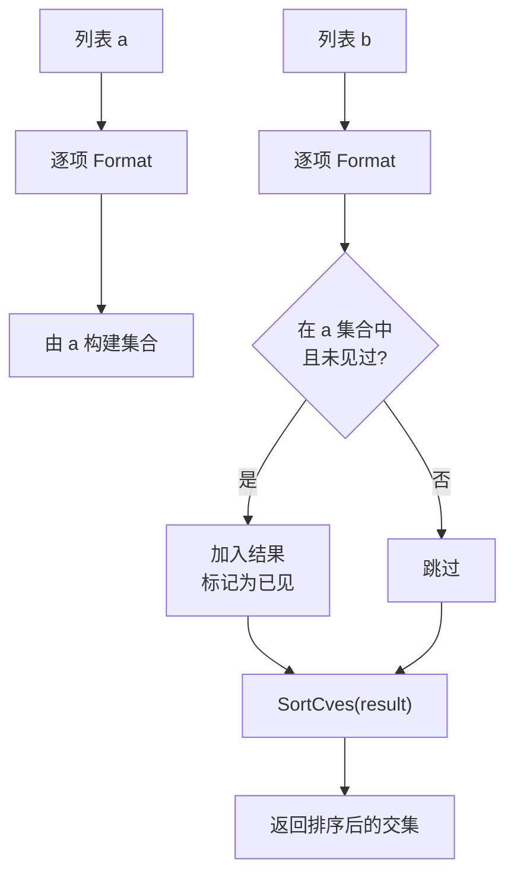

# IntersectCves 交集

:::tip 📂 查看源码
[`filter.go:229`](https://github.com/scagogogo/cve-skills/blob/main/filter.go#L229-L249) — 在 GitHub 上查看实现代码（第 229–249 行）。
:::

`IntersectCves` 返回同时出现在**两个**输入列表中的 CVE 编号，结果已去重、格式化为大写，并按年份与序列号升序排序。

:::tip 📌 场景
- 交叉对比多源 CVE 数据（NVD、厂商公告、内部扫描），找出共有条目
- 核对两份漏洞报告，仅提取重叠部分
- 确认关注清单中有哪些 CVE 也出现在新发布的公告里
:::

## 函数签名

```go
func IntersectCves(a, b []string) []string
```

## 参数

- `a` ([]string): 第一个 CVE 列表
- `b` ([]string): 第二个 CVE 列表

## 返回值

- []string: 两个列表共有的 CVE 编号，已去重、标准化为大写、已排序

## 行为说明

- 先对列表 `a` 的每个元素调用 `Format` 后建立内部集合，因此成员比较是不区分大小写的（例如 `cve-2022-2222` 与 `CVE-2022-2222` 视为同一个 CVE）
- 再遍历列表 `b`，每个元素同样先格式化；仅当其格式化结果已存在于 `a` 的集合中时才予以保留
- 第二个 `seen` 集合用于防止 `b` 中的重复项——每个共有 CVE 在结果中只出现一次
- 最终切片会经过 `SortCves` 处理，输出按年份升序、序列号升序排列
- 当两个列表没有共有 CVE 时返回 `nil`（空切片），可安全地用 `for _, c := range result` 遍历

## 流程图



## 示例

```go
package main

import (
	"fmt"

	"github.com/scagogogo/cve-skills"
)

func main() {
	// 来源：filter.go 文档示例
	list1 := []string{"CVE-2022-1111", "CVE-2022-2222"}
	list2 := []string{"CVE-2022-2222", "CVE-2022-3333"}
	common := cve.IntersectCves(list1, list2)
	fmt.Println(common) // [CVE-2022-2222]

	// 无交集 -> 空结果
	onlyA := []string{"CVE-2022-1111"}
	onlyB := []string{"CVE-2023-2222"}
	fmt.Println(cve.IntersectCves(onlyA, onlyB)) // []

	// 不区分大小写 + 去重 + 排序输出
	messy1 := []string{"cve-2022-2222", "CVE-2021-1111"}
	messy2 := []string{"CVE-2022-2222", "cve-2022-2222", "CVE-2021-1111"}
	fmt.Println(cve.IntersectCves(messy1, messy2)) // [CVE-2021-1111 CVE-2022-2222]

	// 用关注清单与公告流核对
	watchlist := []string{"CVE-2021-44228", "CVE-2022-22222", "CVE-2023-99999"}
	advisory := []string{"CVE-2021-44228", "CVE-2023-99999", "CVE-2024-00001"}
	hits := cve.IntersectCves(watchlist, advisory)
	fmt.Println(hits) // [CVE-2021-44228 CVE-2023-99999]
}
```

## 使用场景

- 多源 CVE 数据核对——找出 NVD、厂商公告、内部扫描器共有的条目
- 识别多份安全报告中共同提及的漏洞
- 确认关注清单中有哪些 CVE 出现在新发布的公告里

## 注意事项

- 比较是**不区分大小写**的，因为每个元素在进入集合前都会经过 `Format` 标准化；返回的 CVE 一律为大写
- 结果由 `SortCves` 排序（年份升序、序列号升序），**不保留**输入顺序——对比 `DiffCves`，它同样会排序，但返回的是 `a` 中独有的条目
- 参数顺序只在概念上有别：交集运算是对称的，`IntersectCves(a, b)` 与 `IntersectCves(b, a)` 产生相同的集合（以及相同的排序切片）
- 时间复杂度为 O(n+m)，辅助空间 O(min(n,m))，对大列表同样高效
- 不会修改入参；始终返回新的切片

## 内部实现

该函数分为三个阶段——构建查找集合、扫描第二个列表、最后排序：

- **由 `a` 构建集合（L230-L233）：** `set := make(map[string]struct{}, len(a))` 按 `a` 的长度预分配 map 容量，避免扩容 rehash。每个元素在存为 map key 前都先经过 `Format(cve)` 处理，因此 `cve-2022-2222` 与 `CVE-2022-2222` 会塌缩为同一个 key。value 类型选用 `struct{}`，因为它不承载数据且每个条目零字节分配。
- **扫描 `b` 并用第二个 `seen` 集合去重（L235-L245）：** `result` 声明为 nil 切片，通过 `append` 增长。对 `b` 的每个元素，先用其格式化结果在 `set` 中查表（对 `a` 的成员判断）；若命中，再查 `seen` map，避免 `b` 自身含重复时同一 CVE 被输出两次。仅首次命中会被追加。
- **返回前排序（L247）：** `return SortCves(result)` 统一输出顺序，调用方始终得到年份升序、再序列号升序的结果，与 `a`、`b` 的输入顺序无关。
- **设计意图——对称且稳定：** 由于成员判断以*格式化后*的字符串为 key，且结果经过排序，`IntersectCves(a, b)` 与 `IntersectCves(b, a)` 产出完全相同的切片。集合从 `a`（而非更短的列表）构建以保持实现简单；O(n+m) 的开销由两次线性遍历主导。
- **不修改入参：** `a` 与 `b` 仅被读取；`result` 是全新分配的切片，调用方可安全保留原始入参。

## 复杂度

| 指标 | 上界 | 推导 |
|---|---|---|
| 时间 | O(n + m + k log k) | 对 `a` 一次线性遍历（n），对 `b` 一次线性遍历（m），再对 k 个结果调用 `SortCves`（k log k）。由于 k <= min(n, m)，当 k 较小时整体可简化为 O(n + m)。 |
| 辅助空间 | O(n + min(n, m)) | `set` 最多持有 n 个格式化 key；`seen` 最多持有 min(n, m) 个 key（受交集大小约束）；`result` 持有 k 个条目。 |
| map 操作 | 平均 O(1) | `make` 预分配容量，加上 Go 内置 map 摊销 O(1) 的插入/查找。 |

其中 `n = len(a)`、`m = len(b)`、`k` 为交集大小。

## 边界情形

| 输入 | 行为 | 返回 |
|---|---|---|
| `a` 或 `b` 为 `nil` | 遍历 nil 切片是空操作；不会对缺失元素调用 `Format` | 空（nil）切片——可安全遍历 |
| `a` 或 `b` 为空（`[]string{}`） | 其中一次遍历不贡献任何元素；交集为空 | `nil` |
| `a` 与 `b` 无共有 CVE | `set` 查表全部未命中；`result` 保持 nil | `nil` |
| `a` 中含重复 CVE | map 插入会去重；`set` 只保留一个 key | 不受影响——交集不变 |
| `b` 中含重复 CVE | `seen` 守卫（L240）抑制第二次出现 | 每个共有 CVE 仅出现一次 |
| 大小写混用（`cve-2022-2222` 与 `CVE-2022-2222`） | `Format` 在进入任何集合操作前先标准化为大写 | 视为相同；返回 `CVE-2022-2222` |
| 元素含首尾空格 | `Format` 会去除空格，`" CVE-2022-2222 "` 与 `CVE-2022-2222` 匹配 | 输出为标准化形式 |
| 无效 CVE 字符串（不符合 CVE 模式） | 仍会调用 `Format`，所得字符串用作 key；无效条目不会与有效条目匹配 | 这些条目不产生交集 |

## 数据流

```text
+-------------------+        +-------------------+
| 输入: 列表 a      |        | 输入: 列表 b      |
| []string (n 项)   |        | []string (m 项)   |
+---------+---------+        +---------+---------+
          |                            |
          v                            v
   +------+-------+            +-------+------+
   | Format(逐项) |            | Format(逐项) |
   | L232         |            | L238         |
   +------+-------+            +-------+------+
          |                            |
          v                            |
   +------+-------+                    |
   | 构建 set      |                   |
   | map[string]   |                   |
   | struct{}      |                   |
   | L230-L233     |                   |
   +------+-------+                    |
          |                            |
          |  +-------------------------+
          |  |
          v  v
   +------+--------+
   | 在 set a 中且 |    否  +--------+
   | 不在 seen 中? |------>| 跳过   |
   +------+--------+       +--------+
          | 是
          v
   +------+--------+
   | 追加到 result |
   | 标记 seen     |
   | L240-242      |
   +------+--------+
          |
          v
   +------+--------+
   | SortCves      |
   | result L247   |
   +------+--------+
          |
          v
+--------------------+
| 输出: 排序后的交集 |
| []string (k 项)    |
+--------------------+
```

## 相关函数

- [UnionCves](/zh/api/functions/union-cves) — 两个 CVE 列表的并集（去重、排序）
- [DiffCves](/zh/api/functions/diff-cves) — 在 `a` 中但不在 `b` 中的 CVE
- [RemoveDuplicateCves](/zh/api/functions/remove-duplicate-cves) — 对单个列表去重
- [SortCves](/zh/api/functions/sort-cves) — 按年份与序列号排序
- [Format](/zh/api/functions/format) — 将 CVE 标准化为大写去空格形式
- [集合运算分类](/zh/api/set-operations)
