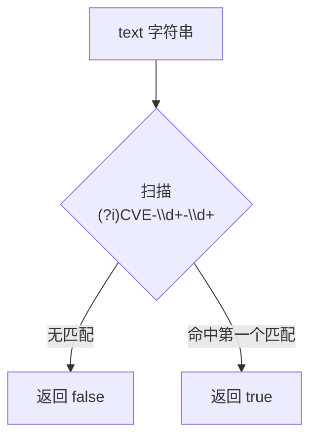

# IsContainsCve 包含判断

:::tip 📂 查看源码
[`base.go:151`](https://github.com/scagogogo/cve-skills/blob/main/base.go#L151-L171) — 在 GitHub 上查看实现代码（第 151–171 行）。
:::

`IsContainsCve` 检查文本中是否包含至少一个 CVE 格式的标识符 —— 与 `IsCve` 不同，CVE 不必是整个字符串，只要出现在文本中任意位置即可。

:::tip 📌 场景
- 在执行较重的 `ExtractCve` 提取之前，快速判断安全报告、邮件或日志行是否提及 CVE
- 对大规模文本语料做预筛，仅对包含 CVE 的文档做后续处理
- 基于「是否出现 CVE」这一信号触发条件逻辑（告警、打标、路由分发）
:::

## 函数签名

```go
func IsContainsCve(text string) bool
```

## 参数

- `text` (string): 需要检查的文本内容

## 返回值

- `bool`: 如果在文本任意位置找到至少一个 CVE 格式子串则返回 `true`，否则返回 `false`

## 行为说明

- 使用预编译的正则表达式 `(?i)CVE-\d+-\d+` 进行匹配
- `(?i)` 表示大小写不敏感 —— `cve-2022-12345`、`CVE-2022-12345`、`CvE-2022-12345` 均可被检测到
- 模式**未锚定** —— 会对整个字符串扫描，因此嵌入在正文中的 CVE（如 `"系统受到CVE-2021-44228的影响，请修复"`）返回 `true`
- `\d+-\d+` 要求年份与序列号均为数字 —— `"CVE-2022-ABCD"` 不匹配
- 命中第一个匹配即短路返回 `true`，不会收集或统计所有出现位置
- 空字符串或不含 CVE 格式子串的文本返回 `false`
- 仅做存在性判断，不校验年份范围、序列号取值，也不去重；完整校验请使用 `ValidateCve`，提取请使用 `ExtractCve`

## 流程图



## 示例

```go
package main

import (
	"fmt"

	"github.com/scagogogo/cve-skills"
)

func main() {
	testCases := []struct {
		input    string
		expected bool
		reason   string
	}{
		{"这个漏洞的编号是CVE-2022-12345", true, "CVE 嵌在正文中"},
		{"系统受到CVE-2021-44228和CVE-2022-12345影响", true, "文本中包含多个 CVE"},
		{"cve-2022-12345在文本中", true, "小写 CVE 也可被检测（大小写不敏感）"},
		{"Primary CVE-2022-1 is single-digit", true, "单数字序列号仍匹配模式"},
		{"这个文本不包含任何CVE", false, "不含 CVE 格式子串"},
		{"CVE格式错误CVE-22-123", true, "22 与 123 均为数字，故匹配（见注意事项）"},
		{"CVE-2022-ABCD mentioned here", false, "序列号不是数字"},
		{"2022-12345 without prefix", false, "缺少 CVE 前缀"},
		{"", false, "空字符串"},
	}

	for _, tc := range testCases {
		result := cve.IsContainsCve(tc.input)
		status := "✅"
		if result != tc.expected {
			status = "❌"
		}
		fmt.Printf("%s %-55s -> %t  (%s)\n", status, tc.input, result, tc.reason)
	}

	// 提取前的典型预筛用法
	report := "系统受到CVE-2021-44228的影响，建议立即修复"
	if cve.IsContainsCve(report) {
		cveList := cve.ExtractCve(report)
		fmt.Printf("提取到的 CVE: %v\n", cveList)
	} else {
		fmt.Println("未发现 CVE，跳过提取")
	}
}
```

## 使用场景

- 检测文章、安全公告或报告中是否提及 CVE
- 在执行较耗时的 `ExtractCve` 提取之前做文档预筛
- 基于「是否出现 CVE」触发告警、打标或路由分发
- 扫描日志或邮件中的 CVE 相关内容

## 注意事项

- `IsContainsCve` 仅做**存在性**判断，不返回匹配到的 CVE —— 如需获取请使用 `ExtractCve`（全部匹配）、`ExtractFirstCve` 或 `ExtractLastCve`
- 与 `IsCve` 对比：`IsCve` 要求**整个**字符串就是 CVE（空白除外）；`IsContainsCve` 只检查字符串中**是否包含** CVE
- `\d+` 接受一位或多位数字，因此 `CVE-22-123` 实际上能匹配正则，尽管 `22` 并非合理的 4 位年份 —— 年份范围校验由 `IsCveYearOk` / `ValidateCve` 负责
- 匹配大小写不敏感，但结果仅为布尔值 —— 如需标准大写的 CVE 字符串，请调用 `ExtractCve`（其会将匹配结果格式化为大写）
- 正则表达式在 init 阶段预编译为包级变量 `containsCveRegex`，因此重复调用开销极低且并发安全
- 正则未锚定，因此同一个 CVE 出现多次也仅返回一个 `true`；本函数不去重、不计数

## 内部实现

函数体仅一行（`base.go:152`），直接委托给包级预编译正则：

```go
return containsCveRegex.MatchString(text)
```

- 正则在包 init 阶段通过 `regexp.MustCompile(`(?i)CVE-\d+-\d+`)` 构造一次，存入包级变量 `containsCveRegex`（声明于 `base.go:16`）。这避免了每次调用重新编译，单次调用的开销仅为 `MatchString` 的扫描成本
- `MatchString` 判断正则是否在字符串**任意位置**匹配 —— 模式未锚定（无 `^`/`$`），这正是「包含」判断而非「相等」判断的来源
- `(?i)` 内联标志将匹配切换为大小写不敏感，故字面量 `CVE` 前缀可匹配 `cve`、`Cve` 等，无需先对输入做大小写归一化
- `\d+-\d+` 要求中划线两侧各有一位或多位数字；由于 Go 的 `regexp` 贪心但未锚定，引擎一旦找到首个整体匹配即停止（命中即短路返回）
- 函数无状态，不分配 map 或 slice，不做排序、格式化或校验 —— 所有行为（大小写不敏感、未锚定、数字字段）均源自正则本身，而非运行时逻辑

## 复杂度

| 维度 | 复杂度 | 原因 |
|---|---|---|
| 时间 | O(n)，其中 n = len(`text`) | `MatchString` 对输入做一次线性扫描；正则不存在导致指数回溯的量词 |
| 空间 | O(1) 额外 | 函数不分配 slice、map 或缓冲区；正则引擎仅使用有界工作状态 |
| 单次调用准备 | O(1) | 模式在 init 阶段编译一次（`containsCveRegex`），每次调用只付出匹配成本，无编译成本 |
| 并发 | 安全 | 预编译的 `*regexp.Regexp` 不可变，`MatchString` 可安全并发使用 |

## 边界情形

| 输入 | 行为 | 返回 |
|---|---|---|
| 空字符串 `""` | 无字符可扫描，模式无法匹配 | `false` |
| 等价空输入 | 同空字符串 | `false` |
| `cve-2022-12345`（小写） | `(?i)` 使前缀大小写不敏感 | `true` |
| `CvE-2022-12345`（混合大小写） | `(?i)` 匹配混合大小写前缀 | `true` |
| `CVE-2022-ABCD`（序列号非数字） | `\d+` 无法匹配 `ABCD` | `false` |
| `CVE-22-123`（2 位年份） | `\d+` 接受任意位数字，故仍匹配，尽管年份并不合理 | `true` |
| `2022-12345`（无 `CVE` 前缀） | 缺少字面量前缀 | `false` |
| 同一 CVE 重复，如 `CVE-2022-1 CVE-2022-1` | 未锚定正则在首个命中处短路，不计数 | `true` |
| CVE 嵌在正文中，如 `see CVE-2021-44228 ASAP` | 未锚定扫描找到子串 | `true` |
| 不含 CVE 的超长文本 | 一次完整线性扫描，无匹配 | `false` |

## 数据流

```text
+----------------------+      +---------------------------------+      +---------------------+
|  text (string)       |----->|  containsCveRegex.MatchString   |----->|  bool               |
|  如 "see cve-2022    |      |  (?i)CVE-\d+-\d+                |      |  true / false       |
|  -1 now"             |      |  (init 阶段预编译)              |      |                     |
+----------------------+      +---------------------------------+      +---------------------+
                                     |
                                     | 未锚定、大小写不敏感扫描
                                     v
                              +-----------------------------+
                              |  从左向右扫描               |
                              |  命中首个匹配即短路返回，   |
                              |  或扫描到字符串末尾         |
                              +-----------------------------+
                                     |
                        +------------+------------+
                        |                         |
                  命中首个匹配              扫描到末尾，无匹配
                        |                         |
                        v                         v
                   返回 true                 返回 false
```

## 相关函数

- [IsCve](/zh/api/functions/is-cve) — 要求整个字符串就是 CVE
- [ExtractCve](/zh/api/functions/extract-cve) — 从文本中提取全部 CVE
- [ExtractFirstCve](/zh/api/functions/extract-first-cve) — 从文本中提取第一个 CVE
- [ExtractLastCve](/zh/api/functions/extract-last-cve) — 从文本中提取最后一个 CVE
- [ValidateCve](/zh/api/functions/validate-cve) — 完整校验（格式 + 年份范围 + 正序列号）
- [格式化与验证分类](/zh/api/format-validate)
