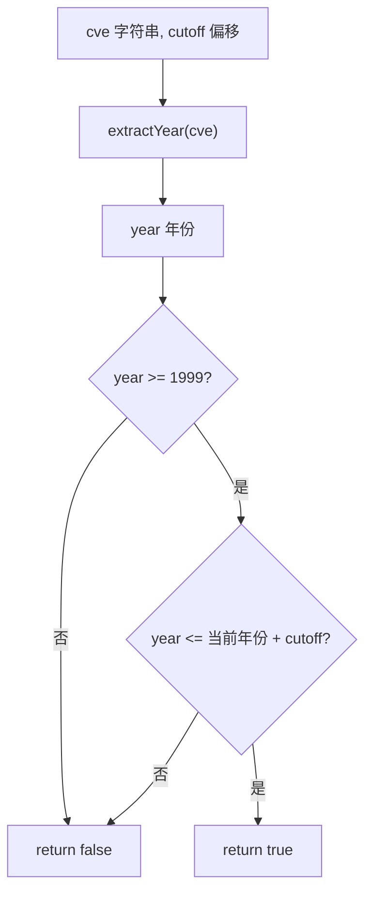

# IsCveYearOkWithCutoff 带偏移年份校验

:::tip 📂 查看源码
[`base.go:231`](https://github.com/scagogogo/cve-skills/blob/main/base.go#L231-L235) — 在 GitHub 上查看实现代码（第 231–235 行）。
:::

`IsCveYearOkWithCutoff` 判断 CVE 编号中的年份是否落在合理的时间范围内，并可通过 `cutoff` 偏移量放宽上界，从而接受未来年份的 CVE。

:::tip 📌 场景
- 校验预留或预发布的 CVE 编号，其年份可能略微超前于当前年份
- 在接入第三方漏洞数据源时应用自定义的未来年份容忍窗口
- 作为 `IsCveYearOk`（传入 `cutoff = 0`）背后的底层范围校验逻辑复用
:::

## 函数签名

```go
func IsCveYearOkWithCutoff(cve string, cutoff int) bool
```

## 参数

- `cve` (string)：需要校验年份的 CVE 编号
- `cutoff` (int)：允许超过当前年份的偏移量，单位为年；将上界放宽至 `当前年份 + cutoff`

## 返回值

- `bool`：若年份在有效范围内则返回 `true`，否则返回 `false`

## 行为说明

- 通过内部辅助函数 `extractYear` 提取年份：先调用 `Format` 去除空白并转为大写，再按 `-` 切分并将中间段解析为整数
- 下界固定：年份必须满足 `year >= 1999`（CVE 编号体系始于 1999 年）
- 上界动态：年份必须满足 `year <= time.Now().Year() + cutoff`，`cutoff` 将可接受窗口向未来延伸
- 当输入不是有效的 CVE 格式时，`extractYear` 返回 `0`，由于 `0 < 1999`，函数返回 `false`，不会对格式错误的输入抛错或 panic
- `cutoff` 可以为 `0`（不接受未来年份，等价于 `IsCveYearOk`），也可以为负数（将上界收紧到当前年份以下）
- 这是**年份范围**校验，不校验序列号数值或完整 CVE 格式，需与 `IsCve` / `ValidateCve` 组合以完成完整校验

## 流程图



## 示例

```go
package main

import (
	"fmt"

	"github.com/scagogogo/cve-skills"
)

func main() {
	// 源码示例（假设当前年份 = 2023）：
	//   "CVE-2022-12345", 5 -> true
	//   "CVE-1998-12345", 5 -> false (1998 < 1999)
	//   "CVE-2030-12345", 5 -> true (2030 <= 2023+5)
	//   "CVE-2030-12345", 2 -> false (2030 > 2023+2)
	testCases := []struct {
		cve     string
		cutoff  int
		reason  string
	}{
		{"CVE-2022-12345", 5, "当前年份内，恒为 true"},
		{"CVE-1998-12345", 5, "1998 早于 1999 -> false"},
		{"CVE-2030-12345", 5, "2030 <= 2023+5 -> true"},
		{"CVE-2030-12345", 2, "2030 > 2023+2 -> false"},
		{"CVE-2025-12345", 2, "未来年份落在偏移窗口内"},
		{"not-a-cve", 5, "格式错误：extractYear 返回 0 -> false"},
	}

	for _, tc := range testCases {
		result := cve.IsCveYearOkWithCutoff(tc.cve, tc.cutoff)
		fmt.Printf("IsCveYearOkWithCutoff(%-18s, %d) -> %t  (%s)\n", tc.cve, tc.cutoff, result, tc.reason)
	}

	// 典型用法：允许未来 2 年的 CVE 编号
	if cve.IsCveYearOkWithCutoff("CVE-2025-12345", 2) {
		fmt.Println("接受：年份在 1999..当前年份+2 范围内")
	} else {
		fmt.Println("拒绝：年份超出范围")
	}
}
```

## 使用场景

- 在允许配置未来年份容忍度的前提下校验 CVE 年份有效性
- 处理预发布或预留的 CVE 编号（其年份可能超过当前年份）
- 作为 `IsCveYearOk`（传入 `cutoff = 0`）的底层引擎复用

## 注意事项

- 下界 `1999` 是固定的，不受 `cutoff` 影响；只有上界会随偏移移动
- `cutoff` 单位为**年**，而非天或月，直接加到 `time.Now().Year()` 上
- 负的 `cutoff` 会收紧上界（例如 `-1` 在你的数据上下文尚未跨年时会拒绝当前年份的 CVE），但无法把下界压到 `1999` 以下
- 对于格式错误的输入，函数静默返回 `false`（经 `extractYear` 返回 `0`）；需要区分“格式错误”与“年份错误”时，请先用 `IsCve` 校验格式
- 上界依赖 `time.Now()`，因此同一输入在不同运行时刻可能得到不同结果（随系统年份推进），不应长期缓存判定结果
- 与 `IsCveYearOk` 对比：逻辑相同，仅 `cutoff = 0`；与 `ValidateCve` 对比：完整校验（格式 + 年份范围 cutoff=0 + 序列号为正整数）

## 内部实现

函数体只有两行（`base.go:231`-`235`），将繁重的工作委托给辅助函数：

- **通过 `extractYear` 提取年份**（L232）：`year := extractYear(cve)` 复用共享辅助函数，它先调用 `Format` 去除空白并转为大写，再按 `-` 切分并将中间段解析为整数。这保证了解析逻辑与所有其他年份相关 API 一致。
- **固定的下界**（L233，左操作数）：`year >= 1999` 将 CVE 计划的起始年份（1999）作为编译期常量。它刻意不可参数化——1999 年之前不存在任何 CVE。
- **动态的上界**（L233，右操作数）：`year <= time.Now().Year()+cutoff` 在调用时读取系统时钟年份并按 `cutoff` 平移。每次调用都读取 `time.Now()`（而非缓存）确保窗口跟踪真实日期，代价是跨运行结果非确定。
- **短路求值 `&&`**：Go 从左到右求值并在第一个 `false` 处停止，因此年份过低时根本不会触发 `time.Now()` 调用。无效输入（`extractYear` 返回 `0`）会在下界处快速失败。
- **无错误路径**：格式错误的输入经 `extractYear` 返回 `0`，`0` 不满足 `>= 1999`，结果为 `false`——函数是全函数且永不 panic，因此调用方需配合 `IsCve` 才能区分“格式错误”与“年份错误”。

## 复杂度

| 维度 | 开销 | 原因 |
|---|---|---|
| 时间 | O(n) | `extractYear` 通过 `Format` + 切分 + 解析对（较短的）CVE 字符串做一次扫描；两次比较为 O(1) |
| 空间 | O(1) | 仅分配一个 `int`（`year`），无切片、map 或递归 |
| `time.Now()` | O(1) | 每次调用一次无系统调用的运行时时钟读取 |

由于输入受 CVE 长度约束，函数在实际中近似常数，但对字符串解析的线性界限保证了对任意长度输入的诚实性。

## 边界情形

| 输入 | 行为 | 返回 |
|---|---|---|
| `"CVE-2022-12345"`，cutoff `0` | 年份 `2022` 落在 `[1999, 当前年份]` | `true` |
| `"CVE-1998-12345"`，cutoff `5` | `1998 < 1999`，不满足下界 | `false` |
| `"CVE-2030-12345"`，cutoff `2`（当前=2023） | `2030 > 2023+2`，不满足上界 | `false` |
| `""`（空字符串） | `extractYear` 返回 `0`，`0 < 1999` | `false` |
| `"not-a-cve"`，cutoff `5` | 无法解析出年份段，返回 `0` | `false` |
| `"cve-2022-12345"`（小写） | `Format` 先转大写，再正常解析 | `true` |
| `"  CVE-2022-12345  "`（含空白） | `Format` 先去空白，再解析 | `true` |
| `"CVE-2022-12345"`，cutoff `-5` | 上界收紧到当前年份以下；`2022 > 当前-5` 可能拒绝 | 取决于 `当前年份` |
| `"CVE-0000-12345"` | 年份 `0`，`0 < 1999` | `false` |
| 等价于 nil / 超长字符串 | 仍为单次解析，不 panic | 不可解析则 `false` |

## 数据流

```text
+---------------------------+      +-----------------------+
| 输入: cve 字符串,         |      | 输入: cutoff int      |
|       cutoff int          |      | (年份偏移, 可为 0     |
+-------------+-------------+      |  或负数)              |
              |                    +-----------+-----------+
              v                                |
+-----------------------------+                |
| extractYear(cve)            |                |
|  - Format(cve): 去空白+大写 |                |
|  - 按 '-' 切分              |                |
|  - Atoi(中间段)             |                |
+-------------+---------------+                |
              | year (int, 失败为 0)          |
              v                                v
+-----------------------------------------------------+
| year >= 1999  &&  year <= time.Now().Year()+cutoff  |
|  (左: 固定下界; 右: 动态上界)                        |
+----------------------+------------------------------+
                       |
          +------------+------------+
          |  短路 &&: 任一操作数为   |
          |  false 即整体为 false   |
          +------------+------------+
                       |
                       v
            +----------+----------+
            |  true  |   false   |
            +--------+-----------+
                    |
                    v
        +-----------+-----------+
        | 输出: bool            |
        +-----------------------+
```

## 相关函数

- [IsCveYearOk](/zh/api/functions/is-cve-year-ok) — 不带未来年份偏移的年份范围校验（cutoff = 0）
- [ValidateCve](/zh/api/functions/validate-cve) — 完整校验（格式 + 年份范围 + 序列号为正）
- [IsCve](/zh/api/functions/is-cve) — 纯格式校验
- [Split](/zh/api/functions/split) — 将 CVE 拆分为年份与序列号
- [Format](/zh/api/functions/format) — 将 CVE 标准化为大写、去空格形式
- [Format & Validate 分类](/zh/api/format-validate)
