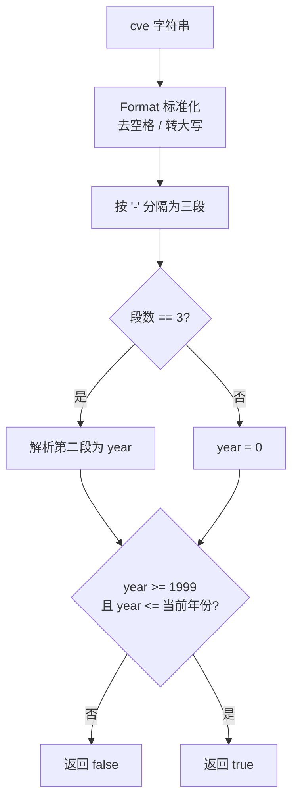

# IsCveYearOk 年份校验

:::tip 📂 查看源码
[`base.go:199`](https://github.com/scagogogo/cve-skills/blob/main/base.go#L199-L202) — 在 GitHub 上查看实现代码（第 199–202 行）。
:::

判断 CVE 编号的年份是否在合理的时间范围内（1999 至当前年份）。

:::tip 📌 场景
- 在导入或入库前快速过滤掉年份异常的 CVE（早于 1999 或晚于当前年份）
- 对用户输入或外部数据源提交的 CVE 做轻量级合理性校验
- 在批量清洗流水线中作为 `IsCve` 之后的第二道年份过滤关卡
:::

## 函数签名

```go
func IsCveYearOk(cve string) bool
```

## 参数

- `cve` (string): 需要验证年份的 CVE 编号，大小写不敏感，允许两侧有空白字符

## 返回值

- `bool`: 如果年份在有效范围内（`1999 <= year <= 当前年份`）则返回 `true`，否则返回 `false`

## 行为说明

- `IsCveYearOk` 是 `IsCveYearOkWithCutoff(cve, 0)` 的简写，等价于不携带任何未来年份偏移
- 内部先调用 `extractYear` 提取年份：先用 `Format` 标准化（去空格、转大写），再按 `-` 分隔；若分隔后不是三段，则年份取 `0`
- 下限固定为 `1999`（CVE 编号体系启用的年份），早于 1999 的年份直接判为 `false`
- 上限为 `time.Now().Year()`，即运行时的当前年份；晚于当前年份的判为 `false`
- 由于年份为 `0` 时 `0 >= 1999` 不成立，因此格式无效的输入会直接返回 `false`，不会误判为合法
- 该函数只校验年份，不校验序列号；如需同时校验格式、年份与序列号，请使用 `ValidateCve`

## 流程图



## 示例

```go
package main

import (
	"fmt"
	"time"

	"github.com/scagogogo/cve-skills"
)

func main() {
	currentYear := time.Now().Year()
	fmt.Printf("当前年份: %d\n\n", currentYear)

	testCases := []struct {
		input    string
		expected bool
		reason   string
	}{
		{"CVE-2022-12345", true, "年份在 1999 至当前年份之间"},
		{"cve-1999-1", true, "1999 是下限，包含在内"},
		{"CVE-1998-12345", false, "1998 < 1999，早于 CVE 体系启用"},
		{"CVE-2030-12345", false, "2030 超过当前年份（无偏移）"},
		{" CVE-2022-12345 ", true, "允许两侧空白字符"},
		{"cVe-2022-12345", true, "大小写不敏感"},
		{"CVE-22-12345", false, "格式异常，年份解析为 0"},
		{"not-a-cve", false, "非 CVE 格式，年份解析为 0"},
		{"", false, "空字符串，年份解析为 0"},
	}

	for _, tc := range testCases {
		result := cve.IsCveYearOk(tc.input)
		status := "✅"
		if result != tc.expected {
			status = "❌"
		}
		fmt.Printf("%s %-20s -> %t  (%s)\n", status, tc.input, result, tc.reason)
	}

	// 等价性演示：IsCveYearOk(cve) == IsCveYearOkWithCutoff(cve, 0)
	cveId := "CVE-2022-12345"
	fmt.Printf("\nIsCveYearOk(%q)          = %t\n", cveId, cve.IsCveYearOk(cveId))
	fmt.Printf("IsCveYearOkWithCutoff(%q, 0) = %t\n", cveId, cve.IsCveYearOkWithCutoff(cveId, 0))
}
```

预期输出（假设运行时当前年份为 2026）：

```bash
当前年份: 2026

✅ CVE-2022-12345       -> true  (年份在 1999 至当前年份之间)
✅ cve-1999-1           -> true  (1999 是下限，包含在内)
✅ CVE-1998-12345       -> false  (1998 < 1999，早于 CVE 体系启用)
✅ CVE-2030-12345       -> false  (2030 超过当前年份（无偏移））
✅  CVE-2022-12345      -> true  (允许两侧空白字符)
✅ cVe-2022-12345       -> true  (大小写不敏感)
✅ CVE-22-12345         -> false  (格式异常，年份解析为 0)
✅ not-a-cve            -> false  (非 CVE 格式，年份解析为 0)
✅                      -> false  (空字符串，年份解析为 0)

IsCveYearOk("CVE-2022-12345")          = true
IsCveYearOkWithCutoff("CVE-2022-12345", 0) = true
```

## 使用场景

- 在数据导入流水线中过滤掉年份异常的 CVE 记录
- 对用户提交的 CVE 做合理性校验，提醒明显错误的年份
- 与 `IsCve` 组合使用：先验格式，再验年份
- 作为 `ValidateCve` 的轻量替代，只关注年份维度时调用更直接

## 注意事项

- ⚠️ 该函数依赖 `time.Now().Year()`，结果会随运行时当前年份变化；同一个输入在不同年份运行可能得到不同结果（例如 `CVE-2030-12345` 在 2030 年运行时为 `true`）
- ⚠️ 下限 `1999` 是硬编码的，对应 CVE 编号体系正式启用的年份，不可配置
- ⚠️ 该函数只校验年份，不校验序列号是否为正整数；需要全面校验请使用 `ValidateCve`
- ⚠️ 格式无效的输入（如 `not-a-cve`）会因年份解析为 `0` 而返回 `false`，但这不代表该字符串是"年份非法的 CVE"——它根本不是 CVE
- 🔍 如需容忍未来年份（如处理预发布或预留的 CVE 编号），请改用 `IsCveYearOkWithCutoff` 并传入正数 `cutoff`
- 🛠️ `IsCveYearOk(cve)` 完全等价于 `IsCveYearOkWithCutoff(cve, 0)`

## 内部实现

`IsCveYearOk` 是一个薄封装，整体委托给 `IsCveYearOkWithCutoff`（第 200 行：`return IsCveYearOkWithCutoff(cve, 0)`）。真正的工作发生在两个辅助函数中：

- `IsCveYearOkWithCutoff`（base.go L231-L234）—— 先调用 `extractYear(cve)` 得到整型年份，再计算单个布尔表达式：`year >= 1999 && year <= time.Now().Year()+cutoff`。由于此处 `cutoff` 为 `0`，上限坍缩为运行时当前年份。
- `extractYear`（base.go L162-L170）—— 先用 `Format(cve)` 标准化（去空格 + 转大写），再 `strings.Split(cve, "-")`。若分段数不等于 3 则短路返回 `year = 0`；否则执行 `strconv.Atoi(split[1])` 返回解析后的整数。`Atoi` 的错误被刻意丢弃（`year, _ := strconv.Atoi(split[1])`），因此非数字的第二段会静默得到 `0`。
- 由于判定条件是 `year >= 1999`，任何畸形输入得到的 `0` 年份都会在下限处失败，格式错误自然落入 `false`，无需单独的格式检查。
- `time.Now().Year()` 在每次调用时即时求值——没有缓存，因此上限会随系统时钟前移而逐年漂移。
- 设计意图：将 `IsCveYearOk` 作为零配置入口，把可配置行为（未来年份容忍度）下沉到 `IsCveYearOkWithCutoff`，避免重复解析逻辑。

## 复杂度

| 维度 | 复杂度 | 说明 |
|---|---|---|
| 时间 | O(n) | `Format` 扫描字符串一次（O(n)）；`strings.Split` 与针对年份段的 `strconv.Atoi` 相对输入长度 n 均为 O(n)。 |
| 空间 | O(n) | `Format` 分配标准化副本；`strings.Split` 分配子串切片，均与 n 成线性关系。 |
| 摊销 | — | 无缓存；每次调用都重新执行 `time.Now()` 与解析。 |

函数不涉及排序或嵌套循环，因此在输入字符串长度上始终为线性。

## 边界情形

| 输入 | 行为 | 返回 |
|---|---|---|
| `"CVE-2022-12345"`（当前年份 >= 2022） | 解析为 2022，落在 `[1999, now]` 内 | `true` |
| `"cve-1999-1"` | 年份 1999 等于下限（含端点） | `true` |
| `"CVE-1998-12345"` | 年份 1998 < 1999 | `false` |
| `"CVE-2030-12345"`（2030 年之前运行，cutoff 0） | 年份 2030 > 当前年份 | `false` |
| `" CVE-2022-12345 "` | `Format` 在分隔前去除两侧空格 | `true` |
| `"cVe-2022-12345"` | `Format` 转大写，分隔与解析不受大小写影响 | `true` |
| `"CVE-22-12345"` | 分隔得 3 段；`Atoi("22")` = 22，仍 < 1999 | `false` |
| `"CVE-ABCD-12345"` | 3 段；`Atoi("ABCD")` 失败，错误被丢弃，year = 0 | `false` |
| `"not-a-cve"` | 分隔后不足 3 段，year = 0 | `false` |
| `""`（空串） | `Format` 得 `""`，分隔得 1 段，year = 0 | `false` |
| `"CVE-2022"` | 分隔得 2 段（!= 3），year = 0 | `false` |
| `"CVE-2022-12345-678"` | 分隔得 4 段（!= 3），year = 0 | `false` |

## 数据流

```text
+---------------------------+
| 输入: cve 字符串          |
|  例: "CVE-2022-12345"     |
+------------+--------------+
             |
             v
+---------------------------+
| Format(cve)               |  去空格 + 转大写
|  -> "CVE-2022-12345"      |
+------------+--------------+
             |
             v
+---------------------------+
| strings.Split(cve, "-")   |
|  -> ["CVE","2022","12345"]|
+------------+--------------+
             |
             v
+---------------------------+
| len(split) == 3 ?         |
+--+---------------------+--+
   |是                    |否
   v                     v
+--------------+  +-------------+
| Atoi(split[1])| | year = 0    |
| year = 2022  |  +------+------+
+------+------+         |
       |                |
       v                |
+-------------------------+
| year >= 1999 ?          |
| year <= now + cutoff ?  |  (cutoff = 0)
+--+---------------------+--+
   |真                    |假
   v                     v
+-------------+   +--------------+
| 返回 true   |   | 返回 false   |
+-------------+   +--------------+
```

## 相关函数

- [IsCveYearOkWithCutoff 年份校验（带偏移）](/zh/api/functions/is-cve-year-ok-with-cutoff): 带未来年份偏移量的版本，可容忍预发布 CVE
- [ValidateCve 全面校验](/zh/api/functions/validate-cve): 全面校验（格式 + 年份 + 序列号），是更严格的校验入口
- [IsCve 格式校验](/zh/api/functions/is-cve): 仅校验 CVE 格式，不涉及年份范围
- [Split 拆分](/zh/api/functions/split): 将 CVE 拆分为年份与序列号
- [格式化与验证分类入口](/zh/api/format-validate)
