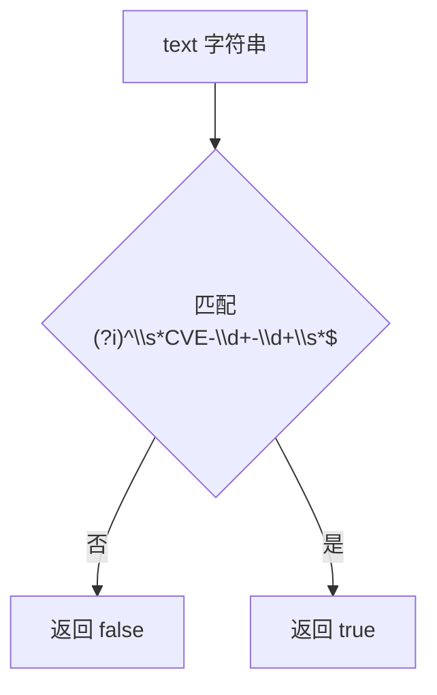

# IsCve 格式判断

:::tip 📂 查看源码
[`base.go:119`](https://github.com/scagogogo/cve-skills/blob/main/base.go#L119-L123) — 在 GitHub 上查看实现代码（第 119–123 行）。
:::

`IsCve` 判断字符串是否为严格 `CVE-YYYY-NNNNN` 形式的有效 CVE 标识符 —— 整个字符串（允许两侧空白字符）必须完全符合 CVE 模式。

:::tip 📌 场景
- 在表单或 CLI 参数输入后，验证用户提交的字符串是否为合法 CVE 格式
- 在解析逻辑（`Split`、`FormatSeq`、`ValidateCve`）执行前对非法输入做前置拦截
- 数据导入或 ETL 流程中的快速格式筛选
:::

## 函数签名

```go
func IsCve(text string) bool
```

## 参数

- `text` (string): 需要验证的字符串

## 返回值

- `bool`: 如果整个字符串符合 CVE 格式（允许两侧空白字符）则返回 `true`，否则返回 `false`

## 行为说明

- 使用预编译的正则表达式 `(?i)^\s*CVE-\d+-\d+\s*$` 进行匹配
- `(?i)` 表示大小写不敏感 —— `cve-2022-12345`、`CVE-2022-12345`、`CvE-2022-12345` 均通过
- `^\s*` 与 `\s*$` 允许首尾空白字符，因此 `" CVE-2022-12345 "` 是合法的
- `\d+-\d+` 要求年份与序列号均为数字 —— `CVE-2022-ABCD`、`CVE-2022-` 不通过
- 模式首尾锚定，CVE 周围任何多余的非空白字符都会导致返回 `false`（如 `"see CVE-2022-12345 here"` 返回 `false`）
- 仅做格式判断，不校验年份范围或序列号取值；完整的语义校验请使用 `ValidateCve`

## 流程图



## 示例

```go
package main

import (
	"fmt"

	"github.com/scagogogo/cve-skills"
)

func main() {
	testCases := []struct {
		input    string
		expected bool
		reason   string
	}{
		{"CVE-2022-12345", true, "标准格式"},
		{" CVE-2022-12345 ", true, "允许两侧空白字符"},
		{"cve-2022-12345", true, "小写也接受（大小写不敏感）"},
		{"CvE-2022-12345", true, "混合大小写也接受"},
		{"CVE-2022-1", true, "单数字序列号仍匹配模式"},
		{"包含CVE-2022-12345的文本", false, "前后有多余文本"},
		{"CVE-2022-ABCD", false, "序列号不是数字"},
		{"CVE-22-12345", false, "年份非4位数字（仍匹配 \\d+，见注意事项）"},
		{"2022-12345", false, "缺少 CVE 前缀"},
		{"CVE-2022-12345-extra", false, "序列号后有多余片段"},
		{"", false, "空字符串"},
	}

	for _, tc := range testCases {
		result := cve.IsCve(tc.input)
		status := "✅"
		if result != tc.expected {
			status = "❌"
		}
		fmt.Printf("%s %-30s -> %t  (%s)\n", status, tc.input, result, tc.reason)
	}

	// 解析前的典型前置校验
	userInput := " CVE-2021-44228 "
	if cve.IsCve(userInput) {
		fmt.Printf("已接受，标准化形式: %s\n", cve.Format(userInput))
	} else {
		fmt.Println("已拒绝：不是有效的 CVE 格式")
	}
}
```

## 使用场景

- 验证表单、API 参数或 CLI 参数中的用户输入
- 在解析逻辑（`Split`、`FormatSeq`、`ExtractCveYear`）执行前对非法输入做前置拦截
- 数据导入或 ETL 流程中的快速格式筛选
- 在更耗时的 `ValidateCve` 语义校验之前做快速预筛

## 注意事项

- `IsCve` 仅做**格式**判断，不校验年份是否在合理范围内、序列号是否为正整数；完整校验请使用 `ValidateCve`（格式 + 年份范围 + 正序列号）
- `\d+` 接受一位或多位数字，因此 `CVE-22-12345` 实际上能匹配正则，尽管 `22` 并非合理的 4 位年份 —— 年份范围校验由 `IsCveYearOk` / `ValidateCve` 负责
- 与 `IsContainsCve` 对比：`IsCve` 要求**整个**字符串就是 CVE（空白除外）；`IsContainsCve` 只检查字符串中**是否包含** CVE
- 正则表达式在 init 阶段预编译为包级变量 `exactCveRegex`，因此重复调用开销极低且并发安全
- 虽然允许两侧空白字符，但不会做归一化 —— 如需大写且去空格的标准形式，请调用 `Format`

## 内部实现

函数体只有一行，将全部工作委托给一个预编译的正则表达式：

- **单表达式委托（L121）**：`return exactCveRegex.MatchString(text)` —— 函数内部不做解析、去空格或分支判断。所有校验策略都集中在正则模式中，因此只要模式正确，函数本身就是正确的。
- **预编译包级变量**：`exactCveRegex` 在包加载时通过 `regexp.MustCompile` 一次性初始化，不会每次调用都重新编译。这使得每次 `IsCve` 调用只剩一次正则匹配，模式本身零分配开销。
- **并发安全**：`*regexp.Regexp` 的方法在官方文档中声明为并发安全，因此共享的包级变量可在多个 goroutine 中无锁调用。
- **锚定且大小写不敏感的模式**：模式 `(?i)^\s*CVE-\d+-\d+\s*$` 将 `(?i)` 标志（大小写不敏感）、`^...$` 锚点（整串匹配）和 `\s*` 填充（空白容忍）合并为一个表达式 —— L120 注释"允许两侧有空白字符，但是不允许有除空白字符以外的其他字符"完全由这些锚点实现。
- **无归一化副作用**：函数只返回 `bool`，绝不修改 `text`。需要标准形式的调用方须另行调用 `Format`，从而把"校验"与"变换"干净地分离。

## 复杂度

| 维度 | 开销 | 原因 |
|---|---|---|
| 时间 | O(n) | `MatchString` 对长度为 n 的输入串扫描一次；模式中无可回溯的量词 |
| 空间 | O(1) | 无与输入规模成比例的分配；正则状态机固定且跨调用复用 |
| 单次调用准备 | O(1) | 模式在 init 阶段预编译，每次调用只付出匹配成本 |

## 边界情形

| 输入 | 行为 | 返回 |
|---|---|---|
| `""`（空字符串） | `\s*` 可匹配空，但 `CVE-\d+-\d+` 无法匹配空 | `false` |
| `"   "`（纯空白） | `\s*` 消耗全部输入，CVE 主体无内容可匹配 | `false` |
| `" CVE-2022-12345 "` | `^\s*` 与 `\s*$` 吸收两侧空格，主体匹配 | `true` |
| `"cve-2022-12345"` / `"CvE-..."` | `(?i)` 使前缀大小写不敏感 | `true` |
| `"CVE-2022-1"` | `\d+` 接受单数字序列号 | `true` |
| `"CVE-22-12345"` | `\d+` 接受 `22` 作为年份（不强制 4 位） | `true` |
| `"CVE-2022-ABCD"` | `\d+` 无法匹配 `ABCD` | `false` |
| `"CVE-2022-"` | 第二个 `\d+` 至少需要一位数字 | `false` |
| `"see CVE-2022-12345 here"` | `^...$` 锚点拒绝任何周围非空白文本 | `false` |
| `"CVE-2022-12345-extra"` | 尾部 `-extra` 违反 `\s*$` | `false` |
| `"2022-12345"` | 缺少 `CVE-` 前缀 | `false` |

## 数据流

```text
+-------------------+
|  text: string     |
|  (调用方输入)     |
+---------+---------+
          |
          v
+-------------------+    init 阶段预编译
| exactCveRegex     | <- (?i)^\s*CVE-\d+-\d+\s*$
| (包级             |
|  *regexp.Regexp)  |
+---------+---------+
          |
          | MatchString(text)
          v
   +------+------+
   | 对 text 执行  |
   | 正则扫描      |
   +------+------+
          |
       匹配?
       /    \
     是      否
      |       |
      v       v
+-------+ +--------+
| true  | | false  |
+-------+ +--------+
          |
          v
   (调用方：在后续处理前
    使用 Format 做归一化)
```

## 相关函数

- [Format](/zh/api/functions/format) — 将 CVE 统一为大写、去空格的标准形式
- [IsContainsCve](/zh/api/functions/is-contains-cve) — 判断文本中是否包含 CVE
- [ValidateCve](/zh/api/functions/validate-cve) — 完整校验（格式 + 年份范围 + 正序列号）
- [IsCveYearOk](/zh/api/functions/is-cve-year-ok) — 校验年份是否在 1999 至当前年份之间
- [Split](/zh/api/functions/split) — 将 CVE 拆分为年份和序列号
- [格式化与验证分类](/zh/api/format-validate)
