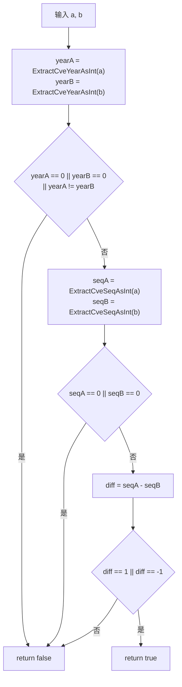

# IsCvesConsecutive 连续判断

:::tip 📂 查看源码
[`generate.go:207`](https://github.com/scagogogo/cve-skills/blob/main/generate.go#L207-L220) — 在 GitHub 上查看实现代码（第 207–220 行）。
:::

`IsCvesConsecutive` 判断两个 CVE 标识符是否连续 —— 即两者年份相同，且序列号差值恰好为 1。

:::tip 📌 场景
- 判断两个 CVE 是否可以合并为一个范围表达式
- 在已排序的 CVE 列表中检测连续性，识别相邻标识符
- 在用成对 CVE 拼接 `to` / `..` 范围串之前校验相邻关系
:::

## 函数签名

```go
func IsCvesConsecutive(a, b string) bool
```

## 参数

- `a` (string): 第一个 CVE 编号
- `b` (string): 第二个 CVE 编号

## 返回值

- `bool`: 若两个 CVE 年份相同且序列号差值为 1，则返回 `true`；否则返回 `false`

## 行为说明

- 通过 `ExtractCveYearAsInt` 提取两个 CVE 的年份；若任一年份为 `0`（输入无法解析）或两个年份不同，则返回 `false`
- 通过 `ExtractCveSeqAsInt` 提取两个 CVE 的序列号；若任一序列号为 `0`（输入无法解析），则返回 `false`
- 计算 `diff := seqA - seqB`，仅当 `diff == 1 || diff == -1` 时返回 `true` —— `a`、`b` 的传入顺序不影响结果
- 判定基于序列号差值的方向，但整体是对称的：`IsCvesConsecutive(a, b)` 等于 `IsCvesConsecutive(b, a)`
- 非法或格式错误的输入不会触发 panic —— 直接短路返回 `false`

## 流程图



## 示例

```go
package main

import (
	"fmt"

	"github.com/scagogogo/cve-skills"
)

func main() {
	pairs := []struct {
		a, b     string
		expected bool
		reason   string
	}{
		{"CVE-2022-12345", "CVE-2022-12346", true, "同年，序列号差值为 1"},
		{"CVE-2022-12346", "CVE-2022-12345", true, "顺序不影响结果"},
		{"CVE-2022-12345", "CVE-2022-12347", false, "序列号差值 > 1"},
		{"CVE-2022-12345", "CVE-2023-12345", false, "不同年份"},
		{"CVE-2022-12345", "CVE-2022-12345", false, "完全相同，差值为 0"},
		{"CVE-2022-12345", "not-a-cve", false, "第二个输入无法解析"},
		{"", "CVE-2022-12346", false, "第一个输入为空"},
	}

	for _, p := range pairs {
		result := cve.IsCvesConsecutive(p.a, p.b)
		status := "✅"
		if result != p.expected {
			status = "❌"
		}
		fmt.Printf("%s %-22s %-22s -> %t  (%s)\n", status, p.a, p.b, result, p.reason)
	}

	// 典型用法：判断一对 CVE 是否可写成范围
	a := "CVE-2022-12345"
	b := "CVE-2022-12346"
	if cve.IsCvesConsecutive(a, b) {
		fmt.Printf("%s 与 %s 连续 —— 可以写成范围\n", a, b)
	}
}
```

## 使用场景

- 判断两个 CVE 是否可以合并为一个范围表达式
- 在已排序的 CVE 列表中检测连续性，识别相邻标识符
- 在用成对 CVE 拼接 `to` / `..` 范围串之前校验相邻关系

## 注意事项

- 该函数只检查**相邻关系**（差值为 1），不处理一般排序 —— 对 `CVE-2022-12345` 和 `CVE-2022-12347` 即使同年也返回 `false`
- 相等不等于连续：`IsCvesConsecutive("CVE-2022-12345", "CVE-2022-12345")` 返回 `false`（差值为 0）
- 它依赖 `ExtractCveYearAsInt` 和 `ExtractCveSeqAsInt`，因此提取失败（年份或序列号为 `0`）的输入会返回 `false`，而非报错
- 若要展开多于两个 CVE 的范围，请改用 `ParseCveRange` —— `IsCvesConsecutive` 仅用于成对场景

## 内部实现

函数体（`generate.go` L207–L220）由一连串「守卫—计算」步骤组成，针对两个 CVE 字符串依次推进：

- **年份提取（L208–L209）：** 调用 `ExtractCveYearAsInt(a)` 与 `ExtractCveYearAsInt(b)`，将每个 CVE 的年份解析为 `int`。年份是第一道守卫，因为年份不一致即可排除连续性 —— 不同年份的两个 CVE 绝不可能是相邻的。
- **年份守卫（L210–L212）：** 若任一年份为 `0`（解析失败 → 输入无法解析）或两个年份不同，则返回 `false`。这个三段条件把「输入非法」与「年份不同」合并为一次短路，避免无谓的序列号解析。
- **序列号提取（L213–L214）：** 仅当年份守卫通过后才调用 `ExtractCveSeqAsInt(a)` 与 `ExtractCveSeqAsInt(b)`。延后这两个调用带来一点效率收益：年份非法的输入完全不必承担解析序列号的开销。
- **序列号守卫（L215–L217）：** 若任一序列号为 `0` 则返回 `false`。它与年份守卫对称，确保后续减法作用于两个有效数字，使 `diff` 有意义。
- **差值判断（L218–L219）：** 计算 `diff := seqA - seqB`，仅当 `diff == 1 || diff == -1` 时返回 `true`。用带符号差值配合双分支比较使谓词对称 —— `a` 与 `b` 的传入顺序可任意交换。

设计意图是 fail-safe：所有非法或非相邻的情形都收敛为单一的 `false` 返回，既不 panic 也不返回 error，因此可安全地用在过滤器与排序比较器内部。

## 复杂度

该函数将解析工作委托给 `ExtractCveYearAsInt` / `ExtractCveSeqAsInt`，其自身逻辑为常数时间；下表反映源码层面的开销。

| 维度 | 开销 | 原因 |
|---|---|---|
| 时间 | O(n) | 每次 `Extract*AsInt` 调用扫描 CVE 字符串一次（长度为 n）以定位并解析年份/序列号字段；每个参数至多扫描两次 |
| 空间 | O(1) | 只分配少量 `int` 局部变量（`yearA`、`yearB`、`seqA`、`seqB`、`diff`），不构造切片或 map |
| 调用 | 4 次解析 + 1 次减法 | 两次年份解析、两次序列号解析、一次 `int` 减法 —— 无循环、无排序 |

## 边界情形

| 输入 | 行为 | 返回 |
|---|---|---|
| `("", "CVE-2022-12346")` 或任一为空串 | 年份解析得 `0`，触发年份守卫 | `false` |
| `("not-a-cve", "CVE-2022-12346")` | 第一个参数无法解析 → 年份为 `0` | `false` |
| `("CVE-2022-12345", "CVE-2023-12345")` | 年份不同 → 触发年份守卫 | `false` |
| `("CVE-2022-12345", "CVE-2022-12345")` | 同年、序列号相同 → `diff == 0` | `false` |
| `("CVE-2022-12345", "CVE-2022-12347")` | 同年、`diff == -2` → 非 ±1 | `false` |
| `("CVE-2022-12345", "CVE-2022-12346")` | 同年、`diff == -1` | `true` |
| `("CVE-2022-12346", "CVE-2022-12345")` | 同年、`diff == 1`（顺序交换） | `true` |
| 小写 `("cve-2022-12345", ...)` | 行为取决于 `ExtractCveYearAsInt`；若其接受小写则结果成立，否则解析失败返回 `false` | 取决于解析器 |
| 序列号带前导零（`CVE-2022-00001`） | 解析器按数值部分正常解析，以整数比较 | 取决于解析值 |

## 数据流

```text
+----------------------+   +----------------------+
| 输入 a (string)      |   | 输入 b (string)      |
+----------+-----------+   +----------+-----------+
           |                          |
           v                          v
   +-----------------------+   +-----------------------+
   | ExtractCveYearAsInt(a)|   | ExtractCveYearAsInt(b)|
   | -> yearA (int)        |   | -> yearB (int)        |
   +-----------+-----------+   +-----------+-----------+
               |                           |
               +-------------+-------------+
                             |
                             v
              +------------------------------+
              | yearA==0||yearB==0||yearA!=yearB|
              +--------------+---------------+
                  | 是             | 否
                  v                 v
            return false   +----------------------------+
                          | ExtractCveSeqAsInt(a)      |
                          | ExtractCveSeqAsInt(b)      |
                          | -> seqA, seqB (int)        |
                          +-------------+--------------+
                                        |
                                        v
                          +------------------------------+
                          | seqA==0 || seqB==0 ?        |
                          +--------------+---------------+
                              | 是            | 否
                              v                v
                        return false   +----------------------+
                                       | diff := seqA - seqB   |
                                       +----------+-----------+
                                                  |
                                                  v
                                    +-----------------------------+
                                    | diff == 1 || diff == -1 ?  |
                                    +---------+---------+---------+
                                      | 是          | 否
                                      v              v
                                return true    return false
```

## 相关函数

- [ParseCveRange](/zh/api/functions/parse-cve-range) — 将范围表达式展开为区间内所有 CVE
- [ExtractCveYearAsInt](/zh/api/functions/extract-cve-year-as-int) — 以整数形式提取 CVE 的年份
- [ExtractCveSeqAsInt](/zh/api/functions/extract-cve-seq-as-int) — 以整数形式提取 CVE 的序列号
- [IsCve](/zh/api/functions/is-cve) — 校验字符串是否为格式合法的 CVE
- [范围与模式分类](/zh/api/range-pattern)
