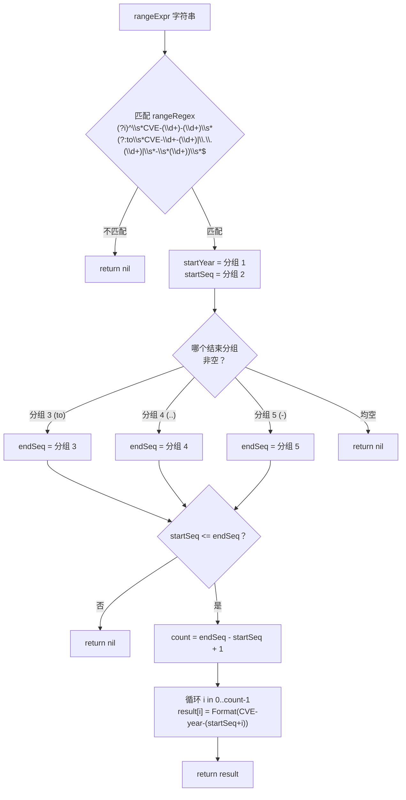

# ParseCveRange 范围解析

:::tip 📂 查看源码
[`generate.go:143`](https://github.com/scagogogo/cve-skills/blob/main/generate.go#L143-L180) — 在 GitHub 上查看实现代码（第 143–180 行）。
:::

`ParseCveRange` 解析 CVE 范围表达式，返回该范围内的所有 CVE 编号切片。

:::tip 📌 场景
- 将安全公告中以范围形式书写的一连串 CVE 展开为显式列表，便于批量处理
- 把不同数据源中各式各样的范围写法（`to`、`..`、`-`）统一归一化为一个规范列表
- 构建连续的 CVE 数据集，用于扫描、去重或报表
:::

## 函数签名

```go
func ParseCveRange(rangeExpr string) []string
```

## 参数

- `rangeExpr` (string)：待解析的 CVE 范围表达式。支持三种写法：`CVE-YYYY-NNNNN to CVE-YYYY-NNNNN`、`CVE-YYYY-NNNNN..NNNNN`、`CVE-YYYY-NNNNN-NNNNN`

## 返回值

- `[]string`：闭区间 `[start, end]` 内所有 CVE 编号的切片，每项均为标准化的大写形式。当表达式不匹配任何受支持的写法或范围无效时返回 `nil`

## 行为说明

- 匹配由预编译的 `rangeRegex` 驱动：`(?i)^\s*CVE-(\d+)-(\d+)\s*(?:to\s*CVE-\d+-(\d+)|\.\.(\d+)|\s*-\s*(\d+))\s*$`
- `(?i)` 使匹配大小写不敏感，并允许首尾空白
- 年份仅取自**起始**段 —— 默认起始与结束同年；结束段的年份不会与起始段做一致性校验
- 结束序列号从实际命中的那个分支读取：`to` 分组、`..` 分组或 `-` 分组
- 当 `startSeq > endSeq` 时范围无效，函数返回 `nil`
- 范围为**闭区间** —— 起始与结束两个 CVE 均包含在内，共产生 `endSeq - startSeq + 1` 项
- 每个生成的 CVE 都会经过 `Format` 处理，结果始终为大写且已去除首尾空白

## 流程图



## 示例

```go
package main

import (
	"fmt"

	"github.com/scagogogo/cve-skills"
)

func main() {
	// 1) "to" 写法 —— 闭区间，两端均包含
	cves1 := cve.ParseCveRange("CVE-2022-12345 to CVE-2022-12350")
	fmt.Printf("to 写法   -> %v (len=%d)\n", cves1, len(cves1))
	// Output: [CVE-2022-12345 CVE-2022-12346 CVE-2022-12347 CVE-2022-12348 CVE-2022-12349 CVE-2022-12350] (len=6)

	// 2) 双点号写法 —— 结束仅给出序列号
	cves2 := cve.ParseCveRange("CVE-2022-12345..12347")
	fmt.Printf("点号写法  -> %v (len=%d)\n", cves2, len(cves2))
	// Output: [CVE-2022-12345 CVE-2022-12346 CVE-2022-12347] (len=3)

	// 3) 连字符写法 —— 结束仅给出序列号
	cves3 := cve.ParseCveRange("CVE-2022-12345-12347")
	fmt.Printf("连字符写法-> %v (len=%d)\n", cves3, len(cves3))
	// Output: [CVE-2022-12345 CVE-2022-12346 CVE-2022-12347] (len=3)

	// 4) 单元素范围 —— 起始等于结束，返回一项
	cves4 := cve.ParseCveRange("CVE-2022-12345 to CVE-2022-12345")
	fmt.Printf("单元素范围-> %v (len=%d)\n", cves4, len(cves4))
	// Output: [CVE-2022-12345] (len=1)

	// 5) 无效：startSeq > endSeq -> nil
	cves5 := cve.ParseCveRange("CVE-2022-12350 to CVE-2022-12345")
	fmt.Printf("反向范围  -> %v (len=%d)\n", cves5, len(cves5))
	// Output: [] (len=0)

	// 6) 无效：不支持的写法 -> nil
	cves6 := cve.ParseCveRange("CVE-2022-12345~12347")
	fmt.Printf("错误写法  -> %v (len=%d)\n", cves6, len(cves6))
	// Output: [] (len=0)

	// 7) 大小写不敏感，允许首尾空白
	cves7 := cve.ParseCveRange("  cve-2022-1000 to CVE-2022-1003  ")
	fmt.Printf("宽松格式  -> %v (len=%d)\n", cves7, len(cves7))
	// Output: [CVE-2022-1000 CVE-2022-1001 CVE-2022-1002 CVE-2022-1003] (len=4)
}
```

## 使用场景

- 将安全公告中的 CVE 范围展开为显式列表，用于批量校验或扫描
- 把来自多个数据源的异构范围写法（`to` / `..` / `-`）归一化为一个规范切片
- 构建连续的 CVE 数据集，用于去重、缺口检测或报表
- 在把每项交给 `ValidateCve` 做完整语义校验之前，先把范围物化为显式列表

## 注意事项

- 返回切片为**闭区间** —— 两端均包含，长度为 `endSeq - startSeq + 1`
- 仅捕获并复用起始年份；函数**不会**校验 `to` 写法中结束段的年份是否与起始段一致，请在 `to` 表达式两侧始终使用同一年份
- 连字符写法 `CVE-YYYY-NNNNN-NNNNN` 与"带有额外片段的单个 CVE"存在歧义 —— `rangeRegex` 通过要求尾部分组为纯数字来消解，但当输入来源本身有歧义时仍需谨慎
- 任何失败情形均返回 `nil`（而非非 nil 的空切片）：正则不匹配、无结束分组、结束分组非数字、或 `startSeq > endSeq`。因此 `nil` 返回值的长度为 0，但与成功解析出的单元素切片含义不同
- 大范围（例如横跨数万个序列号）会分配与之成正比的切片，解析不可信输入前请先校验上界
- 若只需判断两个 CVE 是否相邻而非展开整个范围，请使用 `IsCvesConsecutive`

## 内部实现

该函数是一个基于预编译 `rangeRegex` 的单趟、分配有界的解析器。设计意图是用一条正则同时接纳三种写法，而非写三个独立解析器，然后在一次性预分配的切片中物化闭区间。

- **正则分发（L144）。** `matches := rangeRegex.FindStringSubmatch(rangeExpr)` 对锚定模式 `(?i)^\s*CVE-(\d+)-(\d+)\s*(?:to\s*CVE-\d+-(\d+)|\.\.(\d+)|\s*-\s*(\d+))\s*$` 执行一次。交替分支 `(?:to…|…|…)` 会将结束序列号恰好捕获到第 3/4/5 组中的某一组，于是三种写法被归约为"哪个分组非空"。`FindStringSubmatch` 在不匹配时返回 `nil`，这是 L145-147 的第一个出口。
- **起始段解析（L150-154）。** `startYear` 保留为第 1 组的原始字符串，`startSeq` 则用 `strconv.Atoi(matches[2])` 解析。解析出错（例如超长数字串溢出）时返回 `nil`，而非 panic。
- **结束段选择（L157-167）。** 一个带三个 `case` 分支的 `switch` 依次检查 `matches[3]`、`matches[4]`、`matches[5]`，从首个非空分组取 `endSeq`。`default` 分支返回 `nil` —— 这是对"结构上匹配但（防御性地）没有任何结束分组命中"情形的兜底；正则使得该路径在实践中不可达，但保证编译器认定 `endSeq` 已被定义。
- **边界校验（L168-170）。** 合并的单点判断 `if err != nil || startSeq > endSeq { return nil }` 同时拒绝非数字的结束分组与反向范围。注意结束段的年份从不与 `startYear` 比较 —— `to` 写法中的结束年份虽被正则捕获但被丢弃。
- **物化（L172-178）。** `count := endSeq - startSeq + 1` 用 `make([]string, count)` 预分配切片，随后循环对 `i` in `0..count-1` 写入 `result[i] = Format(fmt.Sprintf("CVE-%d-%d", year, startSeq+i))`。由于 `year` 由 `strconv.Atoi(startYear)` 在 L174 转换一次、格式串每轮重建，每个条目都经 `Format` 规范为大写且去空白。不存在 `sort` 步骤，也不存在 map/去重 —— 闭区间按构造即单调。

## 复杂度

| 维度 | 开销 | 驱动因素 |
|---|---|---|
| 时间（正则） | O(n) | `FindStringSubmatch` 对 `rangeRegex` 扫描输入一次；n = `len(rangeExpr)` |
| 时间（解析） | O(1) | 对捕获的数字分组执行两次 `strconv.Atoi` |
| 时间（构造） | O(count) | 一轮 `count = endSeq - startSeq + 1` 次循环，每次一个 `Sprintf` + `Format` |
| 时间（合计） | O(n + count) | 与输入长度加输出规模成线性 |
| 空间 | O(count) | `make([]string, count)` 及返回的 `[]string`；匹配切片仅含 O(1) 个分组且生命周期短 |
| 分配 | count + 开销 | 一个底层数组切片，外加每轮一次临时字符串（`Format` 之前的 `Sprintf` 中间产物） |

由于没有 `sort`、没有 map，渐近下界完全由输出规模决定 —— 跨度为 `k` 的范围耗时与占用均为 O(k)。

## 边界情形

| 输入 | 行为 | 返回 |
|---|---|---|
| `""`（空） | 锚定正则 `^\s*…\s*$` 不匹配空串或纯空白串 | `nil` |
| `"CVE-2022-12345~12347"` | `~` 不属于 `to` / `..` / `-`；无交替分支命中 | `nil` |
| `"CVE-2022-12350 to CVE-2022-12345"` | 两组均可解析，但 `startSeq (12350) > endSeq (12345)` | `nil` |
| `"cve-2022-1000 to cve-2022-1003"` | `(?i)` 使匹配大小写不敏感；输出经 `Format` 重新大写 | `[CVE-2022-1000 … CVE-2022-1003]`（4 项） |
| `"  CVE-2022-1000 to CVE-2022-1002  "` | 首尾空白由 `\s*` 容忍 | `[CVE-2022-1000 CVE-2022-1001 CVE-2022-1002]`（3 项） |
| `"CVE-2022-12345 to CVE-2022-12345"` | 闭区间且 `startSeq == endSeq`，`count = 1` | `[CVE-2022-12345]`（1 项） |
| `"CVE-2022-12345..12347"` | `..` 分组（4）命中；结束年份隐式取自起始 | `[CVE-2022-12345 CVE-2022-12346 CVE-2022-12347]` |
| `"CVE-2022-12345-12347"` | `-` 分组（5）命中；与"多段单 CVE"有歧义，但由"尾部分组须为纯数字"消解 | `[CVE-2022-12345 CVE-2022-12346 CVE-2022-12347]` |
| `"CVE-2022-12345 to CVE-2023-12347"`（跨年） | 结束年份（2023）被正则捕获但**被忽略**；仅使用 `startYear`（2022） | `[CVE-2022-12345 … CVE-2022-12347]`（全部盖 2022） |
| 超大跨度（如 `1..99999999`） | `count` 极大；`make` 按比例分配，可能耗尽内存 | 长度为 `count` 的 `[]string`，或 OOM |

## 数据流

```text
+--------------------------+
| rangeExpr (string)       |
|  例 "CVE-2022-1000       |
|      to CVE-2022-1003"   |
+-----------+--------------+
            |
            v
+--------------------------+        不匹配
| rangeRegex.FindStringSub |-------------------> return nil
| match（分组 1..5）       |
+-----------+--------------+
            | 匹配成功
            v
+--------------------------+
| startYear = 分组 1       |
| startSeq  = Atoi(分组 2) |   err -> return nil
+-----------+--------------+
            |
            v
+--------------------------+
| switch：首个非空的       |   均空  -> return nil
| 分组 3 / 4 / 5           |
| -> endSeq                |
+-----------+--------------+
            |
            v
+--------------------------+
| 校验：err || startSeq >  |   失败  -> return nil
| endSeq                   |
+-----------+--------------+
            | 通过
            v
+--------------------------+
| count = endSeq-startSeq+1|
| result = make([]string,  |
|            count)        |
+-----------+--------------+
            |
            v
+--------------------------+
| for i in 0..count-1:     |
|   result[i] =            |
|     Format(Sprintf(      |
|       "CVE-%d-%d",       |
|        year, startSeq+i))|
+-----------+--------------+
            |
            v
+--------------------------+
| return result            |
|  [CVE-2022-1000,         |
|   CVE-2022-1001,         |
|   CVE-2022-1002,         |
|   CVE-2022-1003]         |
+--------------------------+
```

## 相关函数

- [Format](/zh/api/functions/format) —— 将每个生成的 CVE 标准化为大写、去空白的形式
- [GenerateCve](/zh/api/functions/generate-cve) —— 根据年份和序列号生成单个 CVE
- [IsCvesConsecutive](/zh/api/functions/is-cves-consecutive) —— 判断两个 CVE 是否在同一年份且相邻
- [ExtractCveSeqAsInt](/zh/api/functions/extract-cve-seq-as-int) —— 将序列号提取为整数
- [范围与模式分类](/zh/api/range-pattern)
