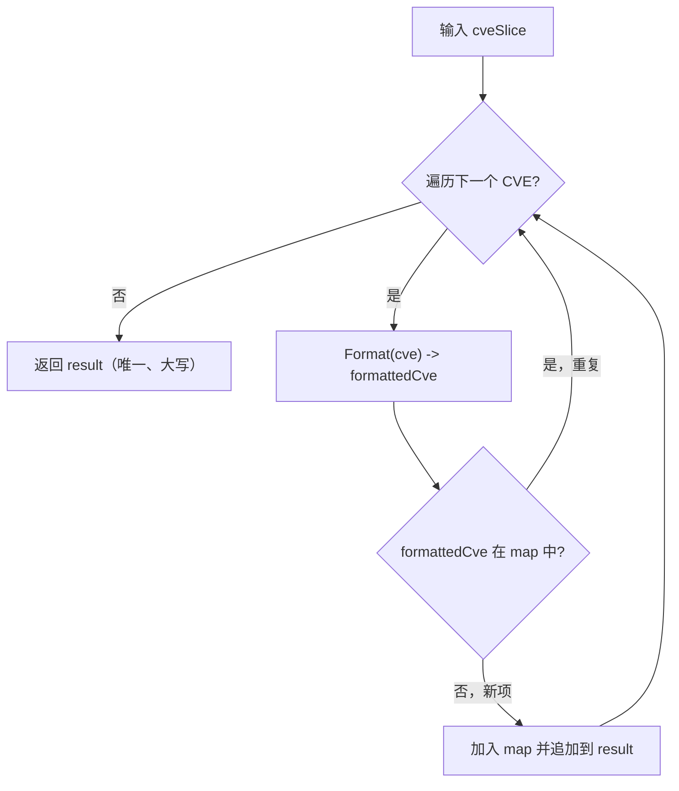

# RemoveDuplicateCves 去重

:::tip 📂 查看源码
[`filter.go:401`](https://github.com/scagogogo/cve-skills/blob/main/filter.go#L401-L415) — 在 GitHub 上查看实现代码（第 401–415 行）。
:::

`RemoveDuplicateCves` 移除切片中重复的 CVE 编号，只保留唯一的 CVE 编号 —— 比较不区分大小写，所有返回的 CVE 均为标准化的大写格式。

:::tip 📌 场景
- 合并来自多个来源（扫描器、公告、工单）的 CVE 列表并去重
- 在对大量 CVE 数据进行聚合、统计或生成报告前做预处理
- 将大小写混用的输入（`cve-2022-1111` 与 `CVE-2022-1111`）归一化为单一、规范且无重复的列表
:::

## 函数签名

```go
func RemoveDuplicateCves(cveSlice []string) []string
```

## 参数

- `cveSlice` ([]string)：可能包含重复项的 CVE 编号数组

## 返回值

- []string：去重后的 CVE 编号数组，所有 CVE 均为标准化格式（大写）

## 行为说明

- 比较不区分大小写：`CVE-2022-1111` 与 `cve-2022-1111` 被视为重复
- 只保留每个 CVE 的第一次出现，后续重复项被丢弃
- 每个返回的 CVE 都经过 `Format` 处理，因此输出统一为大写（且去除首尾空白）
- 内部用 `map[string]struct{}` 记录已见的标准化形式 —— 查询为 O(1)，整体时间复杂度为 O(n)
- 空切片或 nil 输入不会引发 panic，`result` 切片保持为空

## 流程图



## 示例

```go
package main

import (
	"fmt"

	"github.com/scagogogo/cve-skills"
)

func main() {
	// filter.go 中的源码示例：
	//   输入: ["CVE-2022-1111", "cve-2022-1111", "CVE-2022-2222"]
	//   输出: ["CVE-2022-1111", "CVE-2022-2222"]
	cveList := []string{"CVE-2022-1111", "cve-2022-1111", "CVE-2022-2222"}
	uniqueCves := cve.RemoveDuplicateCves(cveList)
	// uniqueCves 为 ["CVE-2022-1111", "CVE-2022-2222"]
	fmt.Println(uniqueCves)

	// filter.go 中全重复的用例：
	//   输入: ["CVE-2022-1111", "CVE-2022-1111", "CVE-2022-1111"]
	//   输出: ["CVE-2022-1111"]
	allDup := []string{"CVE-2022-1111", "CVE-2022-1111", "CVE-2022-1111"}
	fmt.Println(cve.RemoveDuplicateCves(allDup))
	// -> [CVE-2022-1111]

	// 大小写混用 + 顺序：只保留第一次出现，输出为大写
	mixed := []string{"cve-2021-44228", "CVE-2021-44228", "CvE-2021-44228", "CVE-2022-12345"}
	fmt.Println(cve.RemoveDuplicateCves(mixed))
	// -> [CVE-2021-44228 CVE-2022-12345]

	// 汇报前合并多个来源
	scanner := []string{"CVE-2022-1111", "cve-2022-3333"}
	advisory := []string{"CVE-2022-2222", "cve-2022-1111"}
	merged := append(scanner, advisory...)
	fmt.Println(cve.RemoveDuplicateCves(merged))
	// -> [CVE-2022-1111 CVE-2022-3333 CVE-2022-2222]
}
```

## 使用场景

- 合并来自多个来源（扫描器输出、安全公告、内部工单）的 CVE 列表并去重
- 在对大量 CVE 数据进行聚合、统计或生成报告前做预处理
- 在进一步过滤前，将大小写混用的输入归一化为单一、规范且无重复的列表

## 注意事项

- 去重**不区分大小写**，因为每个 CVE 在 map 查询前都先经 `Format` 归一化 —— `cve-2022-1111` 与 `CVE-2022-1111` 合并为一项
- **第一次出现者胜出**，后续重复项被静默丢弃，因此首次出现的相对顺序被保留
- 时间复杂度为 O(n)，n 为数组长度；空间复杂度为 O(n)（已见集合与结果切片）
- 输出始终为大写，因为 `Format` 会大写化结果 —— 如需排序输出，可搭配 `SortCves`
- 本函数**不**对结果排序；如需排序且去重的输出，请使用将去重与排序合并的集合运算辅助函数
- 此函数不会过滤无效的 CVE 字符串 —— 它们会像其他条目一样经 `Format` 处理并去重；如需丢弃格式错误的输入，请先用 `ValidateCves` 校验

## 内部实现

该函数是一个基于 map 已见集合的单遍去重循环，结构紧凑。关键代码点见 [`filter.go:401`](https://github.com/scagogogo/cve-skills/blob/main/filter.go#L401-L415)：

- **已见集合分配**（`cveMap := make(map[string]struct{})`，L402）：`map[string]struct{}` 记录已发出的每一个标准化 CVE。`struct{}` 不占存储，因此该 map 是一个纯粹的「存在性集合」—— 这是 Go 中实现 O(1) 成员判定的惯用写法，且避免了 `map[string]bool` 的内存开销。
- **结果累加器**（`var result []string`，L403）：一个 nil 切片，通过 `append` 增长。由于仅在遇到新 CVE 时才写入，`result` 最终恰好按首次出现顺序为每个唯一 CVE 保留一条 —— 无需事后压缩。
- **边界处的归一化**（`formattedCve := Format(cve)`，L406）：每个 CVE 在 map 查询前都先经过 `Format` 处理。这正是去重不区分大小写的根源 —— `cve-2022-1111`、`CvE-2022-1111` 与 `CVE-2022-1111` 都坍缩为同一个 map 键 `CVE-2022-1111`，因此被正确识别为同一条目。
- **先查后插**（`if _, exists := cveMap[formattedCve]; !exists`，L407）：comma-ok 惯用法先判定是否已存在；仅当未命中时才写入 map（`cveMap[formattedCve] = struct{}{}`，L408）并将标准化形式追加到 `result`（L409）。命中时循环体为空操作，后续重复项被静默丢弃。
- **保序性**：由于遍历按输入顺序、写入又只发生在首次出现时，返回切片保留了首次出现的相对顺序。注意本函数**不**调用 `sort.Slice` —— 如需排序输出，请搭配 `SortCves`。

## 复杂度

| 维度 | 界 | 依据（源码注释） |
|---|---|---|
| 时间 | O(n) | 对 n 元素的 `cveSlice` 做一次线性扫描；每轮一次 `Format` 调用加一次摊还 O(1) 的 map 查询/插入。 |
| 空间 | O(n) | 最坏情况（全部唯一）下，`cveMap` 已见集合与 `result` 切片各持 n 条。 |
| 辅助 | O(n) | 已见集合与结果切片均随*唯一*输入数（≤ n）增长。 |

源码注释 L388-L390 明确记载了这两个界：时间 `O(n)`、空间 `O(n)`。

## 边界情形

| 输入 | 行为 | 返回 |
|---|---|---|
| `nil` 切片 | 循环体不执行；`result` 保持 nil | `[]string{}`（nil，长度 0） |
| 空切片 `[]string{}` | 零次迭代 | `[]string{}`（nil，长度 0） |
| 全部唯一、单种大小写 `["CVE-2022-1111", "CVE-2022-2222"]` | 每个都未命中 → 全部追加 | `["CVE-2022-1111", "CVE-2022-2222"]`（保留顺序） |
| 全部重复 `["CVE-2022-1111", "CVE-2022-1111", "CVE-2022-1111"]` | 首个追加，其余命中 map → 丢弃 | `["CVE-2022-1111"]` |
| 大小写混用重复 `["cve-2022-1111", "CVE-2022-1111"]` | 二者 `Format` 后均为 `CVE-2022-1111`；第二个命中 | `["CVE-2022-1111"]`（大写，首形被归一化） |
| 无效字符串 `"not-a-cve"` | 原样经 `Format` 处理并像其他条目一样去重 | `Format` 的结果，已去重 |
| 含首尾空白 `" CVE-2022-1111 "` | `Format` 在查询前去除首尾空白 | `["CVE-2022-1111"]` |

## 数据流

```text
+--------------------------+      +---------------------------+
| 输入 cveSlice []string   |      | cveMap map[string]struct{}|
| 如 ["CVE-2022-1111",     |      | (已见集合，初始为空)       |
|      "cve-2022-1111",    |      +---------------------------+
|      "CVE-2022-2222"]    |                  ^
+-----------+--------------+                  |
            |                                 |
            v                                 |
   +-------------------+                      |
   | 遍历 cveSlice 中  |                      |
   |   的每个 cve      |                      |
   +---------+---------+                      |
             |                                 |
             v                                 |
   +-------------------+                      |
   | Format(cve)       |  "cve-2022-1111"     |
   | -> formattedCve   |---> "CVE-2022-1111"  |
   +---------+---------+                      |
             |                                 |
             v                                 |
   +---------------------------+               |
   | formattedCve 在 cveMap 中?|               |
   +-----+---------------+-----+               |
        |               |                     |
   是   |               | 否（新项）          |
        v               v                     |
   +-----------+   +-----------------------+   |
   | 丢弃，进入 |   | cveMap[fmt]=struct{} |---+
   | 下一轮     |   | result=append(result,|
   +-----------+   |              fmt)    |
                   +-----------+-----------+
                               |
                               v
                   +-------------------------+
                   | 返回 result []string    |
                   | (唯一、大写、           |
                   |  按首次出现顺序)        |
                   +-------------------------+
```

## 相关函数

- [Format](/zh/api/functions/format) —— 将单个 CVE 标准化为大写、去首尾空白的形式（内部使用）
- [ValidateCves](/zh/api/functions/validate-cves) —— 在去重前过滤掉无效的 CVE 条目
- [SortCves](/zh/api/functions/sort-cves) —— 按升序对 CVE 排序
- [集合运算分类](/zh/api/set-operations)
