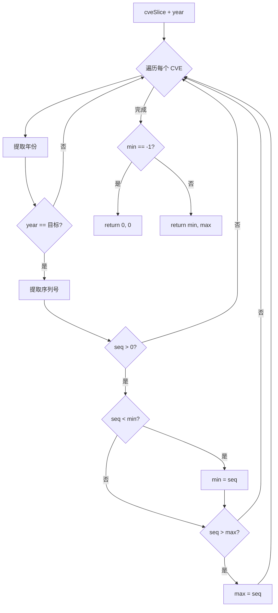

# SeqRange 序列号范围

:::tip 📂 查看源码
[`filter.go:532`](https://github.com/scagogogo/cve-skills/blob/main/filter.go#L532-L555) — 在 GitHub 上查看实现代码（第 532–555 行）。
:::

`SeqRange` 返回指定年份下 CVE 序列号的最小值和最大值，用于了解某一年 CVE 编号的分配范围。

:::tip 📌 场景
- 了解某个年份 CVE 编号的分配范围
- 为估算 CVE 密度提供辅助信息
- 在年度安全报告中汇总已分配编号的跨度
:::

## 函数签名

```go
func SeqRange(cveSlice []string, year int) (min, max int)
```

## 参数

- `cveSlice` ([]string): 待检查的 CVE 编号数组
- `year` (int): 目标年份，如 `2022`

## 返回值

- `min` (int): 该年份下的最小序列号；若未找到匹配的 CVE 则返回 `0`
- `max` (int): 该年份下的最大序列号；若未找到匹配的 CVE 则返回 `0`

## 行为说明

- 遍历 `cveSlice`，仅保留年份（通过 `ExtractCveYearAsInt` 提取）等于目标 `year` 的 CVE
- 对每个匹配的 CVE，通过 `ExtractCveSeqAsInt` 提取序列号；序列号 `<= 0` 的条目会被跳过
- 跟踪遇到的最小和最大有效序列号
- `min` 初始化为 `-1` 作为哨兵值；若未找到任何有效序列号，则 `min` 和 `max` 均返回 `0`
- 输入的大小写和首尾空格由底层提取器处理 —— `cve-2022-1111` 和 `" CVE-2022-1111 "` 与 `CVE-2022-1111` 等价

## 流程图



## 示例

```go
package main

import (
	"fmt"

	"github.com/scagogogo/cve-skills"
)

func main() {
	// 源码示例 1：混合年份，返回 2022 年的序列号范围
	list1 := []string{"CVE-2022-1111", "CVE-2022-5555", "CVE-2022-3333", "CVE-2021-9999"}
	minSeq, maxSeq := cve.SeqRange(list1, 2022)
	fmt.Printf("2022 seq range: min=%d, max=%d\n", minSeq, maxSeq)
	// Output: 2022 seq range: min=1111, max=5555

	// 源码示例 2：无 CVE 匹配目标年份，返回 0, 0
	list2 := []string{"CVE-2022-1111"}
	minSeq2, maxSeq2 := cve.SeqRange(list2, 2023)
	fmt.Printf("2023 seq range: min=%d, max=%d\n", minSeq2, maxSeq2)
	// Output: 2023 seq range: min=0, max=0

	// 不区分大小写、容忍首尾空格的输入
	list3 := []string{"cve-2022-2222", " CVE-2022-8888 ", "CVE-2022-1"}
	minSeq3, maxSeq3 := cve.SeqRange(list3, 2022)
	fmt.Printf("2022 seq range (mixed case/whitespace): min=%d, max=%d\n", minSeq3, maxSeq3)
	// Output: 2022 seq range (mixed case/whitespace): min=1, max=8888

	// 空输入返回 0, 0
	minSeq4, maxSeq4 := cve.SeqRange([]string{}, 2022)
	fmt.Printf("empty input: min=%d, max=%d\n", minSeq4, maxSeq4)
	// Output: empty input: min=0, max=0
}
```

## 使用场景

- 了解某个年份 CVE 序列号的分配范围
- 为估算某年内 CVE 密度提供辅助信息
- 在年度安全报告中汇总已分配 CVE 编号的跨度

## 注意事项

- 返回值 `0, 0` 存在歧义：既可能表示"无匹配 CVE"，也可能表示"输入为空切片" —— 如需区分，请先检查切片长度
- 仅提取年份**精确等于** `year` 的 CVE；其他年份的 CVE 会被静默跳过
- 序列号非正（`<= 0`）的条目会被跳过，因此格式异常的编号不会扭曲范围
- 该函数**不**统计落在范围内的 CVE 数量 —— 计数请用 `CountByYear`，跨整个切片的年份级最小/最大值请用 `YearRange`
- 这是一个只读检查；不会对输入排序、去重或格式化

## 内部实现

- **哨兵初始化**：`min` 被设为 `-1`（第 533 行）作为哨兵值，表示"尚未见到任何有效序列号"；`max` 通过命名返回值默认为 `0`。这一组合让函数无需额外布尔标志即可识别"无匹配"的情形。
- **单趟线性扫描**：`for _, cve := range cveSlice` 循环（第 534 行）只遍历切片一次。年份过滤先通过 `ExtractCveYearAsInt`（第 535 行）完成，不匹配时立即 `continue`（第 536–538 行），因此非目标年份在执行任何序列号工作之前就被跳过。
- **防御性序列号校验**：`ExtractCveSeqAsInt`（第 539 行）提取序列号，`seq <= 0` 的条目会被跳过（第 540–542 行）。这能防止格式异常或零/负序列号污染范围。
- **内联最小/最大值跟踪**：第一个有效序列号替换 `-1` 哨兵（`min == -1 || seq < min`，第 543–545 行）；后续值仅在更大时更新 `max`（第 546–548 行）。两次比较在同一趟中完成 —— 无需额外排序或二次扫描。
- **哨兵归一化**：循环结束后，若 `min` 仍为 `-1`（第 551 行），函数返回 `0, 0`（第 552 行）将"无匹配"输出归一化；否则返回已跟踪的 `min, max`（第 554 行）。

## 复杂度

| 维度 | 复杂度 | 依据 |
|---|---|---|
| 时间 | O(n) | 单趟遍历切片；每个元素做常数时间的年份/序列号提取与比较 |
| 空间 | O(1) | 仅分配 `min`、`max` 及循环局部变量 `cveYear`/`seq` —— 无额外集合 |
| 单元素开销 | 平均 O(1) | `ExtractCveYearAsInt` 与 `ExtractCveSeqAsInt` 各扫描定长 CVE 字符串 |

- 函数刻意避免排序（否则为 O(n log n)），因为最小/最大值可在遍历中同步跟踪。
- 当切片包含多个年份的 CVE 时，非匹配条目的有效开销仍为 O(1) —— 年份检查在序列号提取产生实质影响前即短路返回。

## 边界情形

| 输入 | 行为 | 返回 |
|---|---|---|
| 空切片 `[]string{}` | 循环体不执行；`min` 保持 `-1` | `0, 0` |
| 无 CVE 匹配目标年份 | 所有条目在年份检查处 `continue` | `0, 0` |
| 有匹配 CVE 但序列号全部 `<= 0` | 每条在序列号校验处被跳过 | `0, 0` |
| 单个匹配 CVE | 它同时成为 `min` 与 `max` | `seq, seq` |
| 重复的序列号 | 重复值既不 `< min` 也不 `> max`，不更新边界 | 范围不变 |
| 小写 `cve-2022-1111` | `ExtractCveYearAsInt`/`ExtractCveSeqAsInt` 归一化大小写 | 视同 `CVE-2022-1111` |
| 前后带空格 `" CVE-2022-1111 "` | 底层提取器裁剪空白 | 视同 `CVE-2022-1111` |
| 负数或零年份参数 | 无任何 `cveYear` 会与之相等 | `0, 0` |

## 数据流

```text
+---------------------------+      +-----------------------------+
| 输入: cveSlice []string   |      | 输入: year int              |
| 如 CVE-2022-1111, ...     |      | 如 2022                     |
+---------------------------+      +-----------------------------+
              |                                  |
              v                                  v
       +------+------------------------------------+
       | 遍历 cveSlice 中的每个 cve              |
       |   cveYear = ExtractCveYearAsInt(cve)    |
       +-------------------+---------------------+
                           |
                           v
                +----------+----------+
                | cveYear == year ?   |
                +----------+----------+
                  | 否             | 是
                  v                v
              continue   +-----------------------+
                         | seq = ExtractCveSeqAsInt(cve)
                         +-----------+-----------+
                                     |
                                     v
                          +----------+----------+
                          | seq > 0 ?           |
                          +----------+----------+
                            | 否             | 是
                            v                v
                        continue   +-----------------------+
                                   | if min==-1 or seq<min |
                                   |     min = seq         |
                                   | if seq > max          |
                                   |     max = seq         |
                                   +-----------+-----------+
                                               |
                                               v
                                    (回到下一个 cve)
                                               |
                                               v
                                  +------------+------------+
                                  | min == -1 ?             |
                                  +------------+------------+
                                    | 是            | 否
                                    v                v
                              return 0, 0      return min, max
```

## 相关函数

- [YearRange](/zh/api/functions/year-range) — 获取 CVE 列表中最早和最晚的年份
- [CountByYear](/zh/api/functions/count-by-year) — 按年份统计 CVE 数量
- [ExtractCveYearAsInt](/zh/api/functions/extract-cve-year-as-int) — 以整数形式提取年份
- [ExtractCveSeqAsInt](/zh/api/functions/extract-cve-seq-as-int) — 以整数形式提取序列号
- [统计分类入口](/zh/api/statistics)
