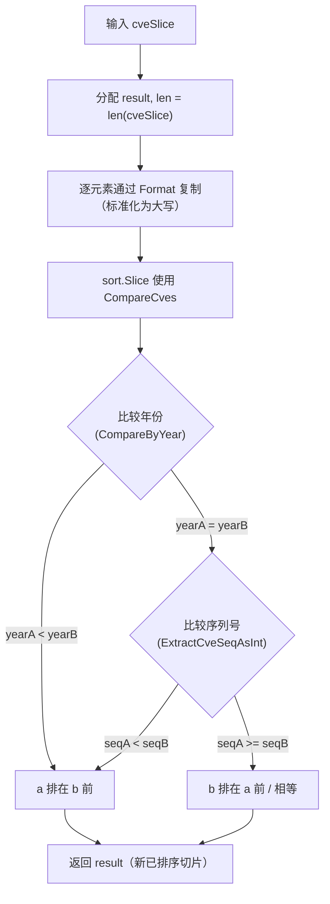

# SortCves 排序

:::tip 📂 查看源码
[`compare.go:165`](https://github.com/scagogogo/cve-skills/blob/main/compare.go#L165-L176) — 在 GitHub 上查看实现代码（第 165–176 行）。
:::

`SortCves` 按年份和序列号对 CVE 标识符切片进行排序，并将每个元素统一为规范的大写格式，返回全新的已排序切片。

:::tip 📌 场景
- 按时间顺序（最早优先）展示或处理一批 CVE
- 生成漏洞报告时对 CVE 按发布顺序排序
- 需要稳定、规范顺序的去重/分组流水线
:::

## 函数签名

```go
func SortCves(cveSlice []string) []string
```

## 参数

- `cveSlice` ([]string): 需要排序的 CVE 编号数组

## 返回值

- []string: 排序后的 CVE 编号数组，所有 CVE 均已标准化格式（大写）

## 行为说明

- 分配与输入等长的 `result` 切片，逐元素通过 `Format` 复制，因此每个 CVE 在比较前都已大写/标准化——原始输入切片绝不会被修改
- 使用 `sort.Slice`，以 `CompareCves` 作为小于判定：先比较年份（经 `CompareByYear`），年份相同时再比较序列号（经 `ExtractCveSeqAsInt`）
- 排序为升序——较早的年份在前，同年份中较小的序列号在前
- 不会拒绝无效 CVE：`Format` 与提取器将无法解析的 CVE 视为年份 `0` / 序列号 `0`，因此格式错误的条目会冒泡到已排序结果的最前面
- 返回切片与输入相互独立，调用方在调用后可安全修改任一方

## 流程图



## 示例

```go
package main

import (
	"fmt"

	"github.com/scagogogo/cve-skills"
)

func main() {
	// 用例 1：混合年份与序列号，输出按年份再按序列号排序
	cveList := []string{"CVE-2022-2222", "cve-2020-1111", "CVE-2022-1111"}
	sortedList := cve.SortCves(cveList)
	// sortedList -> ["CVE-2020-1111", "CVE-2022-1111", "CVE-2022-2222"]
	fmt.Println(sortedList)

	// 用例 2：小写输入被标准化为大写
	lowerList := []string{"cve-2022-2222", "CVE-2022-1111"}
	fmt.Println(cve.SortCves(lowerList))
	// 输出 -> ["CVE-2022-1111", "CVE-2022-2222"]

	// 用例 3：原始切片不会被修改
	original := []string{"CVE-2022-3333", "CVE-2020-0001"}
	_ = cve.SortCves(original)
	fmt.Println(original) // 仍为 ["CVE-2022-3333", "CVE-2020-0001"]

	// 用例 4：无效 CVE 被当作年份 0 / 序列号 0，排在最前
	mixed := []string{"CVE-2022-1111", "not-a-cve", "CVE-2020-1111"}
	fmt.Println(cve.SortCves(mixed))
	// "not-a-cve" 被视为年份 0 / 序列号 0 -> 排在有效 CVE 之前
}
```

## 使用场景

- 按时间顺序（最早优先）展示一批 CVE
- 生成漏洞报告时按发布顺序排序 CVE
- 将大小写混杂的 CVE 列表规范化为统一、有序的数据集
- 在受益于稳定顺序的范围/分组操作前预先排序

## 注意事项

- ⚠️ 返回值是**新**切片；输入切片绝不会被原地修改
- ⚠️ 无效 CVE 格式不会被过滤——它们经 `Format` 标准化后用提取到的默认年份/序列号 `0` 参与比较，因而倾向于聚集在已排序输出的最前面。如仅需有效 CVE，请先用 `IsCve` / `ValidateCve` 预过滤
- ✅ 时间复杂度为 O(n log n)（来自 `sort.Slice`）；空间复杂度为 O(n)（分配了新切片）
- 🔍 排序使用 `CompareCves`，**先比年份再比序列号**——这与 CVE 标识符自然的发布顺序一致
- 📊 若只需比较两个 CVE 而无需排序，请直接调用 [CompareCves](/zh/api/functions/compare-cves)；若仅需按年份比较，使用 [CompareByYear](/zh/api/functions/compare-by-year)

## 内部实现

函数体（`compare.go:165-176`）刻意保持精简，将主要工作委托给两个辅助函数：

- **分配全新的 result 切片**（L166）：`result := make([]string, len(cveSlice))` 创建与输入等长的新切片。这是「绝不修改输入」保证的基础——后续所有写入都作用于 `result`，绝不回写到 `cveSlice`。
- **复制时同步标准化**（L167-169）：`for i, cve := range cveSlice` 循环将 `Format(cve)` 写入 `result[i]`。此处调用 `Format` 意味着比较步骤永远不会看到原始的、大小写混杂或带空白的输入——排序始终基于规范的大写形式，因此 `cve-2022-1111` 与 `CVE-2022-1111` 必然比较相等，而非依赖字符串字节序。
- **以比较函数排序**（L171-173）：`sort.Slice(result, func(i, j int) bool { return CompareCves(result[i], result[j]) < 0 })` 原地对 `result` 重排。该闭包委托给 `CompareCves`，后者再委托给 `CompareByYear` 与 `ExtractCveSeqAsInt`——因此排序键是（年份, 序列号），而非字典序字符串。使用 `< 0`（而非 `<= 0`）使谓词为严格小于，正是 `sort.Slice` 所期望的语义。
- **返回新切片**（L175）：`return result` 返回这个独立、已标准化、已排序的切片。由于 `result` 是局部分配的，且仅对 `result` 做了重排，调用方的原始切片不受影响。
- **设计意图**：将工作拆分为 `Format`（标准化）+ `CompareCves`（排序）+ `sort.Slice`（算法），使每个关注点都可独立测试，排序例程保持为薄薄的组合层，而不重新实现解析或比较逻辑。

## 复杂度

| 维度 | 开销 | 原因 |
|---|---|---|
| 时间 | O(n log n) | `sort.Slice` 是自适应的、以快速排序为主的算法，平均/最坏情形为 O(n log n) 次比较；每次比较调用 `CompareCves`，而 `CompareCves` 自身只做 O(1) 的 `Format`/提取工作 |
| 空间 | O(n) | `make([]string, len(cveSlice))` 分配等长新切片；`sort.Slice` 在该切片上原地排序，不会创建第二个 O(n) 缓冲区 |

注意：每次比较都通过 `CompareCves` 从已格式化的字符串重新解析年份/序列号，而非缓存已解析的键，因此单次比较的常数因子不可忽视——但渐近界仍为 O(n log n) 次比较乘以每次比较 O(1)。

## 边界情形

| 输入 | 行为 | 返回 |
|---|---|---|
| `nil` 切片 | `make([]string, 0)` 产生空且非 nil 的切片；循环与排序均为空操作 | `[]string{}`（长度 0，非 nil） |
| 空切片 `[]string{}` | 分配长度为 0 的 `result`；循环体不执行；对零元素 `sort.Slice` 为空操作 | `[]string{}`（长度 0） |
| 全小写条目（`cve-2022-1`） | 每个条目在比较前与输出中都被 `Format` 转为大写 | 已排序切片，全大写（`CVE-2022-1`） |
| 大小写混杂（`CVE-...`、`cve-...`） | `Format` 将两者规范为同一大写形式，故按年份/序列号比较，而非字节序 | 稳定的规范顺序 |
| 重复 CVE | 重复项保留（不去重）；相等元素在 `sort.Slice` 下保持足够稳定的相对顺序 | 与输入等长的切片，含重复项 |
| 无效条目（`not-a-cve`） | 不被拒绝；`Format`/提取器给出年份 `0` / 序列号 `0`，故该条目排在所有有效 CVE 之前 | 无效条目冒泡到最前 |
| 单元素 `[x]` | 长度为 1 的 `result`；一次 `Format` 调用；对单元素 `sort.Slice` 为空操作 | `[Format(x)]` |
| 已排序输入 | 仍走完整的标准化 + 排序路径；无快速路径短路 | 新切片，顺序相同，已规范化 |

## 数据流

```text
+---------------------+
| 输入: cveSlice       |
| ["cve-2020-1111",    |
|  "CVE-2022-2222",    |
|  "CVE-2022-1111"]    |
+---------------------+
          |
          v
+-----------------------------+
| make([]string, len=3)       |  L166  -> result = ["", "", ""]
+-----------------------------+
          |
          v
+-----------------------------+
| for i, cve := range         |  L167-169
|   result[i] = Format(cve)   |  标准化为大写
+-----------------------------+
          |
          v
+-----------------------------+
| result = ["CVE-2020-1111",  |
|           "CVE-2022-2222",  |
|           "CVE-2022-1111"]  |
+-----------------------------+
          |
          v
+-----------------------------+
| sort.Slice(result, cmp)     |  L171-173
|   cmp = CompareCves < 0     |
|     -> CompareByYear        |
|     -> ExtractCveSeqAsInt   |
+-----------------------------+
          |
          v
+-----------------------------+
| result = ["CVE-2020-1111",  |
|           "CVE-2022-1111",  |
|           "CVE-2022-2222"]  |
+-----------------------------+
          |
          v
+---------------------+
| return result        |  L175  (新切片，输入不受影响)
+---------------------+
```

## 相关函数

- [CompareCves](/zh/api/functions/compare-cves) — 按年份再按序列号比较两个 CVE（`SortCves` 使用的判定函数）
- [CompareByYear](/zh/api/functions/compare-by-year) — 仅按年份比较两个 CVE
- [Format](/zh/api/functions/format) — 将单个 CVE 标准化为大写、去空格格式
- [ExtractCveSeqAsInt](/zh/api/functions/extract-cve-seq-as-int) — 以 int 形式提取序列号
- [IsCve](/zh/api/functions/is-cve) — 格式校验，适合在排序前预过滤无效条目
- [比较与排序分类](/zh/api/compare-sort)
