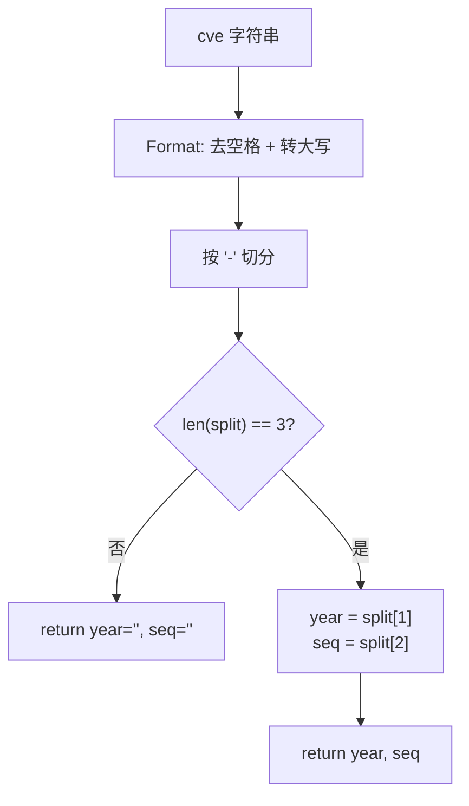

# Split 拆分

:::tip 📂 查看源码
[`base.go:265`](https://github.com/scagogogo/cve-skills/blob/main/base.go#L265-L282) — 在 GitHub 上查看实现代码（第 265–282 行）。
:::

`Split` 把 CVE 编号拆分为年份和序列号两部分 —— 即 `CVE-YYYY-NNNNN` 形式中两个短横线之间的两段数字。

:::tip 📌 场景
- 当需要单独处理年份或序列号时拆分 CVE（排序、分组、补零）
- 为自定义比较或存储逻辑提供结构化的 `(year, seq)` 数据对
- 作为 `FormatSeq` 等需要单独使用年份或序列号的辅助函数的前置步骤
:::

## 函数签名

```go
func Split(cve string) (year string, seq string)
```

## 参数

- `cve` (string): 需要拆分的 CVE 编号，如 `"CVE-2022-12345"`

## 返回值

- `year` (string): 年份部分的字符串，如 `"2022"`
- `seq` (string): 序列号部分的字符串，如 `"12345"`
- 如果输入的 CVE 格式不正确（不是 3 段结构），`year` 和 `seq` 均返回空字符串 (`""`)

## 行为说明

- 输入首先经过 `Format` 标准化 —— 去除首尾空格并转为大写 —— 因此 `" cve-2022-12345 "` 与 `"CVE-2022-12345"` 处理方式相同
- 标准化后的字符串按 `-` 分隔符切分；有效的 CVE 必须切分出恰好 3 段（`["CVE", "2022", "12345"]`）
- 当切分结果恰好为 3 段时，第二段作为 `year` 返回，第三段作为 `seq` 返回
- 当切分结果不是 3 段时（如缺少前缀、多余短横线、无短横线），命名返回值 `year` 和 `seq` 保持零值 —— 空字符串
- 纯结构拆分 —— 不校验 `year` 是否为数字、年份是否在合理范围内、`seq` 是否为正整数；如需完整语义校验请配合 `ValidateCve` 使用

## 流程图



## 示例

```go
package main

import (
	"fmt"

	"github.com/scagogogo/cve-skills"
)

func main() {
	testCases := []struct {
		input string
		year  string
		seq   string
	}{
		{"CVE-2022-12345", "2022", "12345"},
		{"cve-2022-12345", "2022", "12345"},          // 小写，Format 后仍可拆分
		{" CVE-2022-12345 ", "2022", "12345"},        // 首尾空格被容忍
		{"CVE-2021-44228", "2021", "44228"},
		{"CVE-2022-1", "2022", "1"},                  // 单位序列号
		{"not-a-cve", "", ""},                        // 非 3 段 CVE
		{"CVE-2022", "", ""},                         // 只有 2 段
		{"CVE-2022-12345-extra", "", ""},             // 4 段
		{"2022-12345", "", ""},                       // 缺少 CVE 前缀
		{"", "", ""},                                 // 空字符串
	}

	for _, tc := range testCases {
		year, seq := cve.Split(tc.input)
		status := "✅"
		if year != tc.year || seq != tc.seq {
			status = "❌"
		}
		fmt.Printf("%s %-28s -> year=%q, seq=%q\n", status, tc.input, year, seq)
	}

	// 典型用法：自定义处理前先拆分
	year, seq := cve.Split("CVE-2022-12345")
	fmt.Printf("year: %s, seq: %s\n", year, seq)
	// 输出: year: 2022, seq: 12345
}
```

## 使用场景

- 需要单独使用年份或序列号时拆分 CVE（如按年份分组、按数字序列号排序）
- 为比较、补零或存储逻辑提供结构化的 `(year, seq)` 数据对
- 作为 `FormatSeq` 等需要单独使用序列号的辅助函数的前置步骤
- 在执行额外的数值校验前提取原始组成部分

## 注意事项

- `Split` 仅为**结构**拆分 —— 它返回年份/序列号位置上的原始字符串，不检查是否为数字、年份是否在范围内、序列号是否为正整数；完整校验请使用 `ValidateCve`
- 无效输入时返回空字符串是命名返回值的零值 —— 没有错误类型；当输入有效性不确定时，调用方需检查 `year == ""`（或先调用 `IsCve`）
- 大小写和首尾空格在拆分前已由 `Format` 标准化，调用方无需预先去空格或转大写
- 含多余短横线的 CVE（`CVE-2022-12345-extra`）会切分出 4 段而被拒绝并返回空字符串 —— 要求恰好 3 段
- 与 `extractYear` 对比：未导出的 `extractYear` 返回 `int` 类型的年份（失败时为 0），而 `Split` 返回年份和序列号的原始字符串

## 内部实现

该函数是两个标准库调用加一个长度判空的轻量封装，几乎不分配额外内存。对照源码逐步说明：

- **第 266 行 —— `cve = Format(cve)`：** 输入先经过 `Format`，去除首尾空格并转为大写。这就是 `" cve-2022-12345 "` 与 `"cve-2022-12345"` 能被同等接受的原因 —— 标准化发生在切分之*前*，而非之后。
- **第 267 行 —— `split := strings.Split(cve, "-")`：** 标准化后的字符串按每一个 `-` 切分。`strings.Split` 返回 `[]string`；对格式正确的 `CVE-2022-12345` 得到 `["CVE", "2022", "12345"]`，任何多余短横线只会让元素变多。
- **第 268–270 行 —— `if len(split) != 3 { return }`：** 唯一的判空点检查是否恰好 3 段。裸 `return` 依赖命名返回值（`year`、`seq`）仍保持零值（`""`），因此无需写成 `return "", ""`。这是函数中唯一的分支。
- **第 271 行 —— `return split[1], split[2]`：** 满足条件时直接返回第二、第三段作为原始字符串 —— 不做数值解析、不做校验。`"CVE"` 前缀（`split[0]`）被有意丢弃，`Split` 只关心载荷部分。
- **设计意图：** 整个函数是结构性的，而非语义性的。把标准化交给 `Format`、把校验交给调用方（`IsCve` / `ValidateCve`），`Split` 始终是一个纯粹的分解原语，便于组合到 `FormatSeq` 等其他辅助函数中。

## 复杂度

| 维度 | 开销 | 原因 |
|---|---|---|
| 时间 | O(n) | `Format` 扫描字符串一次（去空格 + 转大写），`strings.Split` 再扫描一次按 `-` 切分，二者均与输入长度 n 成线性关系；长度判断和两次切片读取为 O(1)。 |
| 空间 | O(n) | `Format` 可能分配新的标准化字符串，`strings.Split` 分配最多（短横线数+1）个元素的 `[]string` 及其子串，均以 O(n) 为界。无 map、无排序。 |
| 分配次数 | 通常 2 次 | 一次用于 `Format` 结果，一次用于 `split` 切片（及其底层字符串）。在拒绝路径上只有 `Format` 的分配留存。 |

## 边界情形

| 输入 | 行为 | 返回 |
|---|---|---|
| `"CVE-2022-12345"`（规范形式） | Format 无操作，切分 → 3 段 | `("2022", "12345")` |
| `"cve-2022-12345"`（小写） | Format 转大写为 `CVE-2022-12345`，切分 → 3 段 | `("2022", "12345")` |
| `" CVE-2022-12345 "`（首尾空格） | Format 去空格，切分 → 3 段 | `("2022", "12345")` |
| `"CVE-2022-1"`（单位序列号） | 3 段，不做数值检查 | `("2022", "1")` |
| `"CVE-2022"`（仅 2 段） | `len(split) == 2`，判空触发 | `("", "")` |
| `"CVE-2022-12345-extra"`（4 段） | `len(split) == 4`，判空触发 | `("", "")` |
| `"2022-12345"`（缺少前缀） | 2 段，判空触发 | `("", "")` |
| `"not-a-cve"`（2 个短横线、3 段但非 CVE） | 通过 3 段判断，原样返回位置 1、2 | `("a", "cve")` —— 仅结构，无语义检查 |
| `""`（空字符串） | `strings.Split("")` → `[""]`，长度 1，判空触发 | `("", "")` |
| `"CVE-2022-ABC"`（载荷非数字） | 3 段，原样返回 | `("2022", "ABC")` —— 不做数值校验 |

## 数据流

```text
+---------------------+
|  输入: cve 字符串   |
|  如 " cve-22-9 "    |
+----------+----------+
           |
           v
+---------------------+
|  Format(cve)        |  去空格 + 转大写
|  -> "CVE-22-9"      |  (交由 Format 标准化)
+----------+----------+
           |
           v
+---------------------+
|  strings.Split      |  按每个 '-' 切分
|  cve, "-"           |
+----------+----------+
           |
           v
+---------------------+
|  []string split     |
|  ["CVE","22","9"]   |
+----------+----------+
           |
           v
+---------------------+
|  len(split) == 3 ?  |
+--+---------------+--+
   | 否            | 是
   v               v
+----------+ +---------------------+
| return   | | year = split[1]     |
| "", ""   | | seq  = split[2]     |
| (零值)   | +----------+----------+
+----------+            |
                        v
          +-----------------------------+
          |  return year, seq           |
          |  如 ("22", "9")             |
          +-----------------------------+
```

## 相关函数

- [Format](/zh/api/functions/format) —— 将 CVE 标准化为大写、去空格形式（`Split` 内部调用）
- [IsCve](/zh/api/functions/is-cve) —— 拆分前校验 CVE 格式
- [ValidateCve](/zh/api/functions/validate-cve) —— 完整校验（格式 + 年份范围 + 正序列号）
- [FormatSeq](/zh/api/functions/format-seq) —— 将序列号补零到固定宽度（内部使用 `Split`）
- [IsCveYearOk](/zh/api/functions/is-cve-year-ok) —— 校验年份在 1999..当前年份范围内
- [格式化与校验分类](/zh/api/format-validate)
