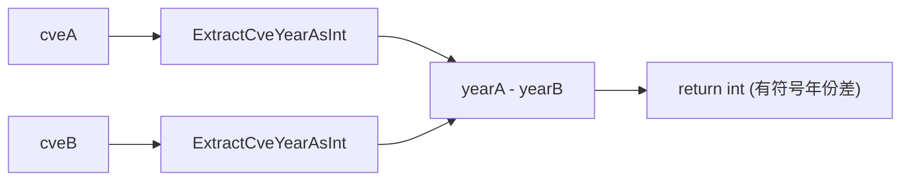

# SubByYear 年份相减

:::tip 📂 查看源码
[`compare.go:72`](https://github.com/scagogogo/cve-skills/blob/main/compare.go#L72-L75) — 在 GitHub 上查看实现代码（第 72–75 行）。
:::

`SubByYear` 把两个 CVE 编号按年份相减，返回 `cveA` 年份减去 `cveB` 年份的有符号差值。

:::tip 📌 场景
- 计算两个 CVE 之间的年份间隔，衡量二者发布时间相差多少年
- 评估安全漏洞在不同年份上的时间分布
- 为趋势报告或 CVE 资产的老化分析构建基于年份的差值指标
:::

## 函数签名

```go
func SubByYear(cveA, cveB string) int
```

## 参数

- `cveA` (string): 第一个 CVE 编号
- `cveB` (string): 第二个 CVE 编号

## 返回值

- `int`: 年份差值（`cveA` 年份减 `cveB` 年份）；`cveA` 较早时为负，较晚时为正，同年份时为 0

## 行为说明

- 内部直接委托给 `CompareByYear`，后者计算 `ExtractCveYearAsInt(cveA) - ExtractCveYearAsInt(cveB)` —— 因此 `SubByYear` 与 `CompareByYear` 在功能上完全等价，只是命名上强调"相减"语义
- 返回值是真实的数值年份差，而非归一化的 `-1 / 0 / 1` 三态 —— 差值为 2 即表示正好相差两年
- 不会拒绝无效或非 CVE 输入：年份通过 `ExtractCveYearAsInt` 提取，任何无法解析的 CVE 一律视为年份 `0`
- 由于无效输入会被归零为年份 `0`，将一个有效 CVE 与一个无效输入混用时，结果等于该有效 CVE 的年份（例如 `SubByYear("CVE-2022-1", "garbage")` 返回 `2022`）

## 流程图



## 示例

```go
package main

import (
	"fmt"

	"github.com/scagogogo/cve-skills"
)

func main() {
	// 以下用例原样照搬源码注释中的示例。
	fmt.Println(cve.SubByYear("CVE-2020-1111", "CVE-2022-2222")) // -2
	fmt.Println(cve.SubByYear("CVE-2022-1111", "CVE-2020-2222")) // 2
	fmt.Println(cve.SubByYear("CVE-2022-1111", "CVE-2022-2222")) // 0

	// 无效输入被视为年份 0，因此差值等于有效 CVE 的年份。
	fmt.Println(cve.SubByYear("CVE-2022-1111", "not-a-cve")) // 2022
	fmt.Println(cve.SubByYear("garbage", "CVE-2020-2222"))   // -2020
	fmt.Println(cve.SubByYear("garbage", "also-garbage"))    // 0

	// 典型用法：衡量两个 CVE 之间的年份间隔。
	yearDiff := cve.SubByYear("CVE-2022-1111", "CVE-2020-2222")
	// yearDiff 为 2，表示第一个 CVE 比第二个晚发布 2 年
	if yearDiff > 0 {
		fmt.Printf("第一个 CVE 晚 %d 年\n", yearDiff)
	} else if yearDiff < 0 {
		fmt.Printf("第一个 CVE 早 %d 年\n", -yearDiff)
	} else {
		fmt.Println("两个 CVE 同年份")
	}
}
```

## 使用场景

- 计算两个 CVE 之间的年份间隔
- 评估安全漏洞的时间分布
- 为趋势报告或 CVE 资产的老化分析构建年份差值指标

## 注意事项

- ⚠️ `SubByYear` 与 `CompareByYear` 在功能上完全等价 —— 二者都返回原始的有符号年份差。想表达"相减"语义时用 `SubByYear`，想表达"比较"语义时用 `CompareByYear`
- ⚠️ 无效输入会被静默归零为年份 `0`，而非报错。若需严格校验，请先调用 `IsCve` / `ValidateCve`
- 🔍 返回的是真实数值差，而非 `CompareCves` 返回的 `-1 / 0 / 1` 三态。如需"年份 + 序列号"的完整比较，请改用 `CompareCves`
- 📊 仅考虑年份；同一年的两个 CVE 不论序列号为何都返回 `0`

## 内部实现

`SubByYear` 是对 `CompareByYear` 的一层薄语义封装。其函数体（compare.go L72-L75）只有一条语句，真正的计算在下一层完成：

- **直接委托（L73）：** 函数体为 `return CompareByYear(cveA, cveB)`，没有任何本地解析、分支或前置校验 —— 所有输入直接交给 `CompareByYear`，因此行为与之完全等价。
- **通过 `ExtractCveYearAsInt` 提取年份（L41）：** `CompareByYear` 计算 `ExtractCveYearAsInt(cveA) - ExtractCveYearAsInt(cveB)`。每个 CVE 字符串被解析为其 4 位年份部分的整数；`CVE-` 前缀与序列号在本操作中被忽略。
- **整数相减即为结果（L41）：** 返回的 `int` 是两个年份的字面算术差，而非归一化的三态。这正是 2 年的间隔会表现为 `2` 的原因，将 `SubByYear`/`CompareByYear` 与返回 `-1 / 0 / 1` 的 `CompareCves` 区分开。
- **无错误路径：** 无效输入不会触发短路。`ExtractCveYearAsInt` 将无法解析的输入降级为年份 `0`，于是减法以 `0` 替代坏的一侧继续进行，产出数值结果而非报错。
- **命名表达意图而非行为：** 由于实现与 `CompareByYear` 完全一致，独立命名纯粹是为了在调用处表达"相减"语义；Go 编译器并未做特殊内联 —— 区别是给人和 API 易用性看的。

## 复杂度

| 指标 | 代价 | 原因 |
|---|---|---|
| 时间 | O(n)，n 为每个 CVE 字符串的长度 | `ExtractCveYearAsInt` 对每个输入字符串扫描/解析一次；两次调用加一次整数相减 |
| 空间 | O(1) | 不分配切片、map 或缓冲；仅有栈上几个 `int` 值 |

两个输入都是定长 CVE 字符串，因此实际开销接近常数。本函数避开了 `SortCves` 所用的 `sort.Slice` 与 `Format` 分配（后者时间 O(n log n)、空间 O(n)），是包内最廉价的年份差值路径。

## 边界情形

| 输入 | 行为 | 返回 |
|---|---|---|
| `SubByYear("CVE-2022-1111", "CVE-2020-2222")` | 两边年份正常解析；`2022 - 2020` | `2` |
| `SubByYear("CVE-2020-1111", "CVE-2022-2222")` | `2020 - 2022` | `-2` |
| `SubByYear("CVE-2022-1111", "CVE-2022-2222")` | 同年份，序列号被忽略 | `0` |
| `SubByYear("CVE-2022-1", "garbage")` | `cveB` 无法解析 → 年份 `0`；`2022 - 0` | `2022` |
| `SubByYear("garbage", "CVE-2020-2222")` | `cveA` 无法解析 → 年份 `0`；`0 - 2020` | `-2020` |
| `SubByYear("garbage", "also-garbage")` | 两边均无法解析 → `0 - 0` | `0` |
| `SubByYear("cve-2022-1111", "CVE-2022-2222")` | 提取器容忍小写前缀；两边年份均为 `2022` | `0` |
| `SubByYear("", "CVE-2022-2222")` | 空串无效 → 年份 `0`；`0 - 2022` | `-2022` |
| `SubByYear("CVE-2022-1111", "CVE-2022-1111")` | 输入完全相同 | `0` |
| `SubByYear("CVE-9999-9999", "CVE-0001-0001")` | 格式有效，极端年份；`9999 - 1` | `9998` |

## 数据流

```text
  +-----------+                              +-----------+
  |  cveA     |                              |  cveB     |
  | (string)  |                              | (string)  |
  +-----+-----+                              +-----+-----+
        |                                          |
        v                                          v
  +-------------------+                    +-------------------+
  | ExtractCveYear    |                    | ExtractCveYear    |
  | AsInt(cveA)       |                    | AsInt(cveB)       |
  +---------+---------+                    +---------+---------+
            |                                        |
            |   yearA (int)                          |   yearB (int)
            |   (无效 -> 0)                          |   (无效 -> 0)
            v                                        v
            \                                        /
             \                                      /
              +------------+   +-------------------+
                           |   |
                           v   v
                    +--------------+
                    |  yearA - yearB   <-- CompareByYear 函数体 (L41)
                    +-------+------+
                            |
                            v
                    +-----------------+
                    | return int      |   有符号年份差
                    | (SubByYear L73) |   （非 -1/0/1）
                    +-----------------+
```

## 相关函数

- [CompareByYear](/zh/api/functions/compare-by-year) —— 按年份比较两个 CVE（与 `SubByYear` 功能等价）
- [CompareCves](/zh/api/functions/compare-cves) —— 按年份再按序列号的完整比较，返回 `-1 / 0 / 1`
- [ExtractCveYearAsInt](/zh/api/functions/extract-cve-year-as-int) —— 将 CVE 的年份提取为整数
- [SortCves](/zh/api/functions/sort-cves) —— 按年份再按序列号对 CVE 切片排序
- [比较与排序分类](/zh/api/compare-sort)
