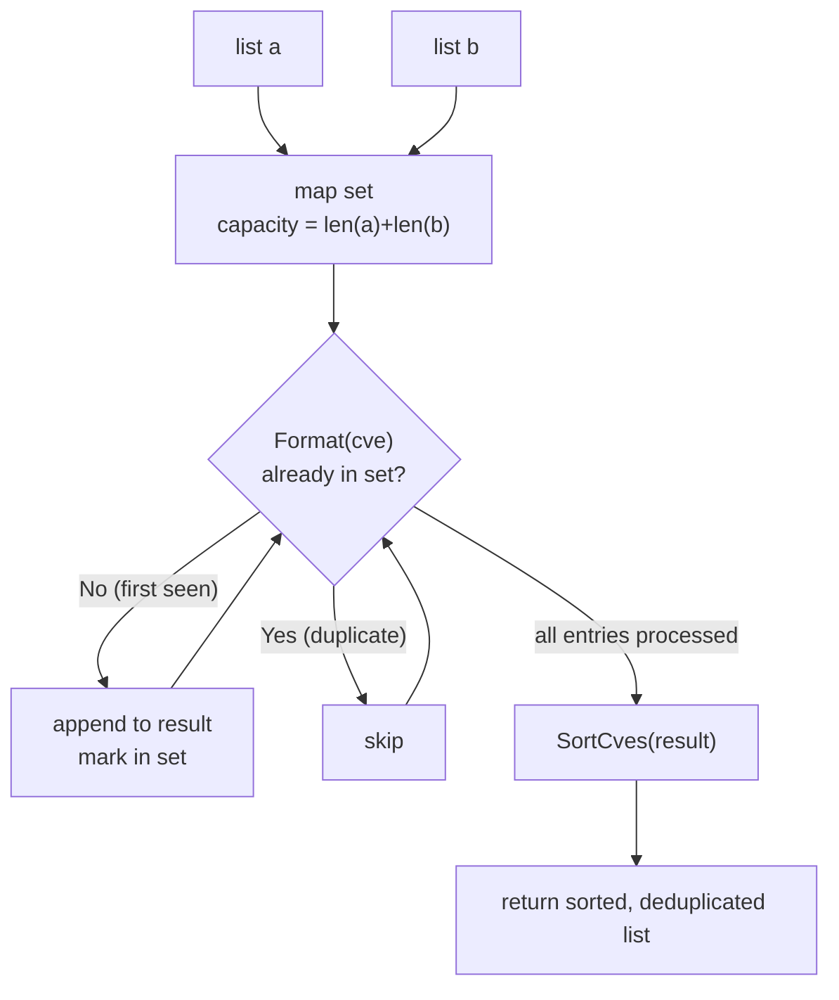

# UnionCves 并集

:::tip 📂 查看源码
[`filter.go:284`](https://github.com/scagogogo/cve-skills/blob/main/filter.go#L284-L306) — 在 GitHub 上查看实现代码（第 284–306 行）。
:::

`UnionCves` 将两个 CVE 列表合并为一个去重集合，返回出现在任一列表中的全部 CVE —— 已格式化为大写并排序。

:::tip 📌 场景
- 合并从多个安全通告或数据源采集到的 CVE 列表
- 在去重前整合不同团队的漏洞清单
- 为后续分析或报告构建一份主 CVE 数据集
:::

## 函数签名

```go
func UnionCves(a, b []string) []string
```

## 参数

- `a` ([]string): 第一个 CVE 列表
- `b` ([]string): 第二个 CVE 列表

## 返回值

- []string: 两个列表中的所有 CVE 编号（已去重），按年份和序列号升序排列

## 行为说明

- 每个输入 CVE 在比较前都会经 `Format` 标准化（大写、去空白），因此 `cve-2022-1111` 与 `CVE-2022-1111` 被视为同一个 CVE
- 使用容量预分配为 `len(a)+len(b)` 的 `map[string]struct{}` 记录已收集的 CVE，仅在首次出现时追加
- 先遍历列表 `a`，再遍历列表 `b` —— 在 `b` 中再次遇到已在 `a` 出现的重复项时会被跳过
- 收集到的结果在返回前会交给 `SortCves` 排序，因此输出按年份再按序列号升序排列（而非按插入顺序）
- 非法或格式异常的条目仍会经 `Format` 处理；只有真正大小写不敏感地相等的重复项才会被去除

## 流程图



## 示例

```go
package main

import (
	"fmt"

	"github.com/scagogogo/cve-skills"
)

func main() {
	list1 := []string{"CVE-2022-1111", "CVE-2022-2222"}
	list2 := []string{"CVE-2022-2222", "CVE-2022-3333"}
	all := cve.UnionCves(list1, list2)
	// all 为 ["CVE-2022-1111", "CVE-2022-2222", "CVE-2022-3333"]
	fmt.Println(all)

	// 大小写不敏感去重 —— 小写的重复项被丢弃
	mixedA := []string{"cve-2022-1111", "CVE-2022-2222"}
	mixedB := []string{"CVE-2022-1111", "cve-2022-3333"}
	fmt.Println(cve.UnionCves(mixedA, mixedB))
	// 输出: [CVE-2022-1111 CVE-2022-2222 CVE-2022-3333]

	// 空列表被优雅处理
	fmt.Println(cve.UnionCves(nil, []string{"CVE-2021-44228"}))
	// 输出: [CVE-2021-44228]

	// 结果按年份再按序列号排序，而非按输入顺序
	unorderedA := []string{"CVE-2022-3333", "CVE-2021-1111"}
	unorderedB := []string{"CVE-2021-2222"}
	fmt.Println(cve.UnionCves(unorderedA, unorderedB))
	// 输出: [CVE-2021-1111 CVE-2021-2222 CVE-2022-3333]
}
```

## 使用场景

- 合并来自多个来源（NVD、厂商通告、内部扫描器）的 CVE 列表
- 将多份安全报告中的漏洞信息整合为一份主清单
- 在生成汇总报告前合并各团队的 CVE 清单
- 为趋势分析或按年份统计预处理一份去重的输入集合

## 注意事项

- 得益于 `Format`，比较是大小写不敏感的；所有返回条目均为规范的大写形式
- 输出是**已排序**的，而非按插入顺序 —— 若希望保留单个列表中首次出现的顺序，请改用 `RemoveDuplicateCves`
- 跨两个列表去重（同时出现在 `a` 和 `b` 的 CVE 只保留一次）；`a` 或 `b` 列表内部的重复也会被合并
- 时间复杂度 O(n+m)，空间复杂度 O(n+m)，其中 n 和 m 为两个列表长度 —— 对大规模数据源依然高效
- 经 `Format` 后仍残留的格式异常字符串会被原样保留（仅大小写不敏感地相等才去重）；如需严格过滤，请事先用 `IsCve` 或 `ValidateCve` 校验输入

## 内部实现

`UnionCves` 函数体（filter.go L284-L306）将两个列表合并为一个去重且排序好的切片。关键步骤如下：

- **预分配容量建集合（L285）**：`set := make(map[string]struct{}, len(a)+len(b))` 按并集最坏规模预分配去重 map，避免随条目增长触发扩容再哈希。值类型用 `struct{}`，因为它不承载数据、零字节占用。
- **两轮遍历收集（L288-L302）**：先遍历列表 `a`，再遍历 `b`。每条记录经 `Format`（L289、L297）生成规范大写键；L290/L298 的 `map` 查询判断是否首次出现。仅首次出现的条目被追加进 `result`（L292、L300），因此跨列表与列表内部的重复都会收敛为首次出现的那一条。
- **委托 `SortCves` 排序（L304）**：收集完成后，未排序的 `result` 切片交给 `SortCves`，按年份再按序列号升序排列。因此函数返回的是已排序集合，而非按插入顺序。
- **设计意图——单一规范键**：通过在 `map` 探测前先标准化，同一个 CVE 的不同大小写写法（`cve-2022-1111` 与 `CVE-2022-1111`）解析为同一个键，无需额外比较器即可天然获得大小写不敏感的去重。
- **不做非法性预过滤**：`Format` 是唯一的变换；那些并非规范 CVE、但经 `Format` 后键互不相同的条目会被保留。严格校验留给调用方，使 `UnionCves` 保持纯粹的求并集原语。

## 复杂度

| 资源 | 代价 | 说明 |
| --- | --- | --- |
| 时间——收集 | O(n+m) | `a` 与 `b` 的每个元素各访问一次；`Format` 与 `map` 查询平均 O(1) |
| 时间——排序 | O(k log k) | `SortCves` 对去重后大小为 k ≤ n+m 的结果排序 |
| 时间——整体 | O(n+m) + O(k log k) | 大规模输入下由收集主导；源码注释概括为 O(n+m) |
| 空间——map | O(n+m) | `set` map 最多容纳 n+m 个不同的格式化键 |
| 空间——结果 | O(n+m) | `result` 切片在排序前最多 n+m 条 |

其中 `n = len(a)`，`m = len(b)`，`k` 为去重后的不同 CVE 数量（k ≤ n+m）。

## 边界情形

| 输入 | 行为 | 返回 |
| --- | --- | --- |
| `a` 与 `b` 均为 `nil`/空 | 两轮循环均零次迭代；`result` 保持 `nil`；`SortCves(nil)` 返回 `nil` | `nil` |
| `a` 为空、`b` 非空 | 第一轮空转；`b` 的条目填入集合与 `result` | `b` 去重并排序 |
| 同一 CVE 的不同大小写（`cve-2022-1111` 与 `CVE-2022-1111`） | 二者经 `Format` 均为 `CVE-2022-1111`；第二次查询命中集合被跳过 | 单条 `CVE-2022-1111` |
| 单列表内重复（`a = ["CVE-2022-1", "CVE-2022-1"]`） | 第二次出现发现键已在集合中被跳过 | 单条 `CVE-2022-1` |
| 跨列表重复（同时存在于 `a` 和 `b`） | `a` 轮加入；`b` 轮跳过 | 单条 |
| 经 `Format` 后仍残留的格式异常字符串 | 原样保留；仅对大小写不敏感相等的字符串去重 | 字符串原样保留 |
| 无序输入 | 插入顺序被 `SortCves` 丢弃 | 按年份再按序列号排序 |

## 数据流

```text
+----------+        +----------+
|  list a  |        |  list b  |
|  []str   |        |  []str   |
+----+-----+        +----+-----+
     |                   |
     |  先遍历 a          |  后遍历 b
     v                   v
+----------------------------------+
|  for cve in a, then b:           |
|    formatted = Format(cve)       |  <-- 规范大写键
|    if formatted not in set:      |
|      set[formatted] = {}         |  <-- 标记已见
|      result = append(result,     |
|                     formatted)   |
+---------------+------------------+
                |
                v
        +--------------+
        | result []str |  (已去重，未排序)
        +------+-------+
               |
               v
        +----------------+
        | SortCves(result)|  <-- 按年份再按序列号排序
        +--------+-------+
                 |
                 v
        +--------------------+
        | 已排序、已去重的    |
        | []string 输出      |
        +--------------------+
```

## 相关函数

- [IntersectCves](/zh/api/functions/intersect-cves) —— 返回两个列表共有的 CVE
- [DiffCves](/zh/api/functions/diff-cves) —— 返回在 `a` 中但不在 `b` 中的 CVE
- [RemoveDuplicateCves](/zh/api/functions/remove-duplicate-cves) —— 对单个列表去重，保留首次出现顺序
- [SortCves](/zh/api/functions/sort-cves) —— 按年份和序列号排序 CVE 列表
- [Format](/zh/api/functions/format) —— 将 CVE 标准化为大写、去空白形式
- [集合运算分类](/zh/api/set-operations)
