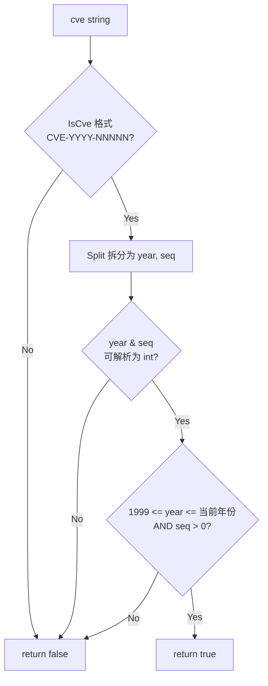

# ValidateCve 单个验证

:::tip 📂 查看源码
[`base.go:445`](https://github.com/scagogogo/cve-skills/blob/main/base.go#L445-L460) — 在 GitHub 上查看实现代码（第 445–460 行）。
:::

`ValidateCve` 对单个 CVE 编号进行完整的语义校验 —— 检查格式、年份范围（1999..当前年份）以及序列号为正整数。

:::tip 📌 场景
- 在持久化或调用外部 API 前，校验用户输入的 CVE 编号
- 在通过低成本的 `IsCve` 格式筛选之后，作为数据导入的最终关卡
- 拒绝那些格式正确但语义无效的预留/未来或史前编号
:::

## 函数签名

```go
func ValidateCve(cve string) bool
```

## 参数

- `cve` (string): 需要验证的 CVE 编号

## 返回值

- `bool`: 当且仅当 CVE 通过格式、年份范围与正序列号检查时返回 `true`，否则返回 `false`

## 行为说明

- 首先委托 `IsCve(cve)` —— 若格式不匹配 `CVE-YYYY-NNNNN`（大小写不敏感、允许两侧空白），立即返回 `false`
- 通过 `Split` 将编号拆分为年份与序列号字符串，再用 `strconv.Atoi` 解析两者；任一解析失败即返回 `false`
- 强制年份范围 `1999 <= year <= time.Now().Year()` —— 早于 1999 或晚于当前年份的均被拒绝
- 要求序列号为正整数（`seqInt > 0`），因此 `CVE-2022-0` 返回 `false`
- 当前年份上界在调用时通过 `time.Now().Year()` 求值，故可接受范围每自然年都会推移

## 流程图



## 示例

```go
package main

import (
	"fmt"

	"github.com/scagogogo/cve-skills"
)

func main() {
	// 输入用例严格照搬源码注释。
	// 当前年份相关示例假设当前年份为 2023。
	testCases := []struct {
		input    string
		expected bool
		reason   string
	}{
		{"CVE-2022-12345", true, "标准格式，年份有效且序列号为正"},
		{"CVE-1998-12345", false, "年份 < 1999"},
		{"CVE-2030-12345", false, "年份 > 当前年份（当前年份为 2023 时）"},
		{"CVE-2022-ABC", false, "序列号不是数字"},
		{"CVE-2022-0", false, "序列号不是正整数"},
	}

	for _, tc := range testCases {
		result := cve.ValidateCve(tc.input)
		status := "✅"
		if result != tc.expected {
			status = "❌"
		}
		fmt.Printf("%s %-20s -> %t  (%s)\n", status, tc.input, result, tc.reason)
	}

	// 进一步处理前的典型守卫用法
	isValid := cve.ValidateCve("CVE-2022-12345")
	if isValid {
		fmt.Println("Accepted: 进行处理...")
	} else {
		fmt.Println("Rejected: 处理无效 CVE...")
	}
}
```

## 使用场景

- 在表单、API 参数或 CLI 参数提交 CVE 后、入库前进行校验
- 在通过低成本的 `IsCve` 格式筛选之后，作为数据导入的最终校验关卡
- 拒绝史前（1999 之前）或未来年份的编号（它们能通过格式检查）
- 守卫下游操作（`Split`、`FormatSeq`、排序、过滤）免受语义无效输入影响

## 注意事项

- `ValidateCve` 是**语义**校验；`IsCve` 仅是**格式**校验。`IsCve` 接受 `CVE-22-12345`（因为 `\d+` 匹配 `22`），但 `ValidateCve` 会因 `22 < 1999` 拒绝它
- 当前年份上界使用调用时求值的 `time.Now().Year()`，因此今天有效的编号明年仍有效 —— 而未来年份的编号会在日历推进后变为有效
- 与 `IsCveYearOkWithCutoff` 不同，`ValidateCve` **不**提供未来年份容忍度；对于带未来年份的预留/预发布 CVE，请改用带 `cutoff` 的 `IsCveYearOkWithCutoff`
- 允许两侧空白（继承自 `IsCve`）但不会归一化 —— 如需标准大写去空格形式，请调用 `Format`
- 如需批量校验并获取每项失败原因，请用 `ValidateCves`（返回 `[]CveValidationResult`）；如仅需有效子集，请用 `FilterValidCves`（其内部调用 `ValidateCve`）

## 内部实现

`base.go:445-460` 的函数体按顺序执行四道低成本关卡，在首次失败处即返回 `false`，仅当全部通过才返回 `true`：

- **格式关卡（L446-448）** —— 委托给 `IsCve(cve)`。这是最廉价的测试，在任何分配或解析之前先剔除绝大多数畸形输入。`IsCve` 允许两侧空白且大小写不敏感，因此 `" cve-2022-12345 "` 在此阶段即可通过。
- **拆分 + 解析（L450-452）** —— 调用 `Split(cve)` 获取年份与序列号的字符串形式，再对二者各执行一次 `strconv.Atoi`。产生两个独立的错误值（`yearErr`、`seqErr`），除真值判断外并不使用其内容，使快路径保持无分支。
- **解析失败关卡（L454-456）** —— `if yearErr != nil || seqErr != nil` 短路：若任一部分非数字（如 `CVE-2022-ABC`），函数直接返回 `false`，根本不会求值年份范围谓词。
- **语义关卡（L459）** —— 单个返回表达式 `yearInt >= 1999 && yearInt <= time.Now().Year() && seqInt > 0` 合并三个不变式：年份不早于 CVE 体系起始年（1999）、年份不晚于当前自然年（经 `time.Now().Year()` 实时求值）、序列号严格为正。设计意图是一个纯函数、无状态、O(1) 的谓词，可安全内联到过滤器与批量循环中。

## 复杂度

| 维度 | 开销 | 原因 |
|---|---|---|
| 时间 | O(n) | `IsCve` 对长度为 n 的输入做一次线性扫描；`Split`、`strconv.Atoi` 及整数比较均为 O(n) 或更优，故总开销由这次单次线性扫描主导。无排序、无分配。 |
| 空间 | O(1) | 仅少量局部变量（`year`、`seq`、`yearInt`、`seqInt`、两个 error）；`Split` 返回的子串共享输入的后备数组，故不会产生与 n 成比例的拷贝。 |

## 边界情形

| 输入 | 行为 | 返回 |
|---|---|---|
| `"CVE-2022-12345"`（标准形式） | 通过格式校验，解析为 year=2022 seq=12345，所有谓词为真 | `true` |
| `" cve-2022-12345 "`（带空白、小写） | `IsCve` 允许空白与大小写，解析正常 | `true` |
| `"CVE-1998-12345"`（年份 < 1999） | 格式通过、解析成功，但 `yearInt >= 1999` 失败 | `false` |
| `"CVE-2030-12345"`（未来年份） | 格式通过、解析成功，但 `yearInt <= time.Now().Year()` 失败 | `false` |
| `"CVE-22-12345"`（短年份，正则可通过） | `IsCve` 接受（`\d+`），解析为 22，`22 < 1999` 失败 | `false` |
| `"CVE-2022-ABC"`（序列号非数字） | 格式通过，`strconv.Atoi(seq)` 失败 → `seqErr != nil` | `false` |
| `"CVE-2022-0"`（序列号为零） | 格式通过，解析为 seqInt=0，`seqInt > 0` 失败 | `false` |
| `""` / `"not-a-cve"` / 等价空输入 | `IsCve` 立即拒绝 | `false` |
| `"CVE-2022-12345"` 反复调用 | 无记忆化；`time.Now().Year()` 每次调用重新求值 | `true`（幂等） |

## 数据流

```text
+----------------------+
|  输入: cve string     |
|  如 "CVE-2022-12345" |
+----------+-----------+
           |
           v
+----------------------+
|  IsCve(cve)          |
|  正则 CVE-YYYY-NNNNN |
|  (大小写不敏感,       |
|   允许两侧空白)       |
+----------+-----------+
           |
   失败?   |---+---> return false
           |   |
           v   ^
+----------------------+
|  Split(cve)          |
|  -> year="2022"      |
|  -> seq  ="12345"    |
+----------+-----------+
           |
           v
+----------------------+
|  strconv.Atoi(year)  |
|  strconv.Atoi(seq)   |
|  -> yearInt, seqInt  |
+----------+-----------+
           |
   出错?   |---+---> return false
           |   |
           v   ^
+----------------------+
|  yearInt >= 1999     |
|  && yearInt <=       |
|     time.Now().Year()|
|  && seqInt > 0       |
+----------+-----------+
           |
   为假?   |---+---> return false
           |   |
           v   ^
+----------------------+
|  return true         |
+----------------------+
```

## 相关函数

- [IsCve](/zh/api/functions/is-cve) — 仅格式检查（不校验年份范围与正序列号）
- [ValidateCves](/zh/api/functions/validate-cves) — 批量校验，返回每项原因
- [FilterValidCves](/zh/api/functions/filter-valid-cves) — 从列表中保留有效的 CVE
- [IsCveYearOk](/zh/api/functions/is-cve-year-ok) — 仅年份范围检查（1999..当前年份），不含序列号检查
- [IsCveYearOkWithCutoff](/zh/api/functions/is-cve-year-ok-with-cutoff) — 带未来年份容忍度的年份范围检查
- [Split](/zh/api/functions/split) — 将 CVE 拆分为年份与序列号
- [Format](/zh/api/functions/format) — 将 CVE 标准化为大写去空格形式
- [格式与校验分类](/zh/api/format-validate)
