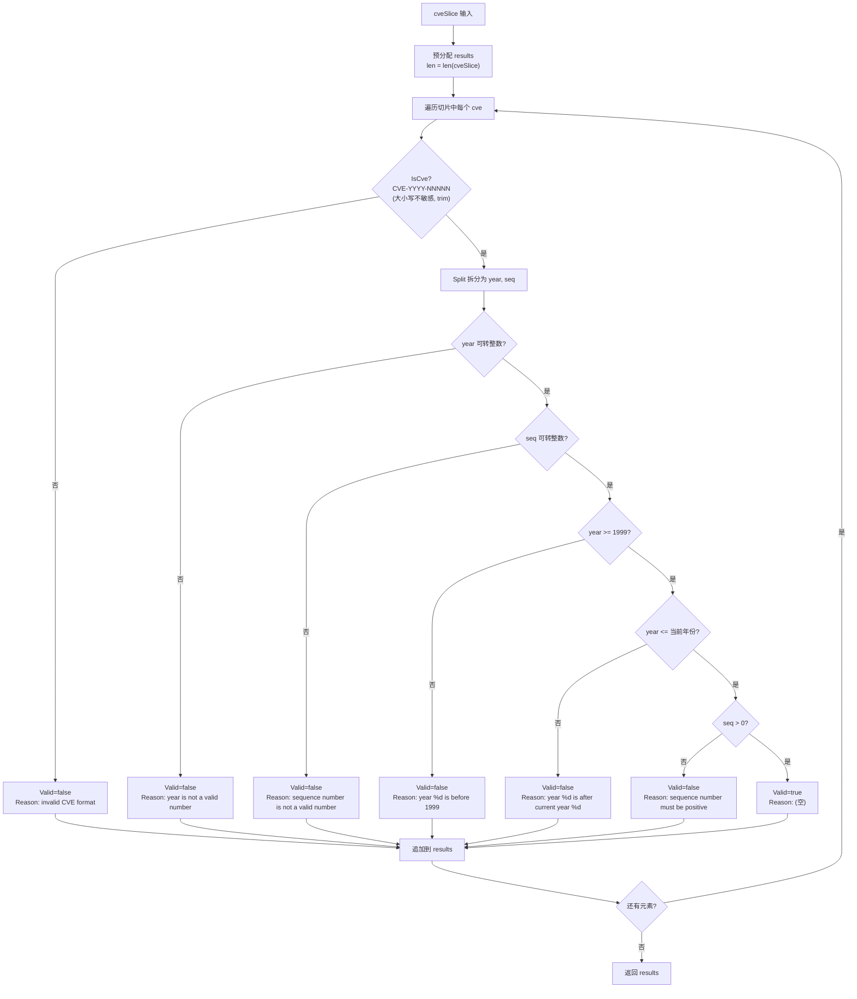

# ValidateCves 批量验证

:::tip 📂 查看源码
[`base.go:319`](https://github.com/scagogogo/cve-skills/blob/main/base.go#L319-L375) — 在 GitHub 上查看实现代码（第 319–375 行）。
:::

一次性验证一批 CVE 标识符，为每个条目返回带失败原因的详细结果。

:::tip 📌 场景
- 批量导入数据库或漏洞跟踪系统前，对 CVE 列表做质量检查
- 生成数据质量报告，记录哪些 CVE 失败以及失败原因
- 验证从外部数据源解析得到的 CVE 列表，其中预期存在无效条目，需要被报告而非被静默丢弃
:::

## 函数签名

```go
func ValidateCves(cveSlice []string) []CveValidationResult
```

返回值所用的 `CveValidationResult` 定义在同一 package 中：

```go
type CveValidationResult struct {
    Cve    string // 传入的原始 CVE 编号
    Valid  bool   // 是否有效
    Reason string // 无效原因，有效时为空字符串
}
```

## 参数

- `cveSlice` (`[]string`): 待验证的 CVE 编号字符串切片。每个元素独立验证。可为 `nil` 或空。

## 返回值

- `[]CveValidationResult`: 结果切片长度等于 `len(cveSlice)`。每个元素与输入元素位置一一对应，携带原始输入字符串、`Valid` 标志以及 `Reason` 字符串。返回切片始终非 nil（即便输入为空，也会返回一个长度为 0 的已分配切片）。

## 行为说明

- 遍历 `cveSlice`，通过内部 `validateSingleCve` 辅助函数逐个验证。它**不**委托给 `ValidateCve`，因此能给出精确的失败原因，而非单纯的 `bool`。
- 结果切片按输入长度预分配，输入与结果的位置对齐得到保证。
- 验证顺序（首次失败即短路返回）：
  1. 格式必须匹配 `CVE-YYYY-NNNNN`（大小写不敏感、允许首尾空白字符），由 `IsCve` 检查。失败原因：`"invalid CVE format"`。
  2. 年份必须可解析为整数。失败原因：`"year is not a valid number"`。
  3. 序列号必须可解析为整数。失败原因：`"sequence number is not a valid number"`。
  4. 年份必须 `>= 1999`。失败原因：`"year %d is before 1999"`。
  5. 年份必须 `<= 当前年份`（取自 `time.Now().Year()`）。失败原因：`"year %d is after current year %d"`。
  6. 序列号必须 `> 0`。失败原因：`"sequence number must be positive"`。
- 每条结果的 `Cve` 字段**原样**保留输入字符串，包含首尾空白与原始大小写，不做标准化。
- 空 / `nil` 输入切片返回非 nil 的空结果切片（不会 panic）。

## 流程图



## 示例

```go
package main

import (
    "fmt"

    "github.com/scagogogo/cve-skills"
)

func main() {
    // 混合列表：有效、格式无效、年份过早、年份过晚、序列号非数字
    input := []string{
        "CVE-2022-12345",     // 有效
        "CVE-1998-12345",     // 年份早于 1999
        "not-a-cve",          // 格式无效
        "cve-2022-0001",      // 有效（小写、前导零）
        " CVE-2022-0 ",       // 序列号非正整数
        "CVE-2022-ABC",       // 序列号不是数字
    }

    results := cve.ValidateCves(input)

    fmt.Printf("%-20s %-8s %s\n", "CVE", "Valid", "Reason")
    fmt.Println("------------------------------------------------------------")
    for _, r := range results {
        fmt.Printf("%-20s %-8t %s\n", r.Cve, r.Valid, r.Reason)
    }

    // 只收集通过验证的项，保留其原始输入
    var valid []string
    for _, r := range results {
        if r.Valid {
            valid = append(valid, r.Cve)
        }
    }
    fmt.Printf("\nValid CVEs: %v\n", valid)

    // 空 / nil 输入处理
    empty := cve.ValidateCves(nil)
    fmt.Printf("nil input -> len=%d, results==nil? %t\n", len(empty), empty == nil)
}
```

预期输出（假设当前年份为 2026）：

```text
CVE                  Valid    Reason
------------------------------------------------------------
CVE-2022-12345       true
CVE-1998-12345       false    year 1998 is before 1999
not-a-cve            false    invalid CVE format
cve-2022-0001        true
 CVE-2022-0          false    sequence number must be positive
CVE-2022-ABC         false    sequence number is not a valid number

Valid CVEs: [CVE-2022-12345 cve-2022-0001]
nil input -> len=0, results==nil? false
```

## 使用场景

- CVE 数据批量导入前的质量检查
- 生成记录失败条目及其失败原因的数据质量报告
- 验证从外部文档（安全公告、表格、CSV 导出）解析得到的 CVE 列表，再交给下游处理
- 在生产数据管道中对遇到的畸形 CVE 做审计日志记录

## 注意事项

- `Cve` 字段是**原始**输入，未做标准化——空白与大小写原样保留。如需标准形式，请对输入或 `r.Cve` 自行调用 `Format`。
- 与只返回 `bool` 的 `ValidateCve` 不同，`ValidateCves` 对每种失败都给出结构化原因，当需要报告或记录每个条目被拒原因时是更优选择。
- 年份校验使用调用时刻的 `time.Now().Year()`，因此上界取决于函数实际运行时的当前年份。
- 不去重也不合并——每个输入元素恰好产生一个结果元素，重复项亦然。
- 本函数不修改 `cveSlice`，输入切片保持不变。
- 若只需把列表过滤为有效 CVE（不需要原因），`FilterValidCves` 是更简洁的替代方案。

## 内部实现

`ValidateCves`（base.go:319–325）本身只是批量驱动器，真正的逐条逻辑位于未导出的辅助函数 `validateSingleCve`（base.go:328–374）。

- **预分配结果切片。** `results := make([]CveValidationResult, len(cveSlice))` 按输入长度精确分配输出切片，循环中通过下标写入 `results[i] = validateSingleCve(cve)`。这避免了 `append` 的扩容与再分配，且无需额外的索引跟踪变量即可保证输入与输出的位置对齐。
- **委托给专用辅助函数。** 每个元素通过 `validateSingleCve(cve)` 验证，而非 `ValidateCve`。辅助函数返回带 `Reason` 的结构化 `CveValidationResult`，而 `ValidateCve` 会把结果塌缩为单纯的 `bool`；批量函数复用该辅助函数，便免费获得了精确的失败原因。
- **彼此独立、无副作用地迭代。** `for i, cve := range cveSlice` 循环对每个条目独立验证：不去重、不在首个失败时终止整批、也不修改 `cveSlice`。某个坏条目只会通过 `validateSingleCve` 内部的 `return` 短路掉自身那一条结果，不会影响周围循环。
- **辅助函数内部的短路顺序。** `validateSingleCve` 先构造 `result := CveValidationResult{Cve: cve}` 以原样保留输入，再依次串联 `IsCve` → `Split` → `strconv.Atoi(year)` → `strconv.Atoi(seq)` → `yearInt < 1999` → `yearInt > currentYear` → `seqInt <= 0`，在首个失败谓词处 `return`。该顺序把最廉价的结构检查放在最前，把 `time.Now()` 调用推迟到尽量靠后。
- **保留原始输入、不做标准化。** `result.Cve` 在任何标准化（实际上未做任何标准化）之前就被设为原始 `cve` 参数，因此空白与原始大小写都会进入结果。`IsCve` 自身通过正则容忍首尾空白与大小写，但存入结果的字符串是未经触碰的原始输入。

## 复杂度

设 `n = len(cveSlice)`，`L` 为切片中任一 CVE 字符串的最大长度。

| 维度 | 开销 | 源码依据 |
|---|---|---|
| 时间 | 批量循环 `O(n)`；每个元素由 `IsCve` 的正则/trim 主导为 `O(L)`，总计 `O(n * L)` | `for i, cve := range cveSlice`（L321）加每次调用的 `IsCve`/`Split` |
| 空间 | 辅助空间 `O(n)` | `make([]CveValidationResult, len(cveSlice))`（L320）——每个输入元素对应一个结果结构体，无递归、无额外缓冲 |
| 分配 | 恰好一次切片头 + `n` 个结构体槽位，一次性分配到位 | 预定大小的 `make`，无 `append` 扩容 |
| 单元素短路 | `IsCve` 失败后最优 `O(1)` | `validateSingleCve` 内的提前 `return`（L331–L369） |

本函数不排序、不哈希、不重排数据，因此不存在 `O(n log n)` 或 `O(n+m)` 成分。`time.Now().Year()` 调用（L359）为 `O(1)`，且仅在越过格式与解析检查后的成功路径上才会到达。

## 边界情形

| 输入 | 行为 | 返回 |
|---|---|---|
| `nil` 切片 | `make([]CveValidationResult, 0)` 生成空且非 nil 的切片，循环体不执行 | `[]`，`len == 0`，`!= nil` |
| 空切片 `[]string{}` | 与 `nil` 相同——分配长度为 0 的切片 | `[]`，`len == 0`，`!= nil` |
| `"not-a-cve"`（格式错误） | `IsCve` 在 L331 返回 false | `{Cve: "not-a-cve", Valid: false, Reason: "invalid CVE format"}` |
| `"CVE-1998-12345"`（年份 < 1999） | 通过格式与解析，在 L353 处 `yearInt < 1999` 失败 | `{Cve: ..., Valid: false, Reason: "year 1998 is before 1999"}` |
| `"CVE-2099-12345"`（年份 > 当前） | 在 L360 处 `yearInt > currentYear` 失败 | `{Cve: ..., Valid: false, Reason: "year 2099 is after current year YYYY"}` |
| `"CVE-2022-ABC"`（序列号非数字） | L339 处 `strconv.Atoi(seq)` 出错 | `{Cve: ..., Valid: false, Reason: "sequence number is not a valid number"}` |
| `"CVE-2022-0"`（序列号非正） | 解析为 `0`，在 L366 处 `seqInt <= 0` 失败 | `{Cve: ..., Valid: false, Reason: "sequence number must be positive"}` |
| `"cve-2022-0001"`（小写） | `IsCve` 大小写不敏感 | `{Cve: "cve-2022-0001", Valid: true, Reason: ""}`——保留原始小写 |
| `" CVE-2022-0001 "`（首尾空白） | `IsCve` 做 trim；结果存原始输入 | `{Cve: " CVE-2022-0001 ", Valid: true, Reason: ""}`——空白保留 |
| 重复条目 | 不去重，每条各自产生结果 | `n` 个输入对应 `n` 个结果，重复项亦然 |
| 超长有效字符串 | 正则/解析随 `L` 增长 | 有效结果；该元素耗时 `O(L)` |

## 数据流

```text
                +-----------------------------+
   cveSlice ----> make([]CveValidationResult, |
  []string      |          len(cveSlice))     |
                +--------------+--------------+
                               |
                               v
                +--------------+--------------+
                | for i, cve := range cveSlice|
                +--------------+--------------+
                               |
                               v
          +--------------------+--------------------+
          |  validateSingleCve(cve)                 |
          |  result := CveValidationResult{Cve:cve} |
          +--------------------+--------------------+
                               |
                               v
                +--------------+--------------+
                | IsCve(cve)? 格式检查      |
                +--+--------+--------+--------+
                   | 否     | 是
                   v        v
        +----------+---+    +--+----------------------+
        | invalid CVE  |    | Split -> year, seq      |
        | format       |    | Atoi(year), Atoi(seq)   |
        +------+-------+    +------+--------+---------+
               |                   | 否     | 是
               v                   v        v
               |        +----------+---+    +--+-------------+
               |        | year/seq 非   |    | year < 1999 ? |
               |        | 数字          |    +--+-----+------+
               |        +------+--------+       | 否  | 是
               |               |                v     v
               |               |   +------------+--+  +-----+
               |               |   | year > now ?  |  | 太早|
               |               |   +--+-----+------+  +--+--+
               |               |      | 否  | 是         |
               |               |      v     v            |
               |               |   +--+-----+--+         |
               |               |   | seq <= 0 ?|         |
               |               |   +--+--+--+--+         |
               |               |      |否 |是           |
               |               |      v   v               |
               |               |   +--+---+--+           |
               |               |   | Valid=  |           |
               |               |   | true    |           |
               |               |   +----+----+           |
               |               |        |                |
               +---------------+--------+----------------+
                               |
                               v
                +--------------+--------------+
                | results[i] = result        |
                +--------------+--------------+
                               |
                               v
                +--------------+--------------+
                | 切片中还有元素?            |
                +--+-------------------------+
                   | 是        | 否
                   v            v
              (回到循环)    +----+----+
                            | return  |
                            | results |
                            +---------+
```

## 相关函数

- [ValidateCve](/zh/api/functions/validate-cve) — 单个 CVE 的全面验证，返回 `bool`
- [FilterValidCves](/zh/api/functions/filter-valid-cves) — 将切片过滤为有效 CVE（标准化为大写）
- [IsCve](/zh/api/functions/is-cve) — 轻量级格式检查，是内部验证的第一步
- [批量验证分类](/zh/api/batch-validation) — 全部批量验证函数总览
