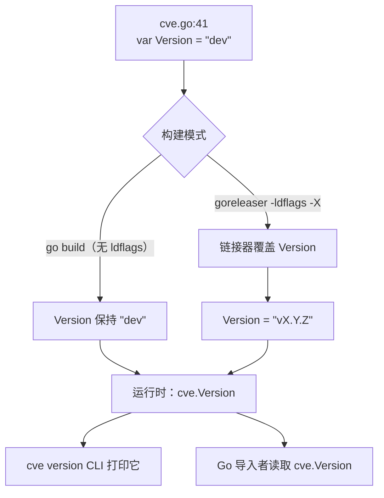

# Version 版本号

:::tip 📂 查看源码
[`cve.go:41`](https://github.com/scagogogo/cve-skills/blob/main/cve.go#L41-L41) — 在 GitHub 上查看声明代码（第 41 行）。
:::

`Version` 是 `cve` 库的包级版本字符串——故意声明为 `var`（而非 `const`），以便 goreleaser 在链接期通过 `-ldflags` 覆盖它。它是整个库中**唯一**的可变包级状态，存在的唯一目的就是被构建工具链注入。

:::tip 📌 场景
- 在运行时从 Go 代码中报告你的二进制链接的是哪个版本的库
- 根据已知版本做行为分支（例如在生产环境遇到 `"dev"` 时告警）
- 让 `cve version` CLI 子命令直接打印发布标签，无需重新实现版本发现机制
:::

## 声明

```go
// Version 表示当前包的版本号
var Version = "dev"
```

## 类型与默认值

- **类型**：`string`
- **默认值**：`"dev"`——不带 ldflags 注入的普通 `go build` 返回的哨兵值
- **可见性**：导出（大写 `V`），任何导入者都可读可写
- **可变性**：`var`，不是 `const`——这一点是关键约束，见 [为什么是 `var` 而非 `const`](#为什么是-var-而非-const)

## 行为说明

- 源码构建时（无 ldflags），`Version` 持有字面量字符串 `"dev"`。这是预期的哨兵值，不是 bug——它表示该二进制是直接从工作树构建的，未注入发布标签。
- 发布构建时，goreleaser 向链接器传递 `-ldflags "-X github.com/scagogogo/cve-skills.Version=vX.Y.Z"`，覆盖该 `var` 为发布的语义化版本标签（如 `"v1.2.3"`）。发布二进制的用户永远看不到默认的 `"dev"`。
- 该变量是普通的 `string`，没有访问器、没有 getter 函数、没有方法。调用方直接以 `cve.Version` 读取。
- 注入值不做任何校验——链接器写入什么字符串，`cve.Version` 就报告什么。goreleaser 被信任会写入格式正确的语义化标签。
- 该变量被 CLI 的 `version` 子命令读取（`cmd/version.go` 中的 `fmt.Println(cve.Version)`），任何 Go 导入者也可同样读取。

## 为什么是 `var` 而非 `const`

这是 `Version` 上最重要的设计约束，`cve.go` 中的文档注释明确警告不要更改它：

- Go 链接器的 `-X` 标志（`-X importpath.name=value`）只能覆盖**类型为 `string` 的包级 `var`**，无法覆盖 `const`。
- 如果 `Version` 声明为 `const`，`-ldflags "-X ...Version=v1.2.3"` 调用会**静默无效**——构建成功，标签未注入，每个发布二进制都会永远报告编译期默认值。这是一种静默失败：没有错误、没有警告，只是发布了错误的版本。
- 声明为 `var Version = "dev"` 使默认值显式（源码构建为 `"dev"`），同时保持符号可注入。`"dev"` 默认值是一个刻意信号：如果用户从发布二进制看到 `dev`，就知道 ldflags 步骤被跳过了。



## 示例

```go
package main

import (
	"fmt"

	"github.com/scagogogo/cve-skills"
)

func main() {
	// 运行时读取链接的版本
	fmt.Println("linked against cve-skills", cve.Version)
	// 源码构建输出：  linked against cve-skills dev
	// 发布构建输出：  linked against cve-skills v1.2.3

	// 根据哨兵值做分支——在 CI 或启动检查中很有用
	if cve.Version == "dev" {
		fmt.Println("warning: running an untagged build")
	}
}
```

在自己的构建中通过链接期注入版本：

```bash
# 注入指定版本构建 CLI
go build -ldflags "-X github.com/scagogogo/cve-skills.Version=v9.9.9" -o cve ./cmd/cve
./cve version
# stdout: v9.9.9

# 不带 ldflags 的普通构建保留默认哨兵值
go build -o cve ./cmd/cve
./cve version
# stdout: dev
```

## 使用场景

- **运行时版本报告**：导入该库的 Go 代码可在自己的 `--version` 标志、启动日志或健康检查端点中暴露 `cve.Version`。
- **哨兵检测**：以 `cve.Version == "dev"` 做分支，在期望发布版本的环境中警告正在运行未打标签的构建。
- **CLI 版本输出**：`cve version` 子命令直接打印 `cve.Version`，无需单独的版本发现机制。
- **可复现的 CI 日志**：在流水线步骤开头捕获 `$(cve version)`，以便事后将该次运行归属到特定的库版本。

## 注意事项

- `Version` 是 `cve` 包中**唯一**的可变包级状态。其他所有符号都是无状态的顶级函数。这是刻意的设计选择——见[库设计哲学](/zh/guide/library-design)。
- 默认值 `"dev"` 是哨兵，不是错误。源码构建报告 `dev` 是正确行为，不表示构建损坏。
- 注入值不做校验。如果通过 `-ldflags -X` 传入了格式错误的标签，`cve.Version` 会原样报告该错误字符串。
- 将声明从 `var` 改为 `const` 会静默破坏发布版本注入——`cve.go:26-40` 的文档注释明确警告了这一点。
- `Version` 中不含构建提交号或构建日期元数据。如果需要更丰富的构建信息，请在自己的构建脚本中叠加；`Version` 只承载语义化标签，仅此而已。

## 内部实现

`Version` 声明于 `cve.go:41`，是单行包级 `string` 类型 `var`，默认字面量为 `"dev"`：

- **`var` 而非 `const`**（L41）：声明为 `var Version = "dev"`。这是关键选择——Go 链接器的 `-X` 标志只能覆盖包级 `string` `var`，不能覆盖 `const`。声明上方的文档注释（L26–40）解释了这一点，并明确警告不要改为 `const`。
- **默认 `"dev"`**（L41）：初始化器是字符串字面量 `"dev"`。对于不带 ldflags 的普通 `go build`，这就是运行时看到的值。它是一个哨兵，意为"从源码构建，未注入发布标签"。
- **文档注释**（L26–40）：多行注释解释了语义化版本格式（`vX.Y.Z`）、goreleaser/ldflags 注入机制（`-X github.com/scagogogo/cve-skills.Version=v1.2.3`）以及 `var` 而非 `const` 的约束。该注释是声明为何如此书写的权威来源。
- **无访问器**：没有 `GetVersion()` 函数或方法。调用方直接读取 `cve.Version`——符号已导出（大写 `V`），对任何导入者可见。
- **读取点**（`cmd/version.go`）：CLI 的 `version` 子命令通过 `fmt.Println(cve.Version)` 打印 `cve.Version`，这是代码库中唯一为输出而消费该变量的位置。库导入者以同样方式读取它。

## 复杂度

| 资源 | 开销 | 驱动因素 |
|---|---|---|
| 时间（读取） | O(1) | 读取包级 `string` var 是单次内存加载 |
| 空间 | O(len(s)) | 一个字符串头；字符串本身由链接器按注入值内联 |
| 初始化 | 链接期 | 值在链接期由 `-ldflags -X` 固定，非运行时——没有 `init()` 会触碰 `Version` |

- 没有每次调用的开销：`Version` 作为全局变量读取，而非计算得到。
- `"dev"` 默认值和任何注入标签都是字符串字面量/常量数据，由链接器烘焙进二进制；读取时不发生分配。

## 边界情形

| 情形 | 行为 | 报告值 |
|---|---|---|
| 普通 `go build`（无 ldflags） | 使用默认初始化器 | `"dev"` |
| `go build -ldflags "-X ...Version=v1.2.3"` | 链接器用 `v1.2.3` 覆盖 `var` | `"v1.2.3"` |
| 发布二进制（goreleaser） | goreleaser 通过 `-X` 传递 git 标签 | 发布标签，如 `"v1.2.3"` |
| 格式错误的 ldflags 值（`-X ...Version=garbage`） | 不校验；链接器写入字面字符串 | `"garbage"` |
| 声明改为 `const`（切勿如此） | `-X` 静默无效；默认值作为常量烘焙 | 永远是 `"dev"`，发布也如此 |
| 从库自身的 Go 测试读取 `cve.Version` | `go test` 不带 ldflags，适用默认值 | `"dev"` |
| 空的 `-X ...Version=`（空值） | 链接器写入空字符串 | `""` |

## 数据流

```text
+---------------------------+        +---------------------------+
|  cve.go:41                |        |  构建工具链               |
|  var Version = "dev"      |        |  (goreleaser / go build)  |
+-------------+-------------+        +-------------+-------------+
              |                                  |
              |  默认初始化器                    |  -ldflags "-X ...Version=vX.Y.Z"
              |  (字符串字面量 "dev")            |  (链接器覆盖该 var)
              v                                  v
       +---------------------------------------------------+
       |            链接后二进制的 .data 段               |
       |   cve.Version = "dev"  或  cve.Version = "vX.Y.Z" |
       +-----------------------+---------------------------+
                               |
                               |  运行时读取（O(1) 全局加载）
                               v
            +----------------------------------------+
            |  消费者                                |
            |  - cmd/version.go: fmt.Println(...)    |
            |  - 任何 Go 导入者: cve.Version          |
            +----------------------------------------+
```

## 相关

- [cve version CLI 命令](/zh/cli/commands/version) — 向 stdout 打印 `cve.Version`
- [库设计哲学](/zh/guide/library-design) — 为什么 `Version` 是唯一的可变包级状态
- [CLI 约定](/zh/reference/cli-conventions) — CLI 如何报告其版本
- [下载与安装](/zh/download) — 预编译二进制随注入的发布标签一同发布
