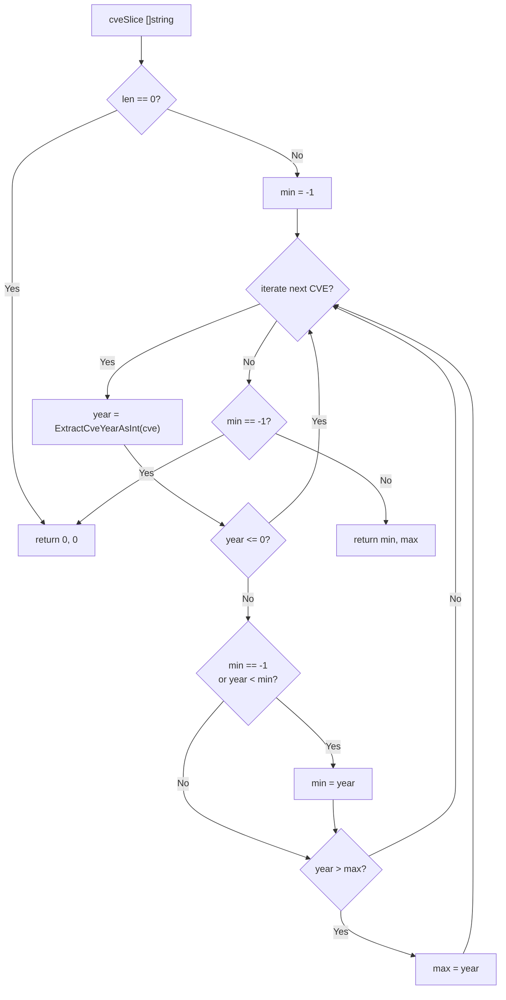

# YearRange 年份范围

:::tip 📂 查看源码
[`filter.go:479`](https://github.com/scagogogo/cve-skills/blob/main/filter.go#L479-L503) — 在 GitHub 上查看实现代码（第 479–503 行）。
:::

`YearRange` 扫描 CVE 编号列表，返回其中最早（最小）与最晚（最大）的年份，描述输入数据所覆盖的时间跨度。

:::tip 📌 场景
- 为安全报告确定 CVE 数据集的时间跨度
- 为仪表盘构建“CVE 跨度 YYYY 至 YYYY”的范围描述
- 校验导入的 CVE 数据是否落在预期的历史时间窗口内
:::

## 函数签名

```go
func YearRange(cveSlice []string) (min, max int)
```

## 参数

- `cveSlice` ([]string)：待扫描年份边界的 CVE 编号字符串切片

## 返回值

- `min` (int)：有效 CVE 中最早（最小）的年份；切片为空或无有效 CVE 时返回 `0`
- `max` (int)：有效 CVE 中最晚（最大）的年份；切片为空或无有效 CVE 时返回 `0`

## 行为说明

- 切片为空时立即短路，返回 `0, 0`
- 内部使用哨兵值 `min = -1` 检测首个有效年份，随后在迭代中不断收紧 `min`/`max`
- 每条 CVE 的年份通过 `ExtractCveYearAsInt` 提取；年份 `<= 0`（无法解析或无效）的条目会被跳过，不影响结果
- 若整轮扫描后未找到任何有效 CVE（`min` 仍为 `-1`），则返回 `0, 0`，调用方可将 `0` 视作“无数据”信号

## 流程图



## 示例

```go
package main

import (
	"fmt"

	"github.com/scagogogo/cve-skills"
)

func main() {
	// 源码示例：混合年份得到 min=2020, max=2022
	cves := []string{"CVE-2020-1111", "CVE-2022-2222", "CVE-2021-3333"}
	min, max := cve.YearRange(cves)
	fmt.Printf("input: %v -> min=%d, max=%d\n", cves, min, max) // min=2020, max=2022

	// 空数组：返回 0, 0
	empty := []string{}
	min, max = cve.YearRange(empty)
	fmt.Printf("empty -> min=%d, max=%d\n", min, max) // min=0, max=0

	// 无效条目被跳过，仅有效 CVE 参与计算
	mixed := []string{"not-a-cve", "", "CVE-2019-9999", "CVE-2018-1"}
	min, max = cve.YearRange(mixed)
	fmt.Printf("mixed -> min=%d, max=%d\n", min, max) // min=2018, max=2019

	// 全部无效：未找到有效年份，返回 0, 0
	allInvalid := []string{"garbage", "CVE-YYYY-NNNN", ""}
	min, max = cve.YearRange(allInvalid)
	fmt.Printf("allInvalid -> min=%d, max=%d\n", min, max) // min=0, max=0

	// 单元素切片：min == max
	single := []string{"CVE-2024-12345"}
	min, max = cve.YearRange(single)
	fmt.Printf("single -> min=%d, max=%d\n", min, max) // min=2024, max=2024
}
```

## 使用场景

- 为趋势分析或报表确定 CVE 数据集的时间跨度
- 为仪表盘与摘要生成“CVE 跨度 YYYY 至 YYYY”的描述
- 对导入的 CVE 数据按预期历史窗口做合理性校验
- 与 `CountByYear` 配合，为按年份分桶的可视化提供边界

## 注意事项

- `0` 是“无数据”哨兵——空切片与全无效切片都返回 `0, 0`，调用方应将 `min == 0` 视作空/无有效 CVE 的信号，而非真实年份
- 年份提取委托给 `ExtractCveYearAsInt`；无法解析出正年份的条目会被静默跳过，因此范围仅反映有效 CVE
- 结果仅为描述性——`YearRange` 不校验年份是否落在现实的 1999..当前年份 窗口内，需配合 `IsCveYearOk` 做该校验
- 需要按年份细分而非仅取边界时，使用 `CountByYear`；需要有序输出时使用 `SortCves`
- 复杂度为 O(n)，单次遍历，且函数只读、并发安全

## 内部实现

函数体（L479-L503）是一个围绕哨兵值的单遍扫描，不涉及排序或辅助数据结构：

- **空切片守卫（L480-L482）**：`if len(cveSlice) == 0 { return 0, 0 }` 在迭代前短路，因此 nil 或空切片根本不会进入哨兵逻辑，直接返回标准的“无数据”结果 `0, 0`。
- **哨兵初始化（L484）**：`min = -1` 以 `-1`（不可能出现的真实年份）作为“尚未见到有效年份”的标记。由于 `max` 的零值就是 `0`，只有 `min` 需要哨兵来区分“首个有效年份”与“收紧已有最小值”。
- **逐元素提取（L486）**：`year := ExtractCveYearAsInt(cve)` 将解析完全委托给共享的提取器，`YearRange` 因此继承该辅助函数所做的一切归一化（数字、符号、错误处理），保证年份解析逻辑只有一处实现。
- **跳过无效项（L487-L489）**：`if year <= 0 { continue }` 丢弃无法解析或非正的年份，不影响 `min`/`max`，因此垃圾条目对结果不可见，而非污染边界值。
- **收紧边界（L490-L495）**：`if min == -1 || year < min { min = year }` 在首个有效年份时种子化最小值、并在更小者出现时更新；`if year > max { max = year }` 跟踪运行中的最大值。两个比较相互独立，单条新 CVE 一次迭代即可更新其一或同时更新两者。
- **最终哨兵检查（L498-L500）**：`if min == -1 { return 0, 0 }` 将“扫描完毕但未找到任何有效年份”这一情形映射回与空切片相同的 `0, 0` 信号，使调用方只需判断一个分支即可识别“无数据”。

## 复杂度

| 维度 | 代价 | 原因 |
|---|---|---|
| 时间 | O(n) | 对 `n` 元素切片做一次正向遍历；每个元素做常量工作（一次 `ExtractCveYearAsInt` 调用加至多两次比较） |
| 空间 | O(1) | 仅持有两个具名返回值 `min`、`max` 及循环局部变量 `year`/`cve`；不分配切片、map，也不递归 |
| 辅助调用 | O(n) × `ExtractCveYearAsInt` | 每个元素触发一次提取器调用；该提取器自身的复杂度与本函数无关 |

说明：扫描为只读且无副作用，因此在多个 goroutine 共享同一输入切片时并发安全。最坏情形（全部条目无效）仍以 O(n) 终止并返回哨兵 `0, 0`。

## 边界情形

| 输入 | 行为 | 返回 |
|---|---|---|
| `nil` 或 `[]`（空切片） | `len == 0` 守卫立即触发，不进入迭代 | `0, 0` |
| 全部无效（`"garbage"`、`""`、`"CVE-YYYY-NNNN"`） | 每条 `year <= 0` 均被跳过；`min` 保持 `-1`；最终检查返回 `0, 0` | `0, 0` |
| 有效与无效混合（`"not-a-cve", "CVE-2019-9999"`） | 无效条目经 `continue` 跳过；仅有效年份种子化/更新边界 | 仅有效年份的 `(min, max)` |
| 单条有效 CVE（`"CVE-2024-12345"`） | 首个有效年份同时种子化 `min` 与 `max`（因 `year > 0 == max`） | `year, year` |
| 年份重复（`"CVE-2020-1", "CVE-2020-2"`） | 第二个相等年份不满足 `year < min` 与 `year > max`，边界不变 | `2020, 2020` |
| 输入字符串大小写差异 | 交由 `ExtractCveYearAsInt`；本函数自身不做任何大小写归一——容忍度取决于提取器 | 依提取器行为而定 |
| 年份超出合理窗口（如 `CVE-0001-1`、`CVE-9999-1`） | 此处不校验——任何正整数都被接受为边界 | `(1, 9999)`（需配合 `IsCveYearOk` 才能拒绝） |

## 数据流

```text
+---------------------+
| cveSlice []string   |
|  (输入 CVE 列表)    |
+----------+----------+
           |
           v
   +-------+-------+
   | len == 0 ?    |
   +-------+-------+
      |        |
   Yes|        |No
      v        v
+----+----+ +--+------+
| return  | | min = -1|
| 0, 0    | | max = 0 |
+---------+ +----+----+
                 |
                 v
          +------+------+
          | 遍历切片中  |
          |  每条 cve   |
          +------+------+
                 |
                 v
          +------+----------------+
          | year = ExtractCveYear |
          |        AsInt(cve)      |
          +------+----------------+
                 |
                 v
          +------+------+
          | year <= 0 ?  |
          +------+------+
            |        |
          Yes|        |No
            v        v
     +------+--+ +---+----------------+
     | continue | | min == -1         |
     | (跳过)   | | 或 year < min ?   |
     +---------+ +---+----------------+
                    |           |
                  Yes|           |No
                    v           v
              +----+----+ +----+--------------+
              | min =   | | year > max ?      |
              |  year   | +----+--------------+
              +----+----+   |          |
                    |     Yes|          |No
                    v        v          |
              +----+----+              |
              | max =   |              |
              |  year   |              |
              +----+----+              |
                    |                  |
                    +------------------+
                             |
                             v
                       (下一次迭代)
                             |
                   (切片遍历完毕)
                             |
                             v
                   +---------+---------+
                   | min == -1 ?       |
                   +---------+---------+
                      |             |
                    Yes|             |No
                      v              v
                +-----+----+   +-----+--------+
                | return   |   | return       |
                | 0, 0     |   | min, max     |
                +----------+   +--------------+
```

## 相关函数

- [CountByYear](/zh/api/functions/count-by-year) — 按年份分组并统计每个年份的数量
- [ExtractCveYearAsInt](/zh/api/functions/extract-cve-year-as-int) — 内部使用的、将年份提取为整数
- [SortCves](/zh/api/functions/sort-cves) — 按时间顺序排序 CVE
- [GetRecentCves](/zh/api/functions/get-recent-cves) — 按年份获取最近的 CVE
- [统计分类](/zh/api/statistics)
