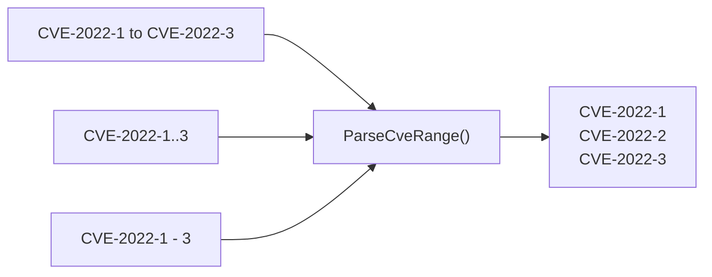

# 范围与模式

这一类函数提供 CVE 范围解析、通配符模式匹配和连续 CVE 检查功能。

`ParseCveRange` 接受三种分隔符语法,均展开为同一列表:



## ParseCveRange

解析 CVE 范围表达式并将其展开为单个 CVE 编号列表。

### 函数签名

```go
func ParseCveRange(rangeExpr string) []string
```

### 参数

- `rangeExpr` (string): 支持格式之一的范围表达式

### 返回值

- `[]string`: 范围内的所有 CVE 编号；表达式无效时返回 nil

### 支持的格式

- `CVE-2022-12345 to CVE-2022-12350`（关键字 "to"）
- `CVE-2022-12345..12350`（双点号）
- `CVE-2022-12345-12350`（短横线分隔符）

### 功能描述

`ParseCveRange` 函数解析安全公告中常见的 CVE 范围表达式，并将其展开为单个 CVE 编号。起始和结束必须在同一年份内。

### 使用示例

```go
cves := cve.ParseCveRange("CVE-2022-12345 to CVE-2022-12348")
fmt.Println(cves)
// 输出: [CVE-2022-12345 CVE-2022-12346 CVE-2022-12347 CVE-2022-12348]
```

## IsCvesConsecutive

检查两个 CVE 编号是否连续（同年份，序列号相邻）。

### 函数签名

```go
func IsCvesConsecutive(a, b string) bool
```

### 参数

- `a` (string): 第一个 CVE 编号
- `b` (string): 第二个 CVE 编号

### 返回值

- `bool`: 如果两个 CVE 年份相同且序列号差值恰好为 1，则返回 true

### 使用示例

```go
fmt.Println(cve.IsCvesConsecutive("CVE-2022-12345", "CVE-2022-12346"))
// 输出: true
fmt.Println(cve.IsCvesConsecutive("CVE-2022-12345", "CVE-2022-12347"))
// 输出: false
```

## FilterCvesByPattern

通过通配符模式过滤 CVE 编号。

### 函数签名

```go
func FilterCvesByPattern(cveSlice []string, pattern string) []string
```

### 参数

- `cveSlice` ([]string): 要过滤的 CVE 编号列表
- `pattern` (string): 通配符模式（例如 `CVE-2022-*`、`CVE-*-1111`、`CVE-2022-1*`）

### 返回值

- `[]string`: 匹配模式的 CVE，已格式化和排序；无匹配时返回 nil

### 功能描述

`FilterCvesByPattern` 函数支持简单的通配符匹配，`*` 匹配任意字符序列。模式匹配不区分大小写。特殊字符如 `.`、`+`、`[` 等会自动转义。

### 使用示例

```go
cves := []string{"CVE-2022-1111", "CVE-2022-2222", "CVE-2023-1111", "CVE-2023-2222"}

cves2022 := cve.FilterCvesByPattern(cves, "CVE-2022-*")
fmt.Println(cves2022)
// 输出: [CVE-2022-1111 CVE-2022-2222]

cve1111 := cve.FilterCvesByPattern(cves, "CVE-*-1111")
fmt.Println(cve1111)
// 输出: [CVE-2022-1111 CVE-2023-1111]
```

::: tip 相关
需要把序列号补零到固定宽度以便对齐？请参见「格式化与验证」中的 [`FormatSeq`](/zh/api/format-validate#formatseq)。
:::
