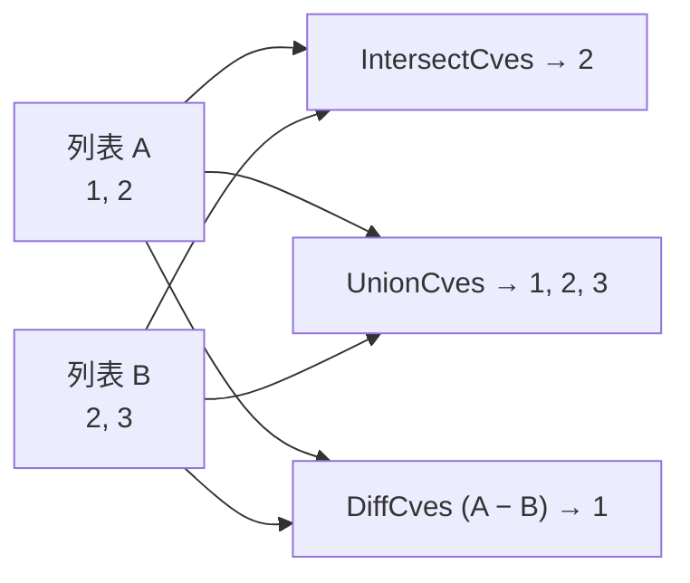

# 集合运算

这一类函数提供 CVE 列表的集合运算（交集、并集、差集），适用于合并或比较来自多个数据源的 CVE 数据。

设两个列表 `A = {1, 2}`、`B = {2, 3}`,三种运算的结果为:



## IntersectCves

计算两个 CVE 列表的交集 — 返回在两个列表中均出现的 CVE 编号。

### 函数签名

```go
func IntersectCves(a, b []string) []string
```

### 参数

- `a` ([]string): 第一个 CVE 列表
- `b` ([]string): 第二个 CVE 列表

### 返回值

- `[]string`: 两个列表中均存在的 CVE 编号，已去重、格式化为大写并排序

### 功能描述

`IntersectCves` 函数返回在两个输入列表中均存在的 CVE 编号。比较时不区分大小写，结果按年份和序列号排序。

### 使用示例

```go
package main

import (
    "fmt"
    "github.com/scagogogo/cve-skills"
)

func main() {
    list1 := []string{"CVE-2022-1111", "CVE-2022-2222", "CVE-2022-3333"}
    list2 := []string{"CVE-2022-2222", "CVE-2022-3333", "CVE-2022-4444"}

    common := cve.IntersectCves(list1, list2)
    fmt.Println(common)
    // 输出: [CVE-2022-2222 CVE-2022-3333]
}
```

## UnionCves

计算两个 CVE 列表的并集 — 返回两个列表中所有 CVE 编号，已去重。

### 函数签名

```go
func UnionCves(a, b []string) []string
```

### 参数

- `a` ([]string): 第一个 CVE 列表
- `b` ([]string): 第二个 CVE 列表

### 返回值

- `[]string`: 两个列表中所有 CVE 编号，已去重、格式化为大写并排序

### 功能描述

`UnionCves` 函数合并两个 CVE 列表并移除重复项。比较时不区分大小写，结果按年份和序列号排序。

### 使用示例

```go
list1 := []string{"CVE-2022-1111", "CVE-2022-2222"}
list2 := []string{"CVE-2022-2222", "CVE-2022-3333"}

all := cve.UnionCves(list1, list2)
fmt.Println(all)
// 输出: [CVE-2022-1111 CVE-2022-2222 CVE-2022-3333]
```

## DiffCves

计算两个 CVE 列表的差集 (a - b) — 返回在列表 a 中但不在列表 b 中的 CVE 编号。

### 函数签名

```go
func DiffCves(a, b []string) []string
```

### 参数

- `a` ([]string): 源 CVE 列表（被减数）
- `b` ([]string): 要排除的 CVE 列表（减数）

### 返回值

- `[]string`: 在 `a` 中但不在 `b` 中的 CVE 编号，已去重、格式化为大写并排序

### 功能描述

`DiffCves` 函数查找在列表 `a` 中但不在列表 `b` 中的 CVE 编号。这对于通过比较当前数据与历史数据来检测新增 CVE 非常有用。比较时不区分大小写。

### 使用示例

```go
current := []string{"CVE-2022-1111", "CVE-2022-2222", "CVE-2022-3333"}
historical := []string{"CVE-2022-2222", "CVE-2022-4444"}

newCves := cve.DiffCves(current, historical)
fmt.Println(newCves)
// 输出: [CVE-2022-1111 CVE-2022-3333]
```
