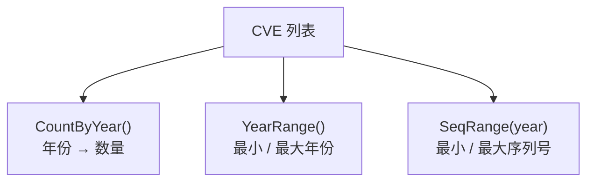

# 统计分析

这一类函数提供 CVE 数据的统计分析功能，包括按年份计数、年份范围检测和序列号范围分析。

一份 CVE 列表可得出三种互补的汇总：



## CountByYear

按年份统计 CVE 数量。

### 函数签名

```go
func CountByYear(cveSlice []string) map[int]int
```

### 参数

- `cveSlice` ([]string): CVE 编号切片

### 返回值

- `map[int]int`: 年份到 CVE 数量的映射

### 功能描述

`CountByYear` 函数按年份对 CVE 编号进行分组，并返回每个年份的数量。无效的 CVE（无法解析年份）会被排除在结果之外。

### 使用示例

```go
cves := []string{"CVE-2022-1111", "CVE-2022-2222", "CVE-2021-3333", "CVE-2022-4444"}
counts := cve.CountByYear(cves)
fmt.Println(counts)
// 输出: map[2021:1 2022:3]
```

## YearRange

获取 CVE 列表中最早和最晚的年份。

### 函数签名

```go
func YearRange(cveSlice []string) (min, max int)
```

### 参数

- `cveSlice` ([]string): CVE 编号切片

### 返回值

- `min` (int): 最早年份；无有效 CVE 时返回 0
- `max` (int): 最晚年份；无有效 CVE 时返回 0

### 使用示例

```go
cves := []string{"CVE-2020-1111", "CVE-2022-2222", "CVE-2021-3333"}
min, max := cve.YearRange(cves)
fmt.Printf("范围: %d - %d\n", min, max)
// 输出: 范围: 2020 - 2022
```

## SeqRange

获取指定年份中 CVE 的序列号范围。

### 函数签名

```go
func SeqRange(cveSlice []string, year int) (min, max int)
```

### 参数

- `cveSlice` ([]string): CVE 编号切片
- `year` (int): 要分析的目标年份

### 返回值

- `min` (int): 指定年份中最小的序列号；无 CVE 时返回 0
- `max` (int): 指定年份中最大的序列号；无 CVE 时返回 0

### 使用示例

```go
cves := []string{"CVE-2022-1111", "CVE-2022-5555", "CVE-2022-3333", "CVE-2021-9999"}
min, max := cve.SeqRange(cves, 2022)
fmt.Printf("2022年序列号范围: %d - %d\n", min, max)
// 输出: 2022年序列号范围: 1111 - 5555
```
