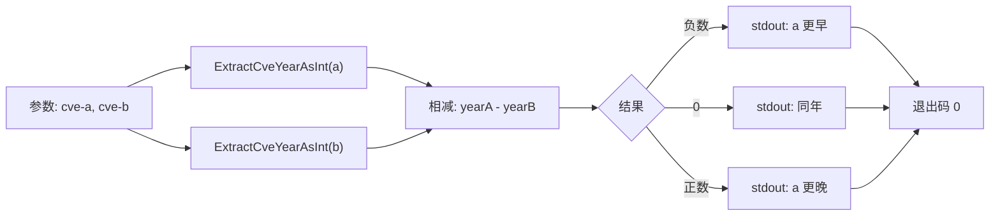

# cve compare by-year 按年比较

:::tip 📂 查看源码
[`cmd/compare.go:48`](https://github.com/scagogogo/cve-skills/blob/main/cmd/compare.go#L48-L62) — 在 GitHub 上查看 cobra 命令定义（第 48–62 行）。
:::

仅按**年份**比较两个 CVE 编号，并输出带符号的年份差值 —— 第一个更早为负，同年为零，第一个更晚为正。

:::tip 🖥️ 适用场景
- 在序列号无关时，按发布年份排序或分桶 CVE。
- 计算两份漏洞公告之间的年份间隔（例如“它们相差几年”）。
- 在 shell 管道中作为轻量的年份判断条件，只关心结果的正负号。
:::

## 命令语法

```bash
cve compare by-year <cve-a> <cve-b>
```

该命令接收恰好两个位置参数，向 stdout 输出一个整数。与列表型子命令不同，它**不会**回退到 stdin —— 两个 CVE 都必须以参数形式传入。

## 参数与选项

- `<cve-a>`（位置参数，必填）：第一个 CVE 编号，例如 `CVE-2021-44228`。
- `<cve-b>`（位置参数，必填）：第二个 CVE 编号，例如 `CVE-2022-12345`。
- 本命令自身**不定义任何 flag**。全局 `-q, --quiet` 标志继承自根命令。
- 参数数量由 `cobra.ExactArgs(2)` 强制校验：传入少于或多于两个参数都会以退出码 `1` 退出，并在 stderr 输出用法错误。

## 使用示例

第一个 CVE 早一年，因此结果为 `-1`：

```bash
$ cve compare by-year CVE-2021-44228 CVE-2022-12345
-1
```

同年、不同序列号 —— 序列号被忽略，结果为 `0`：

```bash
$ cve compare by-year CVE-2022-1 CVE-2022-99999
0
```

第一个 CVE 更晚；数值即为年份差（此处 `2023 - 2021 = 2`）：

```bash
$ cve compare by-year CVE-2023-1111 CVE-2021-2222
2
```

在 shell 条件判断中利用正负号来分支：

```bash
$ if [ "$(cve compare by-year CVE-2024-1 CVE-2021-1)" -gt 0 ]; then echo "newer"; fi
newer
```

## 工作流程



## 对应 Go API

本命令是 [`CompareByYear`](/api/functions/compare-by-year) 的轻量封装，后者返回 `ExtractCveYearAsInt(cveA) - ExtractCveYearAsInt(cveB)`。因此返回值是**带符号的年份差值**，而非 [`CompareCves`](/api/functions/compare-cves)（被 `cve compare` 使用）产生的 `-1 / 0 / 1` 三态。CLI 仅打印该整数。当你在代码中需要数值差而非纯文本输出时，请直接使用该 Go 函数。

## 退出码与输出

- 退出码 `0`：命令正常结束，向 stdout 输出一个整数。
- 退出码 `1`：参数数量不等于二。此时向 stderr 输出错误 `accepts 2 arg(s), received N`。
- stdout：单独一行，包含带符号整数 `yearA - yearB`。
- stderr：仅输出上述参数数量错误。比较结果绝不写入 stderr。

## 注意事项

- 输出是**年份差值**，而非被截断的正负号。`CVE-2025-1` 与 `CVE-2020-1` 的输出为 `5`，而非 `1`。若需要纯粹的 `-1 / 0 / 1` 排序，请改用 `cve compare`。
- 序列号**完全被忽略** —— `CVE-2022-1` 与 `CVE-2022-99999` 比较为相等。
- 非法 CVE 会被 `ExtractCveYearAsInt` 视为年份 `0`。因此将非法输入与 `CVE-2022-1` 比较会得到 `-2022`，两个非法输入比较会得到 `0`。若对此敏感，请先用 `cve validate` 校验输入。
- 年份提取纯属文本解析，不会校验年份是否落在 `1999..当前年份` 范围内。假设的 `CVE-1800-1` 会被解析为年份 `1800` 而不报错。
- 比较前不会规范化大小写与两侧空白 —— 请传入已格式化的编号，或先执行 `cve format`。

## 内部实现

`compareByYearCmd` cobra 命令（`cmd/compare.go:48-L62`）是一个极简的位置参数命令，其 `Run` 逻辑仅有四行：

- **参数接收**：命令声明 `Use: "by-year [cve-a] [cve-b]"`，并用 `Args: cobra.ExactArgs(2)` 校验数量，因此在 `Run` 执行前 `args[0]` 与 `args[1]` 必定存在。
- **`Run` 中不读取 flag**：函数体内从未调用 `cmd.Flags()`，完全忽略继承自根命令的全局 `-q/--quiet` 标志，只处理两个位置参数。
- **库函数调用**：实际工作委托给 `cvepkg.CompareByYear(args[0], args[1])`，该函数返回 `ExtractCveYearAsInt(args[0]) - ExtractCveYearAsInt(args[1])` 的带符号整数。CLI 层不做任何解析、规范化或校验。
- **输出格式化**：返回的整数直接交给 `fmt.Println(result)`，向 stdout 写出数字及一个换行符。没有模板、没有着色、也没有额外输出。

## 参数流

```text
+--------------------------+
| CLI: cve compare by-year |
|   args[0] = cve-a        |
|   args[1] = cve-b        |
+-----------+--------------+
            |
            v
+--------------------------+
| cobra.ExactArgs(2) 校验  |
|  数量 == 2 ?             |
+-----+--------------+-----+
      |否            |是
      v              v
+-----------+   +-----------------------------+
| stderr:   |   | cvepkg.CompareByYear(a, b)  |
| accepts 2 |   |  yA = ExtractCveYearAsInt(a)|
| arg(s)... |   |  yB = ExtractCveYearAsInt(b)|
| 退出码 1  |   |  return yA - yB             |
+-----------+   +--------------+--------------+
                               |
                               v
                  +--------------------------+
                  | fmt.Println(result)      |
                  |   stdout: "<整数>\n"      |
                  +------------+-------------+
                               |
                               v
                  +--------------------------+
                  | 退出码 0                  |
                  +--------------------------+
```

## 边界情形

| 输入 | 行为 | 退出码 / 输出 |
| --- | --- | --- |
| 无参数（`cve compare by-year`） | `cobra.ExactArgs(2)` 在 `Run` 之前拒绝调用 | 退出 `1`；stderr `accepts 2 arg(s), received 0` |
| 一个参数 | 同样的数量校验 | 退出 `1`；stderr `accepts 2 arg(s), received 1` |
| 三个或更多参数 | 同样的数量校验；多余参数不会进入 `Run` | 退出 `1`；stderr `accepts 2 arg(s), received N` |
| stdin（管道输入，无参数） | 不读取 —— stdin 被完全忽略 | 退出 `1`；stderr 数量错误（stdin **不是**回退源） |
| 两个合法 CVE、同年 | 年份相减为零；序列号被忽略 | 退出 `0`；stdout `0` |
| 两个合法 CVE、年份差为 N | 输出带符号差值 `yearA - yearB` | 退出 `0`；stdout 整数（如 `-1`、`5`） |
| 非法 CVE 字符串作为参数 | `ExtractCveYearAsInt` 视为年份 `0`；减法照常执行 | 退出 `0`；stdout 如 `-2022`（不抛错） |
| 两个非法参数 | `0 - 0 = 0` | 退出 `0`；stdout `0` |
| 参数含多余前后空白 | 不做 trim；年份提取可能回退为 `0` | 退出 `0`；stdout 反映解析（通常为 `0`）的年份 |

## 退出码

- **退出 `0`**：正常路径。`Run` 被执行（恰好两个参数），`CompareByYear` 正常返回未 panic，`fmt.Println` 将整数写入 stdout。命令本身不调用 `os.Exit` —— Go 在 `main` 正常返回后的默认退出码即为 `0`。
- **退出 `1`**：仅由 `cobra.ExactArgs(2)` 在参数数量不等于二时触发。Cobra 向 stderr 输出 `accepts 2 arg(s), received N` 及命令用法，并返回非 nil 错误，根执行器将其转换为退出码 `1`。
- **stderr 输出**：仅可能出现 cobra 的数量错误（及用法说明）。比较结果（包括非法输入回退为年份 `0` 的情形）始终写入 stdout —— `Run` 中不存在任何输出错误的代码路径。

## 相关命令

- [cve compare](/cli/commands/compare) —— 按年份**和**序列号完整比较，返回 `-1 / 0 / 1`。
- [cve compare sort](/cli/commands/compare-sort) —— 按年份再按序列号升序排序。
- [cve filter by-year](/cli/commands/filter-by-year) —— 仅保留指定年份的 CVE。
- [cve count-by-year](/cli/commands/count-by-year) —— 按年份统计 CVE 数量。
- [CLI 参考](/cli) —— 完整命令树与 I/O 约定。
