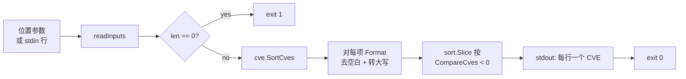

# cve compare sort 排序

:::tip 📂 查看源码
[`cmd/compare.go:27`](https://github.com/scagogogo/cve-skills/blob/main/cmd/compare.go#L27-L46) — 在 GitHub 上查看 cobra 命令定义（第 27–46 行）。
:::

将一组 CVE 标识符按**年份、再按序列号升序**排列，逐行输出标准化为大写后的结果。

:::tip 🖥️ 适用场景
- 把无序的 CVE 列表整理成按时间排序的漏洞报告或时间线视图。
- 对从通告文本中抽取的结果（`cve extract`）排序，让最早的 CVE 排在最前、最新的在最后。
- 在执行集合运算或差集前建立规范次序，使两条流水线产出可比较的输出。
:::

## 命令语法

```bash
cve compare sort [cve-id...]
```

该命令是 `cve compare` 的子命令。它接受位置参数形式的 CVE 标识符；未提供参数时则从 stdin 逐行读取。

## 参数与选项

- `[cve-id...]`（位置参数，可重复）：零个或多个 CVE 标识符。每个参数被视为**一个完整的 CVE** —— 本命令**不**按逗号切分，与 `filter-valid` 等列表型命令不同。
- stdin 回退：未提供位置参数且 stdin 为管道输入时，每一非空行被视为一个 CVE，空行被跳过。
- 本命令**未定义自身 flags**，继承根命令的全局 `-q, --quiet`。

## 使用示例

以参数形式传入三个 CVE，按年份升序、同年内按序列号升序输出，且全部转为大写：

```bash
$ cve compare sort CVE-2022-2222 CVE-2020-1111 CVE-2022-1111
CVE-2020-1111
CVE-2022-1111
CVE-2022-2222
```

大小写混合的输入会被规范化 —— `cve-...` 变为 `CVE-...`，前后空白被去除：

```bash
$ cve compare sort " cve-2022-9 " CVE-2021-100
CVE-2021-100
CVE-2022-9
```

通过 stdin 传入无序列表，这是流水线中的自然形态：

```bash
$ printf 'CVE-2024-5\nCVE-2019-1\nCVE-2024-2\n' | cve compare sort
CVE-2019-1
CVE-2024-2
CVE-2024-5
```

在抽取之后串联使用，按时间顺序展示 CVE：

```bash
$ cve extract "affects CVE-2022-12345 and CVE-2020-5 and CVE-2022-1" | cve compare sort
CVE-2020-5
CVE-2022-1
CVE-2022-12345
```

重复项**不**合并 —— 两份拷贝都会被排序后输出。如需去重集合，请在之后接 `cve filter dedup`：

```bash
$ cve compare sort CVE-2022-1 CVE-2022-1 CVE-2020-1
CVE-2020-1
CVE-2022-1
CVE-2022-1
```

## 工作流程



## 对应 Go API

本命令是 [`SortCves`](/api/functions/sort-cves) 的薄封装。该函数拷贝输入切片，对每个元素执行 `Format`，再用 `sort.Slice` 以 `CompareCves` 作为比较器排序。全部排序与规范化逻辑都在库中实现。若你在代码中需要的是排好序的切片而非打印文本，请直接调用该 Go 函数。

## 退出码与输出

- 退出码 `0`：命令正常执行完毕，按每个输入 CVE 输出一行。
- 退出码 `1`：未提供任何输入（既无位置参数，stdin 也无管道输入）。
- stdout：每行一个 CVE，按升序排列，均为标准化大写形式（`CVE-YYYY-NNNNN`，去除前后空白）。看起来非法的条目不会被校验 —— 它们仍会被格式化并参与排序，因此畸形项会出现在 `CompareCves` 所判定的位置上。
- stderr：成功时静默；在无输入失败场景下 stdout 不输出任何内容，进程以 `1` 退出。

## 注意事项

- 排序规则是**先按年份、再按序列号** —— 与 `cve compare` 成对比较返回 `-1 / 0 / 1` 所用的次序一致。年份与序列号都相同的两个 CVE 视为相等，相对次序保持不变（由 `sort.Slice` 保证稳定）。
- 本命令**不**按逗号切分参数 —— `cve compare sort "CVE-2022-1,CVE-2020-1"` 会把整串当作一个（非法）条目。请将各项作为独立参数或独立 stdin 行传入。
- 条目**不做校验** —— `cve compare sort` 会照常排序畸形 token。若只需输出中包含格式正确的 CVE，请先运行 `cve filter-valid`。
- 重复项**保留**。可配合 `cve filter dedup` 得到排序且去重的列表。
- 此处**不**强制年份上限（排序不会拒绝未来年份）；基于校验的过滤属于 `filter-valid` 或 `validate` 的职责。

## 内部实现

`sortCmd` 这个 cobra 命令（`cmd/compare.go:27-L46`）在 `init()` 中被注册为 `compareCmd` 的子命令。其 `Run` 函数逻辑如下：

1. **`Run` 中不做 flag 解析。** 本命令未定义自身 flag，完全依赖 cobra 传入的位置参数 `args []string` 与继承的根命令 flag。进入 `Run` 之前，cobra 已完成命令行切分。
2. **通过 `readInputs(args)` 收集输入。** 该共享辅助函数负责汇聚 CVE 标识符：`args` 非空时直接使用参数；`args` 为空时回退到 stdin，逐行读取非空行作为 CVE。这就是本命令能透明支持参数输入与流水线输入的原因。
3. **空输入保护。** 收集完成后立即执行 `if len(inputs) == 0 { os.Exit(1) }`，在任何排序之前以退出码 `1` 中止——不打印任何错误信息，进程直接终止。
4. **排序并输出。** `sorted := cvepkg.SortCves(inputs)` 将全部规范化（经 `Format` 去空白并转大写）与排序（`sort.Slice` 配合 `CompareCves`）委托给库完成。随后 `Run` 函数循环 `for _, c := range sorted { fmt.Println(c) }`，向 stdout 每行写出一个标准化后的 CVE。全程不向 stderr 写入任何内容。

## 参数流

```text
+--------------------------+     +--------------------------+
| argv: cve compare sort   |     | stdin（无参数时）         |
|        CVE-... CVE-...   |     | 每行一个 CVE             |
+-----------+--------------+     +-----------+--------------+
            |                              |
            |  args []string               |  逐行读取
            v                              v
          +----------------------------------+
          |  readInputs(args)                |
          |  - 有参数？使用参数              |
          |  - 否则读取 stdin 非空行         |
          +----------------+-----------------+
                           |
                           v
                +-----------------------+
                |  len(inputs) == 0 ?   |
                +----+-------------+----+
                     | 是           | 否
                     v             v
              +-------------+   +-----------------------+
              | os.Exit(1)  |   | cvepkg.SortCves       |
              | (无输出)    |   |  - 拷贝切片           |
              +-------------+   |  - 对每项 Format      |
                                |  - sort.Slice +        |
                                |    CompareCves         |
                                +-----------+-----------+
                                            |
                                            v
                              +-----------------------------+
                              | for _, c := range sorted   |
                              |   fmt.Println(c) -> stdout |
                              +-----------------------------+
                                            |
                                            v
                                    +---------------+
                                    |  exit 0       |
                                    +---------------+
```

## 边界情形

| 输入 | 行为 | 退出码 / 输出 |
| --- | --- | --- |
| 无位置参数，stdin 未接管道（TTY） | `readInputs` 返回空切片，触发保护分支 | 退出 `1`，stdout 与 stderr 均无输出 |
| 无位置参数，stdin 接管道但为空（`printf '' \| cve compare sort`） | 无非空行可收集，`len(inputs) == 0` | 退出 `1`，无输出 |
| 提供了位置参数 | 直接使用参数，即便 stdin 接了管道也不读取 | 退出 `0`，stdout 输出排序后的行 |
| 大小写混合或带空白的 token（`" cve-2022-9 "`） | `SortCves` 执行 `Format` → 去空白并转大写为 `CVE-2022-9` | 退出 `0`，输出规范化后的形式 |
| 畸形 token（`CVE-2022-1,CVE-2020-1` 作为一个参数） | 不按逗号切分，视为一个条目，经格式化后由 `CompareCves` 排序 | 退出 `0`，畸形行出现在比较器判定的位置 |
| 存在重复条目 | 不合并，每份拷贝都经格式化并排序就位 | 退出 `0`，重复项照常输出 |
| stdin 中 CVE 之间存在空行 | 空行被 `readInputs` 跳过 | 退出 `0`，仅输出非空行经排序后的结果 |

## 退出码

- **退出 `0`** —— 成功。`Run` 完成打印循环后正常返回，cobra 以 `0` 退出。stdout 每行一个 CVE。
- **退出 `1`** —— 无输入。由 `len(inputs) == 0` 时的 `os.Exit(1)` 显式触发。这是一次硬性、即时的进程终止：stdout 与 stderr 均不写入任何内容，`main` 协程中延迟执行的清理逻辑不会运行。
- **stderr** —— 任何代码路径下本命令都不向 stderr 写入。错误信号完全通过退出码传递；`sortCmd` 的 `Run` 中不存在 `fmt.Fprintln(os.Stderr, ...)` 调用。未知 flag 或 cobra 层面的用法错误由 cobra 自行处理（打印到 stderr、退出 `1`），这些发生在 `Run` 被调用之前。

## 相关命令

- [cve compare](/cli/commands/compare) — 成对比较两个 CVE，返回 `-1 / 0 / 1`。
- [cve compare by-year](/cli/commands/compare-by-year) — 仅按年份比较两个 CVE。
- [cve filter dedup](/cli/commands/filter-dedup) — 去除重复项，常接在 `compare sort` 之后。
- [cve filter-valid](/cli/commands/filter-valid) — 排序前剔除畸形条目。
- [CLI 参考](/cli) — 完整命令树与输入输出约定。
