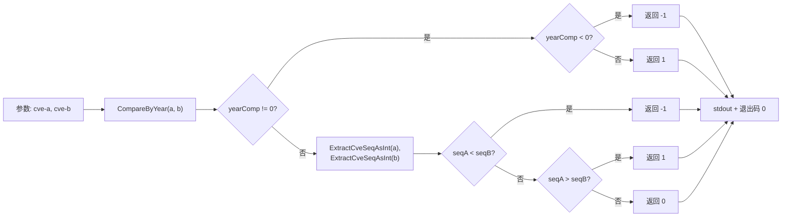

# cve compare 比较

:::tip 📂 查看源码
[`cmd/compare.go:11`](https://github.com/scagogogo/cve-skills/blob/main/cmd/compare.go#L11-L25) — 在 GitHub 上查看 cobra 命令定义（第 11–25 行）。
:::

按**年份和序列号**比较两个 CVE 编号，输出稳定的 `-1 / 0 / 1` 三态 —— 第一个更小为 `-1`，相等为 `0`，第一个更大为 `1`。

:::tip 🖥️ 适用场景
- 在去重或合并漏洞公告记录时，判断两个 CVE 中哪个更新。
- 在 shell 管道中作为轻量的排序判断条件，只关心结果的正负号。
- 当完整的 `cve compare sort` 流程显得过重时，手动进行单次比较。
:::

## 命令语法

```bash
cve compare <cve-a> <cve-b>
```

该命令接收恰好两个位置参数，向 stdout 输出一个整数（`-1`、`0` 或 `1`）。它**不会**从 stdin 读取 —— 两个 CVE 都必须以参数形式传入。

## 参数与选项

- `<cve-a>`（位置参数，必填）：第一个 CVE 编号，例如 `CVE-2021-44228`。
- `<cve-b>`（位置参数，必填）：第二个 CVE 编号，例如 `CVE-2022-12345`。
- 本命令自身**不定义任何 flag**。全局 `-q, --quiet` 标志继承自根命令。
- 参数数量由 `cobra.ExactArgs(2)` 强制校验：传入少于或多于两个参数都会以退出码 `1` 退出，并在 stderr 输出用法错误。

## 使用示例

不同年份 —— 更早的年份排在前，因此结果为 `-1`：

```bash
$ cve compare CVE-2021-44228 CVE-2022-12345
-1
```

同年，第一个序列号更小 —— 年份相等时由序列号决定，结果为 `-1`：

```bash
$ cve compare CVE-2022-1111 CVE-2022-2222
-1
```

完全相同的编号 —— 年份和序列号都一致，结果为 `0`：

```bash
$ cve compare CVE-2022-2222 CVE-2022-2222
0
```

第一个更大（更晚的年份，或同年时更大的序列号）—— 结果为 `1`：

```bash
$ cve compare CVE-2023-1111 CVE-2021-2222
1
```

在 shell 条件判断中利用正负号来分支哪个 CVE 更新：

```bash
$ if [ "$(cve compare CVE-2024-1 CVE-2021-1)" -gt 0 ]; then echo "newer"; fi
newer
```

## 工作流程



## 对应 Go API

本命令是 [`CompareCves`](/api/functions/compare-cves) 的轻量封装，后者先通过 `CompareByYear` 比较年份；若年份不同，立即返回 `-1` 或 `1`。当年份相等时，由序列号（通过 `ExtractCveSeqAsInt` 提取）决定。CLI 仅打印返回的整数。与 [`CompareByYear`](/api/functions/compare-by-year)（原始年份差值）不同，其数值总是被截断为正负号 —— 当你在代码中需要比较器而非纯文本输出时，请直接使用该 Go 函数。

## 退出码与输出

- 退出码 `0`：命令正常结束，向 stdout 输出一个整数。
- 退出码 `1`：参数数量不等于二。此时向 stderr 输出错误 `accepts 2 arg(s), received N`。
- stdout：单独一行，包含 `-1`、`0` 或 `1`。
- stderr：仅输出上述参数数量错误。比较结果绝不写入 stderr。

## 注意事项

- 输出是比较的**正负号**，而非数值。`CVE-2025-1` 与 `CVE-2020-1` 的输出为 `1`，而非 `5`。若需要原始年份差，请改用 `cve compare by-year`。
- 比较顺序为**先年份、后序列号**；更晚的年份总是优先，与序列号大小无关（例如 `CVE-2021-9999` < `CVE-2023-0001`）。
- 非法输入不会触发 panic —— 非法 CVE 会通过底层提取器回退为年份 `0`、序列号 `0`，因此会排到最前面。若对此敏感，请先用 `cve validate` 校验输入。
- 年份提取纯属文本解析，不会校验年份是否落在 `1999..当前年份` 范围内。假设的 `CVE-1800-1` 会被解析为年份 `1800` 而不报错。
- 比较前不会规范化大小写与两侧空白 —— 请传入已格式化的编号，或先执行 `cve format`。

## 内部实现

`compareCmd` 这个 cobra 命令（定义于 `cmd/compare.go:11-L25`）是一个不自带任何 flag 的极简位置参数封装：

- **参数接收**：`Run: func(cmd *cobra.Command, args []string)` 通过 `args` 直接拿到两个 CVE。`compareCmd` 未注册任何 `cobra.Flag`，它唯一能看到的 flag 是 `-q, --quiet` 这类继承自根命令的全局 flag，而比较逻辑完全忽略它们。
- **数量校验**：`Args: cobra.ExactArgs(2)` 在 `Run` 之前执行，cobra 自身会拒绝任何未传入恰好两个位置参数的调用 —— `Run` 绝不会以错误的参数数量被执行。
- **库函数调用**：函数体仅有一条语句 `result := cvepkg.CompareCves(args[0], args[1])`。CLI 自身不做任何解析，提取年份与序列号、产出 `-1 / 0 / 1` 正负号的职责全部由 `CompareCves` 承担。
- **输出**：`fmt.Println(result)` 将该整数连同尾随换行写入 stdout。不加任何格式、不加标签、不写 stderr —— 输出值即全部输出，因此可安全地用 `$(...)` 捕获。

## 参数流

```text
+-------------------------+
| shell: cve compare A B  |
+-----------+-------------+
            |
            v
+-------------------------+
| cobra 解析 argv         |
| 强制 ExactArgs(2)       |
+-----------+-------------+
            |
            v
+-------------------------+
| compareCmd.Run(args)    |
| args[0]=A  args[1]=B    |
+-----------+-------------+
            |
            v
+-------------------------+
| cvepkg.CompareCves(A,B) |
|  -> CompareByYear       |
|  -> ExtractCveSeqAsInt  |
|  返回 -1 / 0 / 1        |
+-----------+-------------+
            |
            v
+-------------------------+
| fmt.Println(result)     |
| -> stdout: 整数\n       |
+-------------------------+
```

## 边界情形

| 输入 | 行为 | 退出码 / 输出 |
|---|---|---|
| 无参数（`cve compare`） | `cobra.ExactArgs(2)` 在 `Run` 之前失败 | 退出码 `1`；stderr `accepts 2 arg(s), received 0` |
| 一个参数（`cve compare CVE-2021-1`） | 数量校验失败 | 退出码 `1`；stderr `accepts 2 arg(s), received 1` |
| 三个或更多参数 | 数量校验失败 | 退出码 `1`；stderr `accepts 2 arg(s), received N` |
| 完全相同的编号（`A == B`） | 年份与序列号均相等 | 退出码 `0`；stdout `0` |
| 非法 CVE（如 `CVE-ABC-1`） | 提取器回退为年份 `0`、序列号 `0`；不 panic | 退出码 `0`；stdout `-1`、`0` 或 `1` |
| 提供 stdin（`echo CVE-2021-1 \| cve compare CVE-2021-2`） | **不读取** stdin；管道数据被忽略 | 参数少于 2 时退出码 `1`，否则退出码 `0` 且 stdout 正常 |
| 仅 flag、无 CVE（`cve compare -q`） | `-q` 被当作 flag 消费，剩余 0 个位置参数 | 退出码 `1`；stderr 数量错误 |

## 退出码

- **成功**（退出码 `0`）：`Run` 执行完 `CompareCves` 与 `fmt.Println`。退出码取进程默认值 `0`；源码在成功路径上不调用 `os.Exit`。
- **数量失败**（退出码 `1`）：由 `cobra.ExactArgs(2)` 在进入 `Run` 之前触发。cobra 向 stderr 写入消息 `accepts 2 arg(s), received N`，随后附上命令用法，并以退出码 `1` 结束进程。
- **stderr**：该命令能产生的 stderr 输出仅有上述 cobra 数量错误。`CompareCves` 从不返回错误、也从不写 stderr —— 非法输入会被静默回退为 `0`，因此不会以退出码失败的形式暴露。
- **stdout**：成功路径上始终只有一行 —— `-1`、`0` 或 `1` 加上尾随换行。

## 相关命令

- [cve compare by-year](/cli/commands/compare-by-year) —— 仅按年份比较，返回带符号的年份差值。
- [cve compare sort](/cli/commands/compare-sort) —— 按年份再按序列号升序排序。
- [cve validate](/cli/commands/validate-batch) —— 在比较前校验 CVE 编号。
- [cve format](/cli/commands/format) —— 在比较前规范化大小写与格式。
- [CLI 参考](/cli) —— 完整命令树与 I/O 约定。
