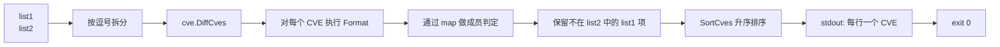

# cve diff 差集

:::tip 📂 查看源码
[`cmd/set.go:49`](https://github.com/scagogogo/cve-skills/blob/main/cmd/set.go#L49-L66) — 在 GitHub 上查看 cobra 命令定义（第 49–66 行）。
:::

计算两个 CVE 列表的差集——出现在 `<list1>` 中但**不在** `<list2>` 中的每个 CVE 只输出一次，按升序排列。即集合论中的 `list1 - list2`。

:::tip 🖥️ 适用场景
- 找出内部扫描器已标记、但厂商安全通告尚未确认的 CVE。
- 从一份新的扫描结果中减去"已知 / 已接受 / 误报"清单，仅呈现新出现的 CVE。
- 对齐两个情报源："在应用上游白名单后，我们丢掉了哪些 CVE？"
:::

## 命令语法

```bash
cve diff <list1> <list2>
```

`<list1>` 与 `<list2>` 均为逗号分隔的 CVE 列表。两个参数在执行集合运算前都会按逗号拆分，因此 `"CVE-2021-1,CVE-2022-2"` 与分别传入这两个标识符效果完全相同。结果为 `<list1>` 中未在 `<list2>` 中出现的 CVE。

## 参数与选项

- `<list1>`（位置参数，必填）：被减数——要从中扣除的列表。参数内的逗号会被视为分隔符，因此每个参数可承载一个或多个 CVE。
- `<list2>`（位置参数，必填）：减数——要移除的列表。解析方式与 `<list1>` 一致。
- stdin 回退：当未提供位置参数且 stdin 通过管道输入时，每一非空行均视为一个输入。由于差集运算需要**两个**列表，stdin 必须至少提供两行——第一行为 `<list1>`，第二行为 `<list2>`。
- 本命令**未定义任何自身 flags**。全局 `-q, --quiet` flag 继承自根命令。

## 使用示例

从第一个列表中减去第二个列表，两者共有的 CVE 被丢弃，list1 的其余项按升序输出：

```bash
$ cve diff "CVE-2021-1,CVE-2022-2" "CVE-2022-2,CVE-2023-3"
CVE-2021-1
```

大小写差异会被规范化消除——`Format` 在比较前将 `CVE` 前缀大写，因此 list2 中以小写匹配的项仍会从 list1 中移除：

```bash
$ cve diff "cve-2022-1,CVE-2022-2,CVE-2022-3" "CVE-2022-1,CVE-2022-3"
CVE-2022-2
```

将两个列表作为独立参数（而非逗号打包的字符串）传入，结果完全一致：

```bash
$ cve diff "CVE-2020-5,CVE-2021-9,CVE-2024-1" "CVE-2021-9"
CVE-2020-5
CVE-2024-1
```

通过 stdin 同时提供两个列表（第一行为 list1，第二行为 list2），对两条上游命令的输出求差集：

```bash
$ printf 'CVE-2021-1,CVE-2022-2\nCVE-2022-2,CVE-2023-3\n' | cve diff
CVE-2021-1
```

当减数为空时，list1 原样保留（去重并排序），因为没有任何项被移除：

```bash
$ cve diff "CVE-2022-3,CVE-2022-1" ""
CVE-2022-1
CVE-2022-3
```

## 工作流程



## 对应 Go API

本命令是 [`DiffCves`](/api/functions/diff-cves) 的薄封装。该函数接收两个 `[]string` 切片，返回 `list1 - list2` 差集的排序去重 `[]string`。内部会先对每个标识符执行 `Format`（因此在比较前已统一大小写并去除首尾空白），将 list2 的条目装入 map 以实现 O(1) 成员判定，仅保留不在该 map 中的 list1 条目，最后再经 `SortCves` 排序，确保输出始终按"年份再序号"升序排列。当你在代码中需要直接拿到差集切片而非打印文本时，请使用该 Go 函数。

## 退出码与输出

- 退出码 `0`：差集已计算并输出。当结果为空（list1 为空，或 list1 完全被 list2 覆盖）时，不输出任何内容，仍返回 `0`。
- 退出码 `1`：提供的输入少于两个（既未给出两个位置参数，也未通过 stdin 提供两行）。stderr 输出错误信息 `requires exactly 2 arguments (two CVE lists)`。
- stdout：每行一个 CVE，升序排列，已去重。差集为空时无输出。
- stderr：仅输出上述用法错误。结果行不会进入 stderr。

## 注意事项

- 每个输入在集合运算前都会经 `Format` 规范化，因此 `cve-2022-1`、`CVE-2022-1` 与 `  CVE-2022-1 ` 会被视为同一个 CVE。
- 输出**始终是排序的**（先年份、再序号）——本命令不保留原始输入顺序。若需要保留 list1 原始顺序并移除 list2，请自行对输出做后处理，或先用 `cve filter dedup` 处理 list1 再针对 list2 过滤。
- 非法或格式错误的 token 不会被过滤——它们会按原样格式化并保留。若希望差集中只包含格式合法的 CVE，请先运行 `cve filter-valid`。
- 该运算是**不对称的**：`cve diff A B` 与 `cve diff B A` 通常结果不同。取共有部分请用 `cve intersect`，合并两列表请用 `cve union`。
- 空输入是安全的：list2 为空时不移除任何项；list1 为空时结果为空。

## 内部实现

`diffCmd` 是定义于 `cmd/set.go`（L49-L66）的 cobra 命令，其 `RunE` 返回 `error`。执行路径如下：

- **参数接收**：`RunE` 接收原始的 `args []string`，随即交给 `readInputs(args)`——该共享辅助函数将位置参数与 stdin 规范化为一个有序的 `[]string` 输入序列。本命令未定义任何自身 flags，仅继承根命令的全局 flags。
- **参数数检查**：`if len(inputs) < 2` 返回 `fmt.Errorf("requires exactly 2 arguments (two CVE lists)")`。Cobra 将该非 nil 错误输出至 stderr，并以退出码 `1` 退出。
- **拆分**：对两个输入分别用 `strings.Split(inputs[0], ",")` 与 `strings.Split(inputs[1], ",")` 按逗号拆分，得到 `list1` 与 `list2` 两个 `[]string`。单个参数内的逗号均视为分隔符，因此"逗号打包"与"独立 token"两种形式等价。
- **库函数调用与输出**：`result := cve.DiffCves(list1, list2)` 完成规范化、去重、排序后的差集运算；随后 `for _, v := range result { fmt.Println(v) }` 逐行将每个 CVE 写入 stdout。函数返回 `nil`，因此即便 `result` 为空，进程也以 `0` 退出。

## 参数流

```text
+--------------------------+
| CLI: cve diff A B        |
| (或 stdin: 第1行,第2行)  |
+-----------+--------------+
            |
            v
+--------------------------+
| readInputs(args)         |
| 收集位置参数，            |
| 回退到 stdin 各行        |
+-----------+--------------+
            |
            v
   len(inputs) < 2 ?  --是-->  返回 error
            |                     "requires exactly 2 arguments"
           否                     -> cobra 输出至 stderr, exit 1
            |
            v
+--------------------------+
| strings.Split(inputs[0]) |  list1 []
| strings.Split(inputs[1]) |  list2 []
+-----------+--------------+
            |
            v
+--------------------------+
| cve.DiffCves(list1,list2)|
|  Format -> map 成员判定 ->|
|  保留不在 list2 的 list1  |
|  -> SortCves 升序排序     |
+-----------+--------------+
            |
            v
+--------------------------+
| for _, v := range result |
|   fmt.Println(v)         |  stdout, 每行一个 CVE
+-----------+--------------+
            |
            v
       return nil  -->  exit 0
```

## 边界情形

| 输入 | 行为 | 退出码 / 输出 |
|---|---|---|
| 无参数且 stdin 未通过管道输入 | `readInputs` 返回空切片；`len(inputs) < 2` 触发参数数错误 | 退出 `1`；stderr：`requires exactly 2 arguments (two CVE lists)` |
| 仅一个位置参数 | `len(inputs) == 1 < 2`；参数数错误 | 退出 `1`；stderr：`requires exactly 2 arguments (two CVE lists)` |
| 两个位置参数且均非空 | 正常路径：拆分、`DiffCves`、输出排序后的差集 | 退出 `0`；stdout：每行一个 CVE |
| `list2` 为空字符串（`""`） | `strings.Split("", ",")` 得到单个空字符串；`DiffCves` 视为不移除任何项 | 退出 `0`；stdout：list1 去重并排序 |
| `list1` 为空字符串（`""`） | 无可被减的源；结果为空 | 退出 `0`；stdout 无输出 |
| `list1` 完全被 `list2` 覆盖 | list1 每一项都被移除；结果为空 | 退出 `0`；stdout 无输出 |
| stdin 管道输入但不足两行 | `readInputs` 只返回一个输入；参数数错误 | 退出 `1`；stderr：`requires exactly 2 arguments (two CVE lists)` |
| stdin 管道输入两行 | 第一行为 `list1`，第二行为 `list2`；正常路径 | 退出 `0`；stdout：差集 |
| 格式非法的 token（非合法 CVE） | 不做过滤；原样经 `Format` 与 `DiffCves` 处理 | 退出 `0`；stdout 含该非法 token |
| 大小写混合（`cve-` 与 `CVE-`） | `Format` 在比较前统一大小写；匹配项被移除 | 退出 `0`；stdout：规范化（大写）形式 |

## 退出码

- **成功（退出 `0`）**：`RunE` 在打印差集后返回 `nil`。任何成功的计算都属此列，包括结果为空（`list1` 为空、`list2` 为空，或 `list1` 被完全减去）的情形。成功时不向 stderr 写入任何内容。
- **失败（退出 `1`）**：唯一的显式失败路径是 `len(inputs) < 2`，返回 `fmt.Errorf("requires exactly 2 arguments (two CVE lists)")`。Cobra 将该错误输出至 stderr 并设置退出码 `1`。本命令不对 CVE token 的格式做任何校验，因此非法输入不会触发非零退出——它们会直接流经 `DiffCves` 并原样打印。
- **stderr**：仅用于上述参数数错误。结果行始终输出至 stdout。

## 相关命令

- [cve intersect](/cli/commands/intersect) — 仅保留两个列表中都存在的 CVE。
- [cve union](/cli/commands/union) — 将两个列表合并为一个去重且排序的集合。
- [cve filter dedup](/cli/commands/filter-dedup) — 对单个列表去重，保留首次出现的顺序。
- [cve compare sort](/cli/commands/compare-sort) — 对单个列表升序排序。
- [CLI 总览](/cli) — 完整命令树与输入输出约定。
