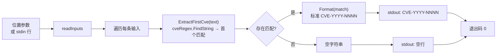

# cve extract first 提取首个

:::tip 📂 查看源码
[`cmd/extract.go:37`](https://github.com/scagogogo/cve-skills/blob/main/cmd/extract.go#L37-L53) — 在 GitHub 上查看 cobra 命令定义（第 37–53 行）。
:::

从自由文本中提取**首个**（第一个）CVE 编号并单行输出，统一规范化为标准大写形式。与 `extract seq`/`extract year` 不同，此处的参数是**包含** CVE 的散文文本，而非一条完整的 CVE。

:::tip 🖥️ 适用场景
- 从变更日志、安全通告或句子中取出开头的 CVE，当你只关心最先提到的那个编号时使用。
- 把自由文本中埋藏的单个 CVE 规范化为标准 `CVE-YYYY-NNNN` 形式，便于存储或上报。
- 在管道中输入多行散文，按输入顺序逐行收集每行的首个 CVE。
:::

## 命令语法

```bash
cve extract first [text...]
```

每个参数被视为一段自由文本，对其完整扫描以查找 CVE。当未提供参数且 stdin 有管道输入时，每个非空行对应一条输入。

## 参数与选项

- `[text...]`（位置参数，可重复）：一段或多段自由文本。每个参数独立扫描其中的 CVE，若找到则打印其首个 CVE。
- stdin 回退：当未提供位置参数且 stdin 有管道输入时，每个非空行被视为一条文本输入。空行会被跳过。
- 本命令自身**不定义任何 flag**。全局 `-q, --quiet` 标志继承自根命令。

## 使用示例

从单段文本中提取首个 CVE：

```bash
$ cve extract first "CVE-2021-44228 and CVE-2022-12345"
CVE-2021-44228
```

传入多个参数 —— 每参数一条结果，按输入顺序输出：

```bash
$ cve extract first "fixed CVE-2021-44228" "backported CVE-2023-0001 from CVE-2022-99999"
CVE-2021-44228
CVE-2023-0001
```

无论输入大小写如何，结果统一规范化为标准大写形式：

```bash
$ cve extract first "affected by cve-2022-00001"
CVE-2022-00001
```

从 stdin 输入多行散文，在管道中逐行收集首个 CVE：

```bash
$ printf 'patched CVE-2021-44228 and CVE-2022-12345\nno cves here\n' | cve extract first
CVE-2021-44228

```

不含 CVE 的文本输出空行 —— 命令不会丢弃它，因此输出行数与输入行数一致：

```bash
$ cve extract first "CVE-2022-12345 is fixed" "nothing to see"
CVE-2022-12345

```

## 工作流程



## 对应 Go API

本命令是 [`ExtractFirstCve`](/api/functions/extract-first-cve) 的薄封装。该函数对全文执行 `cveRegex.FindString` 以捕获首个匹配，再经 `Format` 规范化为标准大写 `CVE-YYYY-NNNN`；无匹配时返回 `""`。CLI 对每条输入调用一次 `ExtractFirstCve` 并打印结果。当你在代码中需要首个 CVE 字符串而非打印文本时，可直接使用该 Go 函数；若需要末个匹配，改用 [`ExtractLastCve`](/api/functions/extract-last-cve)。

## 退出码与输出

- 退出码 `0`：命令对至少一条输入运行完毕。不含 CVE 的输入**不算错误** —— 它输出空行，命令仍以 `0` 退出。
- 退出码 `1`：未提供任何输入（既无位置参数，也无 stdin 管道输入且 stdin 非终端）。不打印任何内容。
- stdout：每条输入一行，按输入顺序输出。包含 CVE 的输入打印首个 CVE（标准形式）；不含 CVE 的输入打印空行。
- stderr：正常情况下无输出。

## 注意事项

- ⚠️ 本命令扫描的是**自由文本** —— `CVE-2021-44228` 与包含它的句子都能处理。与 `extract seq`/`extract year` 不同，后者要求每个参数是完整的、精确的 CVE。
- ⚠️ 不含 CVE 的输入**不会被丢弃** —— 它输出空行，使输出行数与输入行数一致。若只需非空结果，请过滤输出（如 `| grep -v '^$'`）或先用 `cve filter-valid` 预筛。
- 返回的 CVE 一律经 `Format` 规范化为标准大写形式（`CVE-YYYY-NNNN`），故 `cve-2022-00001` 变为 `CVE-2022-00001`。
- 正则匹配大小写不敏感；周围文字被忽略，仅捕获 CVE 令牌本身。
- "首个"指扫描顺序（自左向右）的第一个匹配，而非编号最小的 CVE。如需排序，请在提取后接 `cve sort`。
- 此处**不做逗号拆分** —— 每个参数（或 stdin 行）作为一整段文本输入整体扫描。

## 内部实现

cobra 命令 `extractFirstCmd` 定义于 `cmd/extract.go:37-53`，`Use: "first [text...]"`。其 `Run` 函数逻辑如下：

- 直接接收 cobra 传入的位置参数 `args []string`，交给 `readInputs(args)` 收集输入；该函数优先取 `args`，当 `args` 为空且 stdin 有管道输入时回退为 stdin 的非空行。
- 自身**不定义任何 flag**，仅根命令继承的全局 `-q, --quiet` 生效。
- 收集输入后执行 `if len(inputs) == 0 { os.Exit(1) }` —— 这是唯一的显式非零退出路径，同时覆盖"无参数且无管道 stdin"两种情况。
- 随后 `for _, input := range inputs` 遍历，每条输入调用一次 `cvepkg.ExtractFirstCve(input)`，并用 `fmt.Println` 打印结果。库函数在无 CVE 匹配时返回 `""`，因此会打印空行并继续循环，不视为错误。

## 参数流

```text
+----------------------+     +----------------------+     +------------------------------+
| 命令行调用           |     | cobra 分发到         |     | Run(cmd, args)               |
| cve extract first    | --> | extractFirstCmd      | --> | inputs := readInputs(args)   |
| [text...] / stdin    |     | (cmd/extract.go:37)  |     | 为空则 os.Exit(1)            |
+----------------------+     +----------------------+     +--------------+---------------+
                                                                         |
                                                       遍历每条输入      |
                                                                         v
                                                          +------------------------------+
                                                          | cvepkg.ExtractFirstCve(input)|
                                                          | cveRegex.FindString + Format |
                                                          +--------------+---------------+
                                                                         |
                                                                         v
                                                          +------------------------------+
                                                          | fmt.Println(result)          |
                                                          | stdout: CVE 或空行           |
                                                          +--------------+---------------+
                                                                         |
                                                                         v
                                                          +------------------------------+
                                                          | 退出码 0（循环结束）         |
                                                          +------------------------------+
```

## 边界情形

| 输入 | 行为 | 退出码/输出 |
| --- | --- | --- |
| 无位置参数且 stdin 为终端 | `readInputs` 返回空 | 退出 `1`，无输出 |
| 无位置参数，stdin 有管道但为空（仅空行） | 所有行被跳过，`inputs` 为空 | 退出 `1`，无输出 |
| 参数不含 CVE（如 `"nothing here"`） | `ExtractFirstCve` 返回 `""` | 退出 `0`，打印一个空行 |
| stdin 某行不含 CVE | `ExtractFirstCve` 返回 `""` | 退出 `0`，该行对应打印空行 |
| 大小写混用（如 `cve-2022-00001`） | 正则大小写不敏感匹配，`Format` 转大写 | 退出 `0`，打印 `CVE-2022-00001` |
| 多个参数，部分含 CVE 部分不含 | 每参数一行，按顺序输出 | 退出 `0`，行数等于参数数 |
| 单个参数含多个 CVE | 仅返回首个（最左侧）匹配 | 退出 `0`，打印该单个 CVE |

## 退出码

- `0`（成功）：对 `inputs` 的 `for` 循环正常结束。只要收集到至少一条输入即为成功，包括不含 CVE 的输入 —— 它们仅打印空行，不被视为失败。
- `1`（失败）：由 `os.Exit(1)` 在 `len(inputs) == 0` 时显式触发，即既无位置参数、也无管道非空 stdin。此路径下不向 stdout 或 stderr 写入任何内容。
- stderr：`Run` 函数在两条路径下都不向 stderr 写入内容。错误信息仅依赖数值退出码；cobra 自身的 flag 解析错误（如未知的继承 flag）会在 `Run` 执行前由 cobra 根命令输出到 stderr。

## 相关命令

- [cve extract](/cli/commands/extract) — 从自由文本中提取全部 CVE 编号；返回所有匹配而非仅首个。
- [cve extract last](/cli/commands/extract-last) — 改为提取末个 CVE 编号。
- [cve extract year](/cli/commands/extract-year) — 取得首个 CVE 后，再提取其年份段。
- [cve extract split](/cli/commands/extract-split) — 一次性将 CVE 拆分为年份与序列号。
- [CLI 参考](/cli) — 完整命令树与输入输出约定。
