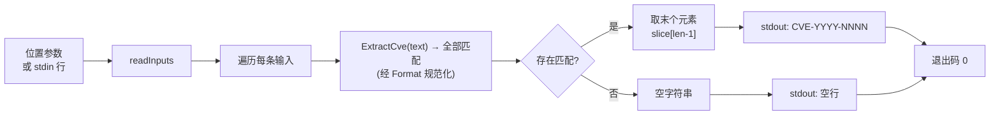

# cve extract last 提取末个

:::tip 📂 查看源码
[`cmd/extract.go:55`](https://github.com/scagogogo/cve-skills/blob/main/cmd/extract.go#L55-L71) — 在 GitHub 上查看 cobra 命令定义（第 55–71 行）。
:::

从自由文本中提取**末个**（最后一个）CVE 编号并单行输出，统一规范化为标准大写形式。与 `extract seq`/`extract year` 不同，此处的参数是**包含** CVE 的散文文本，而非一条完整的 CVE。

:::tip 🖥️ 适用场景
- 从变更日志、安全通告或句子中取出末尾的 CVE，当你只关心最后提到的那个编号时使用。
- 把自由文本中埋藏的单个 CVE 规范化为标准 `CVE-YYYY-NNNN` 形式，便于存储或上报。
- 在管道中输入多行散文，按输入顺序逐行收集每行的末个 CVE。
:::

## 命令语法

```bash
cve extract last [text...]
```

每个参数被视为一段自由文本，对其完整扫描以查找 CVE。当未提供参数且 stdin 有管道输入时，每个非空行对应一条输入。

## 参数与选项

- `[text...]`（位置参数，可重复）：一段或多段自由文本。每个参数独立扫描其中的 CVE，若找到则打印其末个 CVE。
- stdin 回退：当未提供位置参数且 stdin 有管道输入时，每个非空行被视为一条文本输入。空行会被跳过。
- 本命令自身**不定义任何 flag**。全局 `-q, --quiet` 标志继承自根命令。

## 使用示例

从单段文本中提取末个 CVE：

```bash
$ cve extract last "CVE-2021-44228 and CVE-2022-12345"
CVE-2022-12345
```

传入多个参数 —— 每参数一条结果，按输入顺序输出：

```bash
$ cve extract last "fixed CVE-2021-44228" "backported CVE-2023-0001 from CVE-2022-99999"
CVE-2021-44228
CVE-2022-99999
```

无论输入大小写如何，结果统一规范化为标准大写形式：

```bash
$ cve extract last "affected by cve-2022-00001"
CVE-2022-00001
```

从 stdin 输入多行散文，在管道中逐行收集末个 CVE：

```bash
$ printf 'patched CVE-2021-44228 and CVE-2022-12345\nno cves here\n' | cve extract last
CVE-2022-12345

```

不含 CVE 的文本输出空行 —— 命令不会丢弃它，因此输出行数与输入行数一致：

```bash
$ cve extract last "CVE-2022-12345 is fixed" "nothing to see"
CVE-2022-12345

```

## 工作流程



## 对应 Go API

本命令是 [`ExtractLastCve`](/api/functions/extract-last-cve) 的薄封装。该函数委托 `ExtractCve`（对全文做 `cveRegex.FindAllString` 扫描，每个匹配经 `Format` 规范化为标准大写 `CVE-YYYY-NNNN`），随后返回结果切片的最后一个元素；切片为空时返回 `""`。CLI 对每条输入调用一次 `ExtractLastCve` 并打印结果。当你在代码中需要末个 CVE 字符串而非打印文本时，可直接使用该 Go 函数；若需要首个匹配，改用 [`ExtractFirstCve`](/api/functions/extract-first-cve)。

## 退出码与输出

- 退出码 `0`：命令对至少一条输入运行完毕。不含 CVE 的输入**不算错误** —— 它输出空行，命令仍以 `0` 退出。
- 退出码 `1`：未提供任何输入（既无位置参数，也无 stdin 管道输入且 stdin 非终端）。不打印任何内容。
- stdout：每条输入一行，按输入顺序输出。包含 CVE 的输入打印末个 CVE（标准形式）；不含 CVE 的输入打印空行。
- stderr：正常情况下无输出。

## 注意事项

- ⚠️ 本命令扫描的是**自由文本** —— `CVE-2021-44228` 与包含它的句子都能处理。与 `extract seq`/`extract year` 不同，后者要求每个参数是完整的、精确的 CVE。
- ⚠️ 不含 CVE 的输入**不会被丢弃** —— 它输出空行，使输出行数与输入行数一致。若只需非空结果，请过滤输出（如 `| grep -v '^$'`）或先用 `cve filter-valid` 预筛。
- 返回的 CVE 一律经 `Format` 规范化为标准大写形式（`CVE-YYYY-NNNN`），故 `cve-2022-00001` 变为 `CVE-2022-00001`。
- 正则匹配大小写不敏感；周围文字被忽略，仅捕获 CVE 令牌本身。
- "末个"指扫描顺序（自左向右）的最后一个匹配，而非编号最大的 CVE。如需排序，请在提取后接 `cve sort`。
- 此处**不做逗号拆分** —— 每个参数（或 stdin 行）作为一整段文本输入整体扫描。

## 内部实现

该 cobra 命令定义于 `cmd/extract.go:55-71`，名为 `extractLastCmd`，是 `extractCmd` 的子命令，于 `init()` 中注册。其 `Run` 函数是一个简短循环：

- **输入收集**：`Run` 直接从 cobra 接收 `args []string`，并调用 `readInputs(args)`（见 `cmd/helpers.go`）。该辅助函数在有参数时原样返回 `args`；否则对 stdin 做 stat，仅当 stdin **不是**字符设备（即有管道或重定向输入）时，用 `bufio.Scanner` 逐行扫描，跳过空行。
- **不使用 flag**：本命令自身不定义任何 flag，因此 `Run` 内部从不解析 flag 集合 —— `args` 被原样使用。
- **库函数调用**：对每条输入字符串调用一次 `cvepkg.ExtractLastCve(input)`（即 `github.com/scagogogo/cve-skills` 包）。该函数用包内 CVE 正则扫描全文，每个匹配经 `Format` 规范化，返回最后一个匹配（或 `""`）。
- **输出**：每个返回值经 `fmt.Println` 写入 stdout，故按输入顺序每条输入打印一行。无缓冲、无去重、不写 stderr。

## 参数流

```text
+--------------------------+        +---------------------------------+
| 命令行调用               |        | readInputs(args) [helpers.go]   |
| cve extract last [text…] | -----> |  if len(args)>0 -> 返回 args    |
| (cobra 解析 argv)        |        |  否则若 stdin 有管道:           |
+--------------------------+        |     扫描非空行                  |
                                    |  否则 (stdin 是 TTY) -> nil     |
                                    +---------------+-----------------+
                                                    |
                                                    v
                                    +---------------+-----------------+
                                    | len(inputs)==0 ?                |
                                    +---------------+-----------------+
                                       |           |
                                  是   |           | 否
                                       v           v
                              +-----------+  +-----------------------------------+
                              | os.Exit(1)|  | for input := range inputs {       |
                              | (不打印)  |  |   s := cvepkg.ExtractLastCve(in) |
                              +-----------+  |   fmt.Println(s)  // stdout       |
                                             | }                                  |
                                             +----------------+------------------+
                                                              |
                                                              v
                                             +----------------+------------------+
                                             | stdout: 每条输入一行             |
                                             | (末个 CVE 标准形式，或           |
                                             |  无匹配时空行)                   |
                                             +-----------------------------------+
```

## 边界情形

| 输入 | 行为 | 退出码/输出 |
|---|---|---|
| 无位置参数且 stdin 为 TTY | `readInputs` 返回 `nil`；`len(inputs)==0` 触发 `os.Exit(1)` | 退出 `1`，无 stdout，无 stderr |
| 无位置参数，stdin 有管道但为空（如 `printf '' \| cve extract last`） | `readInputs` 扫描 stdin，未收集到非空行 → `nil` | 退出 `1`，无输出 |
| 无位置参数，stdin 仅有空行 | 空行被 `readInputs` 跳过 → `nil` | 退出 `1`，无输出 |
| 单个参数包含多个 CVE | `ExtractLastCve` 返回扫描顺序的最后一个匹配 | 退出 `0`，一行：末个 CVE |
| 单个参数不含 CVE | `ExtractLastCve` 返回 `""` | 退出 `0`，打印一个空行 |
| 多个参数，部分不含 CVE | 各参数独立打印；不含 CVE 的参数打印空行（不丢弃） | 退出 `0`，按序每参数一行 |
| 文本中 CVE 为小写或混合大小写 | 匹配大小写不敏感；结果经 `Format` 规范化为大写 `CVE-YYYY-NNNN` | 退出 `0`，标准形式 |
| stdin 某行有文本但不含 CVE | 该行经 `ExtractLastCve` 返回 `""` | 退出 `0`，该输入对应空行 |

## 退出码

- **成功 —— 退出 `0`**：只要有至少一条输入进入打印循环即可。`Run` 函数正常结束 `for` 循环，cobra 以 `0` 退出。注意"某条输入未找到 CVE"**不算失败** —— 打印空行后仍以 `0` 退出。
- **失败 —— 退出 `1`**：仅在未收集到任何输入（`len(inputs)==0`）时发生，即无位置参数且 stdin 为 TTY 或为空/仅空行。源码直接调用 `os.Exit(1)`，故不会执行任何延迟清理。
- **stderr**：两条路径下源码均不写 stderr。所有诊断信息只能来自 cobra 自身的 flag/错误处理，但本命令未定义 flag，故不会被触发。

## 相关命令

- [cve extract](/cli/commands/extract) — 从自由文本中提取全部 CVE 编号；返回所有匹配而非仅末个。
- [cve extract first](/cli/commands/extract-first) — 改为提取首个 CVE 编号。
- [cve extract year](/cli/commands/extract-year) — 取得末个 CVE 后，再提取其年份段。
- [cve extract split](/cli/commands/extract-split) — 一次性将 CVE 拆分为年份与序列号。
- [CLI 参考](/cli) — 完整命令树与输入输出约定。
