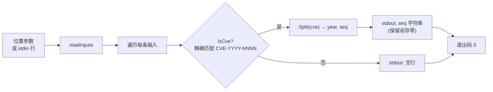

# cve extract seq 提取序列号

:::tip 📂 查看源码
[`cmd/extract.go:91`](https://github.com/scagogogo/cve-skills/blob/main/cmd/extract.go#L91-L107) — 在 GitHub 上查看 cobra 命令定义（第 91–107 行）。
:::

从一个或多个 CVE 编号中提取**序列号**段，逐行输出，并原样保留前导零。

:::tip 🖥️ 适用场景
- 把序列号从 CVE 中分离出来单独存储或展示，与年份解耦。
- 原样保留序列号字符串（含前导零）用于审计，或供期望字符串令牌而非数字的下游工具使用。
- 在一条管道中为一批 CVE 逐个生成以序列号为基础的键或标识符。
:::

## 命令语法

```bash
cve extract seq [cve-id...]
```

每个参数被视为一条完整的 CVE 编号 —— 此处不做逗号拆分（不同于 `filter-valid` 等列表型子命令）。当未提供参数且 stdin 有管道输入时，每个非空行对应一条 CVE。

## 参数与选项

- `[cve-id...]`（位置参数，可重复）：一个或多个 CVE 编号，每参数一条。每个参数必须是**完整的** CVE，而非仅包含 CVE 的自由文本。
- stdin 回退：当未提供位置参数且 stdin 有管道输入时，每个非空行被视为一条 CVE 编号。空行会被跳过。
- 本命令自身**不定义任何 flag**。全局 `-q, --quiet` 标志继承自根命令。

## 使用示例

从单个 CVE 中提取序列号：

```bash
$ cve extract seq CVE-2022-12345
12345
```

以独立参数传入多个 CVE —— 每行一个序列号，顺序与输入一致：

```bash
$ cve extract seq CVE-2022-12345 CVE-2021-44228 CVE-2023-0001
12345
44228
0001
```

前导零被原样保留，因为结果为字符串而非已解析的整数：

```bash
$ cve extract seq cve-2022-00001
00001
```

从 stdin 传入 CVE，在管道中提取序列号：

```bash
$ printf 'CVE-2022-12345\nCVE-2021-44228\n' | cve extract seq
12345
44228
```

非法 CVE 输入会产生一个空行 —— 本命令不丢弃它们，因此输出行数与输入行数一致：

```bash
$ cve extract seq CVE-2022-12345 not-a-cve CVE-2021-44228
12345

44228
```

## 工作流程



## 对应 Go API

本命令是 [`ExtractCveSeq`](/api/functions/extract-cve-seq) 的轻量封装，后者先用 `IsCve` 做闸门校验（**精确**匹配 —— 字符串必须是一整条 CVE，允许两侧空白），再委托 `Split` 以字符串形式返回序列号段。CLI 只是对每条输入调用一次 `ExtractCveSeq` 并打印结果。当你在代码中需要序列号字符串而非纯文本输出时，请直接使用该 Go 函数；若需要整数用于数值比较，请使用 `ExtractCveSeqAsInt`。

## 退出码与输出

- 退出码 `0`：命令对至少一条输入正常结束。非法 CVE **不视为错误** —— 它们打印一个空行，命令仍以 `0` 退出。
- 退出码 `1`：未提供任何输入（既无位置参数，且 stdin 为非终端时也无管道输入）。此时不输出任何内容。
- stdout：每条输入一行，顺序与输入一致。合法 CVE 打印其序列号字符串（保留前导零）；非法输入打印一个空行。
- stderr：正常情况下不输出。

## 注意事项

- ⚠️ 闸门校验使用 `IsCve`，是**精确**匹配 —— `CVE-2022-12345` 合法，但仅*包含* CVE 的文本（如 `"affected by CVE-2022-12345"`）不合法，会产生一个空行。要从自由文本中取出 CVE，请先运行 [`cve extract`](/cli/commands/extract)，再把结果管道传入 `extract seq`。
- ⚠️ 非法输入**不会被丢弃** —— 它们输出一个空行，使输出行数与输入行数一致。若只想要合法序列号，请过滤输出或先用 `cve filter-valid` 预处理。
- 序列号以字符串形式返回，前导零会被保留（`00001` 仍为 `00001`）。若需数值比较或排序，请改用整数变体 `ExtractCveSeqAsInt`。
- 输入大小写不敏感，并容忍两侧空白，与 `IsCve` 行为一致。
- 此处**不做逗号拆分** —— 每个参数（或 stdin 行）是一条完整 CVE。如需拆分逗号分隔列表，请使用列表型命令，或在管道前用 `tr ',' '\n'` 拆分。

## 内部实现

`extractSeqCmd` 这个 cobra 命令（`cmd/extract.go:91-L107`）的 `Run` 闭包逻辑简单，自身不定义任何 flag：

- 它接收位置参数 `args` 切片，立即交给 `readInputs(args)`，后者把位置参数与从管道 stdin 读取的非空行合并，返回有序的 `inputs` 字符串切片，作为待处理的规范输入列表。
- 若 `len(inputs) == 0`（既无参数也无管道 stdin），直接调用 `os.Exit(1)` 退出 —— 不打印任何错误信息，仅以非零码在处理前返回。
- 否则执行 `for _, input := range inputs` 循环，对每条输入调用一次 `cvepkg.ExtractCveSeq(input)`。该库函数先用 `IsCve` 做闸门校验（精确匹配、容忍两侧空白、大小写不敏感），再委托 `Split` 以字符串形式返回序列号段。
- 每个结果通过 `fmt.Println(c)` 写出，因此每条输入恰好输出一行 —— 合法 CVE 输出其序列号字符串（保留前导零），非法输入返回空字符串因而输出一个空行。输出走向 stdout，stderr 不写任何内容。

## 参数流

```text
+-------------------+     +-------------------+     +------------------------+     +-------------------------+
| CLI 参数 / stdin  | --> | readInputs(args)  | --> | ExtractCveSeq(input)   | --> | fmt.Println(seq)        |
| [cve-id...]       |     | 合并并去空行       |     |  IsCve? --是--> Split  |     | 每条输入一行            |
| 每令牌一条 CVE    |     | 有序 []string     |     |        --否--> ""      |     | stdout，保留前导零      |
+-------------------+     +-------------------+     +------------------------+     +-------------------------+
                                |                                                            ^
                                | len==0                                                     |
                                v                                                            |
                          os.Exit(1)                                                    (循环下一条输入)
                          无输出
```

## 边界情形

| 输入 | 行为 | 退出码 / 输出 |
| --- | --- | --- |
| 无位置参数，stdin 为终端（未管道） | `readInputs` 返回空切片；命令在处理前退出 | 退出码 `1`；stdout、stderr 均无输出 |
| 无位置参数，stdin 有管道但为空（或仅空行） | 空行被跳过，故 `inputs` 为空 | 退出码 `1`；无输出 |
| 单条合法 CVE，如 `CVE-2022-12345` | `ExtractCveSeq` 返回 `"12345"` | 退出码 `0`；stdout：`12345` |
| 小写 / 带前导零的 CVE，如 `cve-2022-00001` | `IsCve` 大小写不敏感且容忍空白；`Split` 返回原始序列号字符串 | 退出码 `0`；stdout：`00001`（保留前导零） |
| 非完整 CVE 的参数，如 `not-a-cve` 或 `"affected by CVE-2022-12345"` | `IsCve` 精确匹配失败；`ExtractCveSeq` 返回 `""` | 退出码 `0`；stdout：一个空行（不丢弃该行） |
| 合法与非法参数混合 | 每条输入按顺序独立处理 | 退出码 `0`；stdout：每条输入一行，非法者输出空行 |
| 经 stdin 传入多个 CVE，每行一条 | 每个非空行成为一条输入 | 退出码 `0`；stdout：按输入顺序每行一个序列号 |

## 退出码

- **成功 —— 退出码 `0`：** 只要 `len(inputs) >= 1` 即到达。循环对每条输入运行至结束。注意非法 CVE *不算* 失败：它们打印一个空行，命令仍以 `0` 退出。
- **失败 —— 退出码 `1`：** 仅由 `len(inputs) == 0` 守卫触发，即无位置参数且无管道 stdin（或 stdin 仅含空行）。通过 `os.Exit(1)` 退出，此前没有向 stderr 写入 `fmt.Fprintln`，因此此时 stderr 也为空。
- **stderr：** `Run` 闭包从不显式写 stderr。stderr 文本仅可能来自 cobra 自身（如未知子命令或 flag 解析错误），并遵循 cobra 自身的退出行为。

## 相关命令

- [cve extract](/cli/commands/extract) —— 从自由文本中提取全部 CVE 编号；串联在 `extract seq` 之前可从文字直达序列号。
- [cve extract year](/cli/commands/extract-year) —— 改为提取年份段。
- [cve extract split](/cli/commands/extract-split) —— 一次输出年份与序列号，以制表符分隔。
- [cve filter-valid](/cli/commands/filter-valid) —— 在提取序列号之前先丢弃非法 CVE。
- [CLI 参考](/cli) —— 完整命令树与 I/O 约定。
