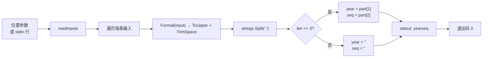

# cve extract split 拆分

:::tip 📂 查看源码
[`cmd/extract.go:109`](https://github.com/scagogogo/cve-skills/blob/main/cmd/extract.go#L109-L128) — 在 GitHub 上查看 cobra 命令定义（第 109–128 行）。
:::

将一个或多个 CVE 编号拆分为**年份**与**序列号**两部分，逐行输出，二者之间以单个制表符分隔（`年份<TAB>序列号`）。

:::tip 🖥️ 适用场景
- 一次性把每条 CVE 拆成两个结构部件（年份、序列号），无需分别运行 `extract year` 和 `extract seq`。
- 生成 `年份<TAB>序列号` 的制表符分隔布局，便于 `cut`、`awk` 或电子表格按 Tab 拆列，无需重新解析 CVE 字符串。
- 在一条管道步骤中为一批 CVE 构建年份/序列号键，并原样保留序列号字符串（含前导零）。
:::

## 命令语法

```bash
cve extract split [cve-id...]
```

每个参数被视为一条完整的 CVE 编号 —— 此处不做逗号拆分。当未提供参数且 stdin 有管道输入时，每个非空行对应一条 CVE。

## 参数与选项

- `[cve-id...]`（位置参数，可重复）：一个或多个 CVE 编号，每参数一条。每个参数被视为一整条 CVE 令牌。
- stdin 回退：当未提供位置参数且 stdin 有管道输入时，每个非空行被视为一条 CVE 编号。空行会被跳过。
- 本命令自身**不定义任何 flag**。全局 `-q, --quiet` 标志继承自根命令。

## 使用示例

把单条 CVE 拆为年份与序列号，以制表符分隔：

```bash
$ cve extract split CVE-2022-12345
2022	12345
```

以独立参数传入多个 CVE —— 每条 CVE 一行 `年份<TAB>序列号`，顺序与输入一致：

```bash
$ cve extract split CVE-2022-12345 CVE-2021-44228 CVE-2023-0001
2022	12345
2021	44228
2023	0001
```

输入大小写不敏感 —— CVE 先被规整为大写再拆分，因此各段不受输入大小写影响：

```bash
$ cve extract split cve-2022-00001
2022	00001
```

从 stdin 传入 CVE，在管道中拆分 —— 配合 `cut -f1`/`cut -f2` 可单独取出某一列：

```bash
$ printf 'CVE-2022-12345\nCVE-2021-44228\n' | cve extract split
2022	12345
2021	44228
```

## 工作流程



## 对应 Go API

本命令是 [`Split`](/api/functions/split) 的轻量封装，后者先通过 `Format`（`strings.ToUpper(strings.TrimSpace(cve))`）规整输入，再按字面量 `-` 拆分字符串。当结果切片恰好为三段（即输入呈 `<前缀>-<年份>-<序列号>` 形态）时，`Split` 返回 `year, seq = part[1], part[2]`；否则返回两个空字符串。CLI 只是对每条输入调用一次 `Split`，并以 `fmt.Printf("%s\t%s\n", year, seq)` 打印这对值。注意：与 `extract year` 和 `extract seq` 不同，本子命令**不**用 `IsCve` 闸门校验输入 —— `Split` 自身不做格式校验，仅检查连字符段数。当你在代码中需要 `(year, seq)` 这对值而非纯文本输出时，请直接使用该 Go 函数；若只需单段且要 `IsCve` 校验，请使用 [`ExtractCveYear`](/api/functions/extract-cve-year) 或 [`ExtractCveSeq`](/api/functions/extract-cve-seq)。

## 退出码与输出

- 退出码 `0`：命令对至少一条输入正常结束。无法拆成三段（连字符分隔）的输入**不视为错误** —— 它们仍会输出一行，命令以 `0` 退出。
- 退出码 `1`：未提供任何输入（既无位置参数，且 stdin 为非终端时也无管道输入）。此时不输出任何内容。
- stdout：每条输入一行，顺序与输入一致，格式为 `年份<TAB>序列号`。合法 CVE 打印两部分；非法输入打印一行仅含一个制表符（两个空字段）。
- stderr：正常情况下不输出。

## 注意事项

- ⚠️ 与 `extract year` 和 `extract seq` 不同，本子命令**不**用 `IsCve` 校验输入 —— 仅检查字符串能否拆成恰好三段（连字符分隔）。任何 `<前缀>-<年份>-<序列号>` 令牌（如 `XYZ-2022-12345`）都会得到非空结果。若只想要真正的 CVE，请先用 [`cve filter-valid`](/cli/commands/filter-valid) 预处理。
- ⚠️ 非法输入**不会被丢弃** —— 它们输出一行仅含单个制表符（两个空字段），因此输出行数始终与输入行数一致。若只想要有内容的行，请过滤输出。
- 📥 两个字段以**字面制表符**（`\t`）分隔。复制输出或嵌入 shell heredoc 时，制表符可能被渲染为空格 —— 可用 `cat -A` 验证分隔符。
- 序列号以字符串形式返回，前导零会被保留（`00001` 仍为 `00001`）。若需数值比较，请在 Go 中配合 `extract seq` 的 `ExtractCveSeqAsInt` 使用。
- 输入大小写不敏感，并容忍两侧空白，因为 `Format` 在拆分前会做大写化与去空白处理。
- 此处**不做逗号拆分** —— 每个参数（或 stdin 行）是一条完整 CVE。如需拆分逗号分隔列表，请在管道前用 `tr ',' '\n'` 拆分。

## 内部实现

cobra 命令 `extractSplitCmd`（`cmd/extract.go:109-128`）的 `Run` 函数不定义任何 flag，逻辑非常轻量：

- **输入收集**：`Run` 接收原始位置参数切片 `args`，将其传给 `readInputs(args)`——该共享辅助函数优先使用位置参数，在 `args` 为空时回退读取 stdin 的非空行。命令不查询任何 flag，仅消费位置参数 / stdin。
- **空输入守卫**：`if len(inputs) == 0 { os.Exit(1) }` 在调用任何库函数之前短路返回，因此未管道输入的终端会以 `1` 退出且不打印任何内容。
- **逐条调用库函数**：对每条 `input`，循环调用 `cvepkg.Split(input)`（即 `github.com/scagogogo/cve-skills.Split`），返回 `(year, seq string)`。注意 `Split`（与 `ExtractCveYear`/`ExtractCveSeq` 不同）**不**经 `IsCve` 闸门，仅检查按 `-` 拆分后的切片长度是否为 3。
- **输出格式化**：每对值通过 `fmt.Printf("%s\t%s\n", year, seq)` 写入 stdout——两字段间为字面制表符，每条输入一行，顺序与输入一致。无缓冲、无去重、无排序；输出行数与输入行数严格相等。

## 参数流

```text
+---------------------------+      +------------------+      +-------------------------+
| CLI: cve extract split    | ---> | readInputs(args) | ---> | []string inputs         |
| [cve-id...] / stdin 行    |      | (先取位置参数，   |      | (先位置参数，再取       |
+---------------------------+      |  空时回退 stdin) |      |  非空 stdin 行)         |
                                   +------------------+      +-------------------------+
                                                                        |
                                                                        v
                                                            +-----------------------+
                                                            | len(inputs) == 0 ?    |
                                                            +-----------------------+
                                                              |                 |
                                                           是 |              否 |
                                                              v                 v
                                              +--------+            +-----------------------+
                                              | 退出 1 |            | for _, input := range |
                                              | (不    |            | inputs {              |
                                              |  输出) |            +-----------------------+
                                              +--------+                       |
                                                                               v
                                                              +---------------------------------+
                                                              | year, seq := cvepkg.Split(input)|
                                                              | (Format -> 大写/去空白,        |
                                                              |  按 '-' 拆分, 检查 len==3)     |
                                                              +---------------------------------+
                                                                               |
                                                                               v
                                                              +---------------------------------+
                                                              | fmt.Printf("%s\t%s\n", year,seq)|
                                                              |  -> stdout, 每条输入一行       |
                                                              +---------------------------------+
                                                                               |
                                                                               v
                                                                     +-------------------+
                                                                     | 处理下一条输入,   |
                                                                     | 随后退出码 0      |
                                                                     +-------------------+
```

## 边界情形

| 输入 | 行为 | 退出码 / 输出 |
| --- | --- | --- |
| 无位置参数，stdin 为终端（未管道输入） | `readInputs` 返回空切片；`len(inputs) == 0` 触发提前返回 | 退出 `1`；stdout 与 stderr 均无输出 |
| 无位置参数，stdin 有管道但所有行均为空 | 空行被 `readInputs` 跳过，得到空切片 | 退出 `1`；无输出 |
| 一条合法 CVE，如 `CVE-2022-12345` | `Split` 按 `-` 拆为 3 段，返回 `("2022", "12345")` | 退出 `0`；stdout：`2022\t12345` |
| 多条 CVE 作为独立参数 | 循环按输入顺序迭代，每条一次 `Printf` | 退出 `0`；每条 CVE 一行 `年份<TAB>序列号`，顺序一致 |
| 小写 / 带空白输入，如 `  cve-2022-00001  ` | `Format` 拆分前大写化并去空白，前导零与大小写被规整 | 退出 `0`；stdout：`2022\t00001` |
| 非 CVE 但含 3 段连字符，如 `XYZ-2022-12345` | `Split` 仅检查 `len == 3`，不校验 `IsCve`；返回 `("2022", "12345")` | 退出 `0`；stdout：`2022\t12345`（非错误） |
| 非法输入，连字符段数不对，如 `CVE-2022` 或 `CVE-2022-12345-extra` | 按 `-` 拆分后长度非 3；`Split` 返回 `("", "")` | 退出 `0`；stdout：一行仅含一个制表符（两个空字段） |
| 通过 stdin 传入 CVE | 每个非空行成为一条输入；逐条处理相同 | 退出 `0`；每个非空 stdin 行对应一行输出 |
| 含逗号的输入，如 `CVE-2022-12345,CVE-2021-44228` | 不做逗号拆分；整串作为一条输入；连字符段数非 3 | 退出 `0`；stdout：一行仅含制表符（需先用 `tr ',' '\n'` 拆分） |

## 退出码

依据 `cmd/extract.go:118-127` 源码，退出码仅对空输入情形显式处理，其余路径均正常结束并隐式返回 `0`：

- **退出 `0`** —— 命令至少处理了一条输入。此为隐式成功路径：`for` 循环结束后 `Run` 正常返回，未调用 `os.Exit`。非法输入在此**不**视为错误，故即便输出行仅含一个制表符，退出码仍为 `0`。
- **退出 `1`** —— `readInputs(args)` 返回空切片（`len(inputs) == 0`），即既无位置参数、也无非空的管道 stdin。命令立即调用 `os.Exit(1)`，此时**尚未**调用 `Split`，故**不打印任何内容**。
- **stderr** —— 源码在两条路径上均不向 stderr 写入任何内容；不存在 `fmt.Fprintln(os.Stderr, ...)` 调用。任何错误诊断只会来自 cobra 自身的 flag 解析或命令解析层，而非本 `Run` 函数。

## 相关命令

- [cve extract year](/cli/commands/extract-year) —— 仅输出年份段（带 `IsCve` 校验）。
- [cve extract seq](/cli/commands/extract-seq) —— 仅输出序列号段（带 `IsCve` 校验）。
- [cve extract](/cli/commands/extract) —— 从自由文本中提取全部 CVE 编号；串联在 `extract split` 之前可从文字直达年份/序列号对。
- [cve filter-valid](/cli/commands/filter-valid) —— 在拆分前丢弃非法 CVE，使输出仅含真正的 CVE。
- [CLI 参考](/cli) —— 完整命令树与 I/O 约定。
