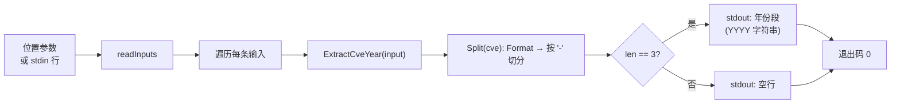

# cve extract year 提取年份

:::tip 📂 查看源码
[`cmd/extract.go:73`](https://github.com/scagogogo/cve-skills/blob/main/cmd/extract.go#L73-L89) — 在 GitHub 上查看 cobra 命令定义（第 73–89 行）。
:::

从一个或多个 CVE 编号中提取**年份**段，逐行输出。

:::tip 🖥️ 适用场景
- 把年份从 CVE 中分离出来，单独存储、展示或分组，与序列号解耦。
- 在一条管道中为一批 CVE 逐个生成以年份为基础的键、桶或文件名。
- 将年份作为字符串令牌提供给期望 `YYYY` 而非已解析数字的下游工具。
:::

## 命令语法

```bash
cve extract year [cve-id...]
```

每个参数被视为一条完整的 CVE 编号 —— 此处不做逗号拆分（不同于 `filter-valid` 等列表型子命令）。当未提供参数且 stdin 有管道输入时，每个非空行对应一条 CVE。

## 参数与选项

- `[cve-id...]`（位置参数，可重复）：一个或多个 CVE 编号，每参数一条。每个参数必须是**完整的** CVE，而非仅包含 CVE 的自由文本。
- stdin 回退：当未提供位置参数且 stdin 有管道输入时，每个非空行被视为一条 CVE 编号。空行会被跳过。
- 本命令自身**不定义任何 flag**。全局 `-q, --quiet` 标志继承自根命令。

## 使用示例

从单个 CVE 中提取年份：

```bash
$ cve extract year CVE-2022-12345
2022
```

以独立参数传入多个 CVE —— 每行一个年份，顺序与输入一致：

```bash
$ cve extract year CVE-2022-12345 CVE-2021-44228 CVE-2023-0001
2022
2021
2023
```

输入大小写不敏感，并容忍两侧空白，与 `Format` 行为一致：

```bash
$ cve extract year " cve-2022-12345 "
2022
```

从 stdin 传入 CVE，在管道中提取年份：

```bash
$ printf 'CVE-2022-12345\nCVE-2021-44228\n' | cve extract year
2022
2021
```

不符合 `CVE-YYYY-NNNN` 形态的输入会产生一个空行 —— 本命令不丢弃它们，因此输出行数与输入行数一致：

```bash
$ cve extract year CVE-2022-12345 not-a-cve CVE-2021-44228
2022

2021
```

## 工作流程



## 对应 Go API

本命令是 [`ExtractCveYear`](/api/functions/extract-cve-year) 的轻量封装，后者委托给 `Split`：输入先经 `Format` 归一化（去空白、转大写），再按 `-` 切分；若结果恰为三段，则返回第二段作为年份字符串，否则返回空字符串。CLI 只是对每条输入调用一次 `ExtractCveYear` 并打印结果。当你在代码中需要年份字符串而非纯文本输出时，请直接使用该 Go 函数；若需要整数用于数值比较或范围校验，请使用 `ExtractCveYearAsInt`。

## 退出码与输出

- 退出码 `0`：命令对至少一条输入正常结束。格式不符的输入**不视为错误** —— 它们打印一个空行，命令仍以 `0` 退出。
- 退出码 `1`：未提供任何输入（既无位置参数，且 stdin 为非终端时也无管道输入）。此时不输出任何内容。
- stdout：每条输入一行，顺序与输入一致。格式合法的 CVE 打印其年份段（`YYYY`）；格式不符的输入打印一个空行。
- stderr：正常情况下不输出。

## 注意事项

- ⚠️ 年份取自编号的**形态**（`CVE-YYYY-NNNN`），而非日历范围校验 —— `Split` 并不验证年份是否介于 1999 与当前年份之间。若需强制校验真实年份范围，请使用 [`cve validate-year-ok`](/cli/commands/validate-year-ok)。
- ⚠️ 仅*包含* CVE 的文本（如 `"affected by CVE-2022-12345"`）并非完整 CVE，会产生一个空行。要从自由文本中取出 CVE，请先运行 [`cve extract`](/cli/commands/extract)，再把结果管道传入 `extract year`。
- ⚠️ 格式不符的输入**不会被丢弃** —— 它们输出一个空行，使输出行数与输入行数一致。若只想要合法年份，请过滤输出或先用 [`cve filter-valid`](/cli/commands/filter-valid) 预处理。
- 年份以字符串形式返回。若需数值比较、排序或算术运算，请改用整数变体 `ExtractCveYearAsInt`。
- 输入大小写不敏感，并容忍两侧空白，与 `Format` 行为一致。
- 此处**不做逗号拆分** —— 每个参数（或 stdin 行）是一条完整 CVE。如需拆分逗号分隔列表，请使用列表型命令，或在管道前用 `tr ',' '\n'` 拆分。

## 内部实现

`extractYearCmd` 这个 cobra 命令的 `Run` 函数（定义于 `cmd/extract.go:80-88`）是对每条输入的轻量遍历：

- **参数接入**：`Run` 直接从 cobra 接收 `args []string`，自身**不注册也不读取任何 flag**，而是把 `args` 原样传入共享辅助函数 `readInputs(args)`。当 `args` 非空时，`readInputs` 原样返回；当 `args` 为空且 stdin 为管道输入（即 stdin 非字符设备）时，通过 `bufio.Scanner` 读取非空行；否则返回 `nil`。
- **空输入守卫**：若 `len(inputs) == 0`，命令直接调用 `os.Exit(1)`，不调用任何库函数，也不打印任何内容。
- **库函数调用**：对每条 `input`，调用一次 `cvepkg.ExtractCveYear(input)`。`ExtractCveYear` 先经 `Format` 归一化（去空白、转大写），再按 `-` 切分；若结果恰为三段则返回第二段，否则返回空字符串。
- **输出格式化**：每个结果通过 `fmt.Println` 写入 stdout，即年份字符串（或空字符串）后跟一个换行，每条输入一行，顺序与输入一致。无分隔符、无表头、无聚合。

## 参数流

```text
+-------------------+     +---------------------------------+     +---------------------------+
| 命令行参数        |     | readInputs(args)                |     | []string inputs           |
| [cve-id...]       | --> | - args 非空? 直接用 args        | --> | (每参数/每行一条)         |
| 或管道 stdin      |     | - 否则扫描 stdin 非空行；       |     +---------------------------+
+-------------------+     |   字符设备则返回 nil            |                |
                          +---------------------------------+                v
                                                                     +-------------------+
                                                                     | len(inputs) == 0? |
                                                                     +-------------------+
                                                                       | 是        | 否
                                                                       v            v
                                                                  os.Exit(1)   遍历每条输入
                                                                                    |
                                                                                    v
                                                                     +------------------------------+
                                                                     | cvepkg.ExtractCveYear(input) |
                                                                     |  Format -> 按 '-' 切分       |
                                                                     |  -> len==3 取 parts[1] 否则 ""|
                                                                     +------------------------------+
                                                                                    |
                                                                                    v
                                                                     +-----------------------------+
                                                                     | fmt.Println(year) -> stdout |
                                                                     | 每条输入一行                 |
                                                                     +-----------------------------+
                                                                                    |
                                                                                    v
                                                                             退出码 0 (循环结束)
```

## 边界情形

| 输入 | 行为 | 退出码/输出 |
| --- | --- | --- |
| 无位置参数，stdin 为终端（无管道） | `readInputs` 返回 `nil`；空输入守卫触发 | 退出码 `1`；stdout 与 stderr 均无输出 |
| 无位置参数，stdin 有管道但为空（如 `printf '' \| cve extract year`） | `readInputs` 读到零条非空行，返回空切片；守卫触发 | 退出码 `1`；无输出 |
| 无参数，stdin 仅含空行 | 空行被扫描器跳过，`inputs` 为空；守卫触发 | 退出码 `1`；无输出 |
| 无参数，stdin 管道传入 CVE | 每个非空行成为一条输入 | 退出码 `0`；每行一个年份（或空行） |
| 完整且合法的 CVE（`CVE-2022-12345`） | `ExtractCveYear` 返回 `2022` | 退出码 `0`；stdout `2022\n` |
| 包含 CVE 的自由文本（`affected by CVE-2022-12345`） | 非完整 CVE；`Split` 切分后不为三段 | 退出码 `0`；stdout 为一个空行 |
| 小写/带空白（`" cve-2022-12345 "`） | `Format` 先去空白并转大写再切分 | 退出码 `0`；stdout `2022\n` |
| 格式不符的 token（`not-a-cve`） | 非 `-` 切分的三段；`ExtractCveYear` 返回 `""` | 退出码 `0`；stdout 为一个空行（不丢弃） |
| 多参数，合法与不合法混杂 | 循环对合法参数打印年份，对不合法的打印空行 | 退出码 `0`；输出行数等于输入行数 |

## 退出码

- **退出码 `0`** —— 循环对一条或多条输入正常结束。这是正常路径：格式不符的输入**不视为错误**，只产生一个空行，命令仍以 `0` 退出。源码并未显式调用 `os.Exit(0)`；cobra 从 `Run` 返回 `nil`，进程默认以 `0` 退出。
- **退出码 `1`** —— `readInputs` 返回空切片（既无参数也无管道 stdin，或管道 stdin 仅含空行）。`Run` 直接调用 `os.Exit(1)`，在任何库函数调用或输出之前短路返回。
- **stderr** —— 两条路径均不向 stderr 写入任何内容。所有诊断输出（此处无）都必须由 `Run` 显式发出；源码仅通过 `fmt.Println` 写 stdout。cobra 自身的错误信息（如未知子命令）仅在进入 `Run` 之前才可能产生。

## 相关命令

- [cve extract](/cli/commands/extract) —— 从自由文本中提取全部 CVE 编号；串联在 `extract year` 之前可从文字直达年份。
- [cve extract seq](/cli/commands/extract-seq) —— 改为提取序列号段。
- [cve extract split](/cli/commands/extract-split) —— 一次输出年份与序列号，以制表符分隔。
- [cve count-by-year](/cli/commands/count-by-year) —— 在你已分离出年份后按年统计 CVE 数量。
- [CLI 参考](/cli) —— 完整命令树与 I/O 约定。
