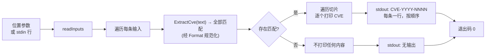

# cve extract 提取

:::tip 📂 查看源码
[`cmd/extract.go:11`](https://github.com/scagogogo/cve-skills/blob/main/cmd/extract.go#L11-L35) — 在 GitHub 上查看 cobra 命令定义（第 11–35 行）。
:::

从自由文本中提取**全部** CVE 编号，每条单独一行输出，统一规范化为标准大写形式。参数是**包含** CVE 的散文文本，而非一条完整的 CVE，因此安全通告、变更日志和日志行均可作为输入。

:::tip 🖥️ 适用场景
- 一次性从安全通告、发布说明或邮件正文中取出全部 CVE 编号。
- 将大小写混杂的提及（如 `cve-2022-12345`）规范化为标准 `CVE-YYYY-NNNN` 形式，同时保留出现顺序。
- 在管道中输入多行散文，按输入顺序逐行收集所有 CVE，供下游去重或排序。
:::

## 命令语法

```bash
cve extract [text...]
```

每个参数被视为一段自由文本，对其完整扫描以查找 CVE。当未提供参数且 stdin 有管道输入时，每个非空行对应一条输入。

## 参数与选项

- `[text...]`（位置参数，可重复）：一段或多段自由文本。每个参数独立扫描其中的 CVE，找到的全部 CVE 每条一行打印。
- stdin 回退：当未提供位置参数且 stdin 有管道输入时，每个非空行被视为一条文本输入。空行会被跳过。
- 本命令自身**不定义任何 flag**。全局 `-q, --quiet` 标志继承自根命令。

## 使用示例

从单段文本中提取全部 CVE —— 每条匹配一行，按出现顺序输出：

```bash
$ cve extract "System affected by CVE-2021-44228 and CVE-2022-12345"
CVE-2021-44228
CVE-2022-12345
```

传入多个参数 —— 每个参数的匹配连续打印，参数按顺序处理：

```bash
$ cve extract "fixed CVE-2021-44228" "backported CVE-2023-0001 from CVE-2022-99999"
CVE-2021-44228
CVE-2023-0001
CVE-2022-99999
```

无论输入大小写如何，结果统一规范化为标准大写形式：

```bash
$ cve extract "affected by cve-2022-00001 and CVE-2023-00002"
CVE-2022-00001
CVE-2023-00002
```

从 stdin 输入多行散文，在管道中逐行收集所有 CVE：

```bash
$ printf 'patched CVE-2021-44228 and CVE-2022-12345\nno cves here\n' | cve extract
CVE-2021-44228
CVE-2022-12345
```

不含 CVE 的文本对该输入不产生任何输出 —— 命令不打印内容，仍以 0 退出：

```bash
$ cve extract "CVE-2022-12345 is fixed" "nothing to see"
CVE-2022-12345
```

## 工作流程



## 对应 Go API

本命令是 [`ExtractCve`](/api/functions/extract-cve) 的薄封装。该函数以预编译正则 `(?i)(CVE-\d+-\d+)` 通过 `FindAllString(-1)` 扫描全文，再将每个原始匹配经 `Format`（`strings.ToUpper(strings.TrimSpace(...))`）规范化为标准大写 `CVE-YYYY-NNNN`。匹配按输入中的出现顺序返回 —— 同一 CVE 出现两次则返回两次。CLI 仅遍历 `ExtractCve` 返回的切片，将每个元素单独一行打印。当你在代码中需要完整 CVE 切片而非打印文本时，可直接使用该 Go 函数；若只需单个匹配，改用 [`ExtractFirstCve`](/api/functions/extract-first-cve) 或 [`ExtractLastCve`](/api/functions/extract-last-cve)。

## 退出码与输出

- 退出码 `0`：命令对至少一条输入运行完毕。不含 CVE 的输入**不算错误** —— 它不输出任何行，命令仍以 `0` 退出。
- 退出码 `1`：未提供任何输入（既无位置参数，也无 stdin 管道输入且 stdin 非终端）。不打印任何内容。
- stdout：找到的每个 CVE 各占一行，按输入内出现顺序排列，各输入按参数顺序处理。不含 CVE 的输入不产生任何行。
- stderr：正常情况下无输出。

## 注意事项

- ⚠️ 本命令扫描的是**自由文本** —— `CVE-2021-44228` 与包含它的句子都能处理。与 `extract seq`/`extract year` 不同，后者要求每个参数是完整的、精确的 CVE。
- ⚠️ 结果**不去重** —— 若同一 CVE 在某输入中出现 N 次，则打印 N 次。需要唯一性时请接 `cve filter-dedup`（Go 中为 `RemoveDuplicateCves`）。
- 返回的 CVE 一律经 `Format` 规范化为标准大写形式（`CVE-YYYY-NNNN`），故 `cve-2022-00001` 变为 `CVE-2022-00001`。
- 正则匹配大小写不敏感；周围文字被忽略，仅捕获 CVE 令牌本身。
- 仅匹配语法形态 `CVE-<数字>-<数字>`，不校验年份与序列号范围。诸如 `CVE-9999-0` 的令牌也会被提取并格式化 —— 如需语义校验请用 `cve validate`。
- 此处**不做逗号拆分** —— 每个参数（或 stdin 行）作为一整段文本输入整体扫描。

## 内部实现

`extract` 命令是一个 cobra 命令，其 `Run` 函数（定义于 `cmd/extract.go:23-34`）执行以下逻辑：

1. **通过 args 接收参数，不使用 flag** — 函数签名为 `Run: func(cmd *cobra.Command, args []string)`。本命令自身不定义任何 flag，因此 `args` 原样承载位置文本块。它从不调用 `cmd.Flag(...)` 或 `cmd.Flags().GetString(...)`。
2. **经 `readInputs(args)` 规整输入** — 该辅助函数（位于 `cmd/helpers.go:11`）在 `args` 非空时直接返回 `args`；否则回退到 stdin，当 stdin 为字符设备（无管道输入的终端）时返回 `nil`。stdin 中的空行会被跳过。
3. **空输入守卫** — `if len(inputs) == 0 { os.Exit(1) }`。既无参数又无管道 stdin 时，进程在任何库函数调用之前即以 `1` 退出。
4. **对每条输入调用 `cvepkg.ExtractCve(input)`** — 对每个输入字符串调用库函数 `ExtractCve`（来自 `github.com/scagogogo/cve-skills` 包），返回已规范化的 CVE 字符串切片 `[]string`。随后 `Run` 函数遍历该切片，用 `fmt.Println(c)` 逐个打印，每条 CVE 占一行。无缓冲、不去重 —— 输出按输入顺序、逐输入流式打印。

## 参数流

```text
+--------------------------+
| 命令行调用               |
| cve extract [text...]    |
+--------------------------+
            |
            v
+--------------------------+
| cobra 解析 args[]        |
| (未声明任何 flag)        |
+--------------------------+
            |
            v
+--------------------------+
| readInputs(args)         |
|  args 非空? -> 返回 args |
|  否则 stdin 有管道?      |
|    扫描非空行            |
|  否则 stdin 是终端 -> nil|
+--------------------------+
            |
            v
+--------------------------+
| len(inputs) == 0 ?       |
|   是 -> os.Exit(1)       |
|   否 -> 继续             |
+--------------------------+
            |
            v
+--------------------------+
| 遍历每条输入字符串:      |
|  cves := ExtractCve(s)   |
|    正则 FindAllString    |
|    + Format (ToUpper)    |
+--------------------------+
            |
            v
+--------------------------+
| 遍历每个 c in cves:      |
|   fmt.Println(c)         |
+--------------------------+
            |
            v
+--------------------------+
| stdout: CVE-YYYY-NNNN    |
| 每条一行，按顺序         |
| 退出码 0                 |
+--------------------------+
```

## 边界情形

| 输入 | 行为 | 退出码 / 输出 |
| --- | --- | --- |
| 无参数，stdin 为终端（无管道） | `readInputs` 返回 `nil`；`len(inputs) == 0` 触发 `os.Exit(1)` | 退出码 `1`，无 stdout，无 stderr |
| 无参数，stdin 有管道但为空（如 `printf '' \| cve extract`） | `readInputs` 扫描零行后返回空（非 nil）切片；`len(inputs) == 0` 触发 `os.Exit(1)` | 退出码 `1`，无输出 |
| 提供参数但均不含 CVE（如 `cve extract "nothing here"`） | `ExtractCve` 返回空切片；内层遍历不打印任何内容 | 退出码 `0`，无 stdout |
| stdin 某行不含 CVE（如 `printf 'no cves\n' \| cve extract`） | 该行产生空切片；对该行不打印任何内容；其余行仍正常处理 | 退出码 `0`（若至少有一条输入），该输入无输出行 |
| 单个参数中同一 CVE 出现两次 | `ExtractCve` 返回两次出现（不去重）；两次均打印 | 退出码 `0`，两行相同内容 |
| 大小写混杂输入（如 `cve-2022-00001`） | 正则大小写不敏感；`Format` 将匹配转为大写 | 退出码 `0`，输出 `CVE-2022-00001` |
| 形态匹配但语义无效的令牌（如 `CVE-9999-0`） | 仅匹配语法形态 `CVE-\d+-\d+`，不做范围校验 | 退出码 `0`，原样打印 `CVE-9999-0` |
| 多个参数，含空字符串（如 `cve extract "" "CVE-2021-1"`） | `args` 非空故 `readInputs` 直接返回，包含空字符串；`ExtractCve("")` 返回空切片 | 退出码 `0`，仅输出 `CVE-2021-1` |

## 退出码

- **`0`** — 命令接收到至少一条输入（位置参数或管道 stdin 行）并将提取循环运行完毕。即便任何输入中都**未找到 CVE** 也仍为 `0`：空结果切片不算错误，循环不打印任何内容，进程通过 `Run` 正常返回以 `0` 退出。
- **`1`** — 未提供任何输入。当 `len(inputs) == 0`（即无参数且 stdin 为终端，或 stdin 有管道但未产生任何非空行）时，`Run` 函数直接调用 `os.Exit(1)`。
- **stderr** — 两种路径下源码均不向 stderr 写入任何内容。`os.Exit(1)` 之前未调用 `fmt.Fprintln(os.Stderr, ...)`，故失败是静默的：进程仅以退出码 `1` 终止，无诊断信息。唯一的 stderr 文本来源是 cobra 自身的 flag 解析错误（本命令未声明 flag，故不触发）。

## 相关命令

- [cve extract first](/cli/commands/extract-first) — 改为仅提取首个 CVE 编号，而非全部匹配。
- [cve extract last](/cli/commands/extract-last) — 改为仅提取末个 CVE 编号，而非全部匹配。
- [cve extract year](/cli/commands/extract-year) — 从每条 CVE 编号中提取年份段。
- [cve extract seq](/cli/commands/extract-seq) — 从每条 CVE 编号中提取序列号段。
- [cve filter-dedup](/cli/commands/filter-dedup) — 对本命令产出的 CVE 去重。
- [CLI 参考](/cli) — 完整命令树与输入输出约定。
