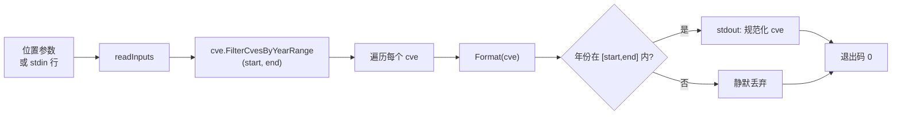

# cve filter by-year-range 年份范围

:::tip 📂 查看源码
[`cmd/filter.go:50`](https://github.com/scagogogo/cve-skills/blob/main/cmd/filter.go#L50-L73) — 在 GitHub 上查看 cobra 命令定义（第 50–73 行）。
:::

仅保留年份落在闭区间 `[start, end]` 内的 CVE 编号，并以标准化大写形式逐行输出存活项。

:::tip 🖥️ 适用场景
- 将跨多年的 CVE 列表收窄到固定时间窗 —— 例如审阅 2021 至 2022 年间披露的全部内容 —— 而无需手写年份解析循环。
- 在接入趋势分析或漏洞密度报告之前，构建一个有界时间范围内的数据集。
- 修剪提取管道的输出（`extract` → `filter by-year-range`），让下游阶段只接收你关注时段内的 CVE。
:::

## 命令语法

```bash
cve filter by-year-range --start [year] --end [year] [cve-id...]
```

CVE 编号可作为位置参数传入，或者 —— 当不提供参数时 —— 从 stdin 按行读取。

## 参数与选项

- `[cve-id...]`（位置参数，可重复）：一个或多个 CVE 编号。与部分列表型子命令不同，每个参数被视为单个编号，**不会**按逗号拆分。
- stdin 回退：当未提供位置参数且 stdin 有管道输入时，每个非空行被视为一条输入编号。
- `--start, -s`（int，必填，含边界）：年份范围下界。必须是非零整数。
- `--end, -e`（int，必填，含边界）：年份范围上界。必须是非零整数。
- 本命令自身不定义其他 flag。全局 `-q, --quiet` 标志继承自根命令。

## 使用示例

只保留 2021 与 2022 年的 CVE —— 2020 年的条目被丢弃：

```bash
$ cve filter by-year-range --start 2021 --end 2022 CVE-2020-1111 CVE-2021-2222 CVE-2022-3333
CVE-2021-2222
CVE-2022-3333
```

使用短标志别名 `-s` 与 `-e`，调用更紧凑：

```bash
$ cve filter by-year-range -s 2022 -e 2022 CVE-2021-44228 CVE-2022-26228 CVE-2023-1234
CVE-2022-26228
```

存活项输出时会规范化为大写，因此小写输入同样能匹配：

```bash
$ cve filter by-year-range -s 2022 -e 2023 cve-2022-1 CVE-2023-9 CVE-2019-1
CVE-2022-1
CVE-2023-9
```

单年窗口即 `--start` 与 `--end` 相等的范围：

```bash
$ cve filter by-year-range --start 2021 --end 2021 CVE-2021-1111 CVE-2022-2222
CVE-2021-1111
```

从 stdin 传入列表，过滤另一条命令的输出：

```bash
$ printf 'CVE-2021-44228\nCVE-2019-1\nCVE-2022-26228\n' | cve filter by-year-range -s 2021 -e 2022
CVE-2021-44228
CVE-2022-26228
```

## 工作流程



## 对应 Go API

本命令是 [`FilterCvesByYearRange`](/zh/api/functions/filter-cves-by-year-range) 的轻量封装，后者遍历切片，用 `Format` 规整每条，用 `ExtractCveYearAsInt` 提取年份，并在 `startYear <= year <= endYear` 时把规范化结果追加到返回切片。所有格式化与年份提取逻辑都在库中实现。当你在代码中需要过滤后的切片而非纯文本输出时，请直接使用该 Go 函数。

## 退出码与输出

- 退出码 `0`：命令正常结束。范围外的 CVE 被丢弃而非视为错误 —— 即便列表中没有任何范围内条目，退出码仍为 `0` 且不输出任何内容。
- 退出码 `1`：未提供 `--start` 或 `--end`（或为 0），此时向 stderr 输出错误 `error: --start and --end are required`；或未提供任何输入（既无位置参数，也无管道 stdin），此时命令静默退出。
- stdout：每个存活 CVE 一行，顺序与首次出现一致。每行均为标准化大写形式 —— `CVE-YYYY-NNNNN`。
- stderr：仅输出上述缺失 flag 的错误。被丢弃的条目不会产生任何 stderr 噪声。

## 注意事项

- 范围**两端均含边界**：年份等于 `--start` 或 `--end` 的 CVE 会被保留。
- `--start` 与 `--end` 是裸整数，不做顺序校验 —— 传入 `--start 2022 --end 2021` 会因无年份满足反向边界而返回空结果，而非报错。
- 两个 flag 都必须非零；`0` 被视为"未提供"，会触发必填 flag 错误。
- 年份取自 CVE 编号本身（`CVE-YYYY-NNNNN`），而非任何外部披露日期 —— 无法提取年份的非法编号永远不会匹配，将被静默丢弃。
- 重复项不会被合并 —— `CVE-2022-1` 与 `cve-2022-1` 都会匹配并都输出为 `CVE-2022-1`。如需去重，请在之后执行 `cve filter dedup`。
- 顺序按首次出现保留；本命令不排序。如需升序，请管道传递给 `cve compare sort`。

## 内部实现

`filterByYearRangeCmd` 的 `Run` 函数（`cmd/filter.go:57-72`）走一条"校验-收集-过滤"的直线路径：

- **读取 flag**：`startYear, _ := cmd.Flags().GetInt("start")` 与 `endYear, _ := cmd.Flags().GetInt("end")` 读取两个必填整数 flag；错误值被刻意丢弃，因此非法的 `--start`/`--end` 值只会以零值的形式暴露。
- **必填 flag 守卫**：`if startYear == 0 || endYear == 0` 经 `fmt.Fprintln(os.Stderr, ...)` 向 stderr 写入 `error: --start and --end are required` 并调用 `os.Exit(1)`。由于 `0` 是 flag 的默认值，"缺失"与"显式传 0"无法区分，二者均被拒绝。
- **收集输入**：`inputs := readInputs(args)` 把位置参数 `args` 与 stdin 行（每个非空行一条编号）合并。`if len(inputs) == 0 { os.Exit(1) }` 在未提供任何输入时静默退出，退出码 `1`。
- **库函数调用与输出**：`filtered := cvepkg.FilterCvesByYearRange(inputs, startYear, endYear)` 完成实际的年份提取与闭区间判断，返回按首次出现顺序排列的规范化大写字符串；循环 `for _, c := range filtered { fmt.Println(c) }` 把每个存活项逐行写入 stdout。随后流程离开 `Run` 末尾，以退出码 `0` 结束。

## 参数流

```text
+---------------------------+   +---------------------------+
| 命令行调用                |   | cobra 解析的 flag         |
| cve filter by-year-range  |-->| --start (int) --end (int) |
|   --start S --end E       |   | [cve-id...] 位置参数      |
|   CVE-... CVE-...         |   +-------------+-------------+
+---------------------------+                 |
                                              v
                              +---------------+---------------+
                              | cmd.Flags().GetInt("start")   |
                              | cmd.Flags().GetInt("end")     |
                              +---------------+---------------+
                                              |
                                  start==0 || end==0 ?
                              +---------------+---------------+
                              | 是: stderr "error: --start   |
                              | and --end are required";      |
                              | os.Exit(1)                    |
                              +---------------+---------------+
                                              | 否
                                              v
                              +---------------+---------------+
                              | inputs := readInputs(args)    |
                              |   (位置参数 + stdin 行)       |
                              +---------------+---------------+
                                              |
                                  len(inputs)==0 ?
                              +---------------+---------------+
                              | 是: 静默 os.Exit(1)           |
                              +---------------+---------------+
                                              | 否
                                              v
                              +---------------+---------------+
                              | cvepkg.FilterCvesByYearRange  |
                              |   (inputs, startYear, endYear)|
                              |  -> Format + ExtractCveYear   |
                              |  -> 满足 start<=year<=end 保留|
                              +---------------+---------------+
                                              |
                                              v
                              +---------------+---------------+
                              | for _, c := range filtered    |
                              |   fmt.Println(c)  (stdout)    |
                              +---------------+---------------+
                                              |
                                              v
                                  离开 Run 末尾 -> 退出码 0
```

## 边界情形

| 输入 | 行为 | 退出码/输出 |
|---|---|---|
| 未提供 `--start` 或 `--end`（或任一为 `0`） | 触发必填 flag 守卫 | 退出码 `1`；stderr 输出 `error: --start and --end are required` |
| 无位置参数且 stdin 为 TTY（无管道输入） | `readInputs` 返回空 | 静默退出 `1`；stdout、stderr 均无输出 |
| 无位置参数，stdin 有管道但为空（如 `printf ''`） | `readInputs` 返回空 | 静默退出 `1`；无输出 |
| 所有输入都落在范围之外 | `FilterCvesByYearRange` 返回空切片 | 退出码 `0`；stdout 为空，stderr 无输出 |
| `--start 2022 --end 2021`（边界反向） | 无年份满足 `2022 <= year <= 2021` | 退出码 `0`；输出为空（非错误） |
| 无法提取年份的非法编号 | `ExtractCveYearAsInt` 得不到有效年份；条目被丢弃 | 退出码 `0`；该条目不在 stdout 中 |
| 小写或大小写混合输入（如 `cve-2022-1`） | `Format` 在测试/输出前规范化为大写 | 退出码 `0`；输出 `CVE-2022-1` |
| 范围内的重复编号 | 每次出现都被保留并输出 | 退出码 `0`；重复项照常输出（用 `dedup` 去重） |
| 同时有管道 stdin 与位置参数 | 使用位置参数；存在参数时不消费 stdin | 退出码 `0`；过滤的是位置参数列表 |

## 退出码

- **`0`** —— 成功。`Run` 函数在打印完存活项后正常返回。其中包括"结果为空"的情况：过滤后零匹配属于成功的过滤而非错误，因此退出码仍为 `0`，stdout 无输出。
- **`1`** —— 失败，有两个触发点，均经 `os.Exit(1)`：
  - 缺失或为零的 `--start`/`--end`：退出前经 `fmt.Fprintln(os.Stderr, ...)` 写入 `error: --start and --end are required`。
  - 未提供输入（`readInputs` 后 `len(inputs) == 0`）：静默退出 —— 该分支不向 stderr 写任何消息。
- 本命令不会以其他退出码调用 `os.Exit`，也不会因范围内/范围外的判断向 stderr 写内容。cobra 自身的 flag 解析错误（如 `--start` 传了非整数）在 `Run` 之前由 cobra 处理，遵循 cobra 的默认错误上报行为。

## 相关命令

- [cve filter by-year](/zh/cli/commands/filter-by-year) —— 按单个精确年份过滤，而非范围。
- [cve filter recent](/zh/cli/commands/filter-recent) —— 相对当前年份过滤最近 N 年。
- [cve filter dedup](/zh/cli/commands/filter-dedup) —— 去除重复项，常在年份过滤之后串联使用。
- [cve filter valid](/zh/cli/commands/filter-valid) —— 在套用年份范围前先丢弃非法 CVE。
- [CLI 参考](/zh/cli) —— 完整命令树与 I/O 约定。
