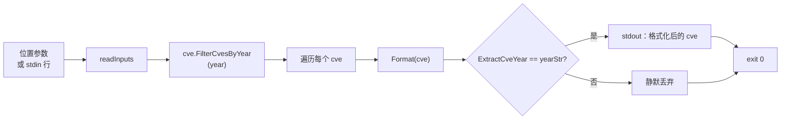

# cve filter by-year 按年筛选

:::tip 📂 查看源码
[`cmd/filter.go:25`](https://github.com/scagogogo/cve-skills/blob/main/cmd/filter.go#L25-L48) — 在 GitHub 上查看 cobra 命令定义（第 25–48 行）。
:::

仅保留属于某一个精确年份的 CVE 编号，每行输出一个，并标准化为大写格式。

:::tip 🖥️ 适用场景
- 从多年列表中提取某一年分配的所有 CVE —— 例如筛出全部 2022 年记录 —— 无需手写年份解析循环。
- 在生成年度报告或漏洞密度统计之前，构建单年数据集。
- 清洗提取流水线的输出（`extract` → `filter by-year`），让下游阶段只接收你关注年份的 CVE。
:::

## 命令语法

```bash
cve filter by-year --year [year] [cve-id...]
```

CVE 编号既可作为位置参数传入，也可在未提供参数时按每行一个从 stdin 读取。

## 参数与选项

- `[cve-id...]`（位置参数，可重复）：一个或多个 CVE 编号。每个参数视为单个编号，**不会**按逗号拆分。
- stdin 回退：当未提供位置参数且 stdin 有管道输入时，每一非空行视为一个输入编号。
- `--year, -y`（整数，必填）：要匹配的目标年份。必须为非零整数。
- 本命令自身不再定义其他标志。全局 `-q, --quiet` 标志继承自根命令。

## 使用示例

只保留 2022 年的 CVE —— 2021 条目被丢弃：

```bash
$ cve filter by-year --year 2022 CVE-2021-1111 CVE-2022-2222
CVE-2022-2222
```

使用短标志别名 `-y` 让调用更紧凑：

```bash
$ cve filter by-year -y 2021 CVE-2021-1111 CVE-2022-2222 CVE-2021-3333
CVE-2021-1111
CVE-2021-3333
```

输出的存活条目会被标准化为大写，因此大小写混合的输入仍能匹配：

```bash
$ cve filter by-year -y 2022 cve-2022-1 CvE-2022-9 CVE-2021-1
CVE-2022-1
CVE-2022-9
```

目标年份无匹配时什么都不输出，仍然以退出码 `0` 结束：

```bash
$ cve filter by-year --year 2025 CVE-2021-1111 CVE-2022-2222
# （无输出）
```

从 stdin 传入列表，对另一个命令的输出进行筛选：

```bash
$ printf 'CVE-2021-44228\nCVE-2019-1\nCVE-2022-26228\n' | cve filter by-year -y 2022
CVE-2022-26228
```

## 工作流程



## 对应 Go API

本命令是 [`FilterCvesByYear`](/api/functions/filter-cves-by-year) 的薄封装。该函数遍历切片，用 `Format` 格式化每个条目，用 `ExtractCveYear` 以字符串形式提取年份，并在年份等于 `strconv.Itoa(year)` 时追加格式化后的结果。所有格式化与年份提取逻辑均位于库中。当你在代码中需要的是筛选后的切片而非打印文本时，请直接使用该 Go 函数。

## 退出码与输出

- 退出码 `0`：命令正常结束。年份与目标不符的 CVE 会被丢弃而非报错 —— 即使列表中没有匹配条目，也以 `0` 退出且不打印任何内容。
- 退出码 `1`：未提供 `--year`（或为 0），此时向 stderr 打印 `error: --year is required`；或未提供任何输入（既无位置参数也无管道 stdin），此时命令静默退出。
- stdout：每个存活 CVE 输出一行，按输入首次出现的顺序。每行为标准化大写格式 —— `CVE-YYYY-NNNNN`。
- stderr：仅输出上述缺失标志的错误。被丢弃的条目不会产生任何 stderr 噪音。

## 注意事项

- 匹配为**精确单年**：仅年份等于 `--year` 的 CVE 被保留。如需闭区间多年窗口请用 `cve filter by-year-range`，如需最近 N 年的相对窗口请用 `cve filter recent`。
- `--year` 必须为非零整数；`0` 被视为"未提供"，会触发必填标志错误。
- 年份取自 CVE 编号本身（`CVE-YYYY-NNNNN`），而非任何外部披露日期 —— 无法提取年份的畸形编号永远不会匹配，会被静默丢弃。
- 不合并重复项 —— `CVE-2022-1` 与 `cve-2022-1` 都会匹配，且都输出为 `CVE-2022-1`。如需去重集合，请在之后运行 `cve filter dedup`。
- 顺序按首次出现保留，命令本身不排序。如需升序排列，请通过 `cve compare sort` 管道处理。

## 内部实现

cobra 命令 `filterByYearCmd`（在 `cmd/filter.go:25-48` 中注册于 `filter` 之下）用一个薄 `Run` 闭包封装库函数：

- `Run` 闭包直接接收已解析的 `args []string`；cobra 已将标志与位置参数分离，因此 `args` 仅包含 CVE 编号。本命令**不会**自行调用 `cmd.ParseFlags`。
- 必填标志通过 `year, _ := cmd.Flags().GetInt("year")`（L34）读取。返回的 error 被有意丢弃 —— 该标志在 `init()` 中以 `IntP("year", "y", 0, ...)`（L155）声明，cobra 保证要么给出合法 int，要么在 `Run` 被调用前就终止解析。
- `year == 0` 作为"未提供"哨兵：闭包经 `fmt.Fprintln(os.Stderr, ...)` 向 stderr 写入 `error: --year is required`，并调用 `os.Exit(1)`（L35-L38）。这是进程级硬退出，而非返回 error。
- 输入收集委托给共享的 `readInputs(args)`（L39），将位置参数与管道 stdin 行合并。若结果切片为空，则不带任何消息调用 `os.Exit(1)`（L40-L42）。
- 库调用为 `cvepkg.FilterCvesByYear(inputs, year)`（L43），返回 `[]string` 类型的格式化存活条目。闭包以普通 `fmt.Println(c)` 循环逐行输出（L44-L46）—— 无分隔符、无表头、无尾部汇总。

## 参数流

```text
+-----------------------+    cobra 解析标志    +--------------------------+
| CLI 调用：            |  ----------------->  | Run(cmd, args)：         |
|   --year/-y N         |   args 仅含 CVE 编号 |   GetInt("year") -> year |
|   [cve-id ...]        |                      +--------------------------+
+-----------------------+                                 |
                                                          v
                                                 +-----------------+
                                                 | year == 0 ?     |
                                                 +-----------------+
                                                    |          |
                                                   是          否
                                                    |          |
                                                    v          v
                                      +-------------+   +-----------------+
                                      | stderr：    |   | readInputs(args) |
                                      | error: ...  |   | -> inputs []     |
                                      | os.Exit(1)  |   +-----------------+
                                      +-------------+          |
                                                               v
                                                       +-----------------+
                                                       | len(inputs)==0? |
                                                       +-----------------+
                                                          |          |
                                                        是          否
                                                          |          |
                                                          v          v
                                           +-------------+   +-----------------------------+
                                           | os.Exit(1)  |   | cvepkg.FilterCvesByYear(     |
                                           | （静默）    |   |   inputs, year) -> filtered  |
                                           +-------------+   +-----------------------------+
                                                                     |
                                                                     v
                                                         +-----------------------------+
                                                         | for _, c := range filtered: |
                                                         |   fmt.Println(c)  (stdout)  |
                                                         +-----------------------------+
                                                                     |
                                                                     v
                                                             exit 0（隐式）
```

## 边界情形

| 输入 | 行为 | 退出码 / 输出 |
|---|---|---|
| 省略 `--year`，如 `cve filter by-year CVE-2021-1` | `year` 取默认 `0`，触发哨兵 | 退出 `1`；stderr `error: --year is required` |
| `--year 0 CVE-2021-1` | 显式 `0` 与省略无法区分 | 退出 `1`；stderr `error: --year is required` |
| 无 CVE 编号且无 stdin，如 `cve filter by-year -y 2022`（交互式 tty） | `readInputs` 返回空切片 | 退出 `1`；静默（无 stderr） |
| 合法年份但无匹配，如 `-y 2025 CVE-2021-1` | `FilterCvesByYear` 返回空切片 | 退出 `0`；stdout 无输出 |
| 大小写混合匹配，如 `-y 2022 cve-2022-1` | 库 `Format` 转大写；年份匹配 | 退出 `0`；stdout `CVE-2022-1` |
| 无法提取年份的畸形编号，如 `-y 2022 CVE-9999` | `ExtractCveYear` 不等于 `2022` | 静默丢弃；退出 `0` |
| 重复编号，如 `-y 2022 CVE-2022-1 cve-2022-1` | 二者均匹配，均未合并 | 退出 `0`；stdout 两次 `CVE-2022-1` |
| 管道 stdin 含空行，如 `printf '\nCVE-2022-1\n\n'` | `readInputs` 跳过空行 | 退出 `0`；stdout `CVE-2022-1` |
| `--year` 值非数字，如 `--year abc` | cobra 标志解析器在 `Run` 前拒绝 | 退出 `1`；stderr 为 cobra 用法错误 |

## 退出码

本命令通过三条显式 `os.Exit` 路径与一条隐式成功路径控制退出码：

- **退出 `0`（隐式）：** `Run` 闭包在打印循环结束后正常返回。这涵盖常规成功**以及**零匹配情形 —— `FilterCvesByYear` 返回空切片仅意味着循环体不执行，进程以 `0` 退出且无输出。
- **退出 `1` —— 缺少 `--year`：** 由 L35-L38 的 `year == 0` 触发。stderr 仅输出一行 `error: --year is required`；stdout 不写任何内容。
- **退出 `1` —— 无输入：** 由 L40-L42 的 `len(inputs) == 0` 触发。此路径**静默**：退出前不向 stderr 或 stdout 写入任何内容。
- **退出 `1` —— cobra 标志解析失败：** 当 `--year` 非法（非整数）或存在未知标志时，cobra 自身向 stderr 打印用法错误并退出，`Run` 不会被调用。闭包自身的逻辑根本不会到达。
- 命令从不调用 `os.Exit(2)`，也不返回 Go 的 `error`；`Run` 内部不存在显式"用法错误"路径。所有非零退出均为上述两处 `os.Exit(1)` 加上任何 cobra 层面的拒绝。

## 相关命令

- [cve filter by-year-range](/cli/commands/filter-by-year-range) —— 按闭区间 `[start, end]` 年份范围筛选，而非单年。
- [cve filter recent](/cli/commands/filter-recent) —— 按相对当前年份的最近 N 年筛选。
- [cve filter group-by-year](/cli/commands/filter-group-by-year) —— 按年分组所有 CVE，而非只选取一年。
- [cve filter dedup](/cli/commands/filter-dedup) —— 去除重复项，常在按年筛选之后链式调用。
- [CLI 参考](/cli) —— 完整命令树与输入输出约定。
