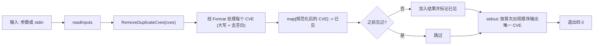

# cve filter dedup 去重

:::tip 📂 查看源码
[`cmd/filter.go:128`](https://github.com/scagogogo/cve-skills/blob/main/cmd/filter.go#L128-L145) — 在 GitHub 上查看 cobra 命令定义（第 128–145 行）。
:::

从列表中去除重复的 CVE 编号，比较时忽略大小写，并以规范的大写形式输出每个唯一的 CVE。

:::tip 🖥️ 适用场景
- 对来自多个公告源、扫描器或报告合并而成的 CVE 列表进行去重。
- 在通过管道传入分组、排序或校验命令前，先清理用户输入。
- 将不一致的大小写（如 `cve-2022-1111` 与 `CVE-2022-1111`）统一为单一规范形式。
:::

## 命令语法

```bash
cve filter dedup [cve-id...]
```

该命令以位置参数接收 CVE 编号。当未提供参数且 stdin 有管道输入时，改为从 stdin 逐行读取编号。命令自身不定义任何 flag。

## 参数与选项

- `[cve-id...]`（位置参数，可选）：零个或多个 CVE 编号，例如 `CVE-2021-44228`。省略时回退到 stdin（每行一个，空行跳过）。
- 本命令自身**不定义任何 flag**。全局 `-q, --quiet` 标志继承自根命令。
- 若未提供参数且 stdin 为终端（非管道），`readInputs` 返回 `nil`，命令以退出码 `1` 退出且不输出任何内容。

## 使用示例

去除一个完全重复项与一个大小写变体；仅保留首次出现项，并以规范的大写形式重新输出：

```bash
$ cve filter dedup CVE-2022-1111 cve-2022-1111 CVE-2022-2222
CVE-2022-1111
CVE-2022-2222
```

当输入来自其他工具时，通过 stdin 管道传入列表；空行会被跳过，输出按首次出现顺序排列：

```bash
$ printf 'CVE-2020-5\ncve-2020-5\nCVE-2020-9\n' | cve filter dedup
CVE-2020-5
CVE-2020-9
```

散布在较长输入中的重复项仅折叠为其首次出现：

```bash
$ cve filter dedup CVE-2021-1 CVE-2021-2 CVE-2021-1 CVE-2021-3 CVE-2021-2
CVE-2021-1
CVE-2021-2
CVE-2021-3
```

将去重与分组串联，得到干净、不重复的按年分桶：

```bash
$ cve filter dedup cve-2022-1111 CVE-2022-1111 cve-2022-2222 | cve filter group-by-year
2022:
  CVE-2022-1111
  CVE-2022-2222
```

## 工作流程



## 对应 Go API

本命令是 [`RemoveDuplicateCves`](/api/functions/remove-duplicate-cves) 的轻量封装，后者返回去重后的 `[]string` 切片。每个 CVE 在查表前会经 `Format`（大写 + 去除首尾空白）规范化，因此大小写与首尾空白差异会折叠为单一规范条目。CLI 将每个唯一 CVE 单独一行输出；直接调用该 Go 函数时你拿到的是切片，需自行处理渲染。

## 退出码与输出

- 退出码 `0`：命令正常结束，向 stdout 输出去重后的列表。
- 退出码 `1`：未提供任何输入（参数为空且 stdin 无管道输入）。不输出任何内容。
- stdout：每个唯一 CVE 单独一行，按首次出现顺序排列，采用规范的大写形式。
- stderr：正常运行时不写入任何内容。

## 注意事项

- 比较为**忽略大小写**，因为每个 CVE 在查表前会经 `Format`（`strings.ToUpper` + `strings.TrimSpace`）处理。`cve-2022-1111`、`CVE-2022-1111` 与 `  cve-2022-1111  ` 都被视为同一标识符。
- **首次出现者胜出**：输出的是首次出现变体的规范大写形式，后续重复项被丢弃。因此输出顺序反映输入顺序，而非字典序。如需排序输出，请随后使用 `cve compare sort`。
- 仅首尾的空白填充会被 `Format` 去除；类似 `" CVE-2022-1 "` 的输入会被视为 `CVE-2022-1`。
- 本命令**不校验**输入是否为合法 CVE 编号。非 CVE 字符串仍会被规范化（大写）并如同其他字符串一样去重。若需拒绝非法条目，请先用 `cve validate` 校验。
- 没有 flag 可切换为大小写敏感去重或保留原始大小写；输出始终为规范的大写形式。
- 此处不规范化序列号宽度。`CVE-2022-1` 与 `CVE-2022-0001` 因 `Format` 仅改变大小写与去空白而被视为不同标识符。若去重前还需序列号补零，请使用 `cve format`。

## 内部实现

`dedup` cobra 命令（`cmd/filter.go:128-145`）是一个仅接收位置参数的轻量封装，自身不定义任何 flag。其 `Run` 函数逻辑如下：

- **通过 cobra 接收位置参数**：`Run: func(cmd *cobra.Command, args []string)` 将原始 CVE 标记作为 `args` 传入。不读取任何 flag —— `dedup` 在 `init()` 中未注册 flag，仅继承根命令的 flag。
- **经 `readInputs(args)` 读取输入**：该辅助函数将位置参数与管道 stdin（每行一个，空行跳过）合并，当二者均不可用时返回 `nil`。
- **调用 `cvepkg.RemoveDuplicateCves(inputs)`**：库函数经 `Format`（大写 + 去首尾空白）规范化每个标记，维护已见集合，并按首次出现顺序返回去重后的 `[]string`。
- **输出到 stdout**：通过 `for _, c := range unique { fmt.Println(c) }` 遍历结果，每行输出一个规范化的 CVE。

## 参数流

```text
+--------------------------+      +---------------------+      +--------------------------------+
| argv: cve filter dedup   | ---> | readInputs(args)    | ---> | cvepkg.RemoveDuplicateCves(    |
|   [cve-id...]            |      |  - 优先使用参数      |      |   inputs                       |
+--------------------------+      |  - 否则读 stdin     |      | ) -> []string (唯一, 大写)      |
                                  |  - 跳过空行          |      +--------------------------------+
+--------------------------+              |                              |
| stdin (每行一个 CVE,     | -----pipe---+                              |
|  无参数时使用)           |                                             v
+--------------------------+      +--------------------------------------------+
                                  | for _, c := range unique {                |
                                  |   fmt.Println(c)   // stdout, 每行一个    |
                                  | }                                          |
                                  +--------------------------------------------+
                                                  |
                                                  v
                                  +--------------------------------------------+
                                  | 退出码 0 (已写输出)                        |
                                  | 退出码 1 (readInputs 返回空时)             |
                                  +--------------------------------------------+
```

## 边界情形

| 输入 | 行为 | 退出码/输出 |
|---|---|---|
| 无参数，stdin 为终端（无管道） | `readInputs` 返回 `nil`；`len(inputs) == 0` 触发提前退出 | 退出码 `1`；stdout 与 stderr 均无输出 |
| 无参数，stdin 仅含空行 | 空行被跳过，剩余输入为零 | 退出码 `1`；无输出 |
| 单个 CVE | 一入一出，无重复可去 | 退出码 `0`；以规范大写形式输出该 CVE |
| 大小写变体（`cve-2022-1` 与 `CVE-2022-1`） | 二者经 `Format` 后键相同；第二个被丢弃 | 退出码 `0`；输出首个规范形式 |
| 首尾空白（`" CVE-2022-1 "`） | `Format` 去空白；视为 `CVE-2022-1` | 退出码 `0`；输出去空白后的规范形式 |
| 非 CVE 标记（`FOO`、`bar-123`） | 不校验；如同其他字符串一样大写并去重 | 退出码 `0`；规范化后输出 |
| 序列号宽度变体（`CVE-2022-1` 与 `CVE-2022-0001`） | `Format` 仅改大小写/去空白；宽度不同故均保留 | 退出码 `0`；二者作为不同项输出 |
| 全部为重复项 | 首次出现胜出，其余丢弃 | 退出码 `0`；仅输出一项 |

## 退出码

- **成功（退出码 `0`）**：只要 `readInputs` 返回非空切片即达此路径。去重后的列表写入 stdout，stderr 不被触碰。
- **失败（退出码 `1`）**：当 `len(inputs) == 0`（无位置参数且无管道 stdin）。命令直接调用 `os.Exit(1)` 而不打印任何内容 —— 此路径不会向 stderr 写入显式错误信息，不同于同族的 `by-year`/`recent` 命令（后者会写入 `error: --flag is required`）。
- 本命令不捕获运行时 panic 或库错误；任何意外 panic 会向上传播，进程以 Go 默认的非零码退出。

## 相关命令

- [cve filter group-by-year](/cli/commands/filter-group-by-year) —— 去重后按年份对唯一 CVE 分桶。
- [cve format](/cli/commands/format) —— 去重前规范化大小写与序列号宽度。
- [cve compare sort](/cli/commands/compare-sort) —— 按年份与序列号对去重后的输出排序。
- [cve validate batch](/cli/commands/validate-batch) —— 去重前拒绝非法标识符。
- [CLI 参考](/cli) —— 完整命令树与 I/O 约定。
