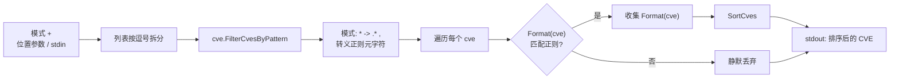

# cve filter-pattern 通配符

:::tip 📂 查看源码
[`cmd/pattern.go:12`](https://github.com/scagogogo/cve-skills/blob/main/cmd/pattern.go#L12-L32) — 在 GitHub 上查看 cobra 命令定义（第 12–32 行）。
:::

用**通配符模式**过滤一组 CVE 标识符，仅保留标准化大写形式匹配的条目，并按排序后逐行输出。

:::tip 🖥️ 适用场景
- 从合并后的多年份列表中按年份挑选（`CVE-2022-*`），无需自己写 grep 循环。
- 按序列号后缀跨年份关联相关公告时查找共享后缀的条目（`CVE-*-1111`）。
- 在进行更重的分析之前预过滤大批量数据——模式匹配开销低，可在交给 validate 或 diff 之前先行筛选。
:::

## 命令语法

```bash
cve filter-pattern <pattern> <cve-list>
```

`<cve-list>` 接受所有列表类子命令共用的灵活输入形式：多个位置参数、每个参数内以逗号分隔，或者在未提供参数时从 stdin 逐行读取。`<pattern>` 始终是**第一个**输入，其余输入构成 CVE 列表。

## 参数与选项

- `<pattern>`（位置参数，第一个）：通配符模式，如 `CVE-2022-*` 或 `CVE-*-1111`。`*` 匹配任意字符序列；其他字符按字面量匹配。前后空白会被裁剪。
- `<cve-list>`（位置参数，模式之后，可重复）：一个或多个 CVE 标识符。每个参数会进一步按逗号拆分，因此 `"CVE-2022-1,CVE-2022-2"` 等价于两个独立参数。
- stdin 回退：当未提供位置参数且 stdin 有管道输入时，每个非空行视为一个输入——第一行为模式，其余行为 CVE 列表。
- 该命令**未定义自己的 flags**。继承根命令的全局 `-q, --quiet` 标志。

## 使用示例

将逗号分隔的列表过滤为 2022 年的 CVE——保留项被标准化为大写并排序：

```bash
$ cve filter-pattern "CVE-2022-*" "CVE-2021-44228,CVE-2022-12345,CVE-2022-0001"
CVE-2022-0001
CVE-2022-12345
```

用 `CVE-*-1111` 跨所有年份匹配共享的序列号后缀：

```bash
$ cve filter-pattern "CVE-*-1111" "CVE-2020-1111,CVE-2022-9999,CVE-2023-1111"
CVE-2020-1111
CVE-2023-1111
```

以独立参数传入条目——结果与逗号形式完全一致：

```bash
$ cve filter-pattern "CVE-2021-*" CVE-2021-44228 CVE-2022-12345
CVE-2021-44228
```

小写输入会被大小写不敏感地匹配，并以标准化大写形式输出：

```bash
$ cve filter-pattern "cve-2022-*" "cve-2022-0001,not-a-cve,CVE-2022-12345"
CVE-2022-0001
CVE-2022-12345
```

从 stdin 输入模式与列表——第一行为模式，其余为 CVE：

```bash
$ printf 'CVE-2022-*\nCVE-2021-44228\ncve-2022-0001\n' | cve filter-pattern
CVE-2022-0001
```

## 工作流程



## 对应 Go API

该命令是 [`FilterCvesByPattern`](/api/functions/filter-cves-by-pattern) 的薄封装。库会将通配符编译为正则表达式（`*` 转为 `.*`，并转义 `.` `+` `(` `)` `[` `]` `{` `}` `\` `^` `$` `|` 等正则元字符），再用每个 CVE 的标准化大写形式与之匹配。所有匹配项被收集，最终切片在返回前经 `SortCves` 排序。当你需要在代码中直接获取过滤后的切片而非打印文本时，请使用该 Go 函数。

## 退出码与输出

- 退出码 `0`：命令正常结束。不匹配模式的 CVE **被丢弃而非报错**——零匹配的列表仍以 `0` 退出且无输出。
- 退出码 `1`：传入输入少于两个（模式与 CVE 列表）。向 stderr 打印错误 `requires pattern and CVE list`。
- stdout：每个匹配的 CVE 一行，按年份与序列号**排序**，均为标准化大写形式 `CVE-YYYY-NNNNN`。
- stderr：仅上述用法错误。不匹配的条目不会产生 stderr 噪声。

## 注意事项

- 仅 `*` 是通配符。不支持 `?` 或字符类——`CVE-2022-1?` 按字面量匹配（且匹配不到任何内容，因为格式化后的 CVE 中不会出现 `?`）。
- 模式中的正则元字符会被转义，因此 `CVE-2022.1` 匹配字面量点号而非"任意字符"。这让模式对 CVE 形态的输入行为可预期。
- 匹配基于**标准化大写**形式，因此 `cve-2022-0001` 与 `CVE-2022-0001` 都能被 `CVE-2022-*` 匹配，且都输出为 `CVE-2022-0001`。如需去重，请在之后执行 `cve filter dedup`。
- 输出是**排序后**的（年份升序，再按序列号升序），与保持输入顺序的 `cve filter valid` 不同。如需原始顺序请另行处理。
- 无法编译为正则的无效模式会使库返回 `nil`，此时 CLI 不输出任何内容并以 `0` 退出。请保持模式格式正确。
- 该命令本身**不去重**，但排序会将相同条目相邻排列，便于后续去重。

## 内部实现

cobra 命令 `filterPatternCmd`（`cmd/pattern.go:12-L32`）在 `RunE` 中以几步直线逻辑完成，**未定义自己的 flags**：

- `readInputs(args)` 从位置参数 `args` 收集输入，无参数时回退到 stdin 逐行读取。随后检查切片：若 `len(inputs) < 2`，命令返回 `fmt.Errorf("requires pattern and CVE list")`，cobra 随即将 usage 打印到 stderr。
- `inputs[0]` 经 `strings.TrimSpace` 后作为 pattern；其余 `inputs[1:]` 通过 `strings.Split(input, ",")` 按逗号展开拼入 `cveList`，因此逗号形式与多参数形式归约为同一切片。
- 库调用 `cve.FilterCvesByPattern(cveList, pattern)` 完成匹配、标准化与 `SortCves` 排序，返回最终的 `[]string`。
- 结果由一个普通的 `for _, v := range result { fmt.Println(v) }` 循环写出——每个保留项占一行 stdout，无额外格式化，除 `Println` 自带换行外无多余分隔符。

## 参数流

```text
+--------------------------+
| CLI 参数 / stdin 行       |
| (首行为模式，其余为 CVE)  |
+-----------+--------------+
            |
            v
+--------------------------+
| readInputs(args)         |
| 位置参数为空时回退 stdin |
+-----------+--------------+
            |
            v
+--------------------------+
| len(inputs) < 2 ?        |
+-----+--------------+-----+
      |是              |否
      v                v
+----------+  +--------------------------+
| 错误:    |  | pattern = TrimSpace(     |
| requires |  |   inputs[0])             |
| pattern  |  | cveList = 将 inputs[1:]  |
| and CVE  |  |   各项按 "," 拆分后拼入  |
| list     |  +-----------+--------------+
+---------+  |           v
             |  +--------------------------+
             |  | cve.FilterCvesByPattern( |
             |  |   cveList, pattern)      |
             |  |  * -> .* , 转义元字符     |
             |  |  匹配 Format(cve)         |
             |  |  收集并 SortCves          |
             |  +-----------+--------------+
             |              |
             |              v
             |  +--------------------------+
             |  | for v := range result    |
             |  |   fmt.Println(v)         |
             |  +-----------+--------------+
             |              |
             |              v
             |  +--------------------------+
             |  | stdout: 排序后的 CVE      |
             |  | (每行一个)                |
             |  +--------------------------+
             v
        exit 1 + stderr
```

## 边界情形

| 输入 | 行为 | 退出码 / 输出 |
| --- | --- | --- |
| 无参数且 stdin 无管道输入 | `readInputs` 返回空切片；`len(inputs) < 2` 触发守卫 | 退出 `1`；stderr 输出 `requires pattern and CVE list` |
| 仅一个输入（只有模式，无列表） | `len(inputs) == 1` 仍不满足 `< 2` 的下限 | 退出 `1`；stderr 输出 `requires pattern and CVE list` |
| 模式带前后空白 | `strings.TrimSpace(inputs[0])` 先裁剪再匹配 | 退出 `0`；以裁剪后的模式匹配 |
| CVE 列表内嵌逗号 | 每个 `inputs[1:]` 按 `,` 拆分，`"a,b"` 变为两项 | 退出 `0`；视为独立的 CVE |
| 小写 CVE / 模式 | 库基于标准化大写形式匹配 | 退出 `0`；保留项以 `CVE-YYYY-NNNNN` 输出 |
| 无 CVE 匹配模式 | `FilterCvesByPattern` 返回空（或 `nil`）切片；打印循环零次迭代 | 退出 `0`；stdout 无输出 |
| 无效模式（正则编译失败） | 库返回 `nil`；CLI 不输出任何内容 | 退出 `0`；stdout 为空 |
| 列表中存在重复项 | 排序将相同条目相邻排列；不合并 | 退出 `0`；输出中仍保留重复项 |
| stdin 含空行 | `readInputs` 跳过空行；首个非空行为模式，其余为 CVE | 退出 `0`；仅对非空输入继续匹配 |

## 退出码

- `0`（成功）：`RunE` 返回 `nil`。只要传入至少两个输入即触发此情形——包括零匹配与无效模式，因为库返回 `nil`/空而非错误，打印循环只是不输出任何内容。
- `1`（用法错误）：仅在 `len(inputs) < 2` 时出现。`RunE` 返回错误 `requires pattern and CVE list`；cobra 将该消息连同命令 usage 打印到 stderr。此路径不产生 stdout。
- `filterPatternCmd` 中不存在显式的 `os.Exit` 调用；cobra 根运行器将 `RunE` 返回的非 nil `error` 转为进程退出码 `1`，将 `nil` 返回转为 `0`。

## 相关命令

- [cve filter valid](/cli/commands/filter-valid) — 按校验而非模式仅保留格式正确的 CVE。
- [cve filter dedup](/cli/commands/filter-dedup) — 去除重复项，常接在 `filter-pattern` 之后。
- [cve filter by-year-range](/cli/commands/filter-by-year-range) — 按年份区间而非通配符进行过滤。
- [CLI 参考](/cli) — 完整命令树与输入输出约定。
